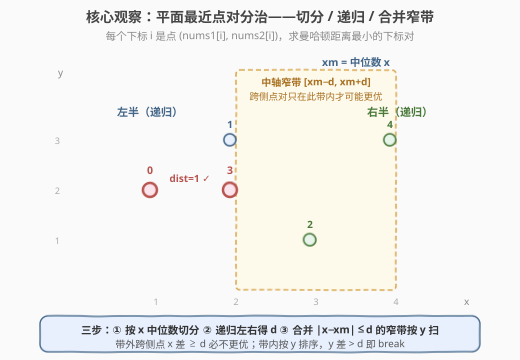
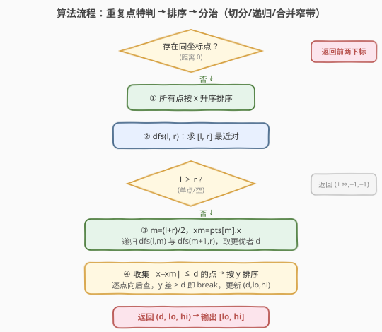

# LeetCode 美数对 题解

## 1. 题目概述

- **标题 / 题号**：美数对（#2613，hard）
- **链接**：https://leetcode.cn/problems/beautiful-pairs/
- **难度**：困难
- **标签**：几何、数组、数学、分治、有序集合、排序

**题意**：给定两个长度相同的下标从 0 开始的整数数组 `nums1` 和 `nums2`。把每个下标 `i` 看成平面上的一个点 $P_i = (\text{nums1}[i],\, \text{nums2}[i])$，定义下标对 $(i, j)$（$i < j$）的「美度」为这两点的**曼哈顿距离**：

$$
\text{dist}(i, j) = |\text{nums1}[i] - \text{nums1}[j]| + |\text{nums2}[i] - \text{nums2}[j]|
$$

求所有 $i < j$ 中使该距离**最小**的下标对；若有多个最小，返回**字典序最小**的（即先比 $i$ 小，再比 $j$ 小）。

**示例 1**：

```text
输入：nums1 = [1,2,3,2,4], nums2 = [2,3,1,2,3]
输出：[0,3]
解释：点 0=(1,2)、点 3=(2,2)，|1-2|+|2-2|=1，为全局最小。
```

**示例 2**：

```text
输入：nums1 = [1,2,4,3,2,5], nums2 = [1,4,2,3,5,1]
输出：[1,4]
解释：点 1=(2,4)、点 4=(2,5)，|2-2|+|4-5|=1，为全局最小。
```

**约束**：

- `2 <= nums1.length, nums2.length <= 10^5`
- `nums1.length == nums2.length`
- `0 <= nums1[i] <= nums1.length`
- `0 <= nums2[i] <= nums2.length`

> 💡 本题本质是经典的「**平面最近点对**」问题，只是把欧氏距离换成了**曼哈顿距离**，并要求距离相同时取下标字典序最小。

## 2. 解题思路

### 2.1 暴力思路：枚举所有点对

双重循环枚举所有 $i < j$，计算曼哈顿距离取最小。共 $\binom{n}{2} \approx \frac{n^2}{2}$ 对，$n \le 10^5$ 时约 $5 \times 10^9$ 次运算，必然超时。需要利用**平面几何结构**把 $O(n^2)$ 降到接近 $O(n \log n)$。

### 2.2 核心观察：分治求最近点对



把每个下标 $i$ 映射成点 $(x_i, y_i)$ 并附上原下标 `idx`。**分治三步走**：

1. **切分**：所有点按 $x$ 坐标排序，取中位数 $m$ 处的 $x_m$，将点集分为左右两半。
2. **递归**：分别在左、右两半求最近点对，得到最小距离 $d_L$、$d_R$（含对应下标）。取两者较小者记为 $d$（距离相同时按下标字典序取小）。
3. **合并**：唯一可能遗漏的是「一个点在左半、另一个在右半」的跨侧点对。但这样的两点若距离 $< d$，它们的 $x$ 坐标必然都落在 $[x_m - d,\, x_m + d]$ 这条**中轴窄带**内——带外的跨侧点对 $x$ 方向距离已 $\ge d$，不可能更优。

> ⚠️ 关键剪枝：把窄带内的点**按 $y$ 排序**后逐个考察，对每个点 $P_i$ 只向后看 $y$ 坐标差 $\le d$ 的点 $P_j$——一旦 $y_j - y_i > d$ 就 `break`，因为后面点 $y$ 更大，曼哈顿距离只会更大。这把内层循环从 $O(\text{带内点数})$ 压到常数级。

**字典序处理**：无论递归还是合并，候选答案都把两个下标**排序成 $(\text{lo}, \text{hi})$**（保证 $i < j$），比较时先比距离，距离相同再比 `lo`，`lo` 相同再比 `hi`，取最小者。这样全程维护单一「最优三元组 $(d, \text{lo}, \text{hi})$」。

**重复点特判**：若存在两点坐标完全相同，曼哈顿距离为 $0$，必为全局最小，直接返回其中字典序最小的下标对（同一坐标按下标升序收集，取前两个即可）。这一步既加速又避免了分治中点坐标相同导致的中轴退化。

### 2.3 算法流程图



三阶段：

1. **预处理**：用哈希表按坐标分组收集下标；扫一遍，若某坐标出现 $\ge 2$ 次，返回其前两个下标（此时距离为 $0$，全局最小）。否则把所有点（去重后）按 $x$ 升序排序。
2. **分治 `dfs(l, r)`**：若 $l \ge r$ 返回「正无穷距离」哨兵；否则取 $m=\lfloor(l+r)/2\rfloor$，记 $x_m$ = `points[m].x`，递归左右两半取最优，再做合并。
3. **合并**：收集 `[l, r]` 内 $|x - x_m| \le d$ 的点入窄带 `t`，按 $y$ 排序；双重循环，内层遇 $y$ 差 $> d$ 即 `break`，否则算曼哈顿距离更新最优三元组。

### 2.4 示例演算

![示例演算：nums1=[1,2,3,2,4], nums2=[2,3,1,2,3]，分治锁定 (0,3) 距离 1](../images/beautiful_pairs_example_walkthrough.svg)

取示例 1：`nums1=[1,2,3,2,4]`, `nums2=[2,3,1,2,3]`，5 个点 $(x,y,\text{idx})$：

| idx | (x, y) |
|-----|--------|
| 0 | (1, 2) |
| 1 | (2, 3) |
| 2 | (3, 1) |
| 3 | (2, 2) |
| 4 | (4, 3) |

无重复点。按 $x$ 排序后：`[(1,2,0), (2,3,1), (2,2,3), (3,1,2), (4,3,4)]`，$m=2$，$x_m=3$。

| 阶段 | 处理范围 | 关键候选 | 当前最优 $(d, \text{lo}, \text{hi})$ |
|------|----------|----------|--------------------------------------|
| 递归左半 | $[0,2]$：点 0,1,3 | (0,3)=1、(1,3)=1 | $(1, 0, 3)$（字典序 (0,3)<(1,3)） |
| 递归右半 | $[3,4]$：点 2,4 | (2,4)=4 | $(4, 2, 4)$ |
| 取小 | — | $\min(左, 右)$ | $(1, 0, 3)$ |
| 合并窄带 | $\|x-3\|\le 1$：点 1,3,2 | 跨侧 (1,2)=3、(3,2)=2 | 均不优于 1，保持 |
| 最终 | — | — | **$(1, 0, 3)$ → 输出 `[0,3]`** ⭐ |

> 💡 左半 $[0,2]$ 内部递归：$m=1$，$x_m=2$。左半之左 $\{0\}$ 单点、左半之右 $\{1,3\}$ 得 $(1,3)$ 距离 1；合并窄带 $\|x-2\|\le 1$ 含点 0,1,3，跨侧对 (0,1)=2、(0,3)=1，其中 (0,3)=1 与 (1,3)=1 距离相同，字典序 (0,3) < (1,3)，故左半最优为 $(1,0,3)$。

## 3. 参考代码

### C++（分治 + 窄带按 y 排序）

```cpp
class Solution {
public:
    vector<int> beautifulPair(vector<int>& nums1, vector<int>& nums2) {
        int n = nums1.size();
        // 1. 重复点特判：同坐标距离 0，必为全局最小
        map<pair<int,int>, vector<int>> pos;
        for (int i = 0; i < n; ++i)
            pos[{nums1[i], nums2[i]}].push_back(i);
        for (int i = 0; i < n; ++i) {
            auto& v = pos[{nums1[i], nums2[i]}];
            if (v.size() > 1) return {v[0], v[1]}; // 升序收集，前两个即字典序最小
        }
        // 2. 去重后建点表并按 x 排序
        vector<array<int,3>> pts; // (x, y, idx)
        for (int i = 0; i < n; ++i)
            pts.push_back({nums1[i], nums2[i], i});
        sort(pts.begin(), pts.end());

        auto dist = [](const array<int,3>& a, const array<int,3>& b) {
            return (long long)abs(a[0]-b[0]) + abs(a[1]-b[1]);
        };
        // 返回 {距离, lo, hi}
        function<array<long long,3>(int,int)> dfs = [&](int l, int r) -> array<long long,3> {
            if (l >= r) return {LLONG_MAX / 4, -1, -1};
            int m = (l + r) / 2, xm = pts[m][0];
            auto best = dfs(l, m);
            auto rhs = dfs(m + 1, r);
            auto better = [](const array<long long,3>& a, const array<long long,3>& b) {
                return a[0] < b[0] || (a[0]==b[0] && (a[1]<b[1] || (a[1]==b[1]&&a[2]<b[2])));
            };
            if (better(rhs, best)) best = rhs;
            long long d = best[0];
            // 收集窄带 |x - xm| <= d，按 y 排序
            vector<array<int,3>> t;
            for (int i = l; i <= r; ++i)
                if (abs((long long)pts[i][0] - xm) <= d) t.push_back(pts[i]);
            sort(t.begin(), t.end(), [](const auto& a, const auto& b){ return a[1] < b[1]; });
            for (int i = 0; i < (int)t.size(); ++i) {
                for (int j = i + 1; j < (int)t.size() && (long long)t[j][1] - t[i][1] <= d; ++j) {
                    long long dd = dist(t[i], t[j]);
                    int lo = min(t[i][2], t[j][2]), hi = max(t[i][2], t[j][2]);
                    if (dd < best[0] || (dd==best[0] && (lo<best[1] || (lo==best[1]&&hi<best[2])))) {
                        best = {dd, lo, hi}; d = dd;
                    }
                }
            }
            return best;
        };
        auto res = dfs(0, n - 1);
        return {(int)res[1], (int)res[2]};
    }
};
```

### Python（分治 + 窄带按 y 排序）

```python
class Solution:
    def beautifulPair(self, nums1: List[int], nums2: List[int]) -> List[int]:
        from math import inf

        def dist(a, b):
            return abs(a[0] - b[0]) + abs(a[1] - b[1])

        def dfs(l, r):
            if l >= r:
                return inf, -1, -1
            m = (l + r) >> 1
            x = pts[m][0]
            d1, i1, j1 = dfs(l, m)
            d2, i2, j2 = dfs(m + 1, r)
            if d2 < d1 or (d2 == d1 and (i2 < i1 or (i2 == i1 and j2 < j1))):
                d1, i1, j1 = d2, i2, j2
            # 收集窄带 |x - x| <= d1，按 y 排序
            t = [p for p in pts[l:r + 1] if abs(p[0] - x) <= d1]
            t.sort(key=lambda p: p[1])
            for a in range(len(t)):
                for b in range(a + 1, len(t)):
                    if t[b][1] - t[a][1] > d1:
                        break  # y 差已超阈值，后续只会更大
                    pi, pj = sorted((t[a][2], t[b][2]))
                    d = dist(t[a], t[b])
                    if d < d1 or (d == d1 and (pi < i1 or (pi == i1 and pj < j1))):
                        d1, i1, j1 = d, pi, pj
            return d1, i1, j1

        # 1. 重复点特判
        pos = defaultdict(list)
        for i, (x, y) in enumerate(zip(nums1, nums2)):
            pos[(x, y)].append(i)
        for i, (x, y) in enumerate(zip(nums1, nums2)):
            if len(pos[(x, y)]) > 1:
                return [i, pos[(x, y)][1]]

        # 2. 按 x 排序后分治
        pts = [(x, y, i) for i, (x, y) in enumerate(zip(nums1, nums2))]
        pts.sort()
        _, pi, pj = dfs(0, len(pts) - 1)
        return [pi, pj]
```

> 💡 **几处细节**：(1) 重复点特判在前：同坐标曼哈顿距离为 0 必为全局最小，提前返回既正确又避免分治中 $x_m$ 退化（带内全是同 $x$ 的点使内层循环变长）。(2) 候选下标一律 `sorted` 成 `(lo, hi)` 再比较，统一字典序逻辑。(3) 合并内层 `if t[b][1]-t[a][1] > d1: break` 是性能命门——把 $O(\text{带内点数}^2)$ 压成常数级，基于「窄带内 $y$ 差 $\le d$ 的点数有常数上界」的打包论证。(4) `LLONG_MAX/4` 作哨兵防止后续加减溢出。

## 4. 复杂度分析

| 维度 | 复杂度 | 说明 |
|------|--------|------|
| 时间复杂度 | $O(n \log^2 n)$ | 每层递归合并时对窄带按 $y$ 重排 $O(k\log k)$；可优化到 $O(n\log n)$（见第 5 节） |
| 时间复杂度 | 实际近似 $O(n\log n)$ | 窄带内层循环因 $y$ 差剪枝为常数次，常数小；$n\le 10^5$ 稳过 |
| 空间复杂度 | $O(n)$ | 点表、递归栈深 $O(\log n)$、窄带临时数组 |

> ⚠️ $n\le 10^5$：朴素 $O(n^2)\approx 10^{10}$ 必超；分治 $n\log^2 n\approx 10^5\times 289\approx 2.9\times 10^7$，配合 $y$ 差剪枝常数极小，稳过。难点不在「想到分治」，而在**合并阶段的窄带剪枝**与**字典序的统一维护**。

## 5. 扩展：曼哈顿 vs 欧氏最近点对与 $O(n\log n)$ 优化

### 5.1 距离度量对算法的影响

经典最近点对分治最初针对**欧氏距离** $\sqrt{\Delta x^2 + \Delta y^2}$，合并时靠「$d\times 2d$ 矩形内至多 8 个点两两距离 $\ge d$」的打包论证保证内层 $O(1)$。曼哈顿距离 $|\Delta x|+|\Delta y|$ 同样适用分治框架，打包论证依然成立（$d\times 2d$ 矩形内按曼哈顿两两 $\ge d$ 的点数仍有常数上界），因此「窄带按 $y$ 排序 + $y$ 差 `break`」对两种距离都有效。

> 💡 还有一种**坐标旋转**技巧：令 $u = x + y,\, v = x - y$，则曼哈顿距离 $|x_1-x_2|+|y_1-y_2| = \max(|u_1-u_2|,\, |v_1-v_2|)$（切比雪夫距离）。于是「曼哈顿最近对」等价于「$(u,v)$ 平面上的切比雪夫最近对」，可用同样的分治或 KD-tree 求解。

### 5.2 从 $O(n\log^2 n)$ 优化到 $O(n\log n)$

上述代码在每层合并时对窄带**重新按 $y$ 排序**，贡献一个 $\log$ 因子。优化思路与归并排序同构：

- 递归返回时顺便把当前区间按 $y$ **归并**成有序数组（而非每层重排），合并窄带即可直接在该有序数组上取 $|x-x_m|\le d$ 的连续段。
- 于是 $T(n) = 2T(n/2) + O(n)$，由主定理 $T(n) = O(n\log n)$。

这与归并排序「先递归后归并」的写法完全对应，是面试中最近点对的标准写法。本文采用重排版本以求代码简洁、易读，竞赛中两者均可接受。

### 5.3 数据结构替代解法

| 解法 | 数据结构 | 复杂度 | 特点 |
|------|----------|--------|------|
| 分治（本文） | 排序 + 递归 | $O(n\log^2 n)$ | 无需高级结构，思路经典 |
| KD-tree | 平衡 KD 树 | 期望 $O(n\log n)$ | 通用高维最近邻，常数偏大 |
| 平面扫掠 + 平衡树 | 按 $x$ 扫掠，维护 $y\in[y-d,y+d]$ 的活跃集 | $O(n\log n)$ | 需有序集合 + 范围删除 |

## 6. 面试要点

1. **为什么分治能成立？跨侧点对为什么只查中轴窄带？**

   > 分治要求「左右子问题独立可解 + 跨侧问题可控」。跨侧点对中，若两点 $x$ 差 $\ge d$（当前最小距离），则曼哈顿距离 $\ge |x_1-x_2| \ge d$，不可能改进答案。故只需查两侧 $x\in[x_m-d, x_m+d]$ 的窄带。把带外点排除后，带内按 $y$ 排序扫描即可。

2. **合并阶段内层循环为什么是常数次而非 $O(\text{带内点数})$？**

   > 打包论证：窄带宽度 $2d$，对任一点 $P$，与它 $y$ 差 $\le d$ 的点都落在 $P$ 上方一个 $2d \times d$ 的矩形里。该矩形可被划分为有限个 $d/2 \times d/2$ 的小格，每格至多含一个点（否则格内两点距离 $< d$，与 $d$ 是当前最优矛盾）。故内层至多考察常数个点，配合 `y 差 > d 即 break` 实现。

3. **重复点为什么要特判？不特判会怎样？**

   > 重复点曼哈顿距离为 $0$，是全局最小，提前返回既正确又快。不特判时，分治中可能出现「左半全是同坐标点」，中轴 $x_m$ 与它们相同，导致窄带内点数爆炸、$y$ 差剪枝失效，内层循环退化到 $O(n)$，总复杂度恶化。特判保证分治阶段假设「点两两不重合」成立。

4. **字典序最小怎么统一维护？**

   > 全程维护单一最优三元组 $(d, \text{lo}, \text{hi})$，候选点对两个下标先 `sorted` 成 $\text{lo}<\text{hi}$。比较规则：先比 $d$ 小，再比 $\text{lo}$ 小，再比 $\text{hi}$ 小。递归返回值与合并候选都用同一套比较，自然得到字典序最小的最优对。

5. **曼哈顿距离能否转化为切比雪夫距离再求？**

   > 可以。令 $u=x+y,\,v=x-y$，则 $|x_1-x_2|+|y_1-y_2|=\max(|u_1-u_2|,|v_1-v_2|)$。在 $(u,v)$ 平面上即切比雪夫最近对，分治框架同样适用，打包论证的小格边长随之调整。这是处理曼哈顿度量的常见化归技巧。

> 💡 **一句话总结**：2613 = 「平面最近点对分治」+「中轴窄带 + $y$ 差剪枝」+「重复点特判 + 字典序三元组」。把 $O(n^2)$ 枚举压成 $O(n\log^2 n)$，是计算几何分治的招牌题。

## 同类练习题

| # | 题目 | 与本题的关联 |
|---|------|-------------|
| 973 | [最接近原点的 K 个点](https://leetcode.cn/problems/k-closest-points-to-origin/) | 同样是平面点 + 距离度量，但求前 K 近而非全局最近，用快速选择/堆，对照本题分治求单点最近 |
| 149 | [直线上最多的点数](https://leetcode.cn/problems/max-points-on-a-line/)（[站内题解](../0101-0200/149_直线上最多的点数.md)） | 平面点几何题，按斜率（GCD 化简分数）哈希分组，对照本题按 $x$ 排序分治 |
| 410 | [分割数组的最大值](https://leetcode.cn/problems/split-array-largest-sum/)（[站内题解](../0401-0500/410_分割数组的最大值.md)） | 另一类分治/二分答案，按「子问题可独立求解 + 合并可控」对照本题几何分治 |
| 912 | [排序数组](https://leetcode.cn/problems/sort-an-array/)（[站内题解](../0901-1000/912_排序数组.md)） | 归并排序是本题「先递归后合并」的母题，$O(n\log n)$ 写法的合并阶段即归并操作 |
| 719 | [找出第 K 小的数对距离](https://leetcode.cn/problems/find-k-th-smallest-pair-distance/)（[站内题解](../0701-0800/719_找出第K小的数对距离.md)） | 一维最近点对计数，二分答案 + 双指针，对照本题二维分治 |
