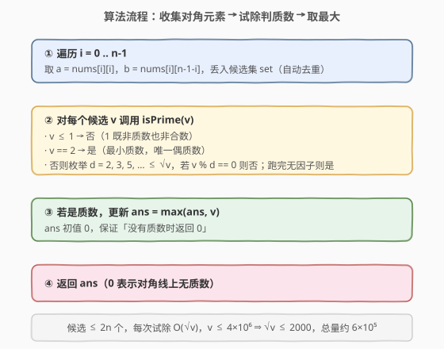
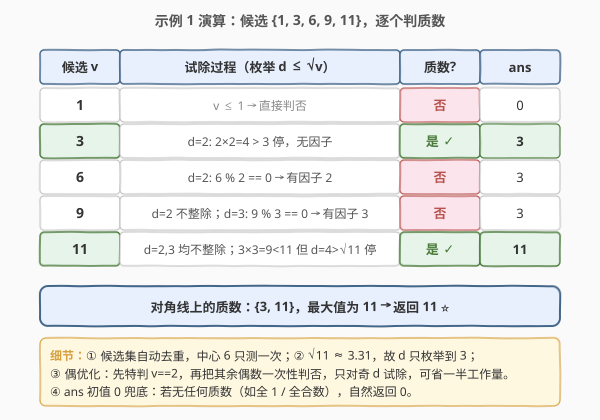

# 对角线上的质数

- **题目名称**：对角线上的质数
- **链接**：[2614. 对角线上的质数](https://leetcode.cn/problems/prime-in-diagonal/)
- **难度**：简单
- **标签**：数组、数学、数论、质数判定

## 1. 题目概述

给定一个下标从 `0` 开始的 $n \times n$ 二维整数数组 `nums`，返回位于其**至少一条对角线**上的最大**质数**；若两条对角线上均无质数，返回 `0`。

- **主对角线**：`nums[i][i]`，$i = 0, 1, \dots, n-1$；
- **副对角线**：`nums[i][n-1-i]`，$i = 0, 1, \dots, n-1$。
- **质数定义**：大于 `1` 且除 `1` 和自身外无其他正因子。注意 `1` **不是**质数。

**示例 1**：

```text
输入：nums = [[1,2,3],[5,6,7],[9,10,11]]
输出：11
解释：对角线上的数字为 1、3、6、9、11（6 在两条对角线上，只计一次）。
      其中质数有 3 与 11，最大为 11。
```

**示例 2**：

```text
输入：nums = [[1,2,3],[5,17,7],[9,11,10]]
输出：17
解释：对角线上数字为 1、3、9、10、17，其中只有 17 是质数，返回 17。
```

**约束条件**：

- $1 \le \text{nums.length} \le 300$
- $\text{nums.length} == \text{nums[i].length}$（方阵）
- $1 \le \text{nums[i][j]} \le 4 \times 10^6$

> 💡 关键信号：方阵 + 对角线 → 候选元素至多 $2n$ 个；值域上界 $4 \times 10^6$ 意味着 $\sqrt{v} \le 2000$，**单点试除判质数**完全够用，无需预筛整个值域。

---

## 2. 解题思路

### 2.1 暴力思路：枚举所有元素判质数

最直白的做法是扫描整张 $n \times n$ 矩阵，对每个元素判质数取最大。但题目只关心**两条对角线**上的值——其余位置无关，扫描全表做了 $n^2$ 次（最多 $9 \times 10^4$）无意义的质数判定。虽然在本题数据规模下也能过，但抓住「只需对角线」这一结构可将候选规模降到 $2n \le 600$，立刻把工作量压低两个量级。

### 2.2 核心观察：收集对角线候选 + 试除判质数

![两条对角线：主对角线 nums[i][i] 与副对角线 nums[i][n-1-i]](../images/prime_diag_concept.svg)

把问题拆成两步：

1. **收集候选**：遍历 $i = 0 \dots n-1$，把 `nums[i][i]` 与 `nums[i][n-1-i]` 加入候选集。用集合去重——当 $n$ 为奇数时，中心点 `nums[n/2][n/2]` 同时满足两式（$i = n-1-i = n/2$），会被采集两次，去重后只判一次。
2. **逐个判质数取最大**：对每个候选 $v$ 调用 `isPrime(v)`，若是质数则更新答案 `ans = max(ans, v)`；`ans` 初值取 `0`，天然兜底「无质数返回 0」。

> ⚠️ **`1` 不是质数**：质数定义要求严格大于 `1`。示例 1 中 `1` 出现在主对角线起点，但被 `isPrime` 在 `v <= 1` 分支直接判否，这是常见易错点。

### 2.3 试除法判质数

判单个正整数 $v$ 是否为质数，标准做法是**试除法**：若 $v$ 是合数，则它必有一个不超过 $\sqrt{v}$ 的因子（反证：若所有因子都 $> \sqrt{v}$，两因子乘积 $> v$，矛盾）。故只需枚举 $d \in [2, \lfloor\sqrt{v}\rfloor]$，遇到整除即否；跑完无因子则是。

**优化**：先特判 $v \le 1$（否）、$v = 2$（是）、$v$ 为偶数（否，因 $2$ 是唯一偶质数）；之后只对奇数因子 $d = 3, 5, 7, \dots \le \sqrt{v}$ 试除，工作量再减半。



### 2.4 示例演算



以示例 1 `nums = [[1,2,3],[5,6,7],[9,10,11]]` 为例，$n = 3$：

- 主对角线：`nums[0][0]=1, nums[1][1]=6, nums[2][2]=11` → `[1, 6, 11]`
- 副对角线：`nums[0][2]=3, nums[1][1]=6, nums[2][0]=9` → `[3, 6, 9]`
- 中心 `i=1` 时 `i == n-1-i == 1`，`6` 被采集两次，去重后候选集 `{1, 3, 6, 9, 11}`

逐个判质数（$\sqrt{11} \approx 3.31$，故 $d$ 只枚举到 $3$）：

| 候选 $v$ | 试除过程 | 质数? | `ans` |
|----------|----------|:-----:|:-----:|
| 1 | $v \le 1$ → 否 | 否 | 0 |
| 3 | $d=2$：$2 \times 2 = 4 > 3$ 停，无因子 | 是 ✓ | 3 |
| 6 | $d=2$：$6 \% 2 = 0$ → 有因子 | 否 | 3 |
| 9 | $d=2$ 不整除；$d=3$：$9 \% 3 = 0$ → 有因子 | 否 | 3 |
| 11 | $d=2,3$ 均不整除；$d=4 > \sqrt{11}$ 停 | 是 ✓ | 11 |

最大质数为 $11$，返回 `11` ⭐。

---

## 3. 参考代码

### C++

```cpp
class Solution {
  public:
    bool isPrime(int v) {
        if (v <= 1) return false;          // 1 既非质数也非合数
        if (v == 2) return true;           // 最小质数，唯一偶质数
        if (v % 2 == 0) return false;      // 其余偶数都是合数
        for (int d = 3; (long long)d * d <= v; d += 2) {  // 只试除奇因子
            if (v % d == 0) return false;
        }
        return true;
    }

    int diagonalPrime(vector<vector<int>>& nums) {
        int n = nums.size();
        int ans = 0;
        for (int i = 0; i < n; ++i) {
            for (int v : {nums[i][i], nums[i][n - 1 - i]}) {
                if (v > ans && isPrime(v)) {  // v > ans 短路：只对可能刷新答案的值判质数
                    ans = v;
                }
            }
        }
        return ans;
    }
};
```

### Python

```python
class Solution:
    def is_prime(self, v: int) -> bool:
        if v <= 1:
            return False
        if v == 2:
            return True
        if v % 2 == 0:
            return False
        d = 3
        while d * d <= v:        # 只试除奇因子到 √v
            if v % d == 0:
                return False
            d += 2
        return True

    def diagonalPrime(self, nums: List[List[int]]) -> int:
        n = len(nums)
        ans = 0
        for i in range(n):
            for v in (nums[i][i], nums[i][n - 1 - i]):
                if v > ans and self.is_prime(v):  # v > ans 短路避免无谓判质数
                    ans = v
        return ans
```

> 💡 **两个小优化**：① `v > ans` 短路——只有比当前答案更大的值才可能刷新答案，跳过更小的候选的质数判定；② 不显式建集合去重，靠短路自然处理中心点重复（重复值 $\le$ `ans` 时被跳过）。`d * d` 用 `(long long)` / Python 大整数防溢出：$v \le 4 \times 10^6$，$\sqrt{v} \le 2000$，`d * d` 最大约 $4 \times 10^6$，C++ `int` 实际不溢出，但显式提升类型是面试稳妥写法。

---

## 4. 复杂度分析

| 维度 | 复杂度 | 说明 |
|------|--------|------|
| 时间复杂度 | $O(n \sqrt{V})$ | 候选至多 $2n$ 个，每个试除 $O(\sqrt{V})$；$n \le 300$、$V = 4 \times 10^6$、$\sqrt{V} \le 2000$，总量约 $6 \times 10^5$ |
| 空间复杂度 | $O(1)$ | 只用常数个变量，不建候选集合（短路 + 原地遍历） |

> ⚠️ 候选规模是 $O(n)$ 而非 $O(n^2)$——只扫两条对角线、不扫全表，这是本题区别于「全矩阵质数计数」的关键。即便不做 `v > ans` 短路，最坏也只判 $2n$ 次。

---

## 5. 扩展：值域更大时改用埃氏筛预表

当值域上界 $V$ 更大、或同组查询次数极多时，逐个试除的 $O(n\sqrt{V})$ 会变贵，可改为**预筛质数表**一次、$O(1)$ 查询：

- 用埃氏筛预处理 $[0, V]$ 的布尔质数表，时间 $O(V \log \log V)$、空间 $O(V)$；
- 之后每个候选 $O(1)$ 查表判质数，总查询 $O(n)$。

| 解法 | 预处理 | 查询 | 空间 | 适用场景 |
|------|--------|------|------|----------|
| 试除法 | 无 | $O(\sqrt{V})$ | $O(1)$ | 候选少、值域大（如本题 $n \le 300$，$V = 4 \times 10^6$） |
| 预筛表 | $O(V \log \log V)$ | $O(1)$ | $O(V)$ | 候选多、查询密集、$V$ 可接受（如 $V \le 10^7$） |

> 💡 本题 $V = 4 \times 10^6$ 实际也适合预筛（`vector<bool>` 约 $0.5\,\text{MB}$），但 $2n \le 600$ 次查询下，试除法的总工作量 $6 \times 10^5$ 远小于筛法建表的 $10^7$ 量级——**查询稀疏时试除反而更快**。选型看「查询次数 × 单次成本」与「建表成本」的大小关系。

---

## 6. 面试要点

1. **为什么只枚举因子到 $\sqrt{v}$？**

   > 若 $v$ 是合数，则 $v = a \times b$，$a, b \ge 2$，必有 $a \le \sqrt{v}$（否则 $a, b > \sqrt{v} \Rightarrow v > v$，矛盾）。所以只要 $\sqrt{v}$ 以内无因子，$\sqrt{v}$ 以外也找不到「成对」的新因子。这是所有试除判质数、Pollard $\rho$ 等数论算法的基础。

2. **`1` 算质数吗？为什么单独特判？**

   > 不算。质数定义要求「大于 1 且仅有 1 和自身两个因子」。`1` 只有一个正因子（自己），不满足「恰两个因子」的约定。早期数学曾把 1 当质数，后为让**唯一分解定理**（每个合数唯一分解为质数之积）成立而排除。代码里 `v <= 1` 一并判否，避免 `1` 误入试除循环。

3. **奇数阶方阵中心点会被采集两次，怎么处理？**

   > $n$ 为奇数时，中心下标 $i = n/2$ 满足 $i = n-1-i$，`nums[i][i]` 与 `nums[i][n-1-i]` 是同一格。两种处理：① 显式用集合去重；② 靠 `v > ans` 短路——第二次遇到该值时 $v \le \text{ans}$ 直接跳过判定。本题代码用②，省去集合开销。

4. **`d * d <= v` 会不会整型溢出？**

   > 本题 $v \le 4 \times 10^6$，$\sqrt{v} \le 2000$，`d * d` 最大约 $4 \times 10^6$，远在 `int`（约 $2.1 \times 10^9$）范围内，不溢出。但若值域扩到 $10^9$，`d` 可达 $\sqrt{10^9} \approx 31623$，`d * d` 约 $10^9$ 仍在范围内；再大就需要 `(long long)d * d` 或改写 `d <= v / d` 规避。这是数论题的常见边界细节。

5. **能不能不判质数、直接用预筛表 $O(1)$ 查？**

   > 可以，但要权衡。预筛 $V = 4 \times 10^6$ 需 $O(V \log \log V) \approx 10^7$ 次操作 + 约 $0.5\,\text{MB}$ 空间；而本题只有 $\le 2n = 600$ 次查询，试除总成本仅 $6 \times 10^5$，远小于建表成本。**查询稀疏时试除更快、空间更省**；查询密集（如判 $10^5$ 个数）时预筛才划算。

> 💡 **一句话总结**：2614 = 「两条对角线候选 + 试除判质数 + 取最大」。候选至多 $2n$ 个，每个 $O(\sqrt{V})$ 试除，$O(n\sqrt{V})$ 时间、$O(1)$ 额外空间，`v > ans` 短路顺手处理中心点重复。

---

## 7. 同类练习题

- [204. 计数质数](https://leetcode.cn/problems/count-primes/)（[站内题解](../0201-0300/204_计数质数.md)）：质数判定的「批量版」——埃氏筛预表，与本题单点试除形成「稀疏查询 vs 密集查询」的选型对照
- [2601. 质数减法运算](https://leetcode.cn/problems/prime-subtraction-operation/)（[站内题解](../2601-2700/2601_质数减法运算.md)）：同区间同主题，值域 $10^3$ 用埃氏筛预表 + 二分选质数，对比本题值域 $4 \times 10^6$ 改用试除
- [762. 二进制表示中质数个计算置位](https://leetcode.cn/problems/prime-number-of-set-bits-in-binary-representation/)：小值域（$\le 32$ 位的 popcount）预置微型质数集查表，筛法/试除的退化场景
- [264. 丑数 II](https://leetcode.cn/problems/ugly-number-ii/)（[站内题解](../0201-0300/264_丑数II.md)）：按「质因子倍数推进」生成序列，与筛法「质数倍数划合数」思想同源
- [172. 阶乘后的零](https://leetcode.cn/problems/factorial-trailing-zeroes/)：数论题，统计质因子 5 的个数，与质因子分析同源
