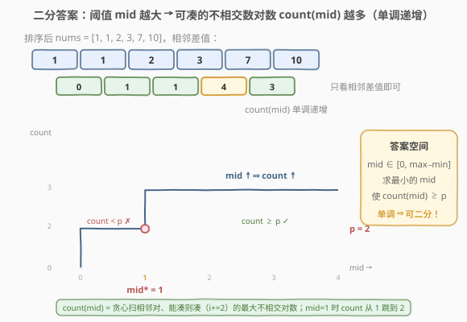
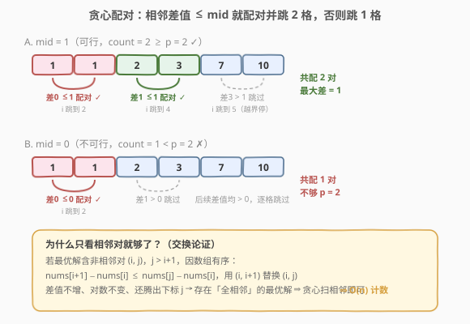
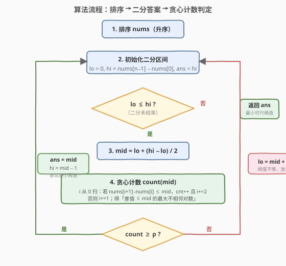

# LeetCode 最小化数对的最大差值 题解

## 1. 题目概述

- **标题 / 题号**：最小化数对的最大差值（#2616，medium）
- **链接**：https://leetcode.cn/problems/minimize-the-maximum-difference-of-pairs/
- **难度**：中等
- **标签**：数组、二分查找、贪心、排序

**题意**：给定下标从 0 开始的整数数组 `nums` 和整数 `p`。从 `nums` 中选出 `p` 个**下标对**，每对取差值 $|\text{nums}[i] - \text{nums}[j]|$，要求每个下标在这 `p` 对中**最多出现一次**（即下标两两不相交）。目标是使这 `p` 个差值的**最大值最小**，返回该最小值。空集（$p=0$）的最大值定义为 0。

**示例 1**：

```text
输入：nums = [10,1,2,7,1,3], p = 2
输出：1
解释：排序得 [1,1,2,3,7,10]。选下标对 (1,4) 差 |1−1|=0、(2,5) 差 |2−3|=1，
      最大差值 = max(0,1) = 1。
```

**示例 2**：

```text
输入：nums = [4,2,1,2], p = 1
输出：0
解释：排序得 [1,2,2,4]。选相邻对 (1,2) 差 0，最大差值即 0。
```

**约束**：

- $1 \le \text{nums.length} \le 10^5$
- $0 \le \text{nums}[i] \le 10^9$
- $0 \le p \le \lfloor \text{nums.length} / 2 \rfloor$

> 💡 「使最大值最小」是**二分答案**的标准信号；难点在于每个下标只能用一次，需在排序后用**贪心配相邻对**高效统计「差值 $\le \text{mid}$ 时最多能凑多少对」。

## 2. 解题思路

### 2.1 暴力思路

最朴素的做法是枚举所有「选 `p` 个不相交下标对」的方案，对每套方案取最大差值，再求全局最小。候选对共有 $\binom{n}{2}$ 个，从中选 `p` 个且互不相交，方案数指数级爆炸，$n \le 10^5$ 完全不可行。

换角度：答案（最大差值的最小值）一定落在 $[0,\ \max - \min]$ 之间。能否**不枚举方案，而是枚举阈值**？对每个候选阈值 `mid`，只需判断「能否选出 $\ge p$ 个不相交对，且每对差值 $\le \text{mid}$」。若从 0 到 $\max-\min$ 逐个试，每次判定 $O(n)$，整体 $O(nW)$，$W \le 10^9$ 仍超时。

> 💡 **关键转化**：把「使最大差值最小」变成「求最小的 `mid`，使差值 $\le \text{mid}$ 的不相交对数 $\ge p$」——**二分答案**的标准信号。

### 2.2 核心观察：二分答案 + 贪心配相邻对



**只看相邻差值**：先把 `nums` 排序。一个关键事实是——存在一个**全部由相邻对构成**的最优解。

> ⚠️ **为什么只需相邻对？** 设最优解含某个非相邻对 $(i, j)$（$j > i+1$）。因数组有序，$\text{nums}[i+1] - \text{nums}[i] \le \text{nums}[j] - \text{nums}[i]$。把 $(i, j)$ 换成 $(i, i+1)$：差值不增、对数不变、还腾出了下标 $j$（可继续参与后续配对）。反复如此，任何最优解都能转化为「全相邻」方案而不变差。故贪心只在相邻位置上选对即可。

于是「差值 $\le \text{mid}$ 的最大不相交对数 `count(mid)`」可用一次贪心扫描算出，且 `count(mid)` 关于 `mid` **单调递增**：

- `mid` 越大（阈值越宽），能凑的对越多。
- `mid = 0` 时只有相等的相邻对算入；`mid = max - min` 时贪心能凑 $\lfloor n/2 \rfloor$ 对。

存在一个**分界点** `mid*`：

```text
mid < mid* → count(mid) < p    (凑不够 p 对，阈值太小)
mid >= mid* → count(mid) >= p  (够 p 对，阈值够大)
```

这正是二分查找所需的**二段性**。在 $[0,\ \max-\min]$ 上二分，每次 $O(n)$ 贪心统计 `count(mid)`，可行则去左半找更小的，不可行则去右半放宽。

> 💡 **识别信号**：题目求「最小的最大值 / 最大的最小值」且能高效统计「$\le$ 某值时能否达标」→ 想「二分答案」。本题与 [找出第 K 小的数对距离](../0701-0800/719_找出第K小的数对距离.md)、[在 D 天内送达包裹的能力](../1001-1100/1011_在D天内送达包裹的能力.md) 同骨架，差异仅在 `count()`：本题要求**不相交**，故贪心配相邻对后**跳 2 格**。

### 2.3 贪心配对机制：O(n) 计数



**先排序**。排好序后，从左到右扫描下标 `i`：

```text
i = 0, count = 0
while i + 1 < n:
    if nums[i+1] - nums[i] <= mid:
        count += 1        # 配这一对
        i += 2            # 两个下标都已用，跳到下一对候选
    else:
        i += 1            # nums[i] 太大留不下，单独跳过
return count
```

**贪心正确性**：扫到 `i` 时若 $\text{nums}[i+1]-\text{nums}[i] \le \text{mid}$，**立刻配对**不会更差。因为 `nums[i]` 越靠左值越小，能与之配成「差值 $\le \text{mid}$」的左端点中，`i` 是最左的；把 `i` 让给更靠右的位置只可能减少可选对数。所以「能配则配」是最大化对数的贪心选择，每个下标至多被访问一次，整体 $O(n)$。

> ⚠️ **跳 2 格 vs 跳 1 格**：一旦配对，`i` 和 `i+1` 都被占用，必须 `i += 2`；不配对时 `nums[i]` 无缘参与，`i += 1`。这与 [719](../0701-0800/719_找出第K小的数对距离.md) 的「双指针数所有对」（允许重叠、`j` 只增不减）截然不同——本题要的是**不相交**配对数。

### 2.4 算法流程图



注意判定为「可行」时**先记录 `ans = mid` 再收缩右界**（`hi = mid - 1`），保证最终保留的是「最小的可行阈值」。

### 2.5 示例演算

![示例演算：nums = [1,1,2,3,7,10], p = 2，在 [0, 9] 上二分](../images/mmdop_example_walkthrough.svg)

以 `nums = [10,1,2,7,1,3]`、`p = 2` 为例。排序后 `[1,1,2,3,7,10]`，相邻差值 `[0,1,1,4,3]`，值域 $[0, 9]$。

- **第 1 轮** `[0,9]`，`mid=4`：贪心——`(1,1)` 差 0 ≤4 配对，跳到 idx2；`(2,3)` 差 1 ≤4 配对，跳到 idx4；`(7,10)` 差 3 ≤4 配对。`count=3 ≥ 2` ✓ → 可行，记 `ans=4`，去左半 `[0,3]`。
- **第 2 轮** `[0,3]`，`mid=1`：`(1,1)` 差 0 ≤1 配对跳 idx2；`(2,3)` 差 1 ≤1 配对跳 idx4；`(7,10)` 差 3 >1 跳过。`count=2 ≥ 2` ✓ → 可行，记 `ans=1`，去左半 `[0,0]`。
- **第 3 轮** `[0,0]`，`mid=0`：`(1,1)` 差 0 ≤0 配对跳 idx2；`(2,3)` 差 1 >0 跳 idx3；后续差值均 >0。`count=1 < 2` ✗ → `lo=1`。
- `lo=1 > hi=0`，循环结束，返回 `ans=1` ⭐。

> 💡 观察第 2 轮：`mid=1` 时 `count` 恰为 `p=2`，但答案仍可能是更小的值——只有当更小的 `mid` 的 `count` 仍 $\ge p$ 时才能更新。第 3 轮证明 `mid=0` 时只凑得出 1 对，故 1 就是分界点。

## 3. 参考代码

### C++

```cpp
class Solution {
  public:
    int minimizeMax(vector<int>& nums, int p) {
        sort(nums.begin(), nums.end());
        int n = nums.size();
        int lo = 0, hi = nums[n - 1] - nums[0];
        int ans = hi;
        while (lo <= hi) {
            int mid = lo + (hi - lo) / 2;
            if (canForm(nums, mid, p)) {  // 能凑 p 对，尝试更小
                ans = mid;
                hi = mid - 1;
            } else {
                lo = mid + 1;             // 不够 p 对，放大阈值
            }
        }
        return ans;
    }
  private:
    bool canForm(vector<int>& nums, int mid, int p) {
        int cnt = 0;
        for (int i = 0; i + 1 < (int)nums.size(); ) {
            if (nums[i + 1] - nums[i] <= mid) {
                ++cnt;
                i += 2;                   // 配对，两下标都已用
            } else {
                i += 1;                    // 留不下，跳过左端点
            }
        }
        return cnt >= p;
    }
};
```

### Python

```python
class Solution:
    def minimizeMax(self, nums: List[int], p: int) -> int:
        nums.sort()
        n = len(nums)

        def can_form(mid: int) -> bool:
            cnt = 0
            i = 0
            while i + 1 < n:
                if nums[i + 1] - nums[i] <= mid:
                    cnt += 1
                    i += 2              # 配对，两下标都已用
                else:
                    i += 1              # 留不下，跳过左端点
            return cnt >= p

        lo, hi = 0, nums[-1] - nums[0]
        ans = hi
        while lo <= hi:
            mid = (lo + hi) // 2
            if can_form(mid):
                ans = mid              # 可行，尝试更小
                hi = mid - 1
            else:
                lo = mid + 1           # 不够 p 对，放大阈值
        return ans
```

> ⚠️ **三个易错点**：
> 1. **必须先排序**：贪心「相邻差值即最小可配对」依赖 `nums` 有序；不排序则相邻无意义，贪心失效。
> 2. **配对后跳 2 格**：本题要求下标不相交，一旦 `i` 与 `i+1` 配对，两者都不可再用，必须 `i += 2`。若误用 `i += 1`（像 719 那样允许重叠）会把同一元素计入多个对，`count` 偏大导致二分答案错误偏小。
> 3. **判定用 `cnt >= p` 而非 `==`**：可能有多个相邻差值相同（如差值 1 出现两次），`count` 会跳跃式增长。只要 `count ≥ p`，说明阈值够大，可尝试更小；用 `>=` 才不会漏掉平台期。

## 4. 复杂度分析

| 维度 | 复杂度 | 说明 |
|------|--------|------|
| 时间复杂度 | $O(n \log n + n \log W)$ | 排序 $O(n \log n)$ + 二分 $O(\log W)$ 次每次贪心 $O(n)$，$W = \max - \min \le 10^9$ |
| 空间复杂度 | $O(\log n)$ | 排序的递归栈空间（C++ `std::sort`），不计输出 |

> ⚠️ 本题 $n = 10^5$、$W \le 10^9$，二分约 $\log_2 10^9 \approx 30$ 次，每次 $O(n) = 10^5$，总计 $\approx 3 \times 10^6$ 次比较，稳过。关键不在于「能否枚举方案」，而在于**把「选 p 对的最小最大差」转为「二分阈值 + 贪心判定」**，把指数级搜索压成 $O(n \log W)$。

## 5. 扩展：与 719 数对距离的对照

本题与 [719. 找出第 K 小的数对距离](../0701-0800/719_找出第K小的数对距离.md) 形同一对镜像题，核心都是「排序 + 二分答案 + $O(n)$ 计数」，差异全在 `count()` 的语义：

| 维度 | 719（第 k 小距离） | 2616（p 对的最小最大差） |
|------|--------------------|--------------------------|
| 目标 | 求第 k 小的数对距离 | 选 p 个**不相交**对，最小化最大差 |
| `count(mid)` | 距离 $\le \text{mid}$ 的**所有**数对数（允许下标重叠） | 差值 $\le \text{mid}$ 的**不相交**对数 |
| 计数实现 | 双指针 `j` 只增不减，`cnt += j-i-1` | 贪心扫相邻，能配则配、配则跳 2 格 |
| 判定 | `cnt >= k` | `cnt >= p` |

> 💡 **共性骨架**：两者答案都落在 $[0, \max-\min]$、`count` 都单调、都二分最小可行阈值。记住这个「二分答案求极值」模板，遇到「最小化最大值 / 最大化最小值 + 可高效判定」就套它，只换 `count()` 的实现即可。本题的「不相交贪心」是 `count()` 的一个变体——本质是**区间调度贪心**（按左端点扫、能取则取）在数对问题上的投影。

## 6. 面试要点

1. **为什么能二分？二段性体现在哪？**

   > `count(mid)`（差值 $\le \text{mid}$ 的最大不相交对数）随 `mid` 单调递增。存在分界点 `mid*`，使 `mid < mid*` 时 `count < p`（不合法）、`mid >= mid*` 时 `count >= p`（合法）。这种「左不合法 / 右合法」的结构就是二段性，可用二分定位 `mid*`。

2. **为什么最优解一定全由相邻对构成？**

   > 设最优解含非相邻对 $(i, j)$，$j > i+1$。因数组有序，$\text{nums}[i+1]-\text{nums}[i] \le \text{nums}[j]-\text{nums}[i]$。用 $(i, i+1)$ 替换 $(i, j)$：最大差值不增、对数不变、还腾出下标 $j$ 可参与后续配对。反复替换，任何最优解都可转为「全相邻」方案而不变差，故只需在相邻位置贪心选对。

3. **贪心「能配则配」为什么最大化对数？配对后为何跳 2 格？**

   > 扫到最左的 `i` 时，若 $\text{nums}[i+1]-\text{nums}[i] \le \text{mid}$，`i` 是能配成合格对的最左左端点；把 `i` 让给更右的位置只可能减少可选对数，故「能配则配」最优。配对后 `i`、`i+1` 都已用，下标不相交要求必须 `i += 2`；不配对则 `nums[i]` 无缘参与，`i += 1`。

4. **判定条件为什么是 `cnt >= p` 而不是 `==`？**

   > 相邻差值可能有重复值（如差值 1 出现多次），`count` 会跳跃式增长，`count == p` 可能永不成立。我们求的是「使对数首次达到 p 的最小阈值」，只要 `count ≥ p` 就说明阈值够大、可继续向左找更小，用 `>=` 才能正确处理平台期。

5. **本题与 719 的 `count()` 有何本质区别？**

   > 719 求第 k 小距离，统计的是「距离 $\le \text{mid}$ 的**所有**数对数」，允许下标重叠，用双指针 `j` 只增不减、`cnt += j-i-1` 累加。本题要求选 p 个**不相交**对，统计的是「差值 $\le \text{mid}$ 的**不相交**对数」，故用贪心配相邻对、配则跳 2 格。前者是「计数型双指针」，后者是「区间调度贪心」，二者 `count()` 实现完全不同但二分骨架一致。

> 💡 **一句话总结**：2616 = 「最小化最大差」⇒ 二分答案 + 「最优解全相邻」⇒ 贪心扫相邻、能配则配、配则跳 2 格。把指数级方案搜索压成 $O(n \log W)$，是「二分答案 + 区间调度贪心」的招牌题。

## 同类练习题

| # | 题目 | 与本题的关联 |
|---|------|-------------|
| 719 | [找出第 K 小的数对距离](https://leetcode.cn/problems/find-k-th-smallest-pair-distance/)（[站内题解](../0701-0800/719_找出第K小的数对距离.md)） | 同骨架二分答案，`count` 换成双指针数所有对（允许重叠），对照本题「不相交贪心」的计数差异 |
| 1011 | [在 D 天内送达包裹的能力](https://leetcode.cn/problems/capacity-to-ship-packages-within-d-days/)（[站内题解](../1001-1100/1011_在D天内送达包裹的能力.md)） | 二分运载能力，`check` 贪心按天装货，同为「最小化最大值 + 贪心判定」 |
| 410 | [分割数组的最大值](https://leetcode.cn/problems/split-array-largest-sum/) | 二分段内和上界，`check` 贪心划段数，区间调度贪心的连续段版本 |
| 875 | [爱吃香蕉的珂珂](https://leetcode.cn/problems/koko-eating-bananas/)（[站内题解](../0801-0900/875_爱吃香蕉的珂珂.md)） | 二分吃速，`check` 向上取整求和，二分答案入门题 |
| 2528 | [最大化城市的最小供电站数量](https://leetcode.cn/problems/maximize-the-minimum-powered-city/) | 二分答案 + 贪心/前缀差分判定「最小供电」能否达标，同为「最大化最小值 + 贪心判定」 |
