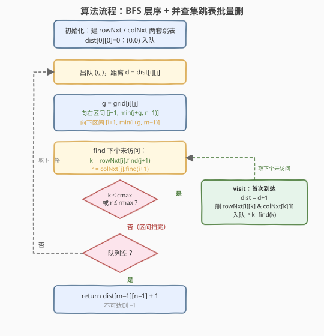
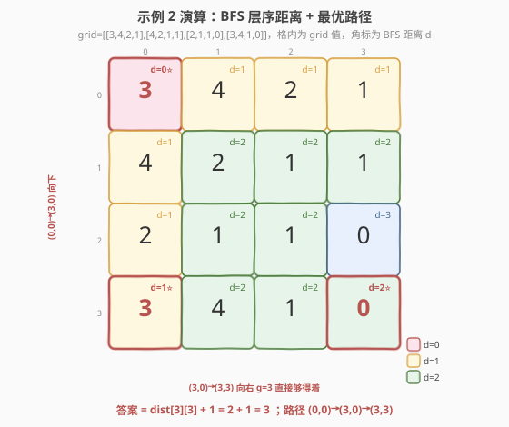

# LeetCode 网格图中最少访问的格子数 题解

## 1. 题目概述

- **标题 / 题号**：网格图中最少访问的格子数（#2617，hard）
- **链接**：https://leetcode.cn/problems/minimum-number-of-visited-cells-in-a-grid/
- **难度**：困难
- **标签**：广度优先搜索、并查集、数组、矩阵、单调栈、堆（优先队列）

**题意**：给定一个 $m \times n$ 的 0-indexed 整数矩阵 `grid`，初始位于左上角 $(0,0)$。从格子 $(i,j)$ 出发可移动到：

- **向右**：同行格子 $(i,k)$，其中 $j < k \le \text{grid}[i][j] + j$；
- **向下**：同列格子 $(k,j)$，其中 $i < k \le \text{grid}[i][j] + i$。

返回到达右下角 $(m-1,\,n-1)$ 需要访问的**最少格子数**；若不可达返回 `-1`。起点计入访问数。

**示例 1**：

```text
输入：grid = [[3,4,2,1],[4,2,3,1],[2,1,0,0],[2,4,0,0]]
输出：4
解释：一条恰访问 4 格的路径如 (0,0)→(0,1)→(3,1)→(3,3)。
```

**示例 2**：

```text
输入：grid = [[3,4,2,1],[4,2,1,1],[2,1,1,0],[3,4,1,0]]
输出：3
解释：最优路径 (0,0)→(3,0)→(3,3)，恰访问 3 格。
```

**示例 3**：

```text
输入：grid = [[2,1,0],[1,0,0]]
输出：-1
解释：无法到达 (1,2)。
```

**约束**：

- $1 \le m,\, n \le 10^5$
- $1 \le m \times n \le 10^5$
- $0 \le \text{grid}[i][j] < m \times n$
- $\text{grid}[m-1][n-1] = 0$

> 💡 「最少访问格子数」=「无权图最短路」= BFS 层序距离 $+1$。难点在于每个格子的邻居是**一段连续区间**，朴素枚举会退化到 $O\big((mn)^2\big)$。

## 2. 解题思路

### 2.1 暴力思路：建图 BFS 但逐个枚举邻居

把每个格子视作节点，把 $(i,j)$ 能到达的所有 $(i,k)$、$(k,j)$ 当作邻居，BFS 求最短路。但每个格子的邻居多达 $O(n)$ 或 $O(m)$ 个，朴素枚举总复杂度 $O\big(mn\cdot(m+n)\big)$，$mn \le 10^5$ 时最坏约 $10^{10}$，必超。必须发现邻居的**区间结构**做批量跳过。

### 2.2 核心观察：邻居是行/列上的连续区间 → 并查集「跳表」批量删除

![从 (i,j) 出发，向右可达行 i 上一段连续列 [j+1, j+g]，向下可达列 j 上一段连续行 [i+1, i+g]；已访问格被 DSU 跳表自动跳过](../images/mvg_reach_ranges.svg)

**关键观察**：从 $(i,j)$ 出发的邻居不是零散的点，而是两段连续区间——

- 行 $i$ 上的列区间 $[\,j+1,\; j+\text{grid}[i][j]\,]$（向右一段）；
- 列 $j$ 上的行区间 $[\,i+1,\; i+\text{grid}[i][j]\,]$（向下一块）。

于是可把「逐个枚举邻居」变成「**在一段区间里批量取未访问格子**」，用**并查集「下一未访问」跳表**（与 [2612. 最少翻转操作数](../2601-2700/2612_最少翻转操作数.md) 同款技巧）即可 $O(\alpha)$ 定位、$O(\alpha)$ 删除：

- **每行**维护一个 DSU `rowNxt[i]`：`find(c)` 返回行 $i$ 中 $\ge c$ 的**下一个未访问列**；访问列 $c$ 后令 `rowNxt[i][c] = find(c+1)`，此后任何 `find` 一路跳过已访问段。
- **每列**维护一个 DSU `colNxt[j]`：`find(r)` 返回列 $j$ 中 $\ge r$ 的**下一个未访问行**；访问行 $r$ 后令 `colNxt[j][r] = find(r+1)`。

**为什么需要两套 DSU？** 一个格子 $(x,y)$ 被访问后，既要让「行 $x$ 的向右扫描」跳过它（删 `rowNxt[x][y]`），也要让「列 $y$ 的向下扫描」跳过它（删 `colNxt[y][x]`）。只删一边，另一方向的扫描仍会把它当作未访问、重复入队，破坏 BFS 的「每点一次」性质。

> 💡 本题只在格子被**首次到达**时赋距离（BFS 性质保证即为最短），随后立即从两套 DSU 中删除，故每个格子至多被处理一次，DSU 操作均摊 $O\big(\alpha(mn)\big) \approx O(1)$。另：所有移动只让 $i$ 或 $j$ 严格增大，图是 **DAG**，天然无环、BFS 必终止。

### 2.3 算法流程图



三阶段：

1. **初始化**：建两套 DSU，各指针指向自身（含尾部哨兵 `n`/`m`，恒指向自己表示「无更多未访问」）；`dist[0][0]=0`，`visit(0,0)` 从两套 DSU 删除起点，$(0,0)$ 入队。
2. **BFS 扩散**：出队 $(i,j)$（距离 $d$）；记 $g=\text{grid}[i][j]$；
   - **向右**：$k = \text{rowNxt}[i].\text{find}(j{+}1)$，只要 $k \le \min(j{+}g,\,n{-}1)$：`visit(i,k,d+1)` 入队，$k = \text{rowNxt}[i].\text{find}(k)$；
   - **向下**：$r = \text{colNxt}[j].\text{find}(i{+}1)$，只要 $r \le \min(i{+}g,\,m{-}1)$：`visit(r,j,d+1)` 入队，$r = \text{colNxt}[j].\text{find}(r)$。
3. **收尾**：队空后返回 $\text{dist}[m{-}1][n{-}1] == -1\;?\;-1\;:\;\text{dist}[m{-}1][n{-}1]+1$。

### 2.4 示例演算



以示例 2 `grid = [[3,4,2,1],[4,2,1,1],[2,1,1,0],[3,4,1,0]]` 为例（$m=n=4$）：

| 层($d$) | 出队 $(i,j)$ | $g$ | 向右可达（去已访） | 向下可达（去已访） | 新入队 |
|---------|--------------|-----|--------------------|--------------------|--------|
| 0 | (0,0) | 3 | (0,1)(0,2)(0,3) | (1,0)(2,0)(3,0) | 6 格 $d{=}1$ |
| 1 | (0,1) | 4 | —（全已访） | (1,1)(2,1)(3,1) | 3 格 $d{=}2$ |
| 1 | (0,2) | 2 | — | (1,2)(2,2) | 2 格 $d{=}2$ |
| 1 | (0,3) | 1 | — | (1,3) | 1 格 $d{=}2$ |
| 1 | (3,0) | 3 | **(3,2)(3,3) ⭐** | — | 2 格 $d{=}2$ |

$(3,3)$ 在 $d=2$ 首次到达 → 答案 $= 2+1 = \mathbf{3}$。最优路径 $(0,0)\to(3,0)\to(3,3)$，恰 3 格。

> ⚠️ 注意 BFS 的层序：$(3,0)$ 是 $d{=}1$ 的格子，在它之前 $d{=}2$ 的 $(3,1)$ 已被 $(0,1)$ 的向下扫描率先访问；而 $(3,2)$、$(3,3)$ 此前无人到达，故由 $(3,0)$ 的向右扫描首次点亮。这正是「每点只首次到达即最短」的体现。

## 3. 参考代码

### C++（两张并查集跳表批量删）

```cpp
class Solution {
public:
    int minimumVisitedCells(vector<vector<int>>& grid) {
        int m = grid.size(), n = grid[0].size();
        // rowNxt[i]: 行 i 上「下一个未访问列」跳表，哨兵 n 恒指向自身
        // colNxt[j]: 列 j 上「下一个未访问行」跳表，哨兵 m 恒指向自身
        vector<vector<int>> rowNxt(m, vector<int>(n + 1));
        vector<vector<int>> colNxt(n, vector<int>(m + 1));
        for (int i = 0; i < m; ++i) iota(rowNxt[i].begin(), rowNxt[i].end(), 0);
        for (int j = 0; j < n; ++j) iota(colNxt[j].begin(), colNxt[j].end(), 0);
        vector<vector<int>> dist(m, vector<int>(n, -1));

        auto rFind = [&](int i, int c) -> int {       // 路径折叠，均摊 O(α)
            vector<int>& p = rowNxt[i];
            while (p[c] != c) { p[c] = p[p[c]]; c = p[c]; }
            return c;
        };
        auto cFind = [&](int j, int r) -> int {
            vector<int>& p = colNxt[j];
            while (p[r] != r) { p[r] = p[p[r]]; r = p[r]; }
            return r;
        };
        auto visit = [&](int i, int j, int d) {        // 首次到达即最短
            dist[i][j] = d;
            rowNxt[i][j] = rFind(i, j + 1);            // 行 DSU 删该格
            colNxt[j][i] = cFind(j, i + 1);            // 列 DSU 删该格
        };

        queue<pair<int,int>> q;
        visit(0, 0, 0);
        q.push({0, 0});
        while (!q.empty()) {
            auto [i, j] = q.front(); q.pop();
            int d = dist[i][j], g = grid[i][j];
            int cmax = min(j + g, n - 1);               // 向右区间上界
            for (int k = rFind(i, j + 1); k <= cmax; k = rFind(i, k)) {
                visit(i, k, d + 1);
                q.push({i, k});
            }
            int rmax = min(i + g, m - 1);              // 向下区间上界
            for (int r = cFind(j, i + 1); r <= rmax; r = cFind(j, r)) {
                visit(r, j, d + 1);
                q.push({r, j});
            }
        }
        int ans = dist[m - 1][n - 1];
        return ans == -1 ? -1 : ans + 1;
    }
};
```

### Python（同结构，路径压缩跳表）

```python
class Solution:
    def minimumVisitedCells(self, grid: List[List[int]]) -> int:
        m, n = len(grid), len(grid[0])
        # 哨兵 n / m 恒指向自身，表示「该行/列已无更多未访问」
        row_nxt = [list(range(n + 1)) for _ in range(m)]
        col_nxt = [list(range(m + 1)) for _ in range(n)]
        dist = [[-1] * n for _ in range(m)]

        def rfind(i, c):                # 行 i 中 >= c 的下一个未访问列
            p = row_nxt[i]
            while p[c] != c:
                p[c] = p[p[c]]           # 路径折叠
                c = p[c]
            return c

        def cfind(j, r):                # 列 j 中 >= r 的下一个未访问行
            p = col_nxt[j]
            while p[r] != r:
                p[r] = p[p[r]]
                r = p[r]
            return r

        def visit(i, j, d):
            dist[i][j] = d
            row_nxt[i][j] = rfind(i, j + 1)   # 行 DSU 删该格
            col_nxt[j][i] = cfind(j, i + 1)   # 列 DSU 删该格

        q = deque()
        visit(0, 0, 0)
        q.append((0, 0))
        while q:
            i, j = q.popleft()
            d, g = dist[i][j], grid[i][j]
            cmax = min(j + g, n - 1)           # 向右区间上界
            k = rfind(i, j + 1)
            while k <= cmax:
                visit(i, k, d + 1)
                q.append((i, k))
                k = rfind(i, k)                # k 已删，跳到下一个未访问
            rmax = min(i + g, m - 1)           # 向下区间上界
            r = cfind(j, i + 1)
            while r <= rmax:
                visit(r, j, d + 1)
                q.append((r, j))
                r = cfind(j, r)
        ans = dist[m - 1][n - 1]
        return -1 if ans == -1 else ans + 1
```

> 💡 **几处细节**：(1) 哨兵 `n`/`m` 恒指向自身：`find` 走到哨兵即返回哨兵值，循环条件 `k <= cmax`（$cmax \le n{-}1$）自然终止，无需额外判空。(2) `visit` 同时更新两套 DSU：行 DSU 让「向右扫描」跳过本格，列 DSU 让「向下扫描」跳过本格，缺一不可。(3) 路径折叠 `p[c]=p[p[c]]`（路径半长）等价于并查集标准优化，均摊 $O(\alpha)$；Python 无 `sortedcontainers` 时这是最省的写法。(4) 起点也走 `visit`，确保不会被任何扫描重新入队。

## 4. 复杂度分析

| 维度 | 复杂度 | 说明 |
|------|--------|------|
| 时间复杂度 | $O(mn \cdot \alpha(mn))$ | 每格至多入队 1 次；每次向右/向下扫描各做若干次 `find`，每格被删 1 次，`find` 均摊 $\alpha \approx O(1)$ |
| 空间复杂度 | $O(mn)$ | `dist` 与两套 DSU（行 $m\times(n{+}1)$ + 列 $n\times(m{+}1)$）均 $O(mn)$ |

> ⚠️ $mn \le 10^5$：朴素 $O\big(mn(m+n)\big)$ 最坏 $10^{10}$ 必超；跳表把「枚举一段邻居」从 $O(n)$/$O(m)$ 压到 $O(\alpha)$，总运算量约 $10^5\sim10^6$，稳过。关键不是「能否 BFS」，而是**利用邻居是行/列连续区间**做批量取删。

## 5. 扩展：线段树区间最短转移 DP

由于所有移动只让 $i$ 或 $j$ 严格增大，图是 DAG，亦可 DP：记 $f[i][j]$ 为到 $(i,j)$ 的最少格子数，则

$$
f[i][j] = 1 + \min\Big(\ \min_{\substack{k<j\\k+\text{grid}[i][k]\,\ge\, j}} f[i][k],\ \ \min_{\substack{k<i\\k+\text{grid}[k][j]\,\ge\, i}} f[k][j] \Big)
$$

前驱需满足「能一步跳到 $(i,j)$」，即 $k+\text{grid}[\cdot] \ge$ 目标坐标——是一个**带条件的前缀最小值**查询，可用线段树/单调栈维护。常见两种实现：

| 实现 | 数据结构 | 单次转移 | 特点 |
|------|----------|----------|------|
| **线段树** | 每行/每列一棵线段树维护区间最小 $f$ | $O(\log mn)$ | 条件 $k+\text{grid}[\cdot]\ge$ 目标需二分定位区间下界，常数偏大 |
| **单调栈** | 每行/每列一个按 $k{+}\text{grid}$ 单调递减的栈 | 摊还 $O(1)$ | 弹掉「够得着但 $f$ 更大」的劣解，栈顶即最优前驱 |

> 💡 BFS + 跳表把「求最短路」与「跳过已访问」合一，无需维护前缀最小值，常数与代码量都更小，是本题首选。线段树/单调栈 DP 适合「边权不等」或「要求还原路径」的变体。

## 6. 面试要点

1. **为什么是 BFS 而不是 Dijkstra？**

   > 每移动一步访问格子数 $+1$，边权恒为 1，求最少格子数 = 无权图最短路 = BFS 层序距离 $+1$。边权不等才需 Dijkstra（对照 [743. 网络延迟时间](../0701-0800/743_网络延迟时间.md)）。

2. **为什么邻居是「连续区间」？怎么用来加速？**

   > 从 $(i,j)$ 向右可达列 $k \in [j{+}1,\,j{+}g]$（同行连续一段），向下可达行 $r \in [i{+}1,\,i{+}g]$（同列连续一段）。把邻居视作「按行/列分桶的有序结构中一段区间」，用并查集跳表 `find` 定位下个未访问、删除即链向下一个，每格总删除 1 次，避免 $O(n)$/$O(m)$ 枚举。

3. **为什么需要两套 DSU？只删一套行不行？**

   > 一个格子 $(x,y)$ 既是「行 $x$ 向右扫描」的候选，也是「列 $y$ 向下扫描」的候选。只删 `rowNxt[x][y]`，列 $y$ 的 `colNxt` 仍认为行 $x$ 未访问，向下扫描会把它重复入队、覆盖距离，破坏 BFS「每点一次、首次即最短」的不变量。两套 DSU 一删皆删，才能保证任一方向都不会重访。

4. **跳表步长为什么是 1 而不是 2（对照 2612 的步长 2）？**

   > 2612 的邻居「同奇偶」成段，故步长 2 保奇偶；本题邻居就是**连续的行列下标**（无奇偶约束），步长 1 即可——`parent[x]=find(x+1)` 链向下一个下标，`find` 自然跳过已删段。两题骨架相同（区间邻居 + BFS + 跳表批量删），仅步长与分桶维度不同。

5. **没有 `std::set` 的语言怎么做？哨兵有什么用？**

   > 用并查集 `find` + 路径折叠，无需平衡树。尾部哨兵 `n`（行）/`m`（列）恒指向自身：`find` 走到哨兵返回哨兵值，而循环条件 `k <= cmax`（$cmax \le n{-}1$）天然拦住哨兵，省去空集特判。

> 💡 **一句话总结**：2617 = 「邻居是行/列连续区间」+「BFS + 两套并查集跳表批量删已访问」+「首次到达即最短」。把 $O(mn(m+n))$ 的逐个枚举压成 $O(mn\cdot\alpha)$，是「区间型邻居 BFS」的招牌优化（与 2612 同一范式）。

## 同类练习题

| # | 题目 | 与本题的关联 |
|---|------|-------------|
| 2612 | [最少翻转操作数](https://leetcode.cn/problems/minimum-reverse-operations/)（[站内题解](../2601-2700/2612_最少翻转操作数.md)） | 同款「区间型邻居 + BFS + 并查集跳表批量删」范式，邻居按奇偶成段、步长 2；对照本题步长 1、按行列分桶 |
| 1306 | [跳跃游戏 III](https://leetcode.cn/problems/jump-game-iii/)（[站内题解](../1301-1400/1306_跳跃游戏%20III.md)） | 数组 BFS + visited 标记的母题，对照本题把「单点邻居」升级为「行列区间邻居」 |
| 1345 | [跳跃游戏 IV](https://leetcode.cn/problems/jump-game-iv/)（[站内题解](../1301-1400/1345_跳跃游戏IV.md)） | BFS + 哈希按值分组一次性跳完同值，对照本题「按行/列跳表一次性跳完一段」的集合优化思想 |
| 994 | [腐烂的橘子](https://leetcode.cn/problems/rotting-oranges/)（[站内题解](../0901-1000/994_腐烂的橘子.md)） | 多源 BFS 层序扩散模板，本题单源 BFS 求最少格子数即层序距离 $+1$ |
| 547 | [省份数量](https://leetcode.cn/problems/number-of-provinces/)（[站内题解](../0501-0600/547_省份数量.md)） | 并查集基础模板，本题两套跳表复用其路径压缩思想 |
