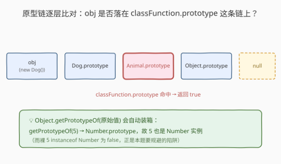
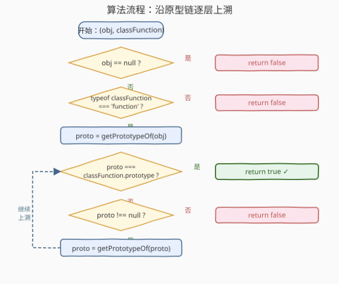
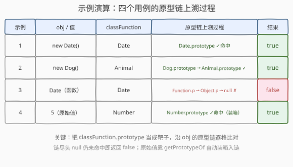

# 检查是否是类的对象实例

- **题目名称**：检查是否是类的对象实例
- **链接**：[2618. 检查是否是类的对象实例](https://leetcode.cn/problems/check-if-object-instance-of-class/)
- **难度**：中等
- **标签**：JavaScript、原型链、类型判断

## 1. 题目概述

编写函数 `checkIfInstanceOf(obj, classFunction)`，判断 `obj` 是否是 `classFunction` **或其超类**的实例。传入的数据类型不做限制——`obj` 与 `classFunction` 都可能是 `undefined`、原始值、函数或对象。

**示例 1**：

```text
输入：checkIfInstanceOf(new Date(), Date)
输出：true
解释：new Date() 返回的对象就是 Date 的实例。
```

**示例 2**：

```text
输入：class Animal {}; class Dog extends Animal {};
      checkIfInstanceOf(new Dog(), Animal)
输出：true
解释：Dog 继承 Animal，故 Dog 实例同时也是 Animal 的实例。
```

**示例 3**：

```text
输入：checkIfInstanceOf(Date, Date)
输出：false
解释：Date 构造函数自身在逻辑上不是它自己的实例。
```

**示例 4**：

```text
输入：checkIfInstanceOf(5, Number)
输出：true
解释：5 是一个 Number；但裸用 instanceof（5 instanceof Number）会返回 false，这正是要规避的坑。
```

> ⚠️ 两个陷阱：(1) 原始值 `5 instanceof Number` 为 `false`——`instanceof` 不会对左操作数装箱，原始值没有 `[[Prototype]]`；(2) `undefined`/`null` 调用 `Object.getPrototypeOf` 会抛 `TypeError`，须提前短路。

---

## 2. 解题思路

### 2.1 暴力思路：直接 instanceof

最直觉的写法是 `return obj instanceof classFunction;`。但它对原始值失效（示例 4 会返回 false）。更糟的是，若 `classFunction` 恰为 `undefined`，`instanceof` 右侧不是可调用对象，会直接抛 `TypeError: Right-hand side of instanceof is not callable`。故直接套 `instanceof` 既漏原始值、又扛不住异常输入，无法满分。

### 2.2 核心观察：沿原型链逐层比对



`instanceof` 的本质是：**沿 `obj` 的原型链逐层上溯，看是否存在某个原型 `=== classFunction.prototype`**。把这一过程手动展开，再补两处防御即可通吃所有用例：

1. **入口防御**：`obj == null` 时直接返回 false（同时挡掉 `null`/`undefined`，避免 `Object.getPrototypeOf(undefined)` 抛错）；`typeof classFunction !== 'function'` 时也返回 false（挡掉 `undefined` 类、数字等非函数类）。
2. **自动装箱**：现代引擎里 `Object.getPrototypeOf(原始值)` 会先 `ToObject` 装箱，例如 `Object.getPrototypeOf(5) === Number.prototype`。于是原始值自然入链，无需特判。

随后便是标准「链表查找」：`proto = getPrototypeOf(obj)`，只要 `proto` 非空就比较 `proto === classFunction.prototype`，命中返回 true；走到 `null` 仍未命中返回 false。

> 💡 **为什么是 `===` 而非继续用 `instanceof`？** `instanceof` 的左操作数必须是对象，对原始值直接判 false；手动比对把「是不是原型链上的某节点」拆成指针相等判断，绕开了这一限制。这与 V8 实现 `instanceof` 的内部 `[[HasInstance]]` 同理，只是把装箱与 null 防御显式补齐。

### 2.3 算法流程图



### 2.4 示例演算



以**示例 4**（`obj = 5`，`classFunction = Number`）走一遍链：

- 入口：`5 != null` 且 `typeof Number === 'function'`，放行；
- `proto = Object.getPrototypeOf(5)` → `Number.prototype`（自动装箱入链）；
- `Number.prototype === Number.prototype` → 命中，返回 `true` ✓。

**示例 3**（`obj = Date`，`classFunction = Date`）：`Date` 是函数对象，原型链为 `Function.prototype → Object.prototype → null`，链上没有 `Date.prototype`，故返回 `false`。

---

## 3. 参考代码

> 本题属 LeetCode「30 天 JavaScript」系列，仅接受 JavaScript / TypeScript 提交，故此处不提供 C++/Python 版本。

### JavaScript（手写原型链遍历）

```javascript
/**
 * @param {Object} obj
 * @param {Object} classFunction
 * @return {Boolean}
 */
var checkIfInstanceOf = function (obj, classFunction) {
    if (obj == null) return false;                        // 挡 null / undefined
    if (typeof classFunction !== 'function') return false; // 挡非函数类
    let proto = Object.getPrototypeOf(obj);              // 原始值在此自动装箱入链
    while (proto !== null) {
        if (proto === classFunction.prototype) return true;
        proto = Object.getPrototypeOf(proto);
    }
    return false;
};
```

### TypeScript（带类型标注）

```typescript
function checkIfInstanceOf(obj: any, classFunction: any): boolean {
    if (obj == null) return false;
    if (typeof classFunction !== 'function') return false;
    let proto = Object.getPrototypeOf(obj);
    while (proto !== null) {
        if (proto === classFunction.prototype) return true;
        proto = Object.getPrototypeOf(proto);
    }
    return false;
}
```

### 简洁版：`Object(obj) instanceof classFunction`

```javascript
var checkIfInstanceOf = function (obj, classFunction) {
    if (obj == null || typeof classFunction !== 'function') return false;
    return Object(obj) instanceof classFunction;   // Object(5) 装箱成 Number 对象再判定
};
```

> ⚠️ 简洁版依赖 `Object(obj)` 对原始值装箱后走 `instanceof`，逻辑与手写版等价；但前置的 `obj == null` 与 `typeof` 判断**不可省**——否则 `Object(undefined)` 返回 `{}` 会把 `undefined` 误判为 `Object` 实例，或对非函数类抛 `TypeError`。

---

## 4. 复杂度分析

| 维度 | 复杂度 | 说明 |
|------|--------|------|
| 时间复杂度 | $O(d)$ | $d$ 为 `obj` 原型链长度，最坏走到 `null`；实际类层级很浅，通常 $d \le 4$ |
| 空间复杂度 | $O(1)$ | 仅用一个指针变量 `proto`，无递归栈 |

---

## 5. 扩展：`instanceof` 的底层 `[[HasInstance]]` 与 `Symbol.hasInstance`

`a instanceof B` 并非简单的语法糖，规范语义是：

1. 若 `B` 实现了 `Symbol.hasInstance`，则调用 `B[Symbol.hasInstance](a)`（行为可被改写）；
2. 否则执行 `OrdinaryHasInstance(B, a)`：沿 `a` 的原型链找 `B.prototype`——正是我们手写的那段循环。

所以本题的手写版本质上复刻了 `OrdinaryHasInstance`，并补上「装箱原始值」与「null/非函数防御」两处补丁。这也解释了示例 4 为何 `instanceof` 失败而我们要绕开它：`instanceof` **不会**对左操作数装箱，`5` 不是对象便直接返回 false。

> 💡 想让自定义类改变 `instanceof` 的判定，可定义静态方法 `static [Symbol.hasInstance](x) { ... }`，这是 ES2015 之后「可定制 instanceof」的标准入口。

---

## 6. 面试要点

1. **为什么 `5 instanceof Number` 是 false？**

   - `instanceof` 检查左操作数对象的 `[[Prototype]]` 链，而 `5` 是原始值、不是对象，没有 `[[Prototype]]`，引擎直接返回 false，不做装箱。需先 `Object(5)` 包成 Number 对象，或用 `Object.getPrototypeOf(5)`（后者会装箱）才能入链。

2. **`Object.getPrototypeOf(undefined)` 会怎样？**

   - 会抛 `TypeError`（`ToObject(undefined)` 抛错）。因此入口必须先 `obj == null` 短路，把 `null`/`undefined` 提前挡掉。

3. **为什么用 `proto === classFunction.prototype` 而不是 `proto instanceof classFunction`？**

   - 后者会再次触发 `instanceof` 语义，对原型链上的原始值/无 `prototype` 的函数处理复杂，且可能递归调用 `Symbol.hasInstance`。直接比指针相等是 `OrdinaryHasInstance` 的原汁原味实现，最稳。

4. **`classFunction.prototype` 为 `undefined` 时（如箭头函数）会怎样？**

   - 链上每个 `proto` 都是对象或 `null`，永远不会 `=== undefined`，故最终走到 `null` 返回 false——等价于「任何值都不是箭头函数的实例」，符合语义。

5. **简洁版为什么不能省掉 `obj == null` 前置判断？**

   - `Object(null)` / `Object(undefined)` 都返回 `{}`（空对象），于是 `Object(undefined) instanceof Object` 会错误地返回 true。先 `obj == null` 短路才能保证语义正确。

---

## 7. 同类练习题

- [2705. 精简对象](https://leetcode.cn/problems/compact-object/)：递归遍历嵌套对象并删除假值，依赖 `typeof`/`Array.isArray` 分派，与本题「typeof 防御性类型判断」同源
- [2704. 相等还是不相等](https://leetcode.cn/problems/to-be-or-not-to-be/)：手写 `expect` 用 `===` 判等并抛错，对照「原始值/对象的相等与类型判定」
- [2634. 过滤数组中的元素](https://leetcode.cn/problems/filter-elements-from-array/)：用 `Boolean(value)` 真值判断手写过滤，同属 JS 运行时基础的「值真假判定」
- [2629. 复合函数](https://leetcode.cn/problems/function-composition/)：手写函数式原语，空列表退化为恒等函数，与本题入口的「`typeof === 'function'` 守卫」同思路
