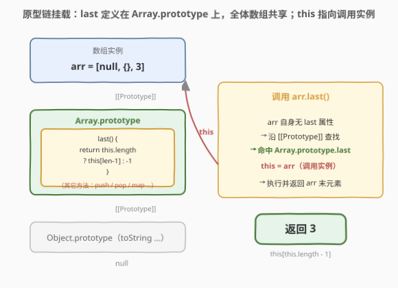
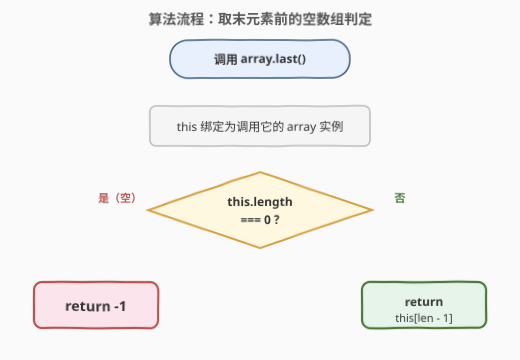
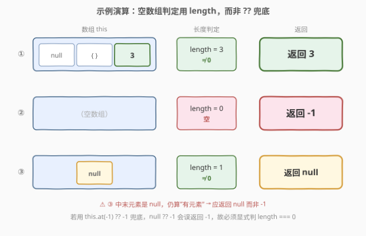

# LeetCode 数组原型对象的最后一个元素 题解

## 1. 题目概述

- **标题 / 题号**：数组原型对象的最后一个元素（#2619，easy）
- **链接**：https://leetcode.cn/problems/array-prototype-last/
- **难度**：简单
- **标签**：数组、JavaScript、原型链、this 绑定

**题意**：编写一段代码，为所有数组实现一个方法 `array.last()`：调用后返回数组的**最后一个元素**；若数组**没有元素**，则返回 $-1$。数组是 `JSON.parse` 的输出结果，因此元素可以是 `null`、对象、数字等任意合法 JSON 类型。

**示例 1**：

```text
输入：nums = [null, {}, 3]
输出：3
解释：调用 nums.last() 返回最后一个元素 3。
```

**示例 2**：

```text
输入：nums = []
输出：-1
解释：数组没有元素，返回 -1。
```

**约束**：

- `arr` 是一个合法的 JSON 数组
- $0 \le \text{arr.length} \le 1000$

> 💡 关键信号：这不是一道算法题，而是一道**语言机制题**——考查 JavaScript 原型链挂载与 `this` 动态绑定。难点不在 $O(1)$ 的取末元素，而在于「把方法挂到哪儿」「`this` 指向谁」「空数组怎么判定才不出错」。

## 2. 解题思路

### 2.1 暴力思路：用现成 API "兜底"

最直觉的写法是借助 ES2022 的负索引方法 `at`，再用空值合并 `??` 兜底：

```javascript
Array.prototype.last = function () {
  return this.at(-1) ?? -1;
};
```

空数组时 `this.at(-1)` 返回 `undefined`，`undefined ?? -1` 得 $-1$，示例 1/2 都能过。**但这有个隐蔽的坑**：当末元素本身就是 `null` 时（如 `[null]`），`null ?? -1` 同样得到 $-1$，把「有元素但元素是 `null`」误判为「没有元素」，违反题意。

> ⚠️ `??` 只能区分 `null/undefined`，无法区分「数组为空」与「末元素恰好是 `null`」。因此空数组判定必须用**精确的长度判断**，而非 nullish 兜底。

### 2.2 核心观察：原型链挂载 + this 绑定 + 长度判定



正确做法立于三根支柱：

1. **挂载位置——`Array.prototype`**：每个数组实例的内部槽 `[[Prototype]]` 都指向 `Array.prototype`。把 `last` 定义在此处，全体数组实例**共享同一份方法**，不必每个实例各存一份。若挂到单个实例 `arr.last = fn`，则只对该 `arr` 生效。

2. **`this` 绑定——调用实例**：调用 `arr.last()` 时，JS 先在 `arr` 自身查找 `last`（未命中），再沿 `[[Prototype]]` 上溯到 `Array.prototype` 命中，随后**以 `arr` 为 `this`** 执行方法。方法体内 `this.length`、`this[i]` 访问的就是这个调用实例。

3. **取值方式——长度判定 + 下标访问**：用 `this.length === 0` 精确判定空数组，非空则返回 `this[this.length - 1]`。**必须用普通 `function`**，不能用箭头函数（箭头函数没有自己的 `this`，会回退到外层词法作用域，拿不到调用实例）。

### 2.3 算法流程图



两步即可：

1. 进入方法体，`this` 即调用它的数组实例；
2. 若 `this.length === 0`，返回 $-1$；否则返回 `this[this.length - 1]`。

### 2.4 示例演算



- **示例 ①** `nums = [null, {}, 3]`：`length = 3 ≠ 0`，返回 `this[2] = 3`。
- **示例 ②** `nums = []`：`length = 0`，返回 $-1$。
- **边界 ③** `nums = [null]`：`length = 1 ≠ 0`，返回 `this[0] = null`。**注意返回的是 `null` 而非 $-1$**——数组有一个元素（恰好是 `null`），不算「没有元素」。这正是 `?? -1` 写法会踩的坑：`null ?? -1` 错误地得 $-1$。

## 3. 参考代码

### JavaScript（题目要求语言）

```javascript
/**
 * @return {null|boolean|number|string|object|array}
 */
Array.prototype.last = function () {
  if (this.length === 0) return -1;
  return this[this.length - 1];
};
```

> 💡 必须用普通 `function`：箭头 `() => {...}` 不绑定自己的 `this`，`this` 会指向外层（模块顶层为 `undefined`），从而 `this.length` 取不到数组。普通函数的 `this` 在**调用时**动态绑定到 `array.last()` 的 `array`。

**更严谨的写法（非可枚举挂载）**：直接赋值 `Array.prototype.last = fn` 会使 `last` 成为**可枚举**自有属性，导致任何数组的 `for...in` 遍历多出一个 `'last'`。用 `Object.defineProperty` 设 `enumerable: false` 可规避：

```javascript
Object.defineProperty(Array.prototype, 'last', {
  value() {
    return this.length === 0 ? -1 : this[this.length - 1];
  },
  enumerable: false,
  configurable: true,
  writable: true,
});
```

### Python（等价实现，对照语言差异）

Python 内置 `list` 由 C 实现，**无法像 JS 那样在共享原型上挂方法**。惯用法是用负索引 `arr[-1]` 取末元素，外加空判定：

```python
def last(arr: list) -> object:
    return arr[-1] if arr else -1   # arr[-1] 取末元素；空时返回 -1


# 若需给「一类 list 实例」挂方法，只能子类化（仅 ListExt 实例生效）：
class ListExt(list):
    def last(self):
        return self[-1] if self else -1
```

> 💡 Python 的 `list` 没有全局共享的可写原型对象，子类化 `ListExt` 只让其**自身实例**拥有 `last`，不会像 JS 那样「一处定义，全体现成数组可用」——这正是原型式语言与基于 C 的内置类型的关键差异。`arr[-1]` 是 Python 取末元素的惯用写法（负索引 = `len - 1`）。

### C++（等价实现，哨兵示意）

C++ 的 `std::vector` 同样无法原型扩展。用自由函数 + `back()`/`empty()` 表达同一逻辑（此处以数值数组示意哨兵 $-1$）：

```cpp
#include <vector>
// 题目语义：空数组返回哨兵 -1，否则返回末元素（以数值数组示意）
int last(const std::vector<int>& arr) {
    return arr.empty() ? -1 : arr.back();
}
```

> 💡 当元素为混合 JSON 类型时，C++ 需用 `std::variant` 包装元素类型，此时「哨兵 $-1$」与「合法元素」会类型冲突——这恰说明本题的哨兵返回语义是**为 JS 弱类型量身设计**的，静态类型语言里通常改用 `std::optional<T>` 表示「可能无值」。

## 4. 复杂度分析

| 维度 | 复杂度 | 说明 |
|------|--------|------|
| **时间复杂度** | $O(1)$ | `length` 属性 $O(1)$ 读取，下标访问 `this[i]` $O(1)$，仅一次比较 |
| **空间复杂度** | $O(1)$ | 无额外数据结构，原地读取 |

> 💡 这是一道常数操作题，重点在**正确性**而非效率：空判定的精确性（`length === 0` vs `??`）、`this` 绑定的正确性（普通函数 vs 箭头）、挂载位置的正确性（`Array.prototype` vs 实例）。

## 5. 扩展：ES2022 的 `at()` 与原型扩展的边界

**`Array.prototype.at(-1)`**：ES2022 原生支持负索引取末元素，空数组返回 `undefined`。可写成 `this.at(-1)`，但空判定仍需 `length` 检查或接受 `undefined`（不能盲目 `?? -1`）。本题用 `this[this.length - 1]` 更直观，且不依赖 ES2022 运行时。

**可枚举性与原型污染**：直接 `Array.prototype.last = fn` 会令 `last` 可枚举，`for...in` 遍历任意数组时冒出 `'last'`。生产代码中改写内置原型（monkey-patching）通常不被推荐，可能与第三方库定义的同名方法冲突。教学/竞赛场景可用 `Object.defineProperty(..., {enumerable: false})` 降低副作用。

> 💡 **一句话总结**：2619 = 「把 `last` 挂到 `Array.prototype`，普通函数体内 `this` 即调用实例，用 `length === 0` 精确判空返回 $-1$，否则返回 `this[len-1]`」。三大坑：箭头函数丢 `this`、`?? -1` 误吞 `null` 元素、直接赋值令 `last` 可枚举污染 `for...in`。

## 6. 面试要点

1. **为什么必须用普通 `function` 而非箭头函数？**

   > 箭头函数没有自己的 `this`，其 `this` 由外层词法作用域决定（模块顶层为 `undefined` 或全局对象），无法在 `arr.last()` 调用时绑定到 `arr`。普通 `function` 的 `this` 在调用时**动态绑定**到点号左侧的调用实例。

2. **为什么不能用 `return this.at(-1) ?? -1`？**

   > 空数组 `at(-1)` 返回 `undefined`，`??` 兜底得 $-1$，看似正确；但当末元素本身是 `null`（如 `[null]`）时，`null ?? -1` 也得 $-1$，把「有元素但元素是 `null`」误判为「没有元素」。空数组判定必须用精确的 `length === 0`，而非 nullish 合并。

3. **为什么挂到 `Array.prototype` 而不是单个实例？**

   > 所有数组实例的 `[[Prototype]]` 指向 `Array.prototype`，方法定义在此即被**全体共享、只存一份**。若挂到实例 `arr.last = fn`，只对该 `arr` 生效，其它数组无此方法，不符合「任何数组都能调用」的要求。

4. **`this` 在 `array.last()` 调用中指向谁？**

   > 指向调用该方法的数组实例（点号左侧的 `array`）。方法体内通过 `this.length`、`this[i]` 访问该实例的属性。

5. **直接赋值 `Array.prototype.last = fn` 有什么副作用？如何规避？**

   > 创建了**可枚举**自有属性，`for...in` 遍历任意数组会多出 `'last'`。用 `Object.defineProperty(Array.prototype, 'last', {value: fn, enumerable: false, configurable: true, writable: true})` 设为不可枚举可规避；或在生产中避免 monkey-patch 内置原型，改用具名导出的工具函数。

## 同类练习题

| # | 题目 | 与本题的关联 |
|---|------|-------------|
| 2620 | [计数器](https://leetcode.cn/problems/counter/) | 同为本系列开篇，考查闭包与函数返回值，对照原型方法的挂载方式 |
| 2626 | [数组原型对象的 reduce 变换](https://leetcode.cn/problems/array-reduce-transformation/) | 在 `Array.prototype` 上挂载类 `reduce` 方法，同属「原型扩展 + this」题型 |
| 2634 | [过滤数组中的元素](https://leetcode.cn/problems/filter-elements-from-array/) | 原型上挂 `filter` 变体，进一步练习原型方法与回调 |
| 2635 | [对数组的每个元素应用变换](https://leetcode.cn/problems/apply-transform-over-each-element-in-array/) | 原型上挂 `map` 变体，对照 2634 的过滤与映射 |
| 2631 | [分组](https://leetcode.cn/problems/group-by/) | 原型上挂 `groupBy` 方法，进阶的原型扩展 + 高阶函数 |
