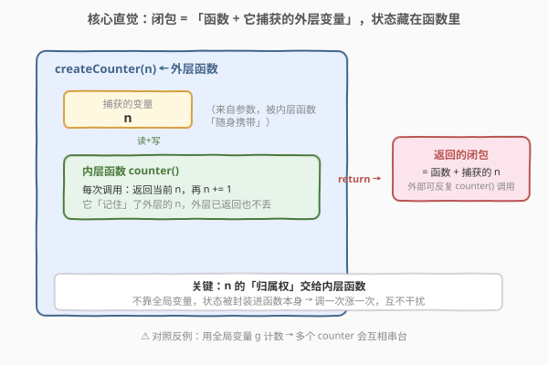
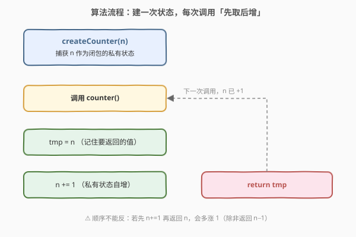
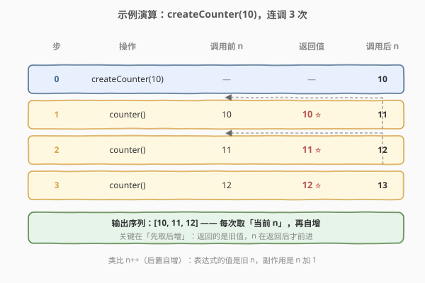

# 计数器

- **题目名称**：计数器
- **链接**：[2620. 计数器](https://leetcode.cn/problems/counter/)
- **难度**：简单
- **标签**：闭包、函数式编程、设计

## 1. 题目概述

给定一个整型参数 `n`，请你编写并返回一个 `counter` 函数。这个 `counter` 函数最初返回 `n`，每次调用它会返回前一个值加 1 的值（`n`、`n+1`、`n+2`，……）。

**示例 1**：

```text
输入：n = 10, calls = ["call","call","call"]
输出：[10,11,12]
解释：
counter() = 10  // 第一次调用，返回 n
counter() = 11  // 返回上次调用的值加 1
counter() = 12  // 返回上次调用的值加 1
```

**示例 2**：

```text
输入：n = -2, calls = ["call","call","call","call","call"]
输出：[-2,-1,0,1,2]
解释：counter() 最初返回 -2，之后每次调用加 1。
```

**约束条件**：

- `-1000 <= n <= 1000`
- `0 <= calls.length <= 1000`
- `calls[i] === "call"`

> 💡 本题考查的不是算法，而是**闭包（closure）**：如何让一个函数「记住」一段状态，并在每次被调用时推进它。题目官方以 JavaScript 为载体，但闭包思想跨语言通用，下文给出 C++ 与 Python 的等价实现。

---

## 2. 解题思路

### 2.1 暴力思路：用全局变量计数

最直白的「能跑」写法：开一个**全局变量** `g` 记状态，`createCounter` 把 `n` 塞进 `g`，每次调用 `counter` 就返回 `g` 再 `g += 1`。

```text
g = 0                       // 全局
createCounter(n): g = n; return counter
counter(): tmp = g; g += 1; return tmp
```

问题：全局变量是**共享可变状态**。如果同时存在两个计数器——`c1 = createCounter(10)`、`c2 = createCounter(-2)`——它们会读写同一个 `g`，互相串台，输出全错。此外全局变量难以被回收、难以单元测试、无法并发安全使用。

### 2.2 核心观察：闭包——把状态「封装进函数」



**闭包的定义**：一个函数 + 它在定义时**捕获**的外层作用域变量，二者绑定在一起，即使外层函数已经返回，被捕获的变量依然「活着」、只被这个内层函数持有。

把上面的全局变量 `g` 换成「外层函数的参数 `n`」即可：

- `createCounter(n)` 不返回值，而**返回一个内层函数** `counter`；
- 内层函数引用了外层的 `n`，于是 `n` 被 `counter` 捕获，成为它的**私有状态**；
- 每次 `counter()` 被调用，就读取并自增这个只属于自己的 `n`。

这样 `c1` 和 `c2` 各自持有**独立的** `n`，互不干扰——这正是「封装」的意义：状态不再暴露在全局，而是被绑在函数实例上。

> 💡 **为什么外层返回后 `n` 不消失？** 一般函数的局部变量在返回后即销毁；但一旦有内层函数引用了它，运行时就把它「提升」到堆上，生命周期与引用它的闭包绑定。JS、Python（`cell` 对象）、C++（`std::function` 捕获）都是类似机制。

> ⚠️ **不可变捕获 vs 可变捕获**：很多语言默认「按值捕获」是不可变的（如 C++ lambda 不加 `mutable`、JS `const` 思路）。要修改捕获的 `n`，需要让状态「可变」——Python 用 `nonlocal`、JS 用 `let`、C++ lambda 用 `mutable`，见第 3 节各语言写法。

### 2.3 算法流程图



整体只有两段：

1. **建状态**：`createCounter(n)` 捕获 `n`，返回闭包（一次性）；
2. **每次调用**：`tmp = n`（取当前值）→ `n += 1`（推进）→ `return tmp`（返回旧值）。

> ⚠️ **顺序必须是「先取后增」**：若先 `n += 1` 再返回 `n`，会多涨 1；除非改成返回 `n − 1`。最简写法直接用后置自增 `n++`——表达式的值是旧 `n`，副作用是 `n` 加 1，天然「先取后增」。

### 2.4 示例演算



以 `n = 10` 为例：

| 步 | 操作 | 调用前 n | 返回值 | 调用后 n |
|----|------|----------|--------|----------|
| 0 | `createCounter(10)` | — | — | 10 |
| 1 | `counter()` | 10 | **10** | 11 |
| 2 | `counter()` | 11 | **11** | 12 |
| 3 | `counter()` | 12 | **12** | 13 |

输出 `[10, 11, 12]`。「先取后增」保证了返回的是**调用前**的值，`n` 在返回之后才前进——与后置 `n++` 语义一致。

---

## 3. 参考代码

### C++

```cpp
#include <functional>
#include <utility>

// 写法一：lambda 捕获 + mutable（最贴近 JS 闭包语义）
std::function<int()> createCounter(int n) {
    // 按值捕获 n，mutable 允许在闭包内修改「属于自己的副本」
    return [n]() mutable {
        return n++;
    };
}

// 写法二：仿函数（functor），用成员变量当状态
struct Counter {
    int n;
    Counter(int x) : n(x) {}
    int operator()() { return n++; }
};
Counter createCounter2(int n) { return Counter{n}; }
```

> 💡 **`mutable` 不可省**：C++ lambda 默认把按值捕获的变量视为 `const`，不加 `mutable` 就无法 `n++`。这等价于「让闭包的状态可变」，对应 Python 的 `nonlocal` / JS 的 `let`。仿函数写法把状态放在成员 `n` 里，语义更直白，调用方式 `counter()` 也一致。

### Python

```python
# 写法一：闭包 + nonlocal（标准闭包写法）
def counter(n: int):
    def call():
        nonlocal n          # 声明修改外层捕获的 n（而非新建局部变量）
        ans = n
        n += 1
        return ans
    return call

# 写法二：生成器 + 可调用包装（函数式风味）
def counter2(n: int):
    gen = (x for x in range(n, 1_000_000))  # 无限自增序列的简化
    return lambda: next(gen)

# 写法三：itertools.count（最省事）
from itertools import count
def counter3(n: int):
    c = count(n)
    return lambda: next(c)
```

> ⚠️ **`nonlocal` 不可省**：若内层只写 `n += 1` 而无 `nonlocal`，Python 会把 `n` 当成**局部变量**，因赋值前读取而抛 `UnboundLocalError`。`nonlocal` 明确告诉解释器「这个 `n` 是外层捕获来的」，与 C++ `mutable` 同义。

> 💡 **额外附 JavaScript 原版**（题目官方语言，便于对照）：
> ```javascript
> var createCounter = function (n) {
>     return function () {
>         return n++;
>     };
> };
> ```

---

## 4. 复杂度分析

| 维度 | 复杂度 | 说明 |
|------|--------|------|
| 时间复杂度 | $O(1)$ 每次 / $O(1)$ 创建 | 每次调用仅一次读取 + 一次自增 |
| 空间复杂度 | $O(1)$ 每个计数器 | 只持有单个整型状态 `n`，与调用次数无关 |

> 💡 本题没有「规模」可言，复杂度恒为常数；考点在**封装**而非性能。`calls.length <= 1000` 也只是说明调用次数有限，不影响渐近分析。

---

## 5. 扩展：闭包的更多用法与陷阱

- **多计数器隔离**：`c1 = createCounter(0)`、`c2 = createCounter(100)` 各自独立，正因状态绑在闭包实例上而非全局。这是闭包相对全局变量的根本优势。
- **带步长/带重置**：闭包可捕获多个变量，做成 `createCounter(n, step)` 每次 `n += step`，或再加一个 `reset()` 内层函数，返回一个「对象」——这正是 JS 模块模式与 Python `__call__` 类的雏形。
- **循环捕获陷阱**（JS 经典）：`for (var i=...)` 中的 `var` 是函数级作用域，循环里创建的闭包都共享同一个 `i`，循环结束后全是终值；用 `let`（块级作用域，每次迭代新建绑定）或 IIFE 即可让每个闭包捕获各自的 `i`。C++ 可显式 `[i]` 按值捕获规避；Python 默认按引用捕获循环变量，需用默认参数 `f=lambda i=i: i` 固化。
- **不可变捕获默认值**：Rust / C++ `const` lambda 捕获的变量不可变，强制「函数纯净」；要可变状态需显式 `mutable` / `Cell` / `RefCell`，是语言层面对「共享可变状态」的约束。

---

## 6. 面试要点

1. **什么是闭包？它解决了「全局变量计数」的什么问题？**

   > 闭包 = 函数 + 捕获的外层变量。它把状态**封装**在函数实例上，外部无法直接访问，且多个闭包各自持有独立状态——避免了全局变量的共享串台、生命周期不可控、难测试等问题。

2. **外层函数返回后，被捕获的变量为什么还在？**

   > 一旦有内层函数引用某外层变量，运行时就把该变量从栈提升到堆（JS 闭包、Python `cell`、C++ `std::function` 捕获），其生命周期与引用它的闭包绑定，直至闭包被回收。

3. **C++ 的 `mutable`、Python 的 `nonlocal`、JS 的 `let` 各解决什么问题？**

   > 都是为了让「按值/按引用捕获的变量可被修改」。C++ lambda 默认按值捕获且视为 `const`，需 `mutable` 解锁；Python 在内层赋值默认建局部变量，需 `nonlocal` 声明指向外层；JS 用 `let`/`var` 决定绑定方式，`var` 会在循环中共享（见扩展 3）。

4. **为什么顺序必须是「先取后增」？写反了会怎样？**

   > 「先取后增」保证返回的是调用**前**的值。若先 `n += 1` 再返回 `n`，会多涨 1；改返回 `n − 1` 可修正但易错。后置自增 `n++` 天然符合该语义——表达式取旧值，副作用使 `n` 加 1。

5. **如何用闭包实现一个「可重置」的计数器？**

   > 闭包可捕获多个变量并返回多个内层函数。例如 Python 返回一个带 `__call__` 与 `reset` 方法的对象，或 JS 返回 `{ call, reset }`；`reset` 把捕获的 `n` 重新赋为初值。关键：`n` 仍是闭包私有状态，外部只能通过暴露的方法操作。

---

## 7. 同类练习题

- [2665. 计数器 II](https://leetcode.cn/problems/counter-ii/)：本题进阶，返回 `counter/reset/increment/decrement` 一组方法，巩固「闭包封装多个操作共享同一私有状态」
- [2621. 睡眠](https://leetcode.cn/problems/sleep/)：同属 30 Days of JS 系列，闭包 + `Promise`/定时器，对照「函数即值」的延时调用
- [2666. 只允许一次函数调用](https://leetcode.cn/problems/allow-one-function-call/)：用闭包加一个布尔标志位实现「调用一次后失效」，同一封装思想不同语义
- [2623. 记忆函数](https://leetcode.cn/problems/memoize/)：闭包持有缓存字典 `cache`，把「记忆」状态封进函数，是「函数 + 私有状态」的典型应用
