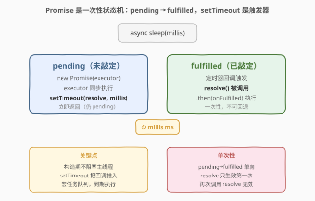
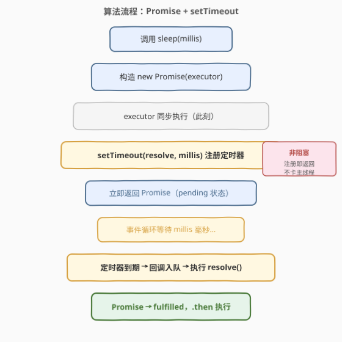
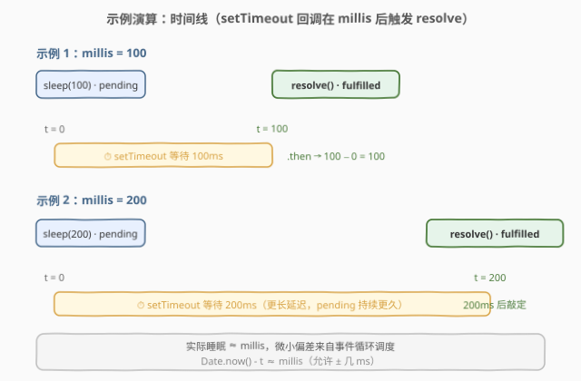

# LeetCode 睡眠函数 题解

## 1. 题目概述

- **标题 / 题号**：睡眠函数（#2621，easy）
- **链接**：https://leetcode.cn/problems/sleep/
- **难度**：简单
- **标签**：Promise、async/await、setTimeout、异步

**题意**：请你编写一个异步函数 `sleep`，它接收一个正整数参数 `millis`，并休眠 `millis` 毫秒。要求此函数可以解析（resolve）任何值。

> 请注意，实际睡眠持续时间与 `millis` 之间的微小偏差是可以接受的。

**示例 1**：

```text
输入：millis = 100
输出：100
解释：在 100ms 后此异步函数执行完时返回一个 Promise 对象
let t = Date.now();
sleep(100).then(() => {
  console.log(Date.now() - t); // 100
});
```

**示例 2**：

```text
输入：millis = 200
输出：200
解释：在 200ms 后函数执行完时返回一个 Promise 对象
```

**约束**：

- `1 <= millis <= 1000`

> 💡 关键信号：这是一道**语言特性题**，不考算法复杂度，考的是对 JS 异步模型——Promise 状态机、事件循环、`setTimeout` 宏任务——的理解。核心是「**用定时器驱动一次性的状态转移**」。

## 2. 解题思路

### 2.1 暴力思路：忙等（busy-wait）

最朴素的思路是写一个 `while` 循环不停判断 `Date.now() - start >= millis` 是否成立：

```javascript
function sleep(millis) {
  const start = Date.now();
  while (Date.now() - start < millis) {} // 死循环阻塞
  return Promise.resolve();
}
```

这能「睡够」时间，但代价是**完全霸占主线程**：在这段时间里事件循环被卡死，UI 无法响应、定时器无法触发、其它 Promise 回调无法执行。在浏览器中还会触发「页面卡死」警告。

> ⚠️ **忙等是异步编程的反模式**。它违背了「非阻塞」的初衷——异步存在的意义正是「让出主线程、等时间到了再回来」。本题要的是「调度一个延迟回调」，而非「占着 CPU 空转」。

### 2.2 核心观察：Promise + setTimeout



`Promise` 是一个**一次性状态机**，有三个状态：

- `pending`（未敲定）：初始状态，既未成功也未失败。
- `fulfilled`（已成功）：`resolve` 被调用后转入，**单向、不可回退**。
- `rejected`（已失败）：`reject` 被调用后转入，同样单向。

状态一旦从 `pending` 转为 `fulfilled` 或 `rejected`，就**永久锁定**，之后再次调用 `resolve` / `reject` 不会再改变状态。

要实现「延迟 `millis` 毫秒后完成」，只需：

1. 构造一个 `Promise`，在它的 **executor**（传入 `new Promise` 的函数）里调用 `setTimeout(resolve, millis)`——把 `resolve` 注册为一个 `millis` 毫秒后才触发的定时器回调；
2. 构造时 Promise 处于 `pending`，**立即返回**（不阻塞主线程），调用方拿到一个未敲定的 Promise；
3. `millis` 毫秒后定时器到期，回调被推入**宏任务队列**，事件循环取出它并执行 `resolve()`，Promise 转为 `fulfilled`；
4. 注册在 `.then` 上的回调随后被推入**微任务队列**执行。

> 💡 **为什么用 `setTimeout` 而非 `setInterval`？** 我们只需要「一次性」的延迟，`setTimeout` 注册一次回调即完成任务；`setInterval` 是周期性触发，需配套 `clearInterval` 清理，对本题多余。`setTimeout(fn, 0)` 也是常见的「把任务推到下一轮事件循环」的手法，但本题要的是真实延迟，故用 `setTimeout(resolve, millis)`。

### 2.3 算法流程图



关键点：`setTimeout(resolve, millis)` 是**注册即返回**的，它不会阻塞当前同步代码；真正的「等待」发生在事件循环层面，主线程在此期间可以处理其它任务。这正是异步非阻塞的精髓。

### 2.4 示例演算



- **示例 1** `millis = 100`：`t = Date.now()` 后调用 `sleep(100)`，立即拿到一个 `pending` 的 Promise；100ms 后定时器触发 `resolve()`，Promise 转 `fulfilled`，`.then` 回调执行，`Date.now() - t ≈ 100`。
- **示例 2** `millis = 200`：同理，延迟 200ms 后敲定。`pending` 持续得更久，但主线程始终未被阻塞。

实际测得的 `Date.now() - t` 会略大于 `millis`（几毫秒级偏差），因为定时器回调需等当前宏任务与微任务清空后才会执行——这正是题目允许「微小偏差」的原因。

## 3. 参考代码

### JavaScript（推荐写法一：Promise 构造）

```javascript
async function sleep(millis) {
  return new Promise(resolve => setTimeout(resolve, millis));
}
```

> 💡 这是最直接的写法：构造一个 Promise，executor 中用 `setTimeout(resolve, millis)` 把 `resolve` 延迟 `millis` 毫秒执行。函数标记为 `async` 以匹配题目「异步函数」的签名；`return` 一个 Promise 后，调用方既可以 `.then` 也可以 `await`。`resolve` 不传参数等价于 `resolve(undefined)`，满足「可以解析任何值」。

### JavaScript（写法二：async/await 内部等待）

```javascript
async function sleep(millis) {
  await new Promise(resolve => setTimeout(resolve, millis));
}
```

> 💡 与写法一等价：`await` 一个内部 Promise，等它敲定后函数自身的 Promise 才 `resolve`。区别仅在「返回时机」：写法一**直接返回**那个内部 Promise（少一层包装）；写法二 `await` 后再隐式 `resolve`（多一层，但语义更直白地表达「等这个延迟结束」）。本题两者 AC 结果一致，推荐写法一更省一层。

### Python（asyncio 对应实现）

```python
import asyncio


class Solution:
    async def sleep(self, millis: int) -> None:
        await asyncio.sleep(millis / 1000)
```

> 💡 Python 的 `asyncio.sleep(seconds)` 是 JS `setTimeout + Promise` 的对应物：它返回一个协程，把唤醒点交给事件循环，**不阻塞线程**。注意 `asyncio.sleep` 接收**秒**，故把毫秒除以 1000。Python 的 `time.sleep` 则是**阻塞**的，对应 JS 的忙等，不能用于异步场景。

## 4. 复杂度分析

| 维度 | 复杂度 | 说明 |
|------|--------|------|
| **时间复杂度** | $O(1)$ | 只注册一个定时器、一次 `resolve`，与 `millis` 大小无关（等待是「挂起」而非计算） |
| **空间复杂度** | $O(1)$ | 仅分配一个 Promise 对象与一个定时器句柄 |

> 💡 真正的「时间成本」是 $O(\text{millis})$ 毫秒的延迟，但这是**调度开销**而非**计算复杂度**。从算法角度看是常数时间、常数空间。题目的 $1 \le \text{millis} \le 1000$ 只是为了保证测试用例能在合理时间内跑完。

## 5. 扩展：`setTimeout` 的 0ms 情形与微任务对比

`setTimeout(fn, 0)`（或省略第二参数）不会「立刻」执行 `fn`，而是把它推迟到**当前同步代码与微任务队列都清空之后**的下一个宏任务。这与 `Promise.resolve().then(fn)`（微任务）有本质区别：

```javascript
console.log(1);
setTimeout(() => console.log(2), 0);        // 宏任务，最后
Promise.resolve().then(() => console.log(3)); // 微任务，先于 setTimeout
console.log(4);
// 输出顺序：1, 4, 3, 2
```

在本题中，`resolve` 由 `setTimeout` 触发，因此整个状态转移发生在**宏任务**层面；`resolve` 之后注册的 `.then` 回调则在随后的**微任务**中执行。理解这条「宏任务→微任务」的链条，是理解 `sleep` 测得时间略大于 `millis` 的关键。

> ⚠️ 极端写法 `async function sleep(millis) { const end = Date.now() + millis; while (Date.now() < end) {} }` 是**忙等阻塞**，虽能过题但违背异步初衷，面试中会被视为错误答法。

## 6. 面试要点

1. **Promise 有几个状态？状态转换是单向的吗？**

   > 三个：`pending`、`fulfilled`、`rejected`。转换是**单向不可逆**的：只能从 `pending` 转到 `fulfilled` 或 `rejected` 之一，且一旦敲定就永久锁定，之后调用 `resolve`/`reject` 无效。

2. **为什么用 `setTimeout(resolve, millis)` 而不是 `while` 忙等？**

   > `setTimeout` 是「**调度一个延迟回调**」，注册即返回，主线程立即让出，事件循环在该延迟到期后才会取出回调执行；忙等则**霸占主线程**空转，阻塞所有 UI、定时器与微任务，是异步编程的反模式。

3. **`async` 函数 `return` 一个 Promise 与 `await` 一个 Promise 有何区别？**

   > 在 `async` 函数中 `return somePromise` 时，若 `somePromise` 已是 thenable，运行时会让函数自身的 Promise **跟随**它（状态同步），不额外包一层；`await somePromise` 则是显式暂停函数直到它敲定，再隐式 `resolve` 函数自身。本题两者等价，但 `return` 写法少一层包装、更直接。

4. **测得的 `Date.now() - t` 为什么可能略大于 `millis`？**

   > 定时器到期后，回调需进入**宏任务队列**排队，必须等当前宏任务及其间产生的微任务队列全部清空后才会执行。若此刻主线程正忙，回调会被推迟，造成几毫秒级偏差。题目据此允许「微小偏差」。

5. **如何让 `sleep` 支持中途取消？**

   > 保存 `setTimeout` 返回的句柄，并暴露一个 `cancel` 方法调用 `clearTimeout`；同时配套 `reject` 一个取消信号，使 Promise 从 `pending` 转 `rejected`，调用方可在 `.catch` 中感知取消。这是实现「可取消的延迟」的标准模式。

> 💡 **一句话总结**：2621 = 「`new Promise(r => setTimeout(r, millis))`」。Promise 是一次性状态机，`setTimeout` 把 `resolve` 延迟到 `millis` 毫秒后的宏任务中执行，实现非阻塞的延迟敲定。

## 同类练习题

| # | 题目 | 与本题的关联 |
|---|------|-------------|
| 2622 | [缓存时间限制](https://leetcode.cn/problems/cache-with-time-limit/) | 用 `setTimeout` 给缓存键设置过期回调，到期 `delete` 后 `clearTimeout`，承接本题「定时器驱动状态」思想 |
| 2627 | [防抖](https://leetcode.cn/problems/debounce/) | 每次调用 `clearTimeout` 旧定时器再 `setTimeout` 新定时器，是本题「延迟回调」的反复重置版 |
| 2636 | [串行处理 promise](https://leetcode.cn/problems/promise-pool/) | 在 Promise 之间用 `await` 串行调度，承接本题对 async/await 与 Promise 链的理解 |
| 1462 | [课程表 IV](https://leetcode.cn/problems/course-schedule-iv/)（[题解](../1401-1500/1462_课程表IV.md)） | 虽为图论题，但「调度有依赖的任务」与异步串行的思想相通，可对照「等待就绪再执行」 |
