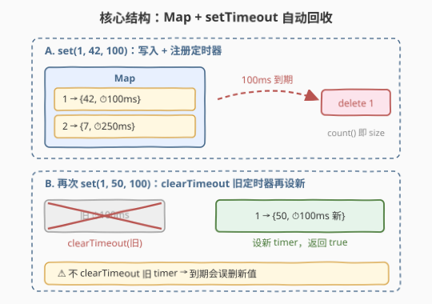
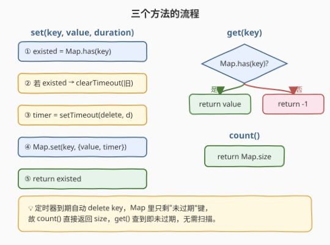
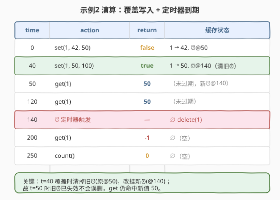

# 有时间限制的缓存

- **题目名称**：有时间限制的缓存
- **链接**：[2622. 有时间限制的缓存](https://leetcode.cn/problems/cache-with-time-limit/)
- **难度**：中等
- **标签**：设计、哈希表、定时器

## 1. 题目概述

编写一个类，允许获取和设置键-值对，并且每个键都有一个**过期时间**（`duration` 毫秒）。该类有三个公共方法：

- `set(key, value, duration)`：接收整型键 `key`、整型值 `value` 和以毫秒为单位的持续时间 `duration`。一旦 `duration` 到期后，这个键就无法访问。如果**相同的未过期键已经存在**，该方法返回 `true`，否则返回 `false`。如果该键已经存在，则它的值和持续时间都应该被覆盖。
- `get(key)`：如果存在一个未过期的键，返回这个键相关的值；否则返回 `-1`。
- `count()`：返回未过期键的总数。

**示例 1**：

```text
输入：
actions = ["TimeLimitedCache", "set", "get", "count", "get"]
values  = [[], [1, 42, 100], [1], [], [1]]
timeDelays = [0, 0, 50, 50, 150]
输出：[null, false, 42, 1, -1]
解释：
t=0   构造缓存。
t=0   set(1, 42, 100) → false（键不存在），1→42，100ms 后过期。
t=50  get(1) → 42。
t=50  count() → 1。
t=100 key=1 过期。
t=150 get(1) → -1（已过期/为空）。
```

**示例 2**：

```text
输入：
actions = ["TimeLimitedCache", "set", "set", "get", "get", "get", "count"]
values  = [[], [1, 42, 50], [1, 50, 100], [1], [1], [1], []]
timeDelays = [0, 0, 40, 50, 120, 200, 250]
输出：[null, false, true, 50, 50, -1, 0]
解释：
t=0   set(1, 42, 50) → false，1→42，50ms 后过期。
t=40  set(1, 50, 100) → true（未过期的 1 已存在），覆盖为 1→50，140ms 后过期。
t=50  get(1) → 50（新定时器未过期）。
t=120 get(1) → 50。
t=140 key=1 过期。
t=200 get(1) → -1。
t=250 count() → 0。
```

**约束条件**：

- `0 <= key, value <= 10^9`
- `0 <= duration <= 1000`
- `1 <= actions.length <= 100`，且 `actions.length === values.length === timeDelays.length`
- `0 <= timeDelays[i] <= 1450`
- `actions[i]` 是 `"TimeLimitedCache"`、`"set"`、`"get"`、`"count"` 之一；第一个操作始终是构造且延迟为 0。

> 💡 本题是 LeetCode「30 天 JavaScript」系列题目，**仅提供 JavaScript / TypeScript 提交入口**，核心考察 `setTimeout` / `clearTimeout` 的运用。本文以 JS 为提交语言，并给出 Python 概念等价实现。

---

## 2. 解题思路

### 2.1 暴力思路

用一个普通对象 `{ key: { value, expireAt } }` 存所有键，`get` 时用 `Date.now() < expireAt` 判断是否过期。可行，但过期键**不会主动消失**，会一直堆积在表里；`count()` 每次都要 `O(n)` 扫描清理过期项。能用，但不够"自动"。

### 2.2 核心观察：Map + setTimeout 主动回收



关键洞察：**让过期键"自己消失"，而不是每次访问再检查**。

- 用 `Map` 存 `key → { value, timer }`，其中 `timer` 是 `setTimeout` 返回的句柄；
- `set` 时注册一个 `setTimeout(() => cache.delete(key), duration)`，`duration` 到期后回调自动把键从 Map 里删掉；
- 于是 **Map 里能查到的键一定是未过期的**——`get` 查到即有效、`count` 直接返回 `Map.size`，无需任何过期扫描。

两个数据结构 / 机制分工：

| 机制 | 职责 | 复杂度 |
|------|------|--------|
| `Map` | `O(1)` 定位键值与定时器句柄 | `O(1)` 查找 |
| `setTimeout` | 到期自动 `delete`，维持"Map 即未过期集"不变式 | `O(1)` 注册 |

> ⚠️ **覆盖时必须 `clearTimeout` 旧定时器**：若再次 `set` 同一个未过期键而不清旧 timer，旧定时器到期时会**误删新值**（见示例 2 的 t=40 覆盖：不清旧 timer 则 t=50 会把新值 50 删掉，导致后续 `get` 返回 -1）。这是本题最易踩的坑。

### 2.3 算法流程图



### 2.4 示例演算



以**示例 2**为例，关键在 t=40 的覆盖：`set(1, 50, 100)` 返回 `true`（键 1 未过期），同时 `clearTimeout` 掉原定于 t=50 触发的旧 timer，改挂一个 t=140 到期的新 timer。因此 t=50 时旧 timer 早已失效、不会误删，`get(1)` 仍命中新值 50；直到 t=140 新 timer 触发删键，此后访问均返回 -1/0。

---

## 3. 参考代码

### JavaScript / TypeScript（提交语言，主动过期）

```javascript
var TimeLimitedCache = function () {
    this.cache = new Map(); // key -> { value, timer }
};

/**
 * @param {number} key
 * @param {number} value
 * @param {number} duration 过期毫秒
 * @return {boolean} 是否已存在未过期的同名键
 */
TimeLimitedCache.prototype.set = function (key, value, duration) {
    const existed = this.cache.has(key); // 能查到即未过期（到期已被定时器删除）
    if (existed) clearTimeout(this.cache.get(key).timer); // 清旧定时器，防误删新值
    const timer = setTimeout(() => this.cache.delete(key), duration);
    this.cache.set(key, { value, timer });
    return existed;
};

/**
 * @param {number} key
 * @return {number}
 */
TimeLimitedCache.prototype.get = function (key) {
    if (!this.cache.has(key)) return -1;
    return this.cache.get(key).value;
};

/**
 * @return {number} 未过期键总数
 */
TimeLimitedCache.prototype.count = function () {
    return this.cache.size;
};
```

TypeScript 版（类写法）：

```typescript
class TimeLimitedCache {
    private cache = new Map<number, { value: number; timer: ReturnType<typeof setTimeout> }>();

    set(key: number, value: number, duration: number): boolean {
        const existed = this.cache.has(key);
        if (existed) clearTimeout(this.cache.get(key)!.timer);
        const timer = setTimeout(() => this.cache.delete(key), duration);
        this.cache.set(key, { value, timer });
        return existed;
    }

    get(key: number): number {
        return this.cache.has(key) ? this.cache.get(key)!.value : -1;
    }

    count(): number {
        return this.cache.size;
    }
}
```

### Python（概念等价，惰性时间戳）

> 本题 LeetCode 仅开放 JS/TS，Python 版作概念对照。Python 无 `setTimeout`，此处用**惰性时间戳**法（第 5 节详解）：存过期时刻，访问时再判定。它更稳健、无多线程竞态，是另一类通用过期缓存设计。

```python
import time


class TimeLimitedCache:
    def __init__(self):
        self.cache = {}  # key -> [value, expire_at_ms]

    @staticmethod
    def _now_ms() -> float:
        return time.time() * 1000.0

    def set(self, key: int, value: int, duration: int) -> bool:
        now = self._now_ms()
        existed = key in self.cache and self.cache[key][1] > now  # 且未过期
        self.cache[key] = [value, now + duration]
        return existed

    def get(self, key: int) -> int:
        entry = self.cache.get(key)
        if entry is not None and entry[1] > self._now_ms():
            return entry[0]
        return -1

    def count(self) -> int:
        now = self._now_ms()
        # 顺手清理已过期键，保证 len 反映真实未过期数
        for k in [k for k, (_, exp) in self.cache.items() if exp <= now]:
            del self.cache[k]
        return len(self.cache)
```

> ⚠️ JS 版的 `set` 返回值依赖"`has(key)` 即未过期"这一**不变式**：因为定时器到期会自动删键，所以能查到必未过期，直接用 `has` 判定即可；Python 惰性版则需额外比 `expire_at > now`，因为过期键仍躺在表里。

---

## 4. 复杂度分析

| 维度 | 复杂度 | 说明 |
|------|--------|------|
| 时间复杂度 | $O(1)$ | `set`/`get`/`count` 均为 `Map` 操作 + 常数次定时器调用；Python 惰性版 `count` 为 $O(n)$（n≤100，可忽略） |
| 空间复杂度 | $O(n)$ | `n` 为当前未过期键数，过期即被回收 |

> 💡 JS 主动过期版的精髓：把"过期检查"的代价从**每次访问 O(n) 扫描**摊到**注册时 O(1) 一次 `setTimeout`**，并用回调把清理异步化，使访问路径始终 O(1)。

---

## 5. 扩展：两种过期策略——主动 vs 惰性

带 TTL 的缓存有两大过期回收范式：

| 策略 | 做法 | 优点 | 缺点 |
|------|------|------|------|
| **主动过期（eager）** | 写入时注册定时器，到期回调自动删 | 访问路径恒 O(1)，`size` 恒准确 | 定时器数量 = 键数，海量键时定时器开销大；依赖事件循环/线程 |
| **惰性过期（lazy）** | 只存过期时刻，访问/扫描时再判定并清 | 无定时器开销，实现简单；易跨语言 | 过期键堆积占内存；`count` 需扫描清理（可用"惰性+后台周期巡检"折中） |

- 本题 JS 版用**主动**（`setTimeout`），Python 版用**惰性**（时间戳）。Redis 的键过期同时采用二者：惰性访问检查 + 后台定期随机采样巡检，兼顾性能与内存。
- 工程上常再加一层**容量淘汰**（如 LRU/LFU），即"既看 TTL 又看容量"：本题只问 TTL，146 LRU 只问容量，二者正交。

> 💡 若把本题的 `setTimeout` 换成"时间轮（hashed wheel timer）"，就是 Linux 内核 / Kafka / Netty 处理海量定时任务的标准结构——按到期桶分桶，把 $O(n)$ 定时器降到接近 $O(1)$ 摊还。

---

## 6. 面试要点

1. **为什么 `set` 里要 `clearTimeout` 旧定时器？**

   - 覆盖写入时旧定时器仍挂在事件循环里。若不清，它到原定时刻会执行 `cache.delete(key)`，把**刚写入的新值**删掉，造成后续 `get` 误返 -1。必须 `clearTimeout` 旧 timer 再挂新 timer，让键的存活期与最新 `duration` 对齐。

2. **为什么 `get` 查到就一定是未过期？`count` 为何直接返回 `size`？**

   - 主动过期策略维持了一条不变式：**Map 中存在的键即未过期键**——过期键在到期瞬间已被定时器回调删除。因此 `get` 不必再比时间戳，`count` 也不必扫描，都享受 O(1)。

3. **`duration = 0` 时键算不算存在？**

   - `duration = 0` 意为"立即过期"。JS 中 `setTimeout(fn, 0)` 回调在下一事件循环 tick 才执行；本题测试框架在相邻操作间 `await` 了 `timeDelays` 的真实延迟，会先让 pending 的 0ms 回调跑掉，故下一操作时键已被删、视为过期。惰性时间戳版则更直白：`expire_at = now + 0 = now`，`now < expire_at` 恒假，立即过期。

4. **JS 版与 Python 惰性版 `set` 的返回值判定有何不同？**

   - JS 版：`existed = cache.has(key)`——因为过期键早已被删，`has` 命中即未过期。Python 惰性版：`existed = key in cache and expire_at > now`——过期键仍在表里，必须再加时间戳比较，否则会把"已过期但未清理的同名键"误判为存在而返回 `true`。

5. **和 146 LRU 缓存的设计思路有何异同？**

   - 都用哈希表做 `O(1)` 定位，都维护一条"淘汰"语义。区别在**淘汰触发**：LRU 按容量满时淘汰"最久未用"（需双向链表维护时序），TTL 缓存按时间到期淘汰（需定时器/时间戳维护 TTL）。两者正交，可叠加成"带 TTL 的 LRU"（如真实缓存系统）。

---

## 7. 同类练习题

- [146. LRU 缓存](https://leetcode.cn/problems/lru-cache/)：按容量淘汰"最久未用"，哈希表 + 双向链表，与本题"按时间淘汰"正交，可叠加
- [460. LFU 缓存](https://leetcode.cn/problems/lfu-cache/)：按频率淘汰，频率桶 + 同频 LRU，淘汰策略维度更细
- [981. 基于时间的键值存储](https://leetcode.cn/problems/time-based-key-value-store/)：同一 key 多版本时间戳，`upper_bound` 二分取最近历史值，TTL 的"读时取最近"对照
- [O(1) 时间插入、删除和获取随机元素](https://leetcode.cn/problems/insert-delete-getrandom-o1/)：另一经典 O(1) 设计题，哈希表 + 数组 + 交换删除
