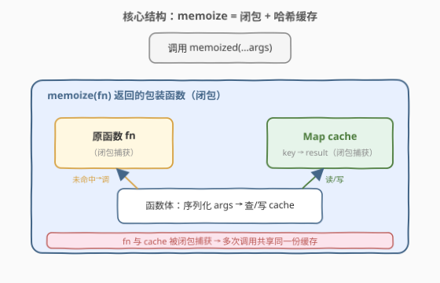
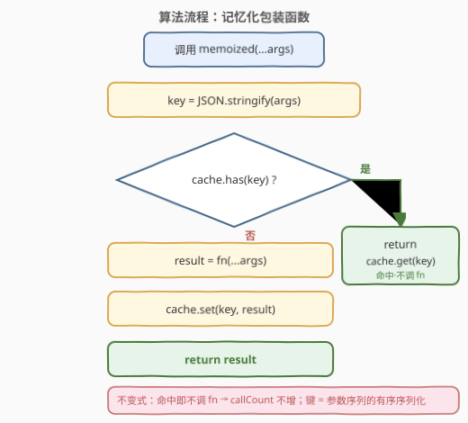
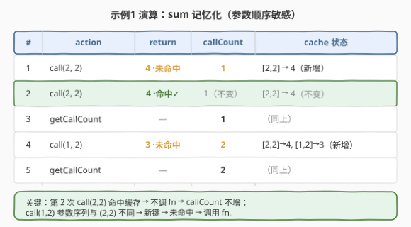

# LeetCode 记忆函数 题解

## 1. 题目概述

- **标题 / 题号**：记忆函数（#2623，medium）
- **链接**：https://leetcode.cn/problems/memoize/
- **难度**：中等
- **标签**：高阶函数、哈希表、记忆化、闭包

**题意**：请你编写一个函数 `memoize`，它接收另一个函数 `fn` 作为参数，返回 `fn` 的**记忆化**版本。

**记忆函数**是一个对于相同输入永远不会调用 `fn` 两次的函数——再次遇到相同输入时，它直接返回缓存值，而不再重新计算。

可以假设有 3 个可能的输入函数 `sum`、`fib`、`factorial`：

- `sum(a, b) = a + b`。注意：若 `(b, a)` 已缓存（且 `a != b`），**不能**当作 `(a, b)` 命中——即**参数顺序敏感**。例如 `(3, 2)` 与 `(2, 3)` 应是两次独立的调用。
- `fib(n)`：若 `n <= 1` 返回 `1`，否则返回 `fib(n - 1) + fib(n - 2)`。
- `factorial(n)`：若 `n <= 1` 返回 `1`，否则返回 `factorial(n - 1) * n`。

**示例 1**：

```text
输入：
fnName = "sum"
actions = ["call","call","getCallCount","call","getCallCount"]
values  = [[2,2],[2,2],[],[1,2],[]]
输出：[4,4,1,3,2]
解释：
const sum = (a, b) => a + b;
const memoizedSum = memoize(sum);
memoizedSum(2, 2);  // call → 4，sum 被调用（首次 (2,2)）
memoizedSum(2, 2);  // call → 4，sum 未调用（命中缓存）
// getCallCount → 1
memoizedSum(1, 2);  // call → 3，sum 被调用（首次 (1,2)）
// getCallCount → 2
```

**示例 2**：

```text
输入：
fnName = "factorial"
actions = ["call","call","call","getCallCount","call","getCallCount"]
values  = [[2],[3],[2],[],[3],[]]
输出：[2,6,2,2,6,2]
解释：
memoFactorial(2);  // 2，调用 factorial
memoFactorial(3);  // 6，调用 factorial
memoFactorial(2);  // 2，命中缓存，不调用
// getCallCount → 2
memoFactorial(3);  // 6，命中缓存，不调用
// getCallCount → 2
```

**示例 3**：

```text
输入：
fnName = "fib"
actions = ["call","getCallCount"]
values  = [[5],[]]
输出：[8,1]
解释：fib(5) = 8（call）；getCallCount → 1
```

**约束**：

- `0 <= a, b <= 10^5`
- `1 <= n <= 10`
- `1 <= actions.length <= 10^5`，且 `actions.length === values.length`
- `actions[i]` 为 `"call"` 或 `"getCallCount"` 之一
- `fnName` 为 `"sum"`、`"factorial"`、`"fib"` 之一

> 💡 关键信号：这是一道**设计 + 高阶函数**题，不考复杂算法，考的是「**闭包捕获共享状态**」+「**哈希表做 O(1) 命中判定**」+「**参数序列化做缓存键**」三件事。`getCallCount` 这一机制把"是否真正调用了原函数"显式化——记忆化的本质就是**减少对 `fn` 的调用次数**。

## 2. 解题思路

### 2.1 暴力思路：不缓存，每次直接调

最朴素的实现是直接透传：

```javascript
function memoize(fn) {
    return function (...args) {
        return fn(...args);   // 每次都重新计算
    };
}
```

这能算出正确结果，但**完全不缓存**——对 `fib` 这种带重叠子问题的递归，每次 `call` 都从头算，`getCallCount` 会爆炸式增长，无法满足"相同输入只调一次"的语义。

> ⚠️ 本题的判定核心不是"返回值对不对"，而是"**有没有少调 `fn`**"。`getCallCount` 正是用来稽查缓存是否生效的探针。

### 2.2 核心观察：闭包 + Map 缓存"参数序列 → 结果"



记忆化的关键是：`memoize` 返回一个新函数，这个新函数通过**闭包**捕获两样东西——

1. **原函数 `fn`**：未命中时才调用它；
2. **一个 `Map` 缓存**：保存"参数序列 → 结果"的映射，多次调用共享同一份。

于是每次调用只需三步：

- **序列化**：把当前参数序列 `args` 转成一个稳定的键（如 `JSON.stringify(args)`）；
- **查表**：键在 `Map` 中即命中，直接返回缓存值，**不触碰 `fn`**；
- **未命中**：调用 `fn(...args)` 算出结果，写回 `Map`，再返回。

| 机制 | 职责 | 复杂度 |
|------|------|--------|
| 闭包 | 让返回的函数持有 `fn` 与 `cache`，跨调用共享 `cache` | — |
| `Map` | `O(1)` 用序列化键查/写"参数 → 结果" | $O(1)$ 均摊 |
| `JSON.stringify(args)` | 把参数序列压成一个**有序**字符串键 | $O(\lvert args\rvert)$ |

> ⚠️ **两个易错点**：
>
> 1. **缓存键必须编码"参数顺序"**。`sum` 的语义要求 `(3,2)` 与 `(2,3)` 是不同调用。`JSON.stringify([3,2])` 与 `JSON.stringify([2,3])` 天然不同，故选 `JSON.stringify` 而非"排序后去重"。
> 2. **判定命中要用 `cache.has(key)`，不能用 `cache.get(key)` 的真值**。因为合法的缓存结果可能是 `0`（如 `sum(0,0) === 0`）——若写成 `cache.get(key) || compute()`，命中 `0` 时会被 `||` 当假值误判为未命中而重算。`has()` 严格区分"不存在键"与"值为假值"。

### 2.3 算法流程图



流程的核心分叉在 `cache.has(key)`：命中走绿色支路直接返回缓存；未命中走橙色支路调用 `fn`、写回缓存、再返回。两条支路都**最终返回结果**，区别仅在"是否计一次 `fn` 调用"。

### 2.4 示例演算



以**示例 1**为例：第 1 次 `call(2,2)` 未命中，调用 `sum` 得 `4`，缓存写入 `[2,2]→4`，`callCount` 增到 1；第 2 次 `call(2,2)` 命中缓存，直接返回 `4`，**`sum` 未被调用**，`callCount` 仍为 1；随后 `call(1,2)` 因参数序列 `[1,2]` 与 `[2,2]` 不同而未命中，再次调用 `sum` 得 `3`，`callCount` 增到 2。注意 `(1,2)` 与 `(2,1)` 若都出现也将是两个独立键——这就是"参数顺序敏感"的体现。

## 3. 参考代码

### JavaScript（提交语言：闭包 + Map + JSON.stringify）

```javascript
function memoize(fn) {
    const cache = new Map();
    return function (...args) {
        const key = JSON.stringify(args);
        if (cache.has(key)) return cache.get(key); // 命中：不调 fn
        const result = fn(...args);                // 未命中：算一次
        cache.set(key, result);                    // 写回缓存
        return result;
    };
}
```

> 💡 这里返回的函数**闭包捕获**了外层的 `cache` 与 `fn`：每次调用都用同一份 `cache`，跨调用累积命中。`key` 用 `JSON.stringify(args)` 是因为它对任意可序列化参数都生成**稳定且有序**的字符串，例如 `JSON.stringify([2,2]) === "[2,2]"`、`JSON.stringify([3,2]) === "[3,2]"`，两者不同键，恰好满足"参数顺序敏感"的要求。

**键的替代写法**（仅当参数都是数字/字符串时可更轻量）：

```javascript
const key = args.join(',');   // [2,2] → "2,2"，比 stringify 更快
```

`join` 省去 JSON 的引号开销，但**仅适用于基本类型参数**；若参数可能含对象、`null`、`undefined`，`join` 会产生歧义（如 `[1, null]` 与 `["1,null"]` 撞键），此时 `JSON.stringify` 更安全。

### Python（`functools.cache` 与手写对照）

> 本题 LeetCode 仅开放 JS/TS，Python 版作概念对照。Python 的"可哈希"特性让缓存键**无需序列化**——`*args` 本身就是个不可变 `tuple`，可直接作 `dict` 键。

**手写版（镜像 JS 结构）**：

```python
def memoize(fn):
    cache = {}

    def wrapper(*args):
        key = args                       # tuple 天然可哈希 & 保序
        if key in cache:
            return cache[key]
        result = fn(*args)
        cache[key] = result
        return result

    return wrapper
```

**标准库版（推荐实战）**：

```python
from functools import cache

@cache                          # 等价于 lru_cache(maxsize=None)
def fib(n: int) -> int:
    return 1 if n <= 1 else fib(n - 1) + fib(n - 2)
```

> ⚠️ 对照要点：JS 因数组是引用类型、不可作 `Map` 键（按引用相等比较），必须**序列化为字符串**才能"按值相等"查表；Python 的 `tuple` 是值类型且可哈希，可直接当键，省去序列化。这是两语言在记忆化实现上的根本差异。

## 4. 复杂度分析

| 维度 | 复杂度 | 说明 |
|------|--------|------|
| **时间复杂度** | 命中 $O(1)$；未命中 $O(T(f))$ | 命中仅一次 `Map.has`+`Map.get`；未命中需实际执行一次 `fn`（代价 $T(f)$ 为 `fn` 本身耗时），之后相同输入均 $O(1)$ |
| **空间复杂度** | $O(k)$ | $k$ 为不同参数组合的数量；缓存保存每个不同输入对应的 $(\text{key}, \text{result})$ |

> 💡 对 `fib` 而言，若把记忆化只包在**最外层调用**上（如示例 3 只调一次 `memoized(5)`），`callCount` 仅 +1；若让递归内部也走记忆化版本，则 `fib(n)` 对每个 $n$ 至多算一次，整棵递归树由 $O(2^n)$ 压成 $O(n)$——这正是**自顶向下记忆化 DP** 的本质（见第 5 节）。

## 5. 扩展：记忆化与动态规划、缓存键设计

### 5.1 记忆化 = 自顶向下 DP

记忆化搜索与动态规划是一枚硬币的两面：**自顶向下（递归 + 缓存）** 与 **自底向上（迭代填表）**。本题的 `memoize` 就是把任意纯函数变成"自顶向下 DP"的通用装置：

- `fib`：朴素递归 $O(2^n)$，套上 `memoize` 后每个 $n$ 只算一次，退化为 $O(n)$；
- `factorial`：本身就是 $O(n)$ 线性，记忆化收益来自"跨多次外部调用的重复 `n` 秒回缓存"。

> 💡 当递归存在**重叠子问题**时记忆化才显著受益；若子问题天然不重叠（如 `factorial` 的单链递归），记忆化主要省的是"跨多次外部调用的重复"，而非单次内部的重复。

### 5.2 缓存键的三种设计

| 方案 | 做法 | 适用 | 代价 |
|------|------|------|------|
| `JSON.stringify(args)` | 序列化任意可 JSON 化参数 | 通用，参数含对象/数组也行 | 每次调用 $O(\lvert args\rvert)$ 序列化 |
| `args.join(',')` | 仅基本类型拼接 | 仅数字/字符串参数 | 更快，但对象参数会撞键 |
| 嵌套 `Map` | 多层 Map 逐参数查 | 参数定长、类型固定 | 无序列化，但层级深时啰嗦 |

> ⚠️ 任何方案都要满足"**相同输入 → 相同键，不同输入 → 不同键**"（双射）。`sum` 的顺序敏感性正提示：**不要**为图省事对参数排序后再拼键，那会令 `(2,3)` 与 `(3,2)` 撞键、违背语义。

### 5.3 与容量淘汰型缓存的对照

本题缓存**永不淘汰**（key 集合只增不减），适合输入空间有限（$n \le 10$、$a,b \le 10^5$）的场景。工程中常需**容量上限**（防内存膨胀）：146 LRU 按"最久未用"淘汰、460 LFU 按"频率最低"淘汰。二者与"按时间淘汰"（2622）正交，可叠加成"带 TTL + LRU 的有限缓存"。

## 6. 面试要点

1. **为什么缓存键要保序，不能排序后去重？**

   - `sum` 明确要求 `(3,2)` 与 `(2,3)` 是两次独立调用。排序后拼键会让二者撞键、把 `(3,2)` 的结果误当作 `(2,3)` 的命中返回。`JSON.stringify(args)` 保留参数原始顺序，自然满足"参数序列一一对应"的双射要求。

2. **为什么判命中要用 `cache.has(key)` 而非 `cache.get(key)` 的真值？**

   - 合法结果可能是假值：`sum(0,0) === 0`。若用 `cache.get(key) || fn(...)`，命中 `0` 时 `||` 把 `0` 当假值，误判未命中而重算——既浪费又仍"正确"，但违背记忆化语义（多调了 `fn`），`getCallCount` 会偏大。`has()` 严格区分"键不存在"与"值为假值"，是唯一正确写法。

3. **闭包在这里起什么作用？为什么不用全局变量存缓存？**

   - 闭包让 `cache` 与 `fn` 成为返回函数的私有状态：外部无法直接访问，且**每次 `memoize(fn)` 调用产生一份独立缓存**。若用全局变量，多个被记忆化的函数会共享同一张表、键互相污染；闭包保证了"每个被包装函数有自己的缓存"的封装性，这正是高阶函数封装状态的精髓。

4. **JS 数组为什么不能直接当 `Map` 的键？**

   - JS 的 `Map` 对引用类型按**引用相等**比较键。两个内容相同的数组 `[2,2]` 是不同对象、引用不同，故 `map.set([2,2], 4)` 后 `map.get([2,2])` 取不到——必须先压成基本类型（字符串）作键，"按值相等"才成立。Python 的 `tuple` 是值类型且可哈希，无此问题。

5. **示例 3 中 `fib(5)` 的 `callCount` 为什么是 1？**

   - 测试框架把 `fn` 包了一层计数器后传给 `memoize`，但 `fib` 内部递归调用的是**原始未计数**的 `fib`（全局名指向纯函数）。因此一次 `memoized(5)` 只在缓存未命中时调一次被计数的 `fn`，`callCount=1`；内部那棵 $O(2^n)$ 递归树照常展开但不被计数。若改成让内部递归也走 `memoized` 版本，则每个 $n$ 至多算一次、callCount $\approx n$，复杂度由 $O(2^n)$ 压到 $O(n)$——即自顶向下记忆化 DP。

> 💡 **一句话总结**：2623 = 「闭包持 `fn` + `Map`，键用 `JSON.stringify(args)`，`has` 判命中」。记忆化的本质是用空间换时间——把"对相同输入的重复计算"折叠成一次 $O(1)$ 查表。

## 同类练习题

| # | 题目 | 与本题的关联 |
|---|------|-------------|
| 509 | [斐波那契数](https://leetcode.cn/problems/fibonacci-number/) | 自顶向下记忆化 DP 的母题，把本题的 `memoize` 装置套到递归 `fib` 上即降复杂度 |
| 322 | [零钱兑换](https://leetcode.cn/problems/coin-change/) | 重叠子问题 DP，记忆化搜索（自顶向下）与迭代填表（自底向上）可互为镜像 |
| 146 | [LRU 缓存](https://leetcode.cn/problems/lru-cache/) | 容量淘汰型缓存，哈希表 + 双向链表，对照本题"永不淘汰"的无限缓存 |
| 2622 | [有时间限制的缓存](https://leetcode.cn/problems/cache-with-time-limit/) | 同系列 TTL 缓存，按"时间到期"淘汰，与本题"按输入命中"的缓存正交（[题解](../2601-2700/2622_有时间限制的缓存.md)） |
