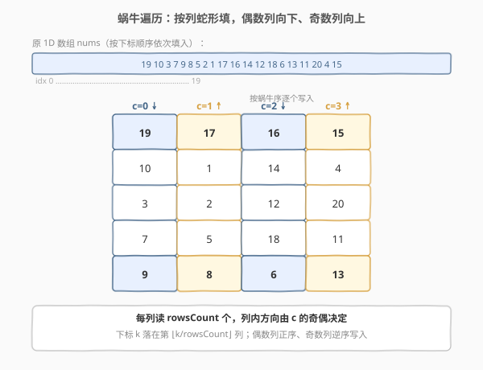
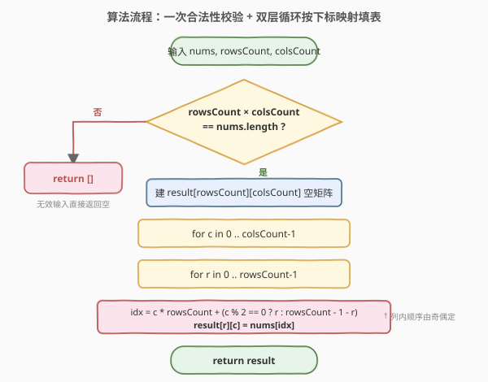
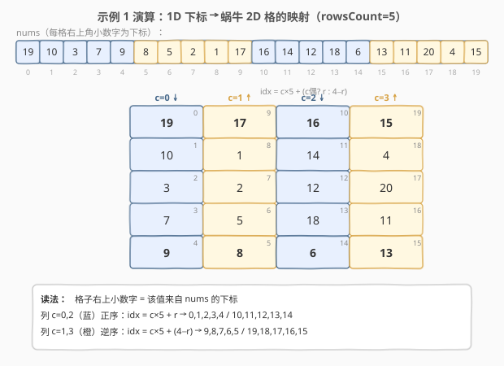

# LeetCode 蜗牛排序 题解

## 1. 题目概述

- **标题 / 题号**：蜗牛排序（#2624，medium）
- **链接**：https://leetcode.cn/problems/snail-traversal/
- **难度**：中等
- **标签**：数组、模拟、遍历、原型扩展

**题意**：请你为所有数组实现 `snail(rowsCount, colsCount)` 方法，把一维数组按**蜗牛排序（snail traversal）**模式重排为 `rowsCount × colsCount` 的二维数组。无效输入应返回空数组——当 `rowsCount * colsCount !== nums.length` 时输入视为无效。

蜗牛排序从左上角、数组的第一个值开始，**先从上到下遍历第一列，再向右移到下一列，从下到上遍历它**；如此每列交替变换方向，直到覆盖整个数组。

**示例 1**：

```text
输入：nums = [19, 10, 3, 7, 9, 8, 5, 2, 1, 17, 16, 14, 12, 18, 6, 13, 11, 20, 4, 15]
      rowsCount = 5, colsCount = 4
输出：
[
  [19, 17, 16, 15],
  [10,  1, 14,  4],
  [ 3,  2, 12, 20],
  [ 7,  5, 18, 11],
  [ 9,  8,  6, 13]
]
```

**示例 2**：

```text
输入：nums = [1,2,3,4], rowsCount = 1, colsCount = 4
输出：[[1, 2, 3, 4]]
```

**示例 3**：

```text
输入：nums = [1,3], rowsCount = 2, colsCount = 2
输出：[]
解释：2 × 2 = 4，但原数组长度为 2，输入无效。
```

**约束**：

- `0 <= nums.length <= 250`
- `1 <= nums[i] <= 1000`
- `1 <= rowsCount, colsCount <= 250`

> 💡 本题是 LeetCode「30 天 JavaScript」系列题目，**仅提供 JavaScript / TypeScript 提交入口**，核心考察下标映射与 `Array.prototype` 扩展。本文以 JS 为提交语言，并给出 Python 概念等价实现。

## 2. 解题思路

### 2.1 暴力思路：按列逐个 push

最直观的写法是**模拟蜗牛的走法**：维护一个读指针 `k` 从 `0` 递增读 `nums`，逐列构造；偶数列从上往下 `push`，奇数列从下往上 `push`（或正序填完再 `reverse`）。

```text
k = 0
for c in 0..colsCount-1:
    col = []
    for r in 0..rowsCount-1:
        col.push(nums[k++])
    if c 是奇数: col.reverse()
    把 col 挂到各行
```

这能过，但需要额外分配中间列数组、还要 `reverse`，且最后还要“把列拼成行”，逻辑绕。本质问题是**把“按列构造”再转回“按行存储”**多了一道转置的弯路。

### 2.2 核心观察：直接按下标映射填表



关键洞察：**不需要模拟“走”，直接算出每个目标格 `(r, c)` 应该读 `nums` 的第几个下标**。

- 每列恰好读 `rowsCount` 个，所以第 `c` 列对应 `nums` 中的一段：起始下标 `c * rowsCount`，长度 `rowsCount`；
- 列内方向由 `c` 的奇偶决定：
  - **偶数列（c 为偶数）正序**：第 `r` 行取 `nums[c * rowsCount + r]`；
  - **奇数列（c 为奇数）逆序**：第 `r` 行取 `nums[c * rowsCount + (rowsCount - 1 - r)]`。

合并成一个公式：

$$
\text{result}[r][c] = \text{nums}\big[\, c \times \text{rowsCount} + \begin{cases} r & c \text{ 为偶数} \\ \text{rowsCount} - 1 - r & c \text{ 为奇数} \end{cases}\,\big]
$$

> 💡 **为什么是“列”优先而不是“行”优先？** 题目要求“第一列从上到下”，即第一段 `rowsCount` 个数填满**第一列**而非第一行，所以外层是列 `c`、内层是行 `r`，下标按列分段。这与常见的“行优先填表”相反，是本题最易写反的地方。

> ⚠️ **“蜗牛”≠“螺旋”**：尽管名字带 snail，本题的走法是**蛇形/boustrophedon（逐列往返）**，不是“由外向内一圈圈缩”的螺旋（spiral）。螺旋是不断收缩的边界，蛇形是固定矩形里按列往返，二者算法完全不同。

### 2.3 算法流程图



只需两步：

1. **校验**：`rowsCount * colsCount !== nums.length` 直接返回 `[]`；
2. **填表**：双层循环 `(c, r)`，按上面的下标公式写入 `result[r][c]`，返回 `result`。

### 2.4 示例演算



以**示例 1**为例（`rowsCount = 5, colsCount = 4`），每个目标格右上角的小数字就是它读自 `nums` 的下标：

- 列 `c=0`（偶，正序）：`(r,0)` 读 `0×5 + r` → 下标 `0,1,2,3,4` → 值 `19,10,3,7,9`；
- 列 `c=1`（奇，逆序）：`(r,1)` 读 `1×5 + (4−r)` → 下标 `9,8,7,6,5` → 值 `17,1,2,5,8`；
- 列 `c=2`（偶，正序）：`(r,2)` 读 `2×5 + r` → 下标 `10,11,12,13,14` → 值 `16,14,12,18,6`；
- 列 `c=3`（奇，逆序）：`(r,3)` 读 `3×5 + (4−r)` → 下标 `19,18,17,16,15` → 值 `15,4,20,11,13`。

四列拼成行即得示例 1 的输出矩阵。注意奇数列的下标序列是**从大往小**的（`9→5`、`19→15`），正是“从下往上读”的体现。

## 3. 参考代码

### JavaScript / TypeScript（提交语言，扩展 `Array.prototype`）

```javascript
/**
 * @param {number} rowsCount
 * @param {number} colsCount
 * @return {Array<Array<number>>}
 */
Array.prototype.snail = function (rowsCount, colsCount) {
    if (rowsCount * colsCount !== this.length) return []; // 合法性校验

    const result = Array.from({ length: rowsCount }, () => new Array(colsCount));
    for (let c = 0; c < colsCount; c++) {
        const base = c * rowsCount; // 第 c 列在 nums 中的起始下标
        for (let r = 0; r < rowsCount; r++) {
            // 偶数列正序取 base + r，奇数列逆序取 base + (rowsCount - 1 - r)
            result[r][c] = this[base + (c % 2 === 0 ? r : rowsCount - 1 - r)];
        }
    }
    return result;
};
```

TypeScript 版（需声明接口扩展 `Array<T>`）：

```typescript
declare global {
    interface Array<T> {
        snail(rowsCount: number, colsCount: number): number[][];
    }
}

Array.prototype.snail = function (rowsCount: number, colsCount: number): number[][] {
    if (rowsCount * colsCount !== this.length) return [];
    const result: number[][] = Array.from({ length: rowsCount }, () => new Array(colsCount));
    for (let c = 0; c < colsCount; c++) {
        const base = c * rowsCount;
        for (let r = 0; r < rowsCount; r++) {
            result[r][c] = this[base + (c % 2 === 0 ? r : rowsCount - 1 - r)];
        }
    }
    return result;
};

export {};
```

> 💡 **`this` 即数组本身**：扩展到 `Array.prototype` 后，`nums.snail(R, C)` 中的 `this` 指向被调用的数组。注意不要用箭头函数定义原型方法（箭头函数的 `this` 是词法绑定，会拿不到调用者）。`Array.from({ length: n }, () => new Array(m))` 保证每行是**独立的**空数组，避免“行别名”踩坑。

### Python（概念等价，函数式实现）

> 本题 LeetCode 仅开放 JS/TS，Python 版作概念对照。Python 不支持给内建 `list` 挂实例方法，故写成普通函数。

```python
from typing import List


def snail(nums: List[int], rows_count: int, cols_count: int) -> List[List[int]]:
    if rows_count * cols_count != len(nums):
        return []

    res = [[0] * cols_count for _ in range(rows_count)]
    for c in range(cols_count):
        base = c * rows_count
        for r in range(rows_count):
            res[r][c] = nums[base + (r if c % 2 == 0 else rows_count - 1 - r)]
    return res
```

> ⚠️ Python 初始化二维列表切忌用 `[[0] * cols_count] * rows_count`——外层乘法复制的是**同一个内层列表的引用**，改一个格子会“牵连”整列。必须用列表推导 `[... for _ in range(rows_count)]` 让每行独立，对应 JS 里也要用 `Array.from` 而非 `new Array(n).fill([])`。

## 4. 复杂度分析

| 维度 | 复杂度 | 说明 |
|------|--------|------|
| 时间复杂度 | $O(n)$ | `n = rowsCount × colsCount = nums.length`，每个元素恰访问一次，无额外遍历 |
| 空间复杂度 | $O(n)$ | 输出矩阵存 `n` 个元素（不计输入本身）；不依赖中间列数组 |

> 💡 朴素“按列构造再转置”写法也是 $O(n)$ 时间，但多一层中间数组与一次 `reverse`/转置，常数更大且可读性差。直接下标映射把“读哪个、写哪格”一步到位，是最简表达。

## 5. 扩展：行优先 vs 列优先 与 “由外向内”螺旋

本题的“蛇形逐列往返”属于**列优先（column-major）遍历**的一个变体。与之对照的几类常见“把 1D 重排为 2D”的模式：

| 模式 | 填充顺序 | 每格 `(r,c)` 读自 `nums` 的下标 |
|------|----------|--------------------------------|
| **行优先**（C/JS 二维数组默认） | 第 0 行从左到右，再第 1 行…… | `r * colsCount + c` |
| **列优先**（Fortran/MATLAB 默认） | 第 0 列从上到下，再第 1 列…… | `c * rowsCount + r` |
| **蛇形逐行往返** | 第 0 行→、第 1 行←…… | `r * colsCount + (r 偶 ? c : colsCount-1-c)` |
| **蜗牛/蛇形逐列往返**（本题） | 第 0 列↓、第 1 列↑…… | `c * rowsCount + (c 偶 ? r : rowsCount-1-r)` |
| **螺旋**（spiral，由外向内） | 右→下→左→上逐圈收缩 | 无闭式公式，需模拟边界收缩 |

- 行优先与列优先只差一个**下标转置**；蛇形往返再叠一个**奇偶取逆序**；螺旋则**完全不同**，需维护四条不断收缩的边界 `top/bottom/left/right` 逐层模拟。
- “行蛇形”与“列蛇形”互为转置：把本题的结果转置一下，就是行蛇形的输出。下标公式可据此互推。

> 💡 若把本题的 `c % 2` 改成 `r % 2`、把 `rowsCount` 与 `colsCount` 互换、并把外层换成按 `r` 遍历，就得到**行蛇形**版。理解了“每段长度 + 段内方向由奇偶定”这一骨架，几类蛇形都能秒写。

## 6. 面试要点

1. **为什么外层是列 `c` 而不是行 `r`？**

   > 题目规定“第一列从上到下”，即第一段 `rowsCount` 个数填满**第一列**。所以按列分段：第 `c` 列对应 `nums` 的 `[c*rowsCount, c*rowsCount + rowsCount)` 这一段，外层自然是 `c`。若误用行优先 `r*colsCount + c` 会把第一段填进第一行，结果完全错位。

2. **奇数列为什么是 `rowsCount - 1 - r` 而不是 `r`？**

   > 奇数列要“从下往上”读，即第 0 行拿该段最后一个、第 `rowsCount-1` 行拿该段第一个。行号 `r` 越大、越靠下，读的下标应越小，故取 `rowsCount - 1 - r`（段内倒序）。偶数列正序则直接取 `r`。两者用三元 `c % 2 === 0 ? r : rowsCount - 1 - r` 统一。

3. **为什么要在原型上挂方法？`this` 指向谁？为什么不能用箭头函数？**

   > 题目要求 `nums.snail(...)` 这种“任何数组都能调”的写法，只能扩展 `Array.prototype`。调用时 `this` 指向调用者 `nums` 本身。箭头函数没有自己的 `this`（词法绑定外层），在原型方法里会拿不到数组，故必须用普通 `function`。

4. **`rowsCount * colsCount !== this.length` 能否省略？空数组会怎样？**

   > 不能省。校验失败必须返回 `[]`，否则后续按下标取值会越界（读到 `undefined`）或返回残缺矩阵。注意 `nums.length = 0` 且 `rowsCount, colsCount >= 1` 时乘积必不为 0，校验天然把它判为无效返回 `[]`，无需单独特判空数组。

5. **螺旋遍历（spiral）和本题的蜗牛遍历有什么区别？**

   > 螺旋是“由外向内一圈圈收缩”，需维护 `top/bottom/left/right` 四条边界并不断收缩、每走完一条边就收紧对应边界；本题是“在固定矩形里按列往返”，矩形不收缩，只靠列的奇偶翻转方向。二者骨架不同：螺旋靠“收缩边界”，蛇形靠“奇偶取逆序”。别被 snail 这个名字误导成本题。

## 同类练习题

| # | 题目 | 与本题的关联 |
|---|------|-------------|
| 54 | [螺旋矩阵](https://leetcode.cn/problems/spiral-matrix/) | 由外向内螺旋**读出** 2D，对照本题“不收缩边界的蛇形往返”，理解螺旋 vs 蛇形的边界处理差异 |
| 59 | [螺旋矩阵 II](https://leetcode.cn/problems/spiral-matrix-ii/) | 把 1..n² 按**螺旋**填入 n×n，是 54 的“写入”版，与本题“蛇形写入”对照两种填充顺序 |
| 2610 | [转换二维数组](https://leetcode.cn/problems/convert-an-array-into-a-2d-array-with-conditions/) | 同目录的前一题，把 1D 按“去重 + 按出现顺序分行”填 2D，同属“1D→2D 重排”家族但分块规则不同 |
| 566 | [重塑矩阵](https://leetcode.cn/problems/reshape-the-matrix/) | 把 2D 按行优先展平再按新行列数重排，是“行优先 1D↔2D”的通用版，对照本题的“列优先 + 蛇形” |
