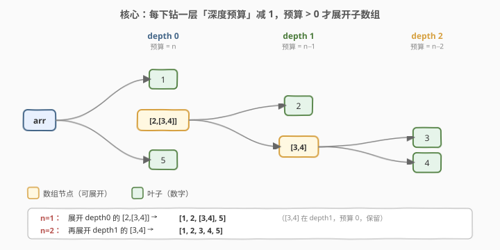
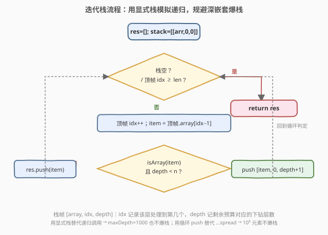
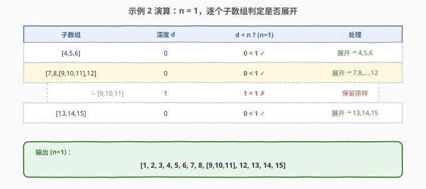

# 扁平化嵌套数组

- **题目名称**：扁平化嵌套数组
- **链接**：[2625. 扁平化嵌套数组](https://leetcode.cn/problems/flatten-deeply-nested-array/)
- **难度**：中等
- **标签**：递归、深度优先搜索、数组、栈

## 1. 题目概述

编写一个函数，接收**多维数组** `arr` 与深度 `n`，返回其**扁平化**后的结果。

- **多维数组**：元素是整数或更多维数组，递归定义。
- **扁平化**：把子数组删除并替换为它内部的元素。
- **关键规则**：只有当子数组的**深度小于 `n`** 时才展开它。**第一层数组中元素的深度被认为是 0**。
- **限制**：不许用内置方法 `Array.prototype.flat`。

**示例 1**：

```text
输入：arr = [1, 2, 3, [4, 5, 6], [7, 8, [9, 10, 11], 12], [13, 14, 15]], n = 0
输出：[1, 2, 3, [4, 5, 6], [7, 8, [9, 10, 11], 12], [13, 14, 15]]
解释：n=0 时任何子数组的深度都不小于 0，故全部保留。
```

**示例 2**：

```text
输入：arr = [1, 2, 3, [4, 5, 6], [7, 8, [9, 10, 11], 12], [13, 14, 15]], n = 1
输出：[1, 2, 3, 4, 5, 6, 7, 8, [9, 10, 11], 12, 13, 14, 15]
解释：[4,5,6]、[7,8,...,12]、[13,14,15] 深度 0 < 1，展开；[9,10,11] 深度 1，不展开。
```

**示例 3**：

```text
输入：arr = [[1, 2, 3], [4, 5, 6], [7, 8, [9, 10, 11], 12], [13, 14, 15]], n = 2
输出：[1, 2, 3, 4, 5, 6, 7, 8, 9, 10, 11, 12, 13, 14, 15]
解释：所有子数组深度都 ≤ 1 < 2，全部展开到底。
```

**约束条件**：

- `0 <= arr 的元素个数 <= 10^5`
- `0 <= arr 的子数组个数 <= 10^5`
- `maxDepth <= 1000`
- `-1000 <= 每个数 <= 1000`
- `0 <= n <= 1000`

> 💡 本题属 LeetCode「30 天 JavaScript」系列，**仅开放 JavaScript / TypeScript 提交入口**，考察递归与数组操作。本文以 JS 为提交语言，并给出 Python 概念等价实现。

---

## 2. 解题思路

### 2.1 暴力思路：递归 + spread

最直白的写法：遍历 `arr`，遇到子数组就递归展开一层，用 `...spread` 把结果拼回：

```text
flat(arr, n):
  res = []
  for item in arr:
    if isArray(item) and n > 0:
      res.push(... flat(item, n - 1))   // ← spread 拼接
    else:
      res.push(item)
  return res
```

逻辑是对的，但有两个隐患：

1. **`...spread` 把子数组的每个元素当作函数参数压栈**：当某个子数组很大（最多 $10^5$ 个元素）时，部分引擎/版本会抛 `Maximum call stack size exceeded`。
2. **递归深度 = 嵌套深度**：`maxDepth <= 1000`。JS（V8）的调用栈通常能扛住约万级，问题不大；但 Python 默认递归上限就是 1000，恰好踩在悬崖边上，深嵌套会 `RecursionError`。

> ⚠️ 本题真正的考点不是"会不会递归"，而是**能不能稳健地处理深嵌套与超大子数组**——把 spread 换成循环收集、把递归换成显式栈，即可彻底规避这两类栈溢出。

### 2.2 核心观察：深度预算递减 + 显式栈



**深度预算模型**：把"还能展开几层"看作一个预算 `n`。处理当前容器的元素时：

- 元素若**不是数组**：直接放进结果，与深度无关；
- 元素若是数组：仅当**预算 > 0**（即它所在深度 `< n`）才展开它，展开后它的内部元素进入一个**预算减 1** 的新容器继续判定。

由此，一个原本位于嵌套深度 $d$ 的子数组，被处理时剩余预算恰为 $n - d$，展开条件 $n - d > 0$ 即 $d < n$——与题意"子数组深度小于 `n` 才展开"完全一致。预算每下钻一层减 1，是本题最核心的不变量。

**两处稳健化改造**：

| 隐患 | 暴力写法 | 稳健写法 |
|------|----------|----------|
| spread 拼接超大子数组爆栈 | `res.push(...sub)` | `for (const x of sub) res.push(x)` 循环收集 |
| 深嵌套递归爆栈 | 递归调用 `flat(item, n−1)` | 用显式栈模拟，`while` 驱动 |

> 💡 把递归改成显式栈后，`maxDepth = 1000` 也只是栈数组多 1000 个元素，与调用栈大小无关；用循环收集后，$10^5$ 个元素只是 $10^5$ 次 `push`，也不触碰函数参数上限。两条爆栈路径都被堵死。

### 2.3 算法流程图



栈中每个帧是三元组 `[array, idx, depth]`：`idx` 记录该层处理到第几个元素，`depth` 即该层元素的深度（也是判定子数组是否展开的依据）。

- 取栈顶帧，若 `idx` 已越过末尾 → 弹栈（该层处理完）；
- 否则推进游标 `idx++`，取当前元素 `item`；
- `item` 是数组且 `depth < n` → 压一个新帧 `[item, 0, depth+1]`（下钻一层）；
- 否则 → `res.push(item)`（保留原样，含未达展开条件的子数组）。

### 2.4 示例演算



以**示例 2**（`n = 1`）为例，三个顶层子数组深度都是 0，`0 < 1` 全部展开；而藏在 `[7,8,...,12]` 里的 `[9,10,11]` 深度为 1，`1 < 1` 不成立，故原样保留——最终 `[9,10,11]` 作为唯一的子数组出现在结果中，其余全部展平为整数。

---

## 3. 参考代码

### JavaScript / TypeScript（迭代栈，最稳健）

```javascript
var flat = function (arr, n) {
    const res = [];
    // 栈帧：[当前数组, 下一个待处理下标, 当前层元素的深度]
    const stack = [[arr, 0, 0]];
    while (stack.length) {
        const top = stack[stack.length - 1];
        const [a, i, d] = top;
        if (i >= a.length) {            // 该层处理完
            stack.pop();
            continue;
        }
        top[1] = i + 1;                 // 推进游标
        const item = a[i];
        if (Array.isArray(item) && d < n) {
            stack.push([item, 0, d + 1]); // 下钻一层，深度 +1（预算 -1）
        } else {
            res.push(item);              // 循环收集，规避 spread 爆栈
        }
    }
    return res;
};
```

TypeScript 版（类函数写法一致，仅加类型）：

```typescript
function flat(arr: any[], n: number): any[] {
    const res: any[] = [];
    const stack: [any[], number, number][] = [[arr, 0, 0]];
    while (stack.length) {
        const top = stack[stack.length - 1];
        const [a, i, d] = top;
        if (i >= a.length) { stack.pop(); continue; }
        top[1] = i + 1;
        const item = a[i];
        if (Array.isArray(item) && d < n) stack.push([item, 0, d + 1]);
        else res.push(item);
    }
    return res;
}
```

### JavaScript（递归 + 循环收集，简洁版）

> V8 调用栈足以承受 `maxDepth <= 1000`，故 JS 环境下递归版同样安全；关键是用循环 `for...of` 收集而非 `...spread`，避免超大子数组作为参数压栈。

```javascript
var flat = function (arr, n) {
    const res = [];
    for (const item of arr) {
        if (Array.isArray(item) && n > 0) {   // 预算 > 0 才下钻
            const sub = flat(item, n - 1);     // 预算 -1
            for (const x of sub) res.push(x);  // 循环收集，不用 spread
        } else {
            res.push(item);
        }
    }
    return res;
};
```

### Python（迭代栈，规避默认递归上限）

> 本题 LeetCode 仅开放 JS/TS，Python 版作概念对照。Python 默认 `sys.recursionlimit() == 1000`，与 `maxDepth <= 1000` 撞车，深嵌套会 `RecursionError`，故这里直接给迭代栈版。

```python
def flat(arr: list, n: int) -> list:
    res: list = []
    # 栈帧：[当前数组, 下一个待处理下标, 当前层元素的深度]
    stack: list[list] = [[arr, 0, 0]]
    while stack:
        a, i, d = stack[-1]
        if i >= len(a):
            stack.pop()
            continue
        stack[-1][1] = i + 1
        item = a[i]
        if isinstance(item, list) and d < n:
            stack.append([item, 0, d + 1])
        else:
            res.append(item)
    return res
```

> ⚠️ 三种写法的判定条件写法略有差异：迭代栈用 `d < n`（`d` 是当前层元素的深度，子数组就在这一层），递归版用 `n > 0`（`n` 是剩余预算）。二者等价——下钻 `d` 层后预算恰为 `n − d`，`d < n` ⟺ `n − d > 0`。

---

## 4. 复杂度分析

| 维度 | 复杂度 | 说明 |
|------|--------|------|
| 时间复杂度 | $O(N)$ | `N` 为所有元素（含嵌套）总数；每个元素进栈、出栈、`push` 各常数次 |
| 空间复杂度 | $O(N + D)$ | 结果 $O(N)$；显式栈最深 $O(D)$，`D = maxDepth <= 1000`；递归版同理占调用栈 |

> 💡 扁平化的本质是把树"压"成线性序列，每个叶子/内部节点至少访问一次，下界即 $\Omega(N)$，故 $O(N)$ 已最优。`maxDepth <= 1000` 是为逼出"递归 vs 显式栈"差异而设的边界条件，并非影响时间复杂度。

---

## 5. 扩展：递归 vs 显式栈的取舍

- **递归**：贴合问题递归结构，代码短、可读性高。适用于嵌套深度有界且远小于调用栈上限的场景（如解析 JSON、配置树）。
- **显式栈**：把"调用栈"搬到堆上的数组里，深度只受内存限制。适用于深度不可控或可能很深的场景（如链表 10^5 节点、本题型 `maxDepth` 与递归上限同量级）。
- **广度 vs 深度**：本题要求**保持原顺序**，故用 DFS（栈/递归）天然保序；若改问"逐层收集"则用 BFS（队列）。
- **`Array.prototype.flat` 的实现**：原生 `flat(depth)` 内部即等价的深度受限展开，思路与本解一致；题目禁止它正是为了让你手写出这层逻辑。注意 `flat` 的 `depth` 默认为 1，且 `Infinity` 表示无限展开——对应本题 `n = ∞` 的特例。

> 💡 顺带一提，本系列 [2610. 转换二维数组](https://leetcode.cn/problems/convert-an-array-into-a-2d-array-with-conditions/) 是反向操作"把一维数组按条件切成二维"，与本题"把多维压成一维"互为镜像，可对照练习。

---

## 6. 面试要点

1. **子数组的"深度"是怎么定义的？为什么要用"预算递减"来理解？**

   > 题规定第一层元素深度为 0，每下钻一层深度加 1；展开条件是子数组深度 `< n`。把剩余展开次数看作预算 `n`，每下钻一层预算减 1，则"预算 > 0"恰好等价于"深度 < n"——预算模型把"绝对深度"翻译成"相对剩余量"，递推时只需传 `n−1`，无需跟踪当前深度。

2. **为什么不用 `arr.flat(n)` 或 `res.push(...sub)`？**

   > 题目明确禁止 `Array.flat`，考的就是手写这层逻辑。而 `...spread` 把子数组元素当作函数参数压栈，某些引擎对参数个数有上限，遇到 $10^5$ 元素的子数组可能抛 `Maximum call stack size exceeded`；改用 `for...of` 循环 `push` 即规避。

3. **`maxDepth <= 1000` 在 JS 和 Python 里分别意味着什么？**

   > JS（V8）调用栈通常可承受万级深度，1000 安全，递归版可直接用。Python 默认 `sys.recursionlimit() == 1000`，深度 1000 正好在边界，深嵌套会 `RecursionError`，需用显式栈（或 `sys.setrecursionlimit` 调高，但治标不治本）。

4. **迭代栈里 `top[1] = i + 1` 这步能不能省？**

   > 不能。栈顶帧的 `idx` 必须在处理元素前推进，否则下钻子帧返回后会重复处理同一元素、陷入死循环。这是把递归"调用并返回"翻成显式栈时最易漏的一步——递归里由"函数返回到下一条语句"隐式完成，显式栈里要手动维护游标。

5. **如何保证结果顺序与原数组一致？**

   > 用 DFS 按从左到右处理：栈顶帧总是当前最深、最靠左的待处理层，遇到子数组就下钻、处理完就弹栈回到上一层继续下一个元素。这种"左子优先、深度优先"的遍历天然保序；若误用 BFS（队列）则会把不同层混在一起、打乱顺序。

---

## 7. 同类练习题

- [2610. 转换二维数组](https://leetcode.cn/problems/convert-an-array-into-a-2d-array-with-conditions/)：反向操作，把一维数组按条件切成二维，与本题"多维压一维"互为镜像
- [341. 扁平化嵌套列表迭代器](https://leetcode.cn/problems/flatten-nested-list-iterator/)：同套路但要求惰性迭代（`hasNext/next`），用栈推迟展开，对照"即时扁平 vs 惰性扁平"
- [430. 扁平化多级双向链表](https://leetcode.cn/problems/flatten-a-multilevel-doubly-linked-list/)：链表版的深度受限展开，把 child 指针展平进主链，与本题同构
- [144. 二叉树的前序遍历](https://leetcode.cn/problems/binary-tree-preorder-traversal/)：显式栈模拟递归的经典母题，本题迭代栈即其"多叉版"思路
