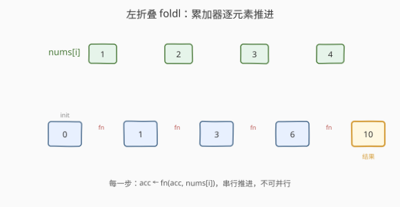
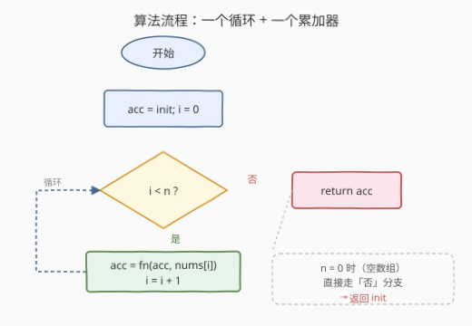

# LeetCode 数组归约运算 题解

## 1. 题目概述

- **标题 / 题号**：数组归约运算（#2626，easy）
- **链接**：https://leetcode.cn/problems/array-reduce-transformation/
- **难度**：简单
- **标签**：数组、函数式编程、高阶函数

**题意**：给定一个整数数组 `nums`、一个 reducer 函数 `fn` 和一个初始值 `init`，返回通过依次对数组的每个元素执行 `fn` 得到的最终结果：`val = fn(init, nums[0])`，`val = fn(val, nums[1])`，……，处理完每个元素后返回 `val`。若数组长度为 0，直接返回 `init`。**不得使用内置的 `Array.reduce`。**

**示例 1**：

```text
输入：nums = [1,2,3,4], fn = function sum(accum, curr) { return accum + curr; }, init = 0
输出：10
解释：(0)+1=1 → (1)+2=3 → (3)+3=6 → (6)+4=10
```

**示例 2**：

```text
输入：nums = [1,2,3,4], fn = function sum(accum, curr) { return accum + curr*curr; }, init = 100
输出：130
解释：100+1=101 → 101+4=105 → 105+9=114 → 114+16=130
```

**示例 3**：

```text
输入：nums = [], fn = function sum(accum, curr) { return 0; }, init = 25
输出：25
解释：这是一个空数组，所以返回 init。
```

**约束**：

- `0 <= nums.length <= 1000`
- `0 <= nums[i] <= 1000`
- `0 <= init <= 1000`

> 💡 本题是 LeetCode「30 天 JavaScript」系列题目，考查的不是算法复杂度，而是**归约（reduce / fold）**这一函数式编程原语：如何把一个"累加器 + 逐元素二元运算"串成一条流水线，把一串数据"压"成一个值。reduce 思想跨语言通用，下文以 JS 为提交语言，并给出 Python / C++ 的等价实现。

## 2. 解题思路

### 2.1 暴力思路：照搬数学定义写递归

reduce 的数学定义天然是递归的：

$$
\mathrm{reduce}(nums, fn, init) = \begin{cases} init & nums = [] \\ \mathrm{reduce}(\,nums[1:],\ fn,\ fn(init, nums[0])\,) & \text{否则} \end{cases}
$$

直接翻译成递归很"优雅"，但有两个问题：

- **切片开销**：每层递归 `nums[1:]` 在多数语言里是 $O(n)$ 拷贝，整体退化为 $O(n^2)$；
- **栈深度**：`nums.length` 可达 1000，递归深度 1000，部分语言（如 Python 默认栈）会逼近上限，JS 引擎虽能优化尾调用却无强制保证。

递归把"过程"藏进调用栈，可读但不可控。我们需要一个"显式"的版本。

### 2.2 核心观察：左折叠（foldl）——一个累加器 + 一个循环



把递归里的"待处理尾巴"换成**一个显式累加器 `acc`** + **一个下标 `i`**，从左到右线性扫描：

- `acc` 初始化为 `init`（对应递归的基准情形：空数组返回 `init`）；
- 每遇到 `nums[i]`，就执行 `acc = fn(acc, nums[i])`——用新值**覆盖**旧 `acc`；
- 扫完所有元素，`acc` 即最终结果。

这就是**左折叠（fold-left, foldl）**：运算**从左往右**、累加器始终是"前面所有元素折完的部分结果"。因为每一步只依赖上一步的 `acc` 和当前 `nums[i]`，天然可写成一个 `for` 循环，$O(n)$ 时间、$O(1)$ 额外空间，且无递归栈。

> 💡 **为什么叫"归约"？** 一个长度为 $n$ 的数组，每执行一次 `fn` 就把"两个值（acc 与 nums[i]）合成一个"，规模减 1，$n$ 步后"归约"成单个值。这与 `map`（$n \to n$，一一映射）、`filter`（$n \to {\le}n$，按谓词筛除）相对，是"多对一"的范式。

> ⚠️ **空数组的处理藏在初始化里**：当 $n=0$，循环一次都不执行，`acc` 保持 `init`，自然返回 `init`——无需单独 `if` 判空。这是"基准情形融入初始值"的妙处，也解释了为什么 `init` 是必要参数：它既是起点，也是空集的恒等元。

### 2.3 算法流程图



整体只有一个循环 + 一个累加器变量：循环条件 `i < n` 控制推进，循环体 `acc = fn(acc, nums[i])` 完成"折叠"。$n=0$ 时直接走"否"分支返回 `init`，空数组与一般情况统一在同一个结构里。

### 2.4 示例演算

![示例演算：nums=[1,2,3,4] fn=sum init=0](../images/reduce_example_walkthrough.svg)

以示例 1（`fn = 求和`，`init = 0`）为例，每一步 `acc` 都被 `fn` **覆盖**为新值，旧的 `acc` 不再需要——这正是 $O(1)$ 空间的来源：累加器是"滚动"的，只占一个变量的位置。

| 步 | i | nums[i] | acc(前) | fn(acc, nums[i]) | acc(后) |
|----|---|---------|---------|------------------|---------|
| init | – | – | – | – | 0 |
| 1 | 0 | 1 | 0 | 0+1 | 1 |
| 2 | 1 | 2 | 1 | 1+2 | 3 |
| 3 | 2 | 3 | 3 | 3+3 | 6 |
| 4 | 3 | 4 | 6 | 6+4 | **10** |

输出 `10`，与示例一致。

## 3. 参考代码

### JavaScript / TypeScript（提交语言）

```javascript
/**
 * @param {number[]} nums
 * @param {Function} fn  (accum, curr) => newValue
 * @param {number} init
 * @return {number}
 */
var reduce = function (nums, fn, init) {
    let acc = init;              // 基准情形：空数组时直接返回它
    for (let i = 0; i < nums.length; i++) {
        acc = fn(acc, nums[i]);  // 左折叠：用新值覆盖累加器
    }
    return acc;
};
```

TypeScript 版：

```typescript
function reduce(nums: number[], fn: (acc: number, curr: number) => number, init: number): number {
    let acc = init;
    for (let i = 0; i < nums.length; i++) {
        acc = fn(acc, nums[i]);
    }
    return acc;
}
```

### Python（概念等价）

> LeetCode 本题仅开放 JS/TS，Python 版作概念对照。Python 标准库的 `functools.reduce` 即左折叠，语义与本题完全一致；此处手写以呼应题意。

```python
from functools import reduce
from typing import List, Callable

# 手写版（对应题意，不用内置 reduce）
def reduce_array(nums: List[int], fn: Callable[[int, int], int], init: int) -> int:
    acc = init
    for x in nums:          # Python 直接遍历元素，无需下标
        acc = fn(acc, x)
    return acc

# 等价于标准库：
# functools.reduce(fn, nums, init)
```

### C++（概念等价）

> C++17 起的标准算法 `std::accumulate` 即左折叠（默认 `+`，可传自定义二元运算）。下面对应手写循环与标准库两种写法。

```cpp
#include <numeric>
#include <vector>
#include <functional>

// 手写版（对应题意）
int reduceArray(const std::vector<int>& nums,
                std::function<int(int, int)> fn, int init) {
    int acc = init;
    for (int x : nums) {
        acc = fn(acc, x);
    }
    return acc;
}

// 等价于标准库（左折叠，init 作为累加器初值）：
// std::accumulate(nums.begin(), nums.end(), init, fn);
```

> 💡 **`std::accumulate` 的初值类型决定累加类型**：若 `init` 是 `int` 而 `nums` 是 `long long`，窄类型会截断。传 `0LL` 之类可避免——这是 C++ reduce 相对 JS/Python 的一个细节陷阱。

## 4. 复杂度分析

| 维度 | 复杂度 | 说明 |
|------|--------|------|
| 时间复杂度 | $O(n)$ | 遍历一次数组，每元素执行一次 `fn`，$n = \text{nums.length}$ |
| 空间复杂度 | $O(1)$ | 仅一个累加器 `acc` 与下标 `i`，不随 $n$ 增长 |

> ⚠️ `fn` 本身的复杂度另算：若 `fn` 是 $O(1)$（如求和），整体 $O(n)$；若 `fn` 内部有 $O(k)$ 工作，整体 $O(nk)$。本题 `fn` 由调用方给定，约定为 $O(1)$。

## 5. 扩展：foldl vs foldr、reduce 的表达力

**左折叠 vs 右折叠。** reduce 在多数语言（JS `Array.prototype.reduce`、Python `functools.reduce`、C++ `std::accumulate`）都是**左折叠**——从左到右 `fn(acc, x)`。函数式语言还有**右折叠**（foldr）：递归从右往左，`fn(x, foldr(rest))`。对**满足结合律**的运算（如加法、乘法）二者结果相同；对**不满足结合律**的运算（如减法、除法、顺序敏感的拼接）结果不同。以 `nums=[1,2,3]`、`fn = (a,b) => a-b`、`init = 0` 为例：

$$
\text{foldl: } ((0-1)-2)-3 = -6 \qquad \text{foldr: } 1-(2-(3-0)) = 2
$$

因此 reduce 的"方向"是语义的一部分，不可随意换。

**reduce 是最通用的高阶函数。** `map` 和 `filter` 都能用 reduce 表达——reduce 把"多个值"压成"一个值"，而那个"值"完全可以是一个**数组**：

```text
map(arr, f)    = reduce(arr, (acc, x) => acc.concat([f(x)]), [])
filter(arr, p) = reduce(arr, (acc, x) => p(x) ? acc.concat([x]) : acc, [])
```

所以 reduce 是 map/filter 的"超集"，是函数式数据处理的最小内核。

**并行性。** foldl 严格串行（每步依赖上一步 `acc`），无法并行。但若运算满足结合律，可用**分治归约**（分块各自 foldl 再合并），把 $O(n)$ 串行降到 $O(\log n)$ 深度——这正是 GPU / MapReduce 中的 parallel reduce、以及并行前缀和（scan）的基础。

> ⚠️ **`Array.prototype.reduce` 不传 `init` 的陷阱**：原生 `reduce` 在不传 `init` 时，会把 `nums[0]` 当初值、从 `nums[1]` 起折叠；空数组且无 `init` 时抛 `TypeError`。本题显式给了 `init`，避开了这个坑，但仍值得知晓原生 API 的边界。

## 6. 面试要点

1. **reduce 的本质是什么？为什么是"左折叠"？**

   > reduce = 把一个二元运算 `fn` 沿数组从左到右串行作用到一个累加器上，把 $n$ 个值归约为 1 个。"左"指运算方向：`acc = fn(acc, nums[i])`，每一步的 `acc` 是"前面所有元素折完的部分结果"，顺序固定从左到右，故称 foldl。

2. **空数组为什么要返回 `init`？不给 `init` 会怎样？**

   > `init` 既是累加器的起点，也是"空集的恒等元"——没有元素可折时，结果就是起点本身，故返回 `init`。若不给 `init`，原生 `Array.reduce` 会用 `nums[0]` 当初值并从 `nums[1]` 折叠，空数组则因无元素可取而抛 `TypeError`。显式 `init` 同时解决了两点。

3. **为什么不用递归直接照搬数学定义？**

   > 递归定义优雅，但每层切片 `nums[1:]` 是 $O(n)$ 拷贝，整体 $O(n^2)$；且递归深度等于数组长度，$n=1000$ 时逼近或超过栈上限。改写成"累加器 + 循环"后变为 $O(n)$ 时间、$O(1)$ 空间、无栈开销，把隐式调用栈显式化为一个变量。

4. **reduce 为什么是"最通用"的高阶函数？**

   > 它的输出不限定是标量——累加器可以是数组、对象、任何聚合结构。把 `acc` 设成数组、`fn` 设成 `concat(f(x))` 就得到 `map`；设成条件 `concat` 就得到 `filter`；甚至可用 reduce 构建 group-by、flatten 等。因此 map/filter 是 reduce 的特例，reduce 是函数式数据处理的最小内核。

5. **foldl 和 foldr 什么时候不能互换？**

   > 当运算**不满足结合律**时：减法、除法、乃至顺序敏感的字符串拼接等，左折与右折结果不同。例如 `[1,2,3]` 对 `-` 做 foldl 得 $((0-1)-2)-3=-6$，foldr 得 $1-(2-(3-0))=2$。加法、乘法、逻辑与/或、集合交/并等满足结合律的运算两者等价。

## 同类练习题

| # | 题目 | 与本题的关联 |
|---|------|-------------|
| 2635 | [转换数组中的每个元素](https://leetcode.cn/problems/apply-transform-over-each-element-in-array/) | `map`——函数式三件套的"一一映射"，可看作 reduce 输出数组长度不变的特殊情形 |
| 2623 | [记忆函数](https://leetcode.cn/problems/memoize/) | 高阶函数，把函数当值传递并缓存，与 reduce 同属"函数式原语"家族 |
| 2620 | [计数器](https://leetcode.cn/problems/counter/)（[题解](../2601-2700/2620_计数器.md)） | 闭包持有一个"滚动的累加状态"，与 reduce 的累加器思想同源——前者状态在闭包里隐式推进，后者在线性序列上显式推进 |
| 2666 | [只允许一次函数调用](https://leetcode.cn/problems/allow-one-function-call/) | 用闭包加一个布尔标志实现"调用一次后失效"，同一"函数 + 私有状态"范式 |
