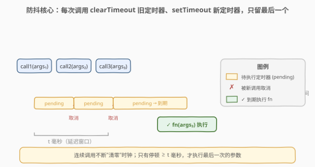
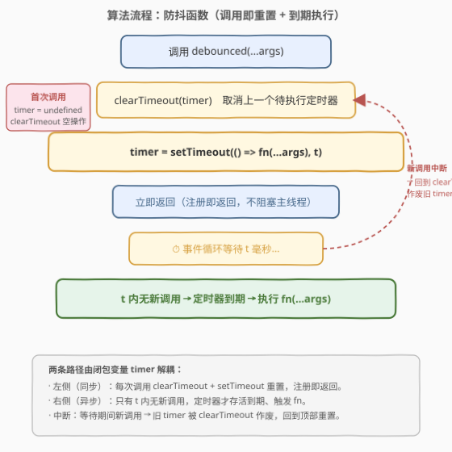
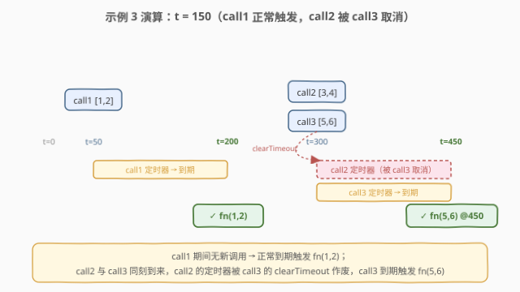

# LeetCode 函数防抖 题解

## 1. 题目概述

- **标题 / 题号**：函数防抖（#2627，medium）
- **链接**：https://leetcode.cn/problems/debounce/
- **难度**：中等
- **标签**：函数、闭包、定时器、防抖

**题意**：编写函数 `debounce(fn, t)`，接收一个函数 `fn` 和时间 `t`（毫秒），返回 `fn` 的**防抖版本**。

**防抖函数**：其执行被推迟 `t` 毫秒；若在这 `t` 毫秒窗口内**再次调用**它，则上一次待执行的调用被**取消**，并以最新调用的参数重新计时。防抖函数应原样接收传递给它的参数。

直观地说：**只有当调用"停顿够久"（≥ t 毫秒无新调用）时，`fn` 才真正执行，且执行的是最后一次调用的参数。**

> 请在不使用 lodash 的 `_.debounce()` 函数的前提下解决该问题。

**示例 1**：

```text
输入：t = 50
calls = [
  {"t": 50, inputs: [1]},
  {"t": 75, inputs: [2]}
]
输出：[{"t": 125, inputs: [2]}]
解释：
- call@50([1]) 调度于 t=100 执行；
- call@75([2]) 在 100 之前到来，取消前者，改调度于 t=125 执行；
- 125ms 后 fn(2) 触发。
```

**示例 2**：

```text
输入：t = 20
calls = [
  {"t": 50, inputs: [1]},
  {"t": 100, inputs: [2]}
]
输出：[{"t": 70, inputs: [1]}, {"t": 120, inputs: [2]}]
解释：
- call@50([1]) 调度于 t=70；70 前无新调用 → fn(1) 于 70ms 触发；
- call@100([2]) 调度于 t=120 → fn(2) 于 120ms 触发。
```

**示例 3**：

```text
输入：t = 150
calls = [
  {"t": 50, inputs: [1, 2]},
  {"t": 300, inputs: [3, 4]},
  {"t": 300, inputs: [5, 6]}
]
输出：[{"t": 200, inputs: [1, 2]}, {"t": 450, inputs: [5, 6]}]
解释：
- call@50([1,2]) 调度于 t=200；200 前无新调用 → fn(1,2) 于 200ms 触发；
- call@300([3,4]) 调度于 t=450；
- call@300([5,6]) 同时刻到来，取消前者，改调度于 t=450；
- fn(5,6) 于 450ms 触发。
```

**约束**：

- `0 <= t <= 1000`
- `1 <= calls.length <= 10`
- `0 <= calls[i].t <= 1000`
- `0 <= calls[i].inputs.length <= 10`

> 💡 本题是 LeetCode「30 天 JavaScript」系列，**仅提供 JavaScript / TypeScript 提交入口**，核心考察**闭包**与 `setTimeout` / `clearTimeout` 的配合。本文以 JS 为提交语言，并给出 Python 概念等价实现。

## 2. 解题思路

### 2.1 暴力思路：轮询 + 时间戳

用 `setInterval` 周期性"巡逻"：每次调用只记录 `lastArgs` 和 `lastCallTime`，由一个固定间隔的 interval 检查"`Date.now() - lastCallTime >= t` 且有待执行"就触发 `fn(...lastArgs)` 并清待执行位。

```javascript
function debounce(fn, t) {
  let lastArgs = null, lastCall = 0, pending = false;
  setInterval(() => {
    if (pending && Date.now() - lastCall >= t) {
      pending = false;
      fn(...lastArgs);
    }
  }, 10); // 每 10ms 巡逻一次
  return function (...args) {
    lastArgs = args; lastCall = Date.now(); pending = true;
  };
}
```

可行但差劲：interval 即使空闲也**持续空转**耗 CPU；执行时刻最多**滞后 `gap` 毫秒**（不精确）；还要自管 `pending` 标志。问题本质是"在最后一次调用后 `t` 毫秒精确触发一次"，轮询是把"事件驱动"硬拧成"时间驱动"，多此一举。

### 2.2 核心观察：闭包 + clearTimeout 重置



关键洞察：**让定时器自己管"取消"，而非轮询去查"到没到时间"**。

- 闭包里维护一个变量 `timer`，存当前**待执行的 `setTimeout` 句柄**；
- 每次调用：先 `clearTimeout(timer)` 把上一个待执行的调用**取消**，再 `timer = setTimeout(() => fn(...args), t)` 重新挂一个 `t` 毫秒后才触发的新定时器；
- 用**箭头函数**包裹 `fn(...args)`，把本次调用的 `args`（及 `this`）在当时就**捕获**进闭包，等定时器到期才执行。

于是产生一条**不变式**：任意时刻**至多有一个待执行定时器**。若 `t` 毫秒内无新调用，它到期、`fn` 以最后一次参数执行；若有新调用，旧定时器先被清掉、永不会再触发——即"只执行最后一次"。

| 机制 | 职责 | 复杂度 |
|------|------|--------|
| 闭包变量 `timer` | 持有"当前唯一待执行定时器"句柄 | $O(1)$ 访问 |
| `clearTimeout` | 取消上一个待执行调用，维持"至多一个"不变式 | $O(1)$ |
| `setTimeout` + 箭头闭包 | `t` 后触发，捕获本次 `args` | $O(1)$ 注册 |

> ⚠️ **箭头函数捕获的是"调用那一刻"的 `args`**：每次调用生成一个**新的箭头闭包**，各自持有自己的 `args`，互不影响；旧定时器被 `clearTimeout` 后，其闭包**永远不会执行**，故不会误用旧参数。若直接写 `setTimeout(fn, t, ...args)`，参数按值拷贝也能工作，但箭头写法 `() => fn.apply(this, args)` 额外保留了调用时的 `this`，对"对象方法防抖"更稳妥。

### 2.3 算法流程图



左侧主流程是"调用即重置"的同步路径（注册即返回，不阻塞）；右侧是"`t` 内无新调用则到期触发"的异步路径。两条路径通过闭包变量 `timer` 解耦：同步路径只管"挂/清定时器"，异步路径只管"到期执行"。

### 2.4 示例演算



- **示例 1**（`t=50`）：`call@50([1])` 挂定时器至 `t=100`；`call@75([2])` 在 100 前到来 → `clearTimeout` 清掉前者、改挂至 `t=125`；至 125 无新调用 → `fn(2)` 触发。**第一次调用被第二次取消**。
- **示例 3**（`t=150`）：`call@50([1,2])` 挂至 `t=200`，期间无新调用 → `fn(1,2)` 于 200 触发；`call@300([3,4])` 挂至 `t=450`，但 `call@300([5,6])` 同刻到来取消它、改挂至 `t=450` → `fn(5,6)` 于 450 触发。**第二次调用被第三次取消**。

## 3. 参考代码

### JavaScript（提交语言）

```javascript
/**
 * @param {Function} fn
 * @param {number} t
 * @return {Function}
 */
var debounce = function (fn, t) {
    let timer; // 闭包变量：当前待执行的定时器句柄
    return function (...args) {
        clearTimeout(timer); // 取消上一个待执行调用（timer 为 undefined 时为空操作）
        timer = setTimeout(() => fn.apply(this, args), t); // 捕获本次 args/this，t 后触发
    };
};
```

> 💡 三行即 AC：`clearTimeout` → `setTimeout`（箭头捕获 `args`）→ 句柄回写 `timer`。`clearTimeout(undefined)` 依规范是**空操作**，故首次调用无需特判。

### TypeScript

```typescript
function debounce(fn: (...args: any[]) => void, t: number) {
    let timer: ReturnType<typeof setTimeout> | undefined;
    return function (this: unknown, ...args: any[]) {
        clearTimeout(timer);
        timer = setTimeout(() => fn.apply(this, args), t);
    };
}
```

### Python（概念等价，threading.Timer）

> 本题 LeetCode 仅开放 JS/TS，Python 版作概念对照。`threading.Timer(interval, func)` 是 `setTimeout` 的对应物：它在 `interval` 秒后于**后台线程**执行 `func`，且 `.cancel()` 可撤销待执行的定时器，正好对应 `clearTimeout`。

```python
import threading


def debounce(fn, t):
    timer = None  # 闭包变量：当前待执行定时器

    def debounced(*args):
        nonlocal timer
        if timer is not None:
            timer.cancel()  # 取消上一个待执行调用
        # 捕获本次 args，t ms 后触发
        timer = threading.Timer(t / 1000, lambda: fn(*args))
        timer.start()

    return debounced
```

> ⚠️ `threading.Timer` 在后台线程触发，与 JS 单线程事件循环模型不同。若需单线程异步语义，可用 `asyncio`：`loop.call_later(t / 1000, fn, *args)` 配合 `handle.cancel()`，对应关系更贴切，但要求 `fn` 在事件循环上下文里运行。

## 4. 复杂度分析

| 维度 | 复杂度 | 说明 |
|------|--------|------|
| 时间复杂度 | $O(1)$ | 每次调用仅 `clearTimeout` + `setTimeout` + 常数次闭包操作，与 `t`、调用次数无关 |
| 空间复杂度 | $O(1)$ | 仅维护一个定时器句柄与本次 `args` 闭包；旧定时器被取消后其闭包可被 GC |

> 💡 真实"延迟成本"是 $O(t)$ 毫秒的等待，但属**调度开销**而非**计算复杂度**——等待期间主线程空闲，可处理其它任务。

## 5. 扩展：防抖 vs 节流，与 leading/trailing 变体

| 机制 | 触发时机 | 行为 | 典型场景 |
|------|----------|------|----------|
| **防抖（debounce，trailing）** | 最后一次调用后 `t` ms | 连续调用只保留最后一次 | 搜索框联想、`resize` 结束、防重复提交 |
| **节流（throttle）** | 每 `t` ms 至多一次 | 连续调用按固定节奏放行，不重置时钟 | `scroll` / `pointermove` 限频 |
| **leading-edge 防抖** | 首次调用**立即**触发，随后 `t` ms 内忽略 | "先响应再冷却" | 按钮、首次点击即反馈 |

- 本题实现的是 **trailing-edge**（尾沿）防抖：`t` ms 后才执行，且只执行最后一次。lodash `_.debounce(fn, t, { leading: true, trailing: false })` 可切到 leading 变体。
- **`maxWait` 选项**把防抖推向节流：连续高频调用会一直把执行往后推（理论上永不触发）；`maxWait` 保证"至多每 `maxWait` ms 必触发一次"，即在"防抖"外衣下兜底成"节流"，避免无限推迟。
- **为什么不用 `setInterval` 做节流？** 节流的标准实现同样基于 `setTimeout` + 时间戳：调用时若距上次触发 ≥ `t` 则立即触发并记时间，否则挂一个"到下次窗口"的 `setTimeout` 补一次尾沿触发。`setInterval` 在标签页后台会被节流、且无法对齐真实事件流，工程上少用。

> 💡 一句话区分：**防抖是"清零重来"**（每次调用重置时钟，只留最后），**节流是"按节奏放行"**（时钟不被重置，到点就放一个）。

## 6. 面试要点

1. **为什么每次调用都要 `clearTimeout`？**

   > 闭包里至多有一个待执行定时器；不清旧定时器，它会在原定时刻触发，把**已被新调用"覆盖"的旧参数**执行出来，破坏"只执行最后一次"的语义。`clearTimeout(timer)` 把旧定时器撤销，再挂新的，使执行时刻与最新调用对齐。

2. **箭头函数为什么捕获的是"本次"的 `args`？直接 `setTimeout(fn, t, ...args)` 行不行？**

   > 每次调用生成一个**新的箭头闭包**，它捕获的是**本次调用那一刻**的 `args` 引用；旧定时器被 `clearTimeout` 后其闭包永不被调用，故不会误用旧参数。`setTimeout(fn, t, ...args)` 同样按值拷贝参数、也能工作，但箭头写法额外保留调用时的 `this`，对"对象方法防抖"更稳妥。

3. **`clearTimeout(undefined)` 会报错吗？**

   > 不会。HTML 规范规定 `clearTimeout` 的参数若不是有效的挂起定时器句柄（包括 `undefined`、已触发/已取消的 id），直接**空操作**返回。故首次调用（`timer` 未初始化为 `undefined`）无需特判。但显式 `let timer;` 声明比不声明更清晰。

4. **防抖和节流有什么本质区别？**

   > 防抖**重置时钟**：连续调用期间时钟被不断推后，只有"停顿够久"才触发，执行的是最后一次；节流**不重置时钟**：到点就放行一次，连续调用按固定速率被采样。防抖 = 去抖动（只要还在动就不输出），节流 = 限频（动多久就按固定频率输出）。

5. **连续高频调用时，防抖函数会不会永远不执行？**

   > 若调用间隔始终小于 `t`，trailing 防抖确实会一直推迟、可能永不触发（这正是搜索框"边打边取消"的预期）。工程上用 `maxWait` 兜底：保证至多每 `maxWait` ms 必触发一次，把纯防抖拉回"防抖 + 节流"的折中，避免输入不停时联想永不出现。

> 💡 **一句话总结**：2627 = 「闭包持 `timer`，调用即 `clearTimeout` 旧 + `setTimeout` 新（箭头捕获 `args`），`t` 内无新调用则到期执行最后一次」。防抖 = 清零重来，只放行尾沿。

## 同类练习题

| # | 题目 | 与本题的关联 |
|---|------|-------------|
| 2621 | [睡眠函数](https://leetcode.cn/problems/sleep/) | `new Promise(r => setTimeout(r, millis))`，一次性延迟回调；防抖是其"反复重置"的升级（[题解](../2601-2700/2621_睡眠函数.md)） |
| 2622 | [有时间限制的缓存](https://leetcode.cn/problems/cache-with-time-limit/) | `setTimeout` + `clearTimeout` 管键过期，覆盖时必须清旧 timer 防误删，与防抖"清旧挂新"同构（[题解](../2601-2700/2622_有时间限制的缓存.md)） |
| 2637 | [有时间限制的 Promise 对象](https://leetcode.cn/problems/promise-time-limit/) | 给 Promise 加超时取消，"延迟 + 撤销"思想相通，对照"到期触发"与"超时中断" |
| 2636 | [串行处理 promise](https://leetcode.cn/problems/promise-pool/) | 异步任务的调度与排队执行，承接对 `setTimeout`/Promise 调度时序的理解 |
