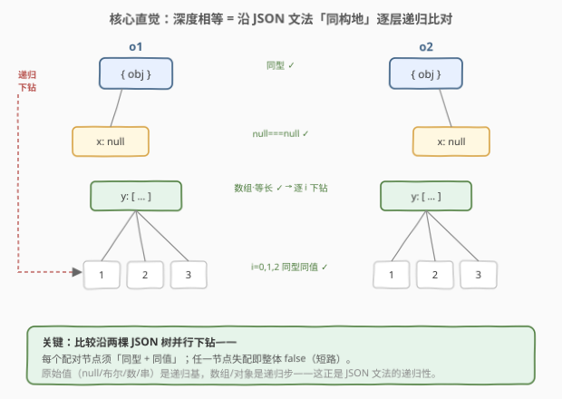
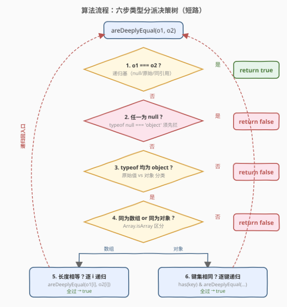
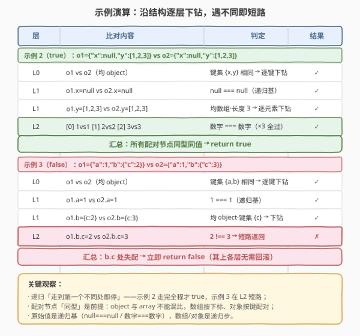

# 完全相等的 JSON 对象

- **题目名称**：完全相等的 JSON 对象
- **链接**：[2628. 完全相等的 JSON 对象](https://leetcode.cn/problems/json-deep-equal/)
- **难度**：中等
- **标签**：递归、深度比较、JSON、类型判断

## 1. 题目概述

给定两个 **JSON 值** `o1` 与 `o2`，判断它们是否「深度相等」。JSON 值的文法定义为：

```
value  = null | true | false | number | string | array | object
array  = [ value, value, ... ]
object = { "key": value, "key": value, ... }
```

两个值深度相等，当且仅当满足下列之一：

- 二者均为 `null`；
- 二者均为布尔 / 数字 / 字符串，且**严格相等**（`===`）；
- 二者均为数组，长度相同，且**每个对应下标**的元素深度相等；
- 二者均为对象，**键集完全相同**，且每个键对应的值深度相等。

**示例 1**：

```text
输入：o1 = {"x":1,"y":2}, o2 = {"x":1,"y":2}
输出：true
解释：两对象键集相同 {x,y}，每个键的值也相同。
```

**示例 2**：

```text
输入：o1 = {"x":null,"y":[1,2,3]}, o2 = {"x":null,"y":[1,2,3]}
输出：true
解释：x 均为 null；y 均为长度 3 的数组，逐元素 1/2/3 相等。
```

**示例 3**：

```text
输入：o1 = {"a":1,"b":{"c":2}}, o2 = {"a":1,"b":{"c":3}}
输出：false
解释：递归到 b.c 时 2 !== 3。
```

**约束条件**：

- `o1`、`o2` 均为合法 JSON 值（不含 `undefined` / 函数 / Symbol / 循环引用）；
- 键名与字符串值由可打印 ASCII 字符组成；
- 两值合并后的键 / 元素总数不超过 $10^5$（保证递归栈深度可控）。

> 💡 本题是 LeetCode「30 天 JavaScript」系列题目，**仅提供 JavaScript / TypeScript 提交入口**，核心考察**递归 + 类型分派**。本文以 JS 为提交语言，并给出 Python 概念等价实现。

---

## 2. 解题思路

### 2.1 暴力思路：`JSON.stringify` 比字符串

最省事的「能跑」写法是把两个值各自 `JSON.stringify` 再比字符串：

```javascript
return JSON.stringify(o1) === JSON.stringify(o2);
```

它的问题是**键序敏感**：`{a:1,b:2}` 与 `{b:2,a:1}` 深度相等，但 `stringify` 的结果不同（键按定义顺序拼接），会被误判为不等。虽然可以给 `JSON.stringify` 传一个「替换函数」强制排序键，但这又要求两个对象的键集先一致、且对嵌套对象要递归排序，反而比直接比较更绕。此外 `stringify` 要把整棵结构序列化两遍，多一份 $O(n)$ 字符串开销。

> ⚠️ `JSON.stringify` 的本质是「**序列化**」而非「**比较**」：它把结构压成线性字符串，丢掉了「键集无序」这一语义。深度相等应当**按结构同构地递归比对**，而非先压平再比字符串。

### 2.2 核心观察：递归 + 类型分派



深度相等的定义本身就是**沿 JSON 文法递归**的：原始类型是递归基（base case），数组与对象是递归步（recursive step）。于是算法天然是一棵「类型分派」决策树：

1. **递归基**：`o1 === o2` 一次性覆盖 `null===null`、布尔/数字/字符串严格相等、以及同引用对象——所有「不用再往下钻」的情形都在此命中；
2. **拦截 `null`**：走到第 2 步说明 `!==`。但 `typeof null === 'object'`，若不先拦 `null`，它会伪装成「对象」继续走类型分支而出错，故 `o1===null || o2===null` 时直接 `false`；
3. **类型一致性**：`typeof` 不同、或二者之一不是 `object`（如一边是数字一边是字符串）→ `false`；
4. **数组 vs 对象**：`typeof` 都是 `object`，但 `[]` 与 `{}` 不能混比，用 `Array.isArray` 区分；
5. **数组**：比长度，再逐下标递归；
6. **对象**：比键数，再对每个键先确认「对方也有此键」、再递归取值比较。

四个 JS 类型陷阱与对应处理：

| 陷阱 | 现象 | 处理 |
|------|------|------|
| `typeof null === 'object'` | `null` 会冒充对象 | 第 2 步显式 `=== null` 拦截 |
| `typeof [] === 'object'` | 数组与对象同 `typeof` | `Array.isArray()` 区分 |
| 键序无关 | `{a,b}` 与 `{b,a}` 应相等 | 比 `Object.keys` 的**集合**，非序列 |
| 缺键 vs `undefined` 值 | `{a:undefined}` 与 `{b:undefined}` 会被 `o2[key]===undefined` 误判相等 | 显式判键存在性（`has`/`hasOwn`） |

> ⚠️ **缺键 ≠ `undefined` 值**：若 `o1={a:undefined}`、`o2={b:undefined}`，只比 `o2['a']` 会得到 `undefined`，与 `o1['a']` 的 `undefined` 用 `===` 判为相等而误返 `true`。必须先 `has(o2, key)` 确认对方真有此键，再比值。这是本题最隐蔽的坑。

### 2.3 算法流程图



决策是「短路」的：每一步失败立刻返回 `false`，只有全部通过才返回 `true`。其中第 5、6 步会**递归**调用自身，把比较问题沿结构逐层下钻，直到撞上原始类型这一递归基。

### 2.4 示例演算



以**示例 2** `o1={"x":null,"y":[1,2,3]}`、`o2={"x":null,"y":[1,2,3]}` 为例，比对沿结构下钻：

| 层 | 比对内容 | 判定 |
|----|----------|------|
| L0 | `o1` vs `o2`（均对象） | 键集 {x,y} 相同 → 逐键下钻 |
| L1 | `o1.x=null` vs `o2.x=null` | `null===null` ✓ |
| L1 | `o1.y=[1,2,3]` vs `o2.y=[1,2,3]` | 均数组、长度 3 → 逐元素下钻 |
| L2 | `[0]` 1 vs 1、`[1]` 2 vs 2、`[2]` 3 vs 3 | 数字 `===` ✓ ×3 |
| 汇总 | 全部通过 | → **true** |

而**示例 3** `o1={"a":1,"b":{"c":2}}`、`o2={"a":1,"b":{"c":3}}` 一路相同，直到 L2 比对 `b.c`：`2 !== 3`，短路返回 **false**。可见递归会「走到第一个不同处即停」。

---

## 3. 参考代码

### JavaScript / TypeScript（提交语言）

```javascript
var areDeeplyEqual = function (o1, o2) {
    // 1. 递归基：=== 覆盖 null===null、原始值严格相等、同引用
    if (o1 === o2) return true;

    // 2. 走到这里说明 !==。拦截 null（typeof null === 'object'，会伪装成对象）
    if (o1 === null || o2 === null) return false;
    // 3. 类型一致性：非对象（原始值）或 typeof 不同 → 不等
    if (typeof o1 !== 'object' || typeof o2 !== 'object') return false;

    // 4. 都是 object：区分数组与普通对象（typeof 相同，须 Array.isArray）
    if (Array.isArray(o1) !== Array.isArray(o2)) return false;

    if (Array.isArray(o1)) {
        // 5. 数组：长度 + 逐下标递归
        if (o1.length !== o2.length) return false;
        for (let i = 0; i < o1.length; i++) {
            if (!areDeeplyEqual(o1[i], o2[i])) return false;
        }
        return true;
    }

    // 6. 对象：键数相同 + 每键都存在 + 取值递归
    const keys1 = Object.keys(o1);
    const keys2 = new Set(Object.keys(o2));
    if (keys1.length !== keys2.size) return false;
    for (const key of keys1) {
        // 显式判键存在性，防「缺键 vs undefined 值」误判
        if (!keys2.has(key) || !areDeeplyEqual(o1[key], o2[key])) return false;
    }
    return true;
};
```

> 💡 **第 1 步的 `o1 === o2` 是全函数的基石**：它把所有「无需下钻」的情形一次性收口——`null`、布尔、数字、字符串，以及两个指向同一对象的引用，都在此命中。只有「同为不同的对象/数组」时才需要继续分派，这正是递归正确性的来源。

TypeScript 版（带类型标注）：

```typescript
function areDeeplyEqual(o1: unknown, o2: unknown): boolean {
    if (o1 === o2) return true;
    if (o1 === null || o2 === null) return false;
    if (typeof o1 !== 'object' || typeof o2 !== 'object') return false;
    if (Array.isArray(o1) !== Array.isArray(o2)) return false;

    if (Array.isArray(o1)) {
        const a2 = o2 as unknown[];
        if (o1.length !== a2.length) return false;
        for (let i = 0; i < o1.length; i++) {
            if (!areDeeplyEqual(o1[i], a2[i])) return false;
        }
        return true;
    }

    const r1 = o1 as Record<string, unknown>;
    const r2 = o2 as Record<string, unknown>;
    const keys1 = Object.keys(r1);
    const keys2 = new Set(Object.keys(r2));
    if (keys1.length !== keys2.size) return false;
    for (const key of keys1) {
        if (!keys2.has(key) || !areDeeplyEqual(r1[key], r2[key])) return false;
    }
    return true;
}
```

### Python（概念等价）

> 本题 LeetCode 仅开放 JS/TS，Python 版作概念对照。需注意 Python 中 `bool` 是 `int` 的子类（`True == 1`），JSON 里二者属不同类型，故用 `type(a) is type(b)` 严格判型。

```python
def areDeeplyEqual(o1, o2) -> bool:
    # 1. None / 原始值：同型 + 同值
    if o1 is None or o2 is None:
        return o1 is o2          # 两者均 None 才相等
    # bool 必须先于 int 判（bool 是 int 子类，True == 1）
    if isinstance(o1, bool) or isinstance(o2, bool):
        return type(o1) is type(o2) and o1 == o2
    if isinstance(o1, (int, float, str)):
        if type(o1) is not type(o2):
            return False
        return o1 == o2

    # 2. 数组：同型 + 等长 + 逐元素递归
    if isinstance(o1, list) or isinstance(o2, list):
        if type(o1) is not type(o2) or len(o1) != len(o2):
            return False
        return all(areDeeplyEqual(a, b) for a, b in zip(o1, o2))

    # 3. 对象：键集相同 + 逐键递归
    if type(o1) is not type(o2):
        return False
    if set(o1.keys()) != set(o2.keys()):
        return False
    return all(areDeeplyEqual(o1[k], o2[k]) for k in o1)
```

> ⚠️ **Python 的 `bool`/`int` 陷阱**：`isinstance(True, int)` 为 `True`、`True == 1` 为 `True`，若不先单独判 `bool`，`areDeeplyEqual(True, 1)` 会被误判相等。JS 中 `typeof true === 'boolean'`、`typeof 1 === 'number'` 天然分型，无需此特判——这是两语言类型系统差异带来的对照点。

---

## 4. 复杂度分析

| 维度 | 复杂度 | 说明 |
|------|--------|------|
| 时间复杂度 | $O(n)$ | $n$ 为两值合并后的键 / 元素总数；每个节点至多被访问常数次，递归无重复下钻 |
| 空间复杂度 | $O(h)$ | $h$ 为嵌套深度（递归栈）；最坏退化到 $O(n)$（单条链状嵌套），通常 $h \ll n$ |

> 💡 本质是**一次结构同构的遍历**：递归沿两棵 JSON 树并行下钻，遇到第一个「形状/值不同」处即短路返回 `false`，故最坏才遍历全部节点；平均情形常因早短路而远好于 $O(n)$。`Object.keys` 取键集为 $O(k)$，累加后仍为 $O(n)$，不改变渐近。

---

## 5. 扩展：循环引用、引用相等与「结构 vs 语义」

- **循环引用**：本题保证无环。若放宽到「可能环」的通用对象比较，朴素递归会无限下钻直至栈溢出；标准做法是用一个 `Map` 记录已访问的 `(o1, o2)` 配对，进入前查表，重复配对即视为相等（同构环必然同步相遇）。这是 `lodash.isEqual` 的实现要点之一。
- **`===` vs 深度相等的边界**：`===` 只比引用地址（对象/数组）或值（原始类型），两个「内容相同但地址不同」的对象 `===` 为 `false`，但深度相等为 `true`。本题正是补上 `===` 在引用类型上的缺口。
- **键序无关的实现选择**：本题用「`Set` 判键存在 + 长度先比」保证键集相等。另一等价写法是 `Object.keys` 各自排序后再逐键比，但多一份 $O(k \log k)$ 排序，不如集合判属 $O(k)$ 来得直接。
- **`NaN` 与 `-0`**：JSON 规范不含 `NaN`（`JSON.stringify(NaN)` 为 `"null"`），`-0` 与 `+0` 在 `===` 下相等；本题既限定合法 JSON 值，二者均不会出现，无需特判。通用 deep-equal 库则需用 `Object.is` 区分 `±0`、并约定 `NaN` 是否相等。

> 💡 工程实践中，`lodash.isEqual`、Node 的 `assert.deepStrictEqual`、Jest 的 `expect(...).toEqual(...)` 都是对「深度相等」的不同语义裁剪：`deepStrictEqual` 连原型链与 `Error` 类型都严格判，`toEqual` 则对 `ArrayBuffer` 等类型有特殊规则。理解本题的类型分派，就理解了它们的核心骨架。

---

## 6. 面试要点

1. **为什么第一步用 `o1 === o2`，它覆盖了哪些情况？**

   > 覆盖所有「无需下钻」的递归基：`null===null`、布尔/数字/字符串的严格相等，以及两个指向**同一对象/数组引用**的情况。它是一次性收口，使后续分支只需处理「同为不同的对象/数组」这一情形，简化了类型分派。

2. **`typeof null === 'object'` 会在哪里坑你？怎么防？**

   > 若不先拦截 `null`，它会走进「都是 object」的分支，对一个 `null` 与一个真对象继续比键集而误判。防法：在 `===` 失败后、`typeof` 判断前，显式 `if (o1 === null || o2 === null) return false`。

3. **为什么对象比较要先判断「对方也有此键」再比值？**

   > 防止「缺键 vs `undefined` 值」误判：`o1={a:undefined}`、`o2={b:undefined}` 时，直接 `o2['a']` 得 `undefined`，与 `o1['a']` 的 `undefined` 用 `===` 会判相等而误返 `true`。先 `keys2.has(key)` 确认对方真有此键，才能正确区分「键不存在」与「键存在且值为 `undefined`」。配合「键数相等」的前置检查，键集相同性才完备。

4. **为什么不用 `JSON.stringify` 比较？**

   > 它是**序列化**而非**比较**：键按定义顺序拼接，使键集相同但键序不同的对象被误判不等；且要序列化两遍、多一份 $O(n)$ 字符串。深度相等应按结构同构递归比对，天然键序无关、且可短路。

5. **Python 版为什么要先单独判 `bool`？**

   > Python 里 `bool` 是 `int` 的子类，`isinstance(True, int)` 为 `True`、`True == 1` 为 `True`，若不先判 `bool`，`areDeeplyEqual(True, 1)` 会被误判相等。JS 中 `typeof true === 'boolean'` 与 `typeof 1 === 'number'` 天然分型，无需此特判——这是跨语言实现 deep-equal 时的典型差异点。

> 💡 **一句话总结**：2628 = 「沿 JSON 文法递归 + 类型分派」。`===` 收口递归基，`null`/`typeof`/`Array.isArray` 三道闸门保证同型，数组按下标、对象按「键存在 + 取值」递归下钻，任一节点失配即短路 `false`。

---

## 7. 同类练习题

- [100. 相同的树](https://leetcode.cn/problems/same-tree/)：二叉树版的「深度相等」——结构同构 + 节点值相同，与本题 JSON 树的递归同构，一树一 JSON 对照
- [2705. 精简对象](https://leetcode.cn/problems/compact-object/)：沿 JSON 树递归 + 类型分派，把「比较」换成「删除假值」，与本题共用同一骨架，一判等一精简
- [2625. 扁平化嵌套数组](https://leetcode.cn/problems/flatten-deeply-nested-array/)：递归遍历嵌套数组按深度剪枝，同属「JSON 文法递归」家族，巩固对数组/对象递归的运用
- [572. 另一棵树的子树](https://leetcode.cn/problems/subtree-of-another-tree/)：在树中找「深度相等的子结构」，复用 100 的逐节点判等，是「深度相等 + 枚举起点」的组合
