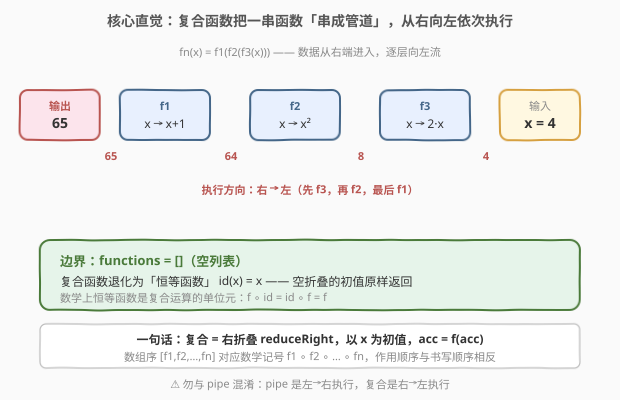
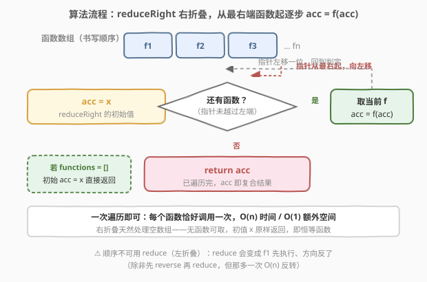

# 复合函数

- **题目名称**：复合函数
- **链接**：[2629. 复合函数](https://leetcode.cn/problems/function-composition/)
- **难度**：简单
- **标签**：函数式编程、高阶函数、数组、右折叠

## 1. 题目概述

给定一个函数数组 `[f1, f2, f3, …, fn]`，请编写并返回一个新的函数 `fn`，它是该数组的**复合函数**（function composition）。

`[f(x), g(x), h(x)]` 的复合函数为 `fn(x) = f(g(h(x)))`，即**从右向左**依次套用。**空函数列表**的复合函数是**恒等函数** `id(x) = x`。每个函数接收一个整数、返回一个整数。

**示例 1**：

```text
输入：functions = [x => x + 1, x => x * x, x => 2 * x], x = 4
输出：65
解释：从右向左计算——
  2 * 4 = 8
  8 * 8 = 64
  64 + 1 = 65
```

**示例 2**：

```text
输入：functions = [x => 10 * x, x => 10 * x, x => 10 * x], x = 1
输出：1000
解释：10 * (10 * (10 * 1)) = 1000
```

**示例 3**：

```text
输入：functions = [], x = 42
输出：42
解释：空函数列表的复合函数即恒等函数，原样返回 x
```

**约束条件**：

- `-1000 <= x <= 1000`
- `0 <= functions.length <= 1000`
- 数组中每个函数都接收并返回一个整数

> 💡 本题属于 LeetCode「30 天 JavaScript」系列，**仅开放 JavaScript / TypeScript 提交入口**，考察**高阶函数**与**复合（compose）**思想。复合是函数式编程的核心操作之一，跨语言通用，下文给出 C++ 与 Python 的等价实现。

---

## 2. 解题思路

### 2.1 暴力思路：手写反向循环 + 特判空数组

最直白的「能跑」写法：开一个累加变量 `acc` 初值为 `x`，然后**从数组末尾往前**遍历，每步 `acc = f(acc)`，遍历完返回 `acc`。还要为空数组单独加一个 `if (functions.length === 0) return x`。

```text
fn(x):
    if functions 空: return x        // 单独特判
    acc = x
    for i from n-1 down to 0:         // 手写反向下标
        acc = functions[i](acc)
    return acc
```

可行，但有两个不优雅之处：① 要**手动特判空数组**，把「恒等函数」当成边界情况硬塞进逻辑；② 反向下标循环把「右折叠」这一本质淹没在索引细节里，可读性差。

### 2.2 核心观察：复合 = 右折叠，空数组天然退化为恒等



把复合放到数学记号下看：数组 `[f1, f2, …, fn]` 对应

$$
\mathrm{fn}(x) = (f_1 \circ f_2 \circ \cdots \circ f_n)(x) = f_1\bigl(f_2(\cdots f_n(x)\cdots)\bigr),
$$

其中 $(f \circ g)(x) = f(g(x))$。**书写顺序与作用顺序相反**：写下 `f1 ∘ f2 ∘ f3`，作用时却是 `f3` 先、`f1` 后。

这正是一个标准的**右折叠（right fold）**：以 `x` 为初值，从数组最右端起，反复执行 `acc = f(acc)`。写成代码即

```text
fn(x) = reduceRight(functions, (acc, f) => f(acc), x)
```

两个关键点让它比暴力法更优雅：

| 观察 | 含义 |
|------|------|
| **右折叠方向天然匹配** | `reduceRight` 从右往左取函数，与复合「先 f3 后 f1」的作用顺序一致，无需手写下标 |
| **空数组 = 折叠单位元** | `reduceRight` 对空数组且给了初值时，**直接返回初值 `x`** —— 即恒等函数 `id`。无需特判 |

> 💡 **数学背景**：恒等函数 $\mathrm{id}$ 是复合运算的单位元，$f \circ \mathrm{id} = \mathrm{id} \circ f = f$。右折叠把空列表映射到单位元，正是「折叠」定义里「空集 → 单位元」的体现（求和折叠空集得 0、求积折叠空集得 1，复合折叠空集得 id）。

> ⚠️ **不可用 `reduce`（左折叠）替代**：左折叠从左往右取，会把 `f1` 先执行、`fn` 最后执行，方向整个反掉，结果错误。要左折叠得先 `reverse` 再 `reduce`，多一次 $O(n)$ 反转，不如直接用 `reduceRight`。

### 2.3 算法流程图



整体只有一条主线：**初始化 `acc = x` → 判定是否还有函数 → 取当前 `f`、`acc = f(acc)`、指针左移并回环 → 取尽则返回 `acc`**。空数组走捷径：初值 `x` 原样返回，天然成为恒等函数。

### 2.4 示例演算

![示例演算：functions = [x→x+1, x→x², x→2x]，x = 4](../images/compose_example_walkthrough.svg)

以**示例 1** 为例，`functions = [x→x+1, x→x², x→2x]`、`x = 4`：

| 步 | 取出的函数 | acc 变化 | 说明 |
|----|-----------|----------|------|
| 0  | （初始值） | `acc = x = 4` | reduceRight 的起点 |
| 1  | f3：x → 2·x | `2 × 4 = 8` | 最右端先执行 |
| 2  | f2：x → x² | `8² = 64` | 指针左移一位 |
| 3  | f1：x → x+1 | `64 + 1 = 65` | 最左端最后执行 |

输出 `65`，与 $f_1(f_2(f_3(4)))$ 手算一致。对照**示例 3**：`functions = []`、`x = 42` —— 无函数可取，`acc` 始终保持 `42`，即恒等函数。

---

## 3. 参考代码

### JavaScript / TypeScript（提交语言，右折叠一行版）

```javascript
/**
 * @param {Array<Function>} functions
 * @return {Function}
 */
var compose = function (functions) {
    return function (x) {
        // reduceRight：从右向左折叠，初值 x；空数组时原样返回 x（恒等）
        return functions.reduceRight((acc, f) => f(acc), x);
    };
};
```

TypeScript 版（带函数类型签名）：

```typescript
type F = (x: number) => number;

function compose(functions: F[]): F {
    return (x: number) => functions.reduceRight((acc: number, f: F) => f(acc), x);
}
```

> 💡 `reduceRight(callback, initialValue)` 的语义：回调签名是 `(accumulator, currentValue) => newAccumulator`，从数组最末元素起向左推进，`accumulator` 首次即 `initialValue`。这里 `currentValue` 是当前函数 `f`，`accumulator` 是中间结果 `acc`，一步 `f(acc)`。空数组时回调不执行、直接返回 `initialValue = x`。

### Python

```python
from functools import reduce
from typing import Callable


def compose(functions: list[Callable[[int], int]]) -> Callable[[int], int]:
    # reversed 从右向左迭代；reduce 初值 x；空列表时 reduce 返回初值 x（恒等）
    return lambda x: reduce(lambda acc, f: f(acc), reversed(functions), x)
```

等价的显式循环版（不依赖 reduce，逻辑更直白）：

```python
from typing import Callable


def compose(functions: list[Callable[[int], int]]) -> Callable[[int], int]:
    def fn(x: int) -> int:
        acc = x
        for f in reversed(functions):   # reversed 产生反向迭代器，O(1)
            acc = f(acc)
        return acc                       # 空列表不进循环，返回 x = 恒等
    return fn
```

### C++

```cpp
#include <functional>
#include <utility>
#include <vector>

// 写法一：lambda 捕获 + 反向迭代器（最贴近 JS 闭包语义）
std::function<int(int)> compose(std::vector<std::function<int(int)>> functions) {
    // 按值捕获 functions（移动进闭包），返回一个可反复调用的函数对象
    return [functions = std::move(functions)](int x) {
        int acc = x;
        // rbegin/rend：反向迭代，从末元素走向首元素，与 reduceRight 同向
        for (auto it = functions.rbegin(); it != functions.rend(); ++it)
            acc = (*it)(acc);
        return acc;   // 空数组时不进循环，acc = x，即恒等
    };
}

// 写法二：手写嵌套递归（数学记号 f1∘f2∘…∘fn 的直译）
std::function<int(int)> composeRecursive(const std::vector<std::function<int(int)>>& functions) {
    std::function<int(int)> rec = [&](size_t i, int x) -> int {
        return i == functions.size() ? x : functions[i](rec(i + 1, x));
    };
    return [functions, rec](int x) { return rec(0, x); };
}
```

> ⚠️ C++ 写法二的递归 `rec(i, x) = functions[i](rec(i+1, x))` 是复合的「自左向右构造、自右向左求值」结构：从 `i=0` 起向右递归到底，回溯时 `fn` 最先算、`f1` 最后算，恰好对应 $f_1(f_2(\cdots f_n(x)\cdots))$。该写法栈深 $O(n)$，`n ≤ 1000` 时安全但不如反向迭代器简洁。

---

## 4. 复杂度分析

| 维度 | 复杂度 | 说明 |
|------|--------|------|
| 时间复杂度 | $O(n)$ 每次调用 / $O(1)$ 创建 | `compose` 仅闭包捕获数组，真正求值时每个函数恰好调用一次 |
| 空间复杂度 | $O(1)$ 额外 / $O(n)$ 捕获 | 只用一个 `acc` 变量；闭包需持有函数数组引用（不计入额外空间） |

> 💡 本题没有「输入规模」压力（`functions.length ≤ 1000`），复杂度恒为线性；考点在**函数即值（函数作为一等公民）**与**右折叠方向**，非性能。返回的 `fn` 可被反复用不同 `x` 调用，每次都是 $O(n)$。

---

## 5. 扩展：compose vs pipe，以及恒等函数的角色

复合是函数式编程的基础积木，围绕它有几个常见变体：

| 概念 | 定义 | 执行方向 | 空列表单位元 |
|------|------|----------|--------------|
| **compose**（本题） | `compose([f,g,h])(x) = f(g(h(x)))` | 右 → 左 | `id` |
| **pipe** | `pipe([f,g,h])(x) = h(g(f(x)))` | 左 → 右 | `id` |
| **恒等函数 id** | `id(x) = x` | — | 复合的单位元 |

- **方向差异**：`compose` 是右折叠（`reduceRight`），`pipe` 是左折叠（`reduce`）。语义上 `pipe` 更接近「自然阅读顺序」，`compose` 更贴近数学记号 $f \circ g$。两者可互转：`pipe(fns) = compose(fns.reverse())`。
- **单位元**：空列表的复合返回 `id`，正如空数组的求和返回 `0`、求积返回 `1`——这是「折叠遇到空集返回单位元」的一般规律。把恒等函数显式纳入 API（如 `compose([id, f]) === f`）能让组合律在代码层面显形：$f \circ \mathrm{id} = \mathrm{id} \circ f = f$。
- **结合律**：复合满足结合律 $(f \circ g) \circ h = f \circ (g \circ h)$，所以可任意分组「预编译」子管道，再串联成大管道，结果不变。这是 RxJS / Lodash `flow` / Redux middleware 能自由拆分组合的理论基础。
- **工程落点**：HTTP 中间件、请求/响应管线、数据转换流水线、解析器组合子（parser combinators）本质都是 `compose`/`pipe`。理解右折叠方向是调试这类管线的关键。

> 💡 若把本题推广到「函数可返回多个值、下一个函数接收多参数」，就进入 **transducer** 领域：把 map/filter 抽象成可组合的函数变换器，串成一条不再分配中间数组的管道——Clojure 与 RxJS 都用这套模型。

---

## 6. 面试要点

1. **为什么用 `reduceRight` 而不是 `reduce`？方向反了会怎样？**

   > 复合 $f_1 \circ f_2 \circ \cdots \circ f_n$ 要求 $f_n$ 先执行、$f_1$ 最后执行，即「从右向左作用」。`reduceRight` 正是从右往左取元素，方向匹配；`reduce` 从左往右取，会把 $f_1$ 先执行，结果错。若坚持用 `reduce`，需先 `reverse` 再折叠，多一次 $O(n)$ 反转。

2. **空数组为何不需要特判就返回 `x`？**

   > `reduceRight(callback, initialValue)` 在数组为空时根本不调用回调，直接返回 `initialValue`。本题初值就是 `x`，所以空数组返回 `x`，恰是恒等函数 `id`。这把「恒等」从边界特例变成了折叠语义的自然结果——空集折叠到单位元。

3. **`reduceRight` 的回调参数顺序是怎样？为什么是 `(acc, f)` 而非 `(f, acc)`？**

   > JS 中 `reduce`/`reduceRight` 的回调统一是 `(accumulator, currentValue, index, array)`，累加器总在第一参。这里 `currentValue` 是当前函数 `f`，所以写 `(acc, f) => f(acc)`：用当前函数去变换累加器。顺序记反成 `(f, acc) => f(acc)` 在本题恰好也能跑通（因两者都是单参函数），但语义易错，应按 API 约定写。

4. **返回的 `fn` 每次调用的代价是多少？闭包捕获了什么？**

   > 每次调用 `fn(x)` 是 $O(n)$：遍历一遍数组，每个函数调用一次。闭包捕获了 `functions` 数组的引用（JS 按引用；C++ 可按值/移动捕获）。`compose` 本身是 $O(1)$，它不立即执行任何 `f`，只是「记住」数组并返回一个待调用的函数——这正是**惰性**与**函数作为值**的体现。

5. **如何把复合改成 pipe（左到右执行）？恒等函数在其中扮演什么角色？**

   > `pipe(fns)(x) = fns.reduce((acc, f) => f(acc), x)`，用 `reduce` 从左向右折叠即可。空列表同样返回初值 `x`（恒等）。恒等函数 `id` 是 compose 与 pipe 的共同单位元：`compose([id, f]) === pipe([f, id]) === f`。它让组合律显形，也是构造「默认无操作」管线节点的惯用占位符。

---

## 7. 同类练习题

- [2623. 记忆函数](https://leetcode.cn/problems/memoize/)：同属 30 天 JS 系列，闭包持缓存字典把「记忆」封进函数，与本题「闭包捕获函数数组」同属高阶函数设计
- [2620. 计数器](https://leetcode.cn/problems/counter/)：闭包捕获并推进私有状态 `n`，对照本题闭包捕获「一组函数」而非可变状态，体现闭包的两种用法
- [2666. 只允许一次函数调用](https://leetcode.cn/problems/allow-one-function-call/)：闭包加布尔标志位实现「调用一次后失效」，同样是「函数 + 私有状态」封装的不同语义
- [2621. 睡眠](https://leetcode.cn/problems/sleep/)：返回延时执行的 Promise，与本题返回延时执行的普通函数对照，体现「函数即值」可被传递/延迟调用
- [2635. 转换数组中的每个元素](https://leetcode.cn/problems/apply-transform-over-each-element-in-array/)：手撕 `map`，与本题 `reduceRight` 同属 Array 高阶方法族，对照「左→右转换」与「右→左折叠」两种折叠方向
