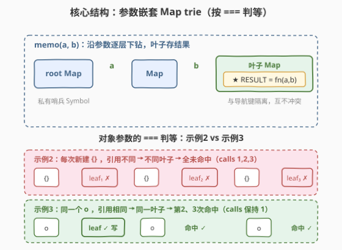
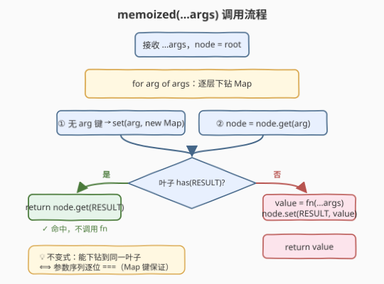
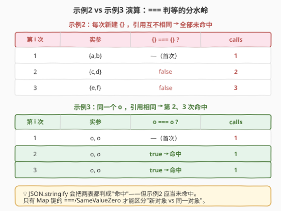

# LeetCode 记忆函数 II 题解

## 1. 题目概述

- **标题 / 题号**：记忆函数 II（#2630，hard）
- **链接**：https://leetcode.cn/problems/memoize-ii/
- **难度**：困难
- **标签**：函数式编程、哈希表、记忆化、设计

**题意**：给定任意函数 `fn`，返回它的一个**记忆化**版本：对相同输入（按 `===` 判等）不重复调用 `fn`，而是返回缓存的值。`fn` 接受的值类型**没有任何限制**（数字、字符串、对象、数组……皆可）；两个输入当且仅当在 JavaScript 中用 `===` 比较相等时，才视为"相同"。

**示例 1**（数字参数，按值判等）：

```text
getInputs = () => [[2,2],[2,2],[1,2]]
fn = function (a, b) { return a + b; }
输出：[{"val":4,"calls":1}, {"val":4,"calls":1}, {"val":3,"calls":2}]
解释：
  (2,2) 首次算 4，调用 1 次；
  (2,2) 与上次 ===，命中缓存，不调用 fn，calls 仍为 1；
  (1,2) 不同，算 3，累计调用 2 次。
```

**示例 2**（每次新建空对象，引用互不相同）：

```text
getInputs = () => [[{},{}],[{},{}],[{},{}]]
fn = function (a, b) { return ({...a, ...b}); }
输出：[{"val":{},"calls":1}, {"val":{},"calls":2}, {"val":{},"calls":3}]
解释：三对空对象看似相同，但 {} !== {}，故每次都未命中，calls 1→2→3。
```

**示例 3**（同一个对象引用 `o` 传三次）：

```text
getInputs = () => { const o = {}; return [[o,o],[o,o],[o,o]]; }
fn = function (a, b) { return ({...a, ...b}); }
输出：[{"val":{},"calls":1}, {"val":{},"calls":1}, {"val":{},"calls":1}]
解释：o === o，第 2、3 次命中缓存，calls 保持 1。
```

**约束**：

- `1 <= inputs.length <= 10^5`
- `0 <= inputs.flat().length <= 10^5`
- `inputs[i][j] != NaN`

> 💡 本题是 LeetCode「30 天 JavaScript」系列题目，**仅开放 JavaScript / TypeScript 提交入口**，核心考察 `Map` 与值/引用判等。它是 [2623. 记忆函数 I](https://leetcode.cn/problems/memoize) 的升级版：I 按"结构"判等（`JSON.stringify` 即可），II 改按"引用同一性"判等（`===`），序列化方案直接失效——这正是本题"困难"的来源。本文以 JS 为提交语言，并给出 Python 概念等价实现。

## 2. 解题思路

### 2.1 陷阱思路：序列化键（I 的解法在 II 失效）

记忆函数 I（2623）的常规解法是把参数数组 `JSON.stringify(args)` 得到一个字符串键，存进普通对象/Map。这在 II 里**直接错**：

- 示例 2 中三对空对象 `JSON.stringify([{}, {}])` 都等于 `"[{},{}]"`，会被**误判为同一输入**而命中缓存，导致 `calls` 不增长——但题目要求它们是三个**不同对象**、应当各算一次。
- 根本原因：`JSON.stringify` 抹平了"引用同一性"，把 `{} !== {}` 折叠成同一个字符串。原始值参数序列化尚可，对象/数组参数序列化就**丢失了身份**。

> ⚠️ 能正确实现 `===` 判等的，只有 **Map 原生按身份比较的键**——Map 的键使用 `SameValueZero` 算法：对对象按引用比较（两个 `{}` 是不同的键），对原始值按 `===` 比较（题目已排除 `NaN`，故与 `===` 完全一致）。

### 2.2 核心观察：嵌套 Map trie + 哨兵



把"一串参数"看作一条**路径**，用**嵌套 Map** 组成的前缀树（trie）缓存：

- 第 1 个参数是根 Map 的键，指向一棵子 Map；第 2 个参数是这棵子 Map 的键，再指向更深的子 Map……逐层下钻；
- 走完所有参数到达的"叶子 Map"，用一个**私有哨兵键**（`Symbol`）存结果值。

为什么叶子要单独用哨兵、而不直接把结果存进 Map？因为**同一个 Map 既要当"继续下钻的容器"，又要当"存结果的叶子"**——若直接把结果当作某个参数键存进去，会和真实参数冲突（见第 6 节 Q2）。一个私有 `Symbol`（调用方永远拿不到、也传不进来）作为结果键，干净地把"导航键"和"结果键"隔开，互不干扰。

| 机制 | 职责 | 复杂度 |
|------|------|--------|
| 嵌套 Map | 按参数顺序逐层 `===` 定位叶子 | $O(k)$ 定位，$k$=参数个数 |
| Symbol 哨兵 | 在叶子 Map 标记/读取缓存结果 | $O(1)$ |

> 💡 **为什么不能用 `WeakMap`？** `WeakMap` 只接受对象键，而参数可能是数字/字符串等原始值；`Map` 两者都接受，故必选 `Map`。代价是：作为键的对象即便外部不再引用，也因被 `Map` 强引用而无法回收（见第 5 节内存讨论）。

> ⚠️ **同一叶子当且仅当参数序列逐位 `===`**：由 Map 键的 `SameValueZero` 逐层保证。`memo(a)` 的叶子是深度 1 的 Map，`memo(a,b)` 的叶子是深度 2 的 Map——是**不同的 Map 对象**，各自挂各自的哨兵，互不干扰。

### 2.3 算法流程图



### 2.4 示例演算



以**示例 2 vs 示例 3**对照最能说明问题：两题 `fn` 行为相同、输入"看起来"都是三对空对象，但示例 2 每次是**新建**的 `{}`（引用不同 → 不同叶子 → 全部未命中，`calls` 1/2/3），示例 3 是**同一个 `o`**（引用相同 → 第二次起命中同一叶子 → `calls` 保持 1）。这正是 `===` 判等的分水岭，也是 `JSON.stringify` 无法区分之处。

## 3. 参考代码

### JavaScript / TypeScript（提交语言，嵌套 Map trie）

```javascript
function memoize(fn) {
    const cache = new Map();
    const RESULT = Symbol('result'); // 私有哨兵：标记叶子已缓存结果
    return function (...args) {
        let node = cache;
        for (const arg of args) {           // 沿参数逐层下钻 Map trie
            if (!node.has(arg)) node.set(arg, new Map());
            node = node.get(arg);
        }
        if (node.has(RESULT)) return node.get(RESULT); // 命中：直接返回缓存值
        const value = fn.apply(this, args);            // 未命中：调用原函数并写入叶子
        node.set(RESULT, value);
        return value;
    };
}
```

TypeScript 版（带类型注解）：

```typescript
function memoize(fn: (...args: any[]) => any) {
    const cache = new Map<any, any>();
    const RESULT = Symbol('result');
    return function (this: any, ...args: any[]) {
        let node: Map<any, any> = cache;
        for (const arg of args) {
            if (!node.has(arg)) node.set(arg, new Map());
            node = node.get(arg);
        }
        if (node.has(RESULT)) return node.get(RESULT);
        const value = fn.apply(this, args);
        node.set(RESULT, value);
        return value;
    };
}
```

> ⚠️ 哨兵 `RESULT` 必须是闭包内的**私有 `Symbol`**：外部永远拿不到这个引用，也就不可能把它当作参数传进来，从而不会和真实导航键冲突。若把哨兵改成字符串（如 `'__result__'`），而某次调用恰好以该字符串为参数，就会把真实参数误当成"结果键"。

### Python（概念等价，嵌套 dict）

> 本题 LeetCode 仅开放 JS/TS，Python 版作概念对照。Python 默认对象按 `id()` 哈希、按身份判等，与 `===` 同义，故嵌套 `dict` 也能按"身份"判等。但**列表/字典等不可哈希类型不能当键**，且 Python 的 `==`/`__hash__` 语义与 JS `===` 并非完全一致（如 `1 == True`），故仅对可哈希参数概念等价。

```python
class Memoize:
    def __init__(self, fn):
        self.fn = fn
        self.cache = {}
        self._RESULT = object()  # 私有哨兵

    def __call__(self, *args):
        node = self.cache
        for arg in args:           # 沿参数逐层下钻 dict
            if arg not in node:
                node[arg] = {}
            node = node[arg]
        if self._RESULT in node:
            return node[self._RESULT]
        value = self.fn(*args)
        node[self._RESULT] = value
        return value
```

> 💡 JS 版用 `Symbol` 作哨兵，Python 版用 `object()` 新实例作哨兵——二者本质相同：一个外部拿不到、不会与参数相等的私有唯一引用。

## 4. 复杂度分析

| 维度 | 复杂度 | 说明 |
|------|--------|------|
| 时间 | $O(k)$ 每次 | $k$ 为本次调用参数个数；下钻 $k$ 层 Map + 1 次哨兵读写，每层均摊 $O(1)$。命中时不调用 `fn`，未命中时另加一次 `fn` 本身耗时 |
| 空间 | $O(N \cdot k)$ | $N$ 为**不同参数序列**条数；每条序列沿途建 $k$ 个 Map 节点。最坏 $N \le 10^5$、$\sum k \le 10^5$ |

> 💡 关键不变式："能下钻到同一叶子" $\iff$ "参数序列逐位 `===` 相等"——由 Map 键的 `SameValueZero` 逐层保证。命中即不调用 `fn`，正是"记忆化"省时的来源。

## 5. 扩展

### 5.1 哨兵的几种等价写法

叶子的"结果键"必须是一个**调用方永远无法当作参数传入**的值，否则会和真实导航键冲突。三种等价写法：

| 写法 | 做法 | 评价 |
|------|------|------|
| `Symbol()` | `const R = Symbol()` 作键 | 最清晰、最安全；私有符号外部不可构造 |
| 私有对象 | `const R = {}` 作键 | 同样安全；比 Symbol 略省一次类型转换 |
| 根 Map 自身 | `node.has(cache)` | 复用已有引用、零额外变量；官方题解采用，但读起来略"巧" |

> ⚠️ **不能用字符串/数字当哨兵**：它们可能就是真实参数值（如调用 `memo('')` 或 `memo(0)`），会把真实参数误当成"结果键"。

### 5.2 与记忆函数 I（2623）的对照

| 维度 | 2623 记忆函数 I | 2630 记忆函数 II（本题） |
|------|----------------|------------------------|
| 判等口径 | 结构相等（`JSON.stringify`） | 引用同一（`===`） |
| 键结构 | 单个字符串键 | 嵌套 Map trie |
| `{} !== {}` | 视为**相同**（命中） | 视为**不同**（未命中） |
| 对象可变 | 缓存后对象被改仍命中旧结果 | 同样问题；二者都按调用时身份缓存 |

### 5.3 内存与回收

`Map` 对作为键的对象持有**强引用**，即便外部已无引用也不会被 GC，长期运行可能累积内存。若函数确定**只接受对象参数**，可把每层换成 `WeakMap`（按引用、弱持有），节点随键对象回收而回收；但 `WeakMap` 不支持原始值键，故通用情形仍需 `Map`。一种折中：原始值层用 `Map`、对象层用 `WeakMap`——但实现复杂，本题规模下不必。

> 💡 若把本题的 `Map` trie 看作"以参数序列为键的字典"，它和 208 Trie、字典树是同构的：Trie 用字符逐层下钻子节点，本题用参数逐层下钻子 Map。区别只在键的粒度（字符 vs 任意值）与叶子的存法。

## 6. 面试要点

1. **为什么 `JSON.stringify` 在本题不可用？**

   - 它把"内容相同但引用不同"的对象折叠成同一字符串，违反 `===`。示例 2 的三对 `{}` 应当三次都未命中，序列化却会误命中。

2. **为什么叶子要用哨兵键，不能直接存结果？**

   - 叶子 Map 同时承担"继续下钻容器"和"存结果"两职。若把结果当普通键存，会和真实参数冲突——例如把 `memo(2,2)` 的结果存进 `node[2]=结果`，下次 `memo(2,2,3)` 下钻到第三层就会读到结果而非 Map 而报错。哨兵是一个调用方传不进来的私有键，彻底隔离两类用途。

3. **Map 键的判等为什么正好是 `===`？**

   - Map 用 `SameValueZero`：对象按引用比、原始值按 `===` 比、且 `NaN===NaN`。题目已保证参数不含 `NaN`，故与 `===` 完全一致——这正是能用 Map trie 实现 `===` 缓存的根基。

4. **同一个 `node` 既是中间层又是叶子，会冲突吗？**

   - 不会。`memo(a)` 的叶子是深度 1 的 Map，`memo(a,b)` 的叶子是深度 2 的 Map，二者是**不同的 Map 对象**，各自挂各自的哨兵，互不干扰（见 2.2 不变式）。

5. **和 146 LRU、2622 有时间限制缓存的联系？**

   - 都是"哈希定位 + 维护淘汰/失效"的设计题。2622 按**时间**失效（`setTimeout` 自动删），146 按**容量**淘汰（双向链表保序），本题按**输入序列**去重（trie 保身份）。三者淘汰维度正交，真实系统常叠加。

## 同类练习题

| # | 题目 | 与本题的关联 |
|---|------|-------------|
| 2623 | [记忆函数 I](https://leetcode.cn/problems/memoize/) | 按结构（序列化）判等的记忆化，本题的"弱化版"，对照理解 `===` 与 `JSON.stringify` 的差异 |
| 146 | [LRU 缓存](https://leetcode.cn/problems/lru-cache/) | 哈希表 + 双向链表按容量淘汰，与本题"按输入去重"正交 |
| 2622 | [有时间限制的缓存](https://leetcode.cn/problems/cache-with-time-limit/) | Map + 定时器按时间失效，同为 30 天 JS 系列的 Map 设计题 |
| 208 | [实现 Trie (前缀树)](https://leetcode.cn/problems/implement-trie-prefix-tree/) | 字符逐层下钻子节点，与本题"参数逐层下钻子 Map"同构，对照理解 trie 思想 |
| 460 | [LFU 缓存](https://leetcode.cn/problems/lfu-cache/) | 按频率淘汰，淘汰策略维度更细 |
