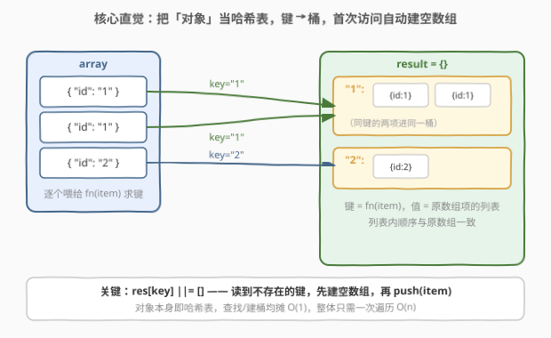
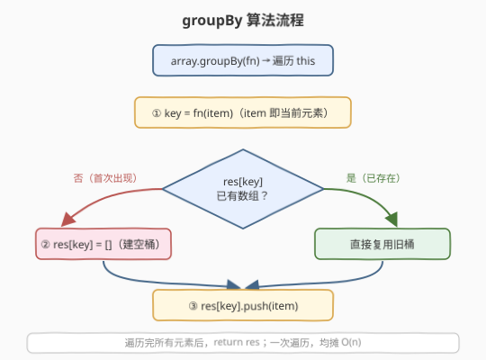

# LeetCode 分组 题解

## 1. 题目概述

- **标题 / 题号**：分组（#2631，medium）
- **链接**：https://leetcode.cn/problems/group-by/
- **难度**：中等
- **标签**：数组、哈希表、原型扩展、函数式编程

**题意**：请你编写一段可应用于所有数组的代码，使任何数组调用 `array.groupBy(fn)` 方法时，它返回对该数组**分组后**的结果。

数组**分组**是一个对象（`Object`），其中的每个键都是 `fn(arr[i])` 的输出的一个数组，该数组中含有原数组中具有该键的所有项。提供的回调函数 `fn` 将接受数组中的项并返回一个**字符串**类型的键。每个值列表的顺序应该与元素在数组中出现的顺序相同。请**不使用 lodash 的 `_.groupBy`**。

**示例 1**：

```text
输入：
array = [
  {"id":"1"},
  {"id":"1"},
  {"id":"2"}
],
fn = function (item) {
  return item.id;
}
输出：
{
  "1": [{"id": "1"}, {"id": "1"}],
  "2": [{"id": "2"}]
}
解释：分组方法是从每个项中取 "id"。两个 id=1 的对象放进第一个数组，一个 id=2 的放进第二个数组。
```

**示例 2**：

```text
输入：
array = [
  [1, 2, 3],
  [1, 3, 5],
  [1, 5, 9]
]
fn = function (list) {
  return String(list[0]);
}
输出：
{
  "1": [[1, 2, 3], [1, 3, 5], [1, 5, 9]]
}
解释：键取每个子数组的第一个元素（统一转字符串），三者首元素均为 1，故合并为一组。
```

**示例 3**：

```text
输入：
array = [1, 2, 3, 4, 5, 6, 7, 8, 9, 10]
fn = function (n) {
  return String(n > 5);
}
输出：
{
  "true": [6, 7, 8, 9, 10],
  "false": [1, 2, 3, 4, 5]
}
解释：按是否大于 5 切分，n>5 为 true 否则为 false，键统一字符串化。
```

**约束**：

- `0 <= array.length <= 10^5`
- `fn` 返回一个字符串

> 💡 本题考查的不是复杂算法，而是**把「对象」当哈希表用**这一基本套路，以及**扩展内置原型（`Array.prototype`）**的写法与代价。官方以 JavaScript 为载体，下文给出 C++ 与 Python 的等价实现，三种语言都依赖「哈希表首访自动建空桶」这一共性。

## 2. 解题思路

### 2.1 暴力思路：并行数组 + 线性扫描

最直白的「不靠哈希」写法：维护两个并行数组 `keys[]` 与 `groups[][]`，对每个元素算出 `key` 后，在 `keys` 里**线性扫描**找它是否已出现——找到就把元素塞进对应 `groups[i]`，没找到就 `keys.push(key)`、`groups.push([item])` 新开一组。

```text
keys = [], groups = []
for item in array:
    key = fn(item)
    i = keys.indexOf(key)        # 线性扫描
    if i == -1:
        keys.push(key); groups.push([item])
    else:
        groups[i].push(item)
```

问题：`indexOf` 每次都要从头扫一遍，若共有 $m$ 个不同键，最坏 $O(n\cdot m)$；当所有键互异时退化到 $O(n^2)$，`n = 10^5` 直接超时。而且这种「键列表 + 桶列表」双数组维护啰嗦、易错。

### 2.2 核心观察：对象当哈希表，首访自动建空桶



关键一步：用一个普通对象 `{}`（或 `Map`）当哈希表，`key` 作属性名直接索引。这样「查找」从线性扫描降为均摊 $O(1)$，整题变回**一次遍历 $O(n)$**。

更妙的是，多数语言的哈希表访问语义都自带「**键不存在则先建空容器**」：

| 语言 | 取/建桶惯用法 | 失败时默认建空容器？ |
|------|--------------|----------------------|
| JS | `res[key] \|\|= []` 后 `.push(item)` | `a[k]` 读不存在键得 `undefined`，配合 `\|\|=` 即建空数组 |
| Python | `defaultdict(list)`，直接 `.append` | `defaultdict` 首访自动调工厂建空 `list` |
| C++ | `res[key].push_back(item)` | `unordered_map::operator[]` 插入时**值初始化**空 `vector` |

三者异曲同工地把「判存在 + 建空桶 + push」压缩成一行——**不需要显式 `if` 判断**。本题再把它封装进 `Array.prototype.groupBy`，让任意数组都能 `.groupBy(fn)` 调用，这正是「扩展内置原型」的典型用法。

> 💡 **为什么键一定是字符串？** JS 对象的属性名会被强制转成字符串（`fn` 题面也要求返回字符串）。若用 `Map` 则键保留原类型、无需字符串化，对应 ES2024 新增的 `Map.groupBy`（见第 5 节）。

> ⚠️ **扩展原型的代价**：往 `Array.prototype` 上挂方法会影响**所有**数组实例，且可能与未来标准方法或第三方库撞名（一旦 `Array.prototype.groupBy` 已存在，重写会静默覆盖）。生产代码里更推荐写成独立函数 `groupBy(arr, fn)`，仅在本题这类「题面要求挂原型」的场景才这么做。

### 2.3 算法流程图



整体三段循环体：

1. **取键**：`key = fn(item)`；
2. **取/建桶**：`res[key]` 不存在则先 `= []`（`\|\|=` / `operator[]` / `defaultdict` 各自隐式完成）；
3. **入桶**：`res[key].push(item)`，因遍历顺序即入桶顺序，**天然保序**。

遍历结束 `return res`。一次遍历、均摊 $O(n)$、额外 $O(n)$ 存结果。

### 2.4 示例演算

![示例演算：[{id:1},{id:1},{id:2}] 三步分组](../images/groupby_example_walkthrough.svg)

以示例 1 为例：

| 步 | 当前 item | key | result 状态 |
|----|-----------|-----|------------|
| 1 | `{id:"1"}` | `"1"` | `{"1": [ {id:1} ]}` ← 建空桶再 push |
| 2 | `{id:"1"}` | `"1"` | `{"1": [ {id:1}, {id:1} ]}` ← 复用旧桶 push |
| 3 | `{id:"2"}` | `"2"` | `{"1": [...], "2": [ {id:2} ]}` ← 新键建桶 |

最终 `{ "1": [ {id:1}, {id:1} ], "2": [ {id:2} ] }`。注意 `fn` 只决定「键怎么取」，**桶内顺序由遍历顺序决定**，所以严格按数组顺序遍历即可保序，无需排序或去重。

## 3. 参考代码

### C++

```cpp
#include <vector>
#include <string>
#include <unordered_map>
#include <functional>

// 等价实现：自由函数版 groupBy（C++ 无 Array.prototype，故以函数模板呈现）
template <typename T, typename KeyFn>
std::unordered_map<std::string, std::vector<T>> groupBy(const std::vector<T>& arr, KeyFn fn) {
    std::unordered_map<std::string, std::vector<T>> res;
    for (const auto& item : arr) {
        res[fn(item)].push_back(item);   // operator[]：键不存在则值初始化空 vector
    }
    return res;
}
```

> 💡 **`operator[]` 的隐藏行为**：`unordered_map::operator[]` 在键缺失时会**插入并值初始化**一个默认构造的 `std::vector<T>`（即空 vector），随后返回其引用。因此 `res[fn(item)].push_back(item)` 一行即完成「判存在 + 建空桶 + 入桶」，无需 `if (res.find(key) == res.end())` 显式判空——与 JS 的 `||=`、Python 的 `defaultdict` 完全对称。

### Python

```python
from collections import defaultdict
from typing import Callable, TypeVar

T = TypeVar("T")

# 等价实现：自由函数版 group_by
def group_by(arr: list[T], fn: Callable[[T], str]) -> dict[str, list[T]]:
    res: dict[str, list[T]] = defaultdict(list)
    for item in arr:
        res[fn(item)].append(item)   # defaultdict：首访自动调 list() 建空桶
    return dict(res)
```

> ⚠️ **勿用 `itertools.groupby`**：标准库里的 `itertools.groupby` 要求输入**已按 key 排序**（相邻同键才合并），否则会把同一键拆成多段。本题主数组无序，直接用 `defaultdict` 最稳；若坚持用 `groupby`，必须先 `sorted(arr, key=fn)`，多一次 $O(n\log n)$ 排序且会**破坏原顺序**。

> 💡 **额外附 JavaScript 原版**（题目官方语言，便于对照）：
> ```javascript
> /**
>  * @param {Function} fn
>  * @return {Object}
>  */
> Array.prototype.groupBy = function (fn) {
>     return this.reduce((acc, item) => {
>         const key = fn(item);
>         (acc[key] ||= []).push(item);   // ||=：左值为 falsy（undefined）才赋 []
>         return acc;
>     }, {});
> };
>
> // 不用 reduce 的等价 for-of 写法：
> Array.prototype.groupBy = function (fn) {
>     const res = {};
>     for (const item of this) {
>         const key = fn(item);
>         (res[key] ||= []).push(item);
>     }
>     return res;
> };
> ```

## 4. 复杂度分析

| 维度 | 复杂度 | 说明 |
|------|--------|------|
| 时间复杂度 | $O(n)$ | 一次遍历，每次 `fn(item)` $O(1)$（题意）、哈希表访问均摊 $O(1)$ |
| 空间复杂度 | $O(n)$ | 结果对象存下全部 $n$ 个元素（仅引用，不复制内容本身） |

> 💡 均摊而非最坏 $O(1)$：哈希表偶发 rehash / 冲突时会稍慢，但 $n$ 次插入的总成本仍线性。最坏退化到 $O(n^2)$ 仅在极端构造哈希冲突时发生，本题键由 `fn` 产出、不构成攻击面，可视为 $O(n)$。

## 5. 扩展：原生 `Object.groupBy` 与 `Map.groupBy`（ES2024）

ES2024 已把「按函数分键」标准化为两个**静态方法**，无需再手写：

```javascript
// 返回「使用 null 原型」的对象，键统一字符串
Object.groupBy(array, fn);     // fn(item) => string | symbol

// 返回 Map，键保留原类型（数字就还是数字）
Map.groupBy(array, fn);
```

- `Object.groupBy` 的结果原型为 `null`，故**没有** `toString`/`hasOwnProperty` 等被键名「撞车」污染的风险（普通 `{}` 上若 `fn` 返回 `"toString"` 会覆盖原型方法）。
- `Map.groupBy` 适合键非字符串的场景（如按数字、对象引用分组），避免 `1` 与 `"1"` 被对象合并成同一键。

> ⚠️ **`toString` 陷阱**：用普通 `{}` 当结果时，若 `fn` 可能返回 `"toString"`、`"constructor"` 等原型属性名，会覆盖掉对象自带方法，后续 `.toString()` 失效。规避：用 `Object.create(null)` 建无原型对象，或直接用 `Map`。这也正是 `Object.groupBy` 默认返回 null 原型的原因。

此外本题的 `||=`（ES2021 逻辑或赋值）等价于 `acc[key] || (acc[key] = [])`，而 `?.`、`??=` 不可用于此处：`undefined ?? []` 虽得 `[]`，但 `??=` 只在 `null/undefined` 时赋值——本场景 `acc[key]` 首访确为 `undefined`，故 `??=` 与 `||=` 在此等价；唯独当桶可能是 `0`/`""` 等 falsy 合法值时才需 `??=` 区分，但此处的桶恒为数组，故 `||=` 足够。

## 6. 面试要点

1. **为什么用对象当哈希表就能从 $O(n^2)$ 降到 $O(n)$？**

   > 暴力并行数组的 `indexOf` 每次 $O(m)$ 线性扫描键列表；用对象属性作索引后，键查找变成均摊 $O(1)$ 的哈希查询，$n$ 个元素总共 $O(n)$。

2. **`res[key] ||= []` 这行到底干了什么？为什么不用显式 `if`？**

   > `||=` 是「逻辑或赋值」：左值 `res[key]` 为 falsy（首次访问得 `undefined`）时才把 `[]` 赋给它，无论新建还是复用，表达式的值都是那个数组，紧接着 `.push(item)`。它把「判存在 + 建空桶 + 入桶」三步压成一行，等价于 `if (!res[key]) res[key] = []; res[key].push(item)`。

3. **扩展 `Array.prototype` 有哪些风险？生产代码里该怎么写？**

   > 挂在原型上会影响**所有**数组实例，且可能覆盖未来标准方法或第三方库同名方法（静默覆盖、难排查）。生产中更推荐独立函数 `groupBy(arr, fn)`，或直接用 ES2024 原生 `Object.groupBy`；只在题面强制「挂原型」时才这么做，并注意 `toString` 等键名污染原型方法的问题。

4. **JS 对象作结果，为什么键会被强制成字符串？有什么坑？**

   > JS 普通对象的属性名只能是 `string` 或 `symbol`，传数字 `1` 会被转成 `"1"`，导致 `1` 与 `"1"` 撞键。此外若 `fn` 返回 `"toString"`、`"constructor"` 等会覆盖原型方法。规避：用 `Object.create(null)` 或 `Map`，或直接用 `Map.groupBy`（键保留原类型）。

5. **`itertools.groupby` 能直接用来解这道题吗？**

   > 不能直接用。`itertools.groupby` 只合并**相邻**同键元素，要求输入已按 key 排序。本题数组无序，必须先 `sorted(arr, key=fn)`，会多 $O(n\log n)$ 且破坏原顺序；而 `defaultdict(list)` 一次遍历保序 $O(n)$，是 Python 下的标准写法。

## 同类练习题

| # | 题目 | 与本题的关联 |
|---|------|-------------|
| 49 | [字母异位词分组](https://leetcode.cn/problems/group-anagrams/) | 分组思想的本体题——把每个串的「字母计数/排序串」当键，哈希表聚合同键，正是 `groupBy` 的经典应用 |
| 1282 | [用户分组](https://leetcode.cn/problems/group-the-people-given-the-group-size-they-belong-to/) | 按 `groupSizes[i]` 作键 `groupBy`，再把大组按容量切分，巩固「键→桶」聚拢 |
| 2634 | [过滤数组中的元素](https://leetcode.cn/problems/filter-elements-from-array/) | 同属 30 Days of JS 系列，实现 `Array.prototype.filter`，与 `groupBy` 都是「在原型上挂一个遍历型方法」，可对照 `this` 指向与回调签名 |
| 2626 | [数组归约运算](https://leetcode.cn/problems/array-reduce-transformation/) | 同系列实现 `Array.prototype.reduce`，`groupBy` 的 `reduce` 写法正是以它为底，对照「累加器初值 + 回调返回下一个累加器」 |
| 884 | [两句话中的不常见单词](https://leetcode.cn/problems/uncommon-words-from-two-sentences/) | 用哈希表按「单词→出现次数」分组再筛只出现一次的，是 groupBy + 计数过滤的组合应用 |
