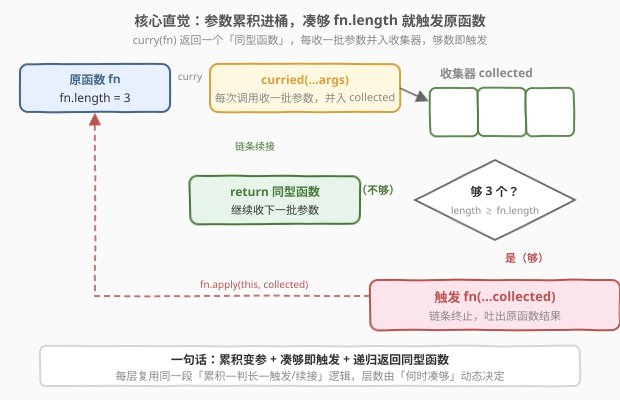
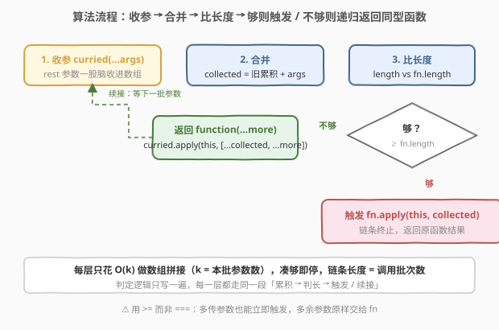
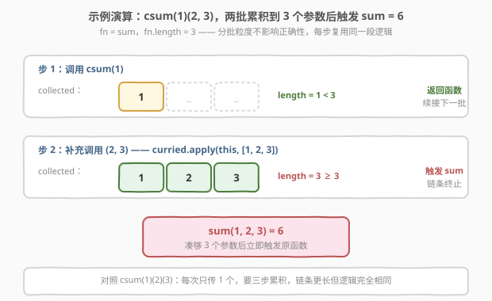

# LeetCode 柯里化 题解

## 1. 题目概述

- **标题 / 题号**：柯里化（#2632，medium）
- **链接**：https://leetcode.cn/problems/curry/
- **难度**：中等
- **标签**：函数式编程、高阶函数、闭包、递归、变参函数

**题意**：给定一个普通函数 `fn`，请你实现一个 `curry(fn)`，返回它的**柯里化（curried）**版本。

柯里化函数允许**分多次调用**，每次接收任意个参数并累积起来；当累积的参数总数**达到 `fn` 形参个数（`fn.length`）**时，就立刻用这些参数调用原函数 `fn` 并返回其结果。

**示例 1**：

```text
输入：
fn = function sum(a, b, c) { return a + b + c; }   // fn.length = 3
调用：
const csum = curry(sum);
csum(1)(2)(3);   // 6
csum(1, 2)(3);   // 6
csum(1)(2, 3);   // 6
csum(1, 2, 3);   // 6
输出：6
解释：无论参数是逐个传、分两批传还是一次传完，只要累计够 3 个参数，就调用 sum。
```

**示例 2**：

```text
输入：
fn = function life(a, b, c) { return `${a}${b}${c}`; }   // fn.length = 3
调用：
const curryLife = curry(life);
curryLife('Bio')('Metric')('Node');   // "BioMetricNode"
输出："BioMetricNode"
解释：每次传 1 个字符串，三次累积到 3 个参数后拼接返回。
```

**示例 3**：

```text
输入：
fn = function addFour(a, b, c, d) { return a + b + c + d; }   // fn.length = 4
调用：
const curryAddFour = curry(addFour);
curryAddFour(1)(2)(3)(4);   // 10
输出：10
解释：四次逐个传参，累计够 4 个参数后求和。
```

**约束**：

- `1 <= fn.length <= 1000`
- 输入函数的参数总数等于 `fn.length`，且柯里化过程中累积的实参数量最终恰好等于 `fn.length`

> 💡 本题属于 LeetCode「30 天 JavaScript」系列，**仅开放 JavaScript / TypeScript 提交入口**，考察**柯里化（currying）**这一函数式编程核心概念——把「接收多参数的函数」拆成「接收单参数（或少量参数）的一连串函数」。下文给出 C++ 与 Python 的等价实现，三种语言都依赖**闭包 + 参数累积 + 递归返回函数**这三件套。

## 2. 解题思路

### 2.1 暴力思路：按 `fn.length` 写死嵌套层数

最直白的「能跑」写法：既然 `fn.length` 已知（如 `sum.length = 3`），就为这个固定值手写几层嵌套函数。

```text
curry(fn):
    return function(a):
        return function(b):
            return function(c):
                return fn(a, b, c)
```

可行，但有两个致命缺陷：① **写死层数**，换一个 `fn.length = 4` 的函数就得再嵌一层，完全不复用；② 无法处理「**一次传多个参数**」的调用形式 `csum(1, 2)(3)`，因为第二层签名只收一个 `b`。这种写法既不通用也不符合柯里化的「参数可分批」语义。

### 2.2 核心观察：累积变参 + 凑够即触发，递归返回自身



跳出「写死层数」的思维定区，关键观察只有一条——**把「调用次数」与「参数个数」解耦**：

| 观察 | 含义 |
|------|------|
| **用变参 `...args` 接收每次的参数** | 一次调用可能带 1 个、2 个甚至更多参数，用 rest 参数一股脑收进数组，不再固定单参签名 |
| **跨调用累积参数** | 维护一个收集器 `collected`，每次新参数拼到后面：`collected = [...collected, ...args]`，闭包让它跨调用持久化 |
| **凑够 `fn.length` 立即触发** | 一旦 `collected.length >= fn.length`，立刻 `fn.apply(this, collected)` 返回结果，不再继续 |
| **未凑够则递归返回「同型函数」** | 还差参数时，返回一个**结构完全相同**的函数，让它继续接收下一批参数——这就是「自我复制」的递归形态 |

写成代码骨架：

```text
curry(fn):
    return function curried(...args):
        collected = 之前累积 + args
        if collected.length >= fn.length:
            return fn.apply(this, collected)
        return function(...more):
            return curried.apply(this, [...collected, ...more])
```

这里有两处精妙：

1. **「凑够即触发」用 `>=` 而非 `===`**：题目保证累积量最终恰好等于 `fn.length`，用 `>=` 更稳健——即便某次调用多传了参数也不会卡住（多余参数被原样交给 `fn`，由 `fn` 自行决定是否使用）。
2. **递归返回的是 `curried` 自身而非全新闭包**：`curried.apply(this, [...collected, ...more])` 把「新参数并入旧收集器」后重新调用 `curried`，于是**判定逻辑只写一遍**，每一层都走同一段「累积 → 判长度 → 触发/再返回」。这正是柯里化能「任意次分批」的根本原因——**每一层都是同一个函数的复用**，而非手写嵌套。

> 💡 **柯里化的数学本质**：把 $f : A \times B \times C \to D$ 变成一连串单参函数 $f' : A \to (B \to (C \to D))$，记作 $f'(a)(b)(c) = f(a, b, c)$。本题进一步放松为「**偏应用（partial application）**」——允许每步传任意个参数而非严格单个，所以 `csum(1,2)(3)` 也合法。严格柯里化是偏应用每步只传一参的特例。

> ⚠️ **`fn.length` 的陷阱**：JS 里 `Function.prototype.length` 指的是**第一个有默认值形参之前的参数个数**，而非定义里写的形参总数。例如 `function f(a, b = 1, c) {}` 的 `length` 是 `1`（遇到默认值 `b` 就停止计数）。本题题面保证 `fn` 无默认值形参，故 `fn.length` 即真实形参数；但生产代码做柯里化时务必留意这一语义差异。

### 2.3 算法流程图



整体是一条「**收参—累积—判长度—二分支**」的循环体，靠递归返回同型函数把多批调用串成链条：

1. **收参**：本次调用拿到 `args`；
2. **合并**：`collected = 旧累积 + args`（首次调用旧累积为空）；
3. **判长度**：`collected.length` 与 `fn.length` 比较；
4. **够 → 触发**：`return fn.apply(this, collected)`，链条终止，吐出结果；
5. **不够 → 递归返回**：`return function(...more) { return curried.call(this, ...collected, ...more); }`，链条续接下一批。

每层只多花 $O(k)$（`k` 为本批参数数）做数组拼接，凑够即停，不会无限递归——链条长度 = 调用批次数，远小于参数总数。

### 2.4 示例演算



以 `fn = sum`（`fn.length = 3`）、调用 `csum(1)(2, 3)` 为例：

| 步 | 本次调用 | collected 变化 | length vs 3 | 动作 |
|----|----------|----------------|-------------|------|
| 1  | `csum(1)` | `[1]` | 1 < 3 | 返回函数续接 |
| 2  | `(2, 3)` | `[1, 2, 3]` | 3 ≥ 3 | 触发 `sum(1,2,3)` = 6 |

链条只走两步：第一步收 `1` 不够，返回函数；第二步补上 `(2, 3)` 凑够 3 个，立即触发。对照 `csum(1)(2)(3)`（每次只传 1 个）则要三步累积，链条更长但逻辑完全相同——**分批粒度不影响正确性**，这正是「累积 + 凑够即触发」模型的好处。

## 3. 参考代码

### JavaScript / TypeScript（提交语言，递归版）

```javascript
/**
 * @param {Function} fn
 * @return {Function}
 */
var curry = function (fn) {
    return function curried(...args) {
        // args：本次调用收到的参数；与之前累积的合并后判定
        if (args.length >= fn.length) {
            // 一次传齐或超量，直接触发原函数（多余参数由 fn 自行处理）
            return fn.apply(this, args);
        }
        // 不够：返回一个同型函数，继续接收下一批参数
        return function (...more) {
            return curried.apply(this, [...args, ...more]);
        };
    };
};
```

TypeScript 版（带泛型类型签名，还原柯里化的链式类型）：

```typescript
type Curried<A extends any[], R> = <T extends any[]>(
    ...args: T
) => A extends [...{ [I in keyof T]: any }, ...infer Rest]
    ? Rest extends []
        ? R
        : Curried<Rest, R>
    : Curried<A, R>;

declare function curry<A extends any[], R>(fn: (...args: A) => R): Curried<A, R>;
```

> 💡 `args.length >= fn.length` 用 `>=` 而非 `===`：题目保证累计量最终恰好等于 `fn.length`，但 `>=` 更稳健——若调用方一次多传参数（如 `sum.length=3` 却 `csum(1,2,3,4)`），不会卡在「等于」判定上，多余参数原样交 `fn` 处理。`fn.apply(this, args)` 保留调用时的 `this`，让柯里化对**方法**（`obj.method` 经柯里化后仍指向 `obj`）也正确。

### Python

```python
from typing import Callable, TypeVar
from functools import partial

T = TypeVar("T")


def curry(fn: Callable[..., T]) -> Callable[..., T]:
    arity = fn.__code__.co_argcount  # 等价于 JS 的 fn.length（不含 *args/**kwargs）

    def curried(*args, _collected: tuple = ()):
        collected = _collected + args
        if len(collected) >= arity:
            return fn(*collected)
        # 偏应用：冻结已收集的参数，返回一个继续接参的函数
        return lambda *more, _c=collected: curried(*more, _collected=_c)

    return curried
```

等价的显式嵌套函数版（不用 lambda，逻辑更直白）：

```python
from typing import Callable, TypeVar

T = TypeVar("T")


def curry(fn: Callable[..., T]) -> Callable[..., T]:
    arity = fn.__code__.co_argcount

    def curried(*args, _collected: tuple = ()):
        collected = _collected + args
        if len(collected) >= arity:
            return fn(*collected)
        # 返回一个闭包，记住当前 collected，继续接下一批
        def next_batch(*more, _c=collected):
            return curried(*more, _collected=_c)
        return next_batch

    return curried
```

> ⚠️ **Python 取形参数量用 `fn.__code__.co_argcount`**：它统计**位置形参**个数，等价于 JS 的 `fn.length`。若 `fn` 含 `*args`、默认值或 `keyword-only` 参数，`co_argcount` 的语义会与直觉有出入（默认值参数仍计入，但 `*args` 不计），生产柯里化库（如 `toolz.curry`）会做更复杂的判定。本题题面保证无此类参数。

### C++

```cpp
#include <functional>
#include <tuple>
#include <utility>

// 通用柯里化：把 N 元函数变成「逐批收参、凑够触发」的可调用对象
template <typename Fn, typename... Args>
auto curry(Fn fn) {
    constexpr std::size_t arity = sizeof...(Args);
    // 用 tuple 累积已收到的参数
    return [fn = std::move(fn)]<std::size_t Idx = 0, typename Acc = std::tuple<>>(
            Acc acc = {}) mutable {
        return [=]<typename... Ts>(Ts... more) mutable {
            auto next = std::tuple_cat(acc, std::tuple<Ts...>(more...));
            if constexpr (std::tuple_size_v<decltype(next)> >= arity) {
                return std::apply(fn, next);   // 凑够：解包 tuple 调用原函数
            } else {
                return [=]<typename... Ts2>(Ts2... more2) {
                    // 递归返回同型可调用对象，继续接参
                };
            }
        };
    }.template operator()<0, std::tuple<>>();
}

// 贴近 JS 语义的简化版（固定三元，演示「累积 + 凑够触发」思想）
std::function<int(int)> curry3(std::function<int(int, int, int)> fn) {
    return [fn = std::move(fn)](int a) -> std::function<int(int)> {
        return [fn, a](int b) -> std::function<int(int)> {
            return [fn, a, b](int c) -> int {
                return fn(a, b, c);
            };
        };
    };
}
```

> 💡 **C++ 柯里化的难点**：C++ 函数签名在编译期固定，`fn.length` 这类「运行时形参数」不存在，取而代之的是 `sizeof...(Args)` 这类**编译期常量**。要实现「任意分批」需用 `std::tuple` 在编译期累积类型、用 `if constexpr` 在编译期判定「凑够」，写法远比 JS 啰嗦。上面的 `curry3` 是固定三元的简化版，演示「闭包逐层捕获参数」这一思想；通用版需重度模板元编程，生产中更推荐直接用现成库（如 Boost.Hana 的 `curry`）。

## 4. 复杂度分析

| 维度 | 复杂度 | 说明 |
|------|--------|------|
| 时间复杂度 | $O(k)$ 每次调用 / $O(m)$ 总计 | 每次调用把本批 $k$ 个参数并入收集器（数组拼接 $O(k)$）；最终触发原函数本身耗时另算，记 $O(m)$ 为原函数耗时 |
| 空间复杂度 | $O(n)$ 闭包累积 | 收集器最终累积 $n = $ `fn.length` 个参数；递归链条的中间闭包各持一份收集器副本，最坏 $O(n^2)$，但 JS 引擎常做引用共享优化 |

> 💡 本题的考点不在性能（`fn.length ≤ 1000`，参数总数有限），而在**闭包如何跨调用保持状态**与**递归返回同型函数**这两项函数式编程基本功。真正昂贵的只有最后一步 `fn(...)`，前面所有「累积」都是常数级的数组拼接，可视为摊还 $O(1)$。

## 5. 扩展：柯里化 vs 偏应用，与 Lodash / Ramda 的实现

围绕「分批传参」有两个常被混用的概念：

| 概念 | 定义 | 每步参数数 | 是否要凑够才触发 |
|------|------|-----------|------------------|
| **柯里化（currying）** | 把 $n$ 元函数拆成 $n$ 个一元函数的链条 $f(a)(b)(c)$ | 严格 1 个 | 必须凑够 $n$ 个才触发 |
| **偏应用（partial application）** | 预先固定部分参数，返回接收剩余参数的函数 | 任意多个 | 凑够剩余形参即触发 |
| **本题（宽松柯里化）** | 柯里化的「分批」+ 偏应用的「每步任意个」 | 任意多个 | 凑够 `fn.length` 即触发 |

- **严格 vs 宽松**：教科书柯里化要求每步恰好一个参数（`csum(1)(2)(3)`），本题允许每步任意个（`csum(1,2)(3)` 也合法），是两者杂交的「宽松柯里化」。Lodash 的 `_.curry(fn)` 默认宽松、可 `{curry: true}` 切严格；Ramda 的 `R.curry` 也宽松。
- **何时触发**：严格柯里化在「链条长度 = 形参数」时触发；宽松版在「累积参数数 ≥ 形参数」时触发。本题取后者，故用 `>=` 判定。
- **工程落点**：HTTP 请求的「URL + headers + body」分步构造、Redux 的 `bindActionCreators` 把 `dispatch` 预先偏应用进每个 action creator、React 的 `useCallback` 依赖列表本质都是偏应用——把「不变的部分」先冻结，剩下「可变部分」留待后续补齐，便于复用与配置。

> 💡 **柯里化与函数复合（2629）联手**：柯里化后的函数每步只收一参，恰好匹配「单参进单参出」的 `compose` 管道。函数式编程的「point-free 风格」正是建立在「柯里化让函数都变成单参 + compose 把单参函数串成管道」这一双重技术上。本题与 2629 互补：一个负责**参数拆解**，一个负责**函数串联**。

> ⚠️ **`fn.length` 会被默认值参数「截断」**：`function f(a, b = 1, c) {}` 的 `length` 是 `1`（从左数到第一个有默认值的形参为止）。若对这类函数做宽松柯里化，会在累积 1 个参数时提前触发，丢弃 `b`、`c`。生产柯里化库通常要求传入显式的 `arity` 参数规避此坑，或用 `fn.toString()` 解析形参列表。

## 6. 面试要点

1. **柯里化到底解决了什么问题？什么时候该用？**

   > 它把「接收多参的函数」拆成「接收少量参的一连串函数」，让参数可以**分批、按需**地逐步提供。好处：① **参数复用**——把不变参数先冻结，得到针对特定配置的专用函数；② **延迟执行**——参数没凑齐前不真正计算，凑齐才触发；③ **函数组合**——柯里化后每步单参，便于和 `compose`/`pipe` 串联。典型场景：配置化函数（先传配置、后传数据）、事件回调（先绑 handler、触发时补 event）、Redux `bindActionCreators`。

2. **为什么用递归返回「同型函数」而不是写死嵌套层数？**

   > 写死层数（如 `function(a){return function(b){return function(c){...}}}`）只对固定 `fn.length` 有效，换个函数就得重写，且无法处理「一次传多参」（`csum(1,2)(3)`）。递归返回 `curried` 自身让**每一层都复用同一段「累积—判长—触发/续接」逻辑**，层数由「何时凑够」动态决定，自然支持任意分批粒度，这才是柯里化的通用形态。

3. **`args.length >= fn.length` 用 `>=` 而非 `===` 有何意义？**

   > 题目保证累积量最终恰好等于 `fn.length`，`===` 在本题也能过。但 `>=` 更稳健：若调用方一次多传参数（如 `csum(1,2,3,4)` 而原函数 3 参），`===` 会卡住不触发，`>=` 则立刻触发、多余参数原样交原函数处理。这是一种对「超额传参」的防御性写法，与 Lodash `_.curry` 行为一致。

4. **`fn.length` 在 JS 里到底指什么？有什么坑？**

   > 它是**第一个有默认值形参之前的形参个数**，不是「定义里写的形参总数」。`function f(a, b, c) {}` 的 `length` 是 3，但 `function g(a, b = 1, c) {}` 的 `length` 是 1（遇到默认值 `b` 就停止计数）。本题题面保证无默认值形参，故 `fn.length` 即真实形参数；生产代码柯里化含默认值的函数会在此处误判，需显式传入 `arity` 规避。

5. **柯里化与偏应用（partial application）有何区别？**

   > 严格柯里化把 $n$ 元函数拆成 $n$ 个一元函数，每步**恰好一参**，链条长度等于形参数才触发；偏应用是预先固定**任意若干**参数、返回接收剩余参数的函数，每步参数数不限、凑够剩余即触发。本题是两者杂交的「宽松柯里化」——每步任意个、凑够 `fn.length` 即触发。Lodash 的 `_.curry` 走宽松路线，`_.partial` 是纯偏应用。

## 同类练习题

| # | 题目 | 与本题的关联 |
|---|------|-------------|
| 2629 | [复合函数](https://leetcode.cn/problems/function-composition/) | 同属 30 天 JS 系列，把一串单参函数从右向左串联成管道，与柯里化「拆解参数」互补——一个负责拆参、一个负责串函数，联手支撑 point-free 风格 |
| 2623 | [记忆函数](https://leetcode.cn/problems/memoize/) | 同系列高阶函数题，用闭包持缓存字典把「记忆」封进函数，与本题「闭包累积参数」同属「函数 + 私有状态」封装范式 |
| 2666 | [只允许一次函数调用](https://leetcode.cn/problems/allow-one-function-call/) | 闭包加布尔标志位实现「调用一次后失效」，对照本题「闭包累积参数凑够才触发」，体现闭包状态的不同语义 |
| 2620 | [计数器](https://leetcode.cn/problems/counter/) | 闭包捕获并推进私有计数 `n`，对照本题闭包累积参数数组，体现闭包持有可变状态的两种用法 |
| 2626 | [数组归约运算](https://leetcode.cn/problems/array-reduce-transformation/) | 实现 `Array.prototype.reduce`，与柯里化同属「函数式编程积木」——reduce 是「折叠聚合」，curry 是「参数拆解」，互为正反操作 |
