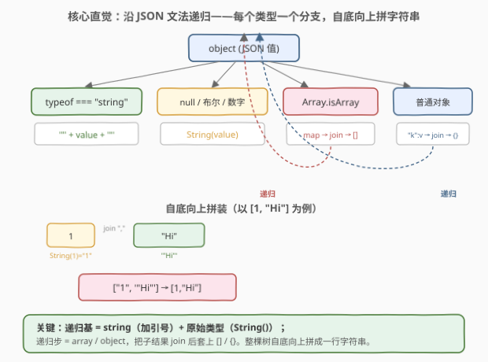
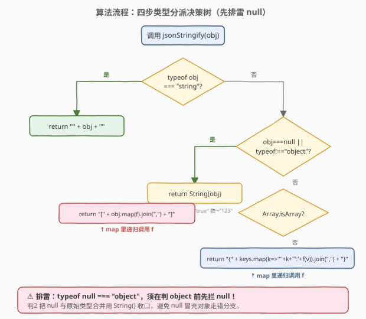
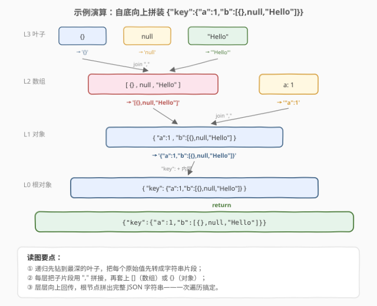

# 将对象转换为 JSON 字符串

- **题目名称**：将对象转换为 JSON 字符串
- **链接**：[2633. 将对象转换为 JSON 字符串](https://leetcode.cn/problems/convert-object-to-json-string/)
- **难度**：中等
- **标签**：递归、JSON、类型分派、字符串

## 1. 题目概述

给定一个 **JSON 值** `object`，将其转换为 JSON 字符串。**不能**使用语言内置的 `JSON.stringify` 方法，需要手动实现序列化逻辑。

`object` 可以是以下任一类型：

| 类型 | 示例值 | 期望输出 |
|------|--------|----------|
| `null` | `null` | `"null"` |
| 布尔 | `true` / `false` | `"true"` / `"false"` |
| 数字 | `-12`、`1` | `"-12"`、`"1"` |
| 字符串 | `"Hello"` | `'"Hello"'` |
| 数组 | `[1, "Hi"]` | `'[1,"Hi"]'` |
| 对象 | `{"y":1,"x":2}` | `'{"y":1,"x":2}'` |

数组的元素和对象的值同样都是 JSON 值（即可嵌套），因此序列化天然是**递归**的。

**示例 1**：

```text
输入：object = {"y":1,"x":2}
输出：'{"y":1,"x":2}'
解释：对象有两个键 y、x，值分别为 1、2，拼成 "y":1,"x":2 后套上花括号。
```

**示例 2**：

```text
输入：object = {"a":"str","b":-12,"c":true,"d":null}
输出：'{"a":"str","b":-12,"c":true,"d":null}'
解释：四种原始类型同处一个对象中，各自按规则序列化后用逗号拼接。
```

**示例 3**：

```text
输入：object = {"key":{"a":1,"b":[{},null,"Hello"]}}
输出：'{"key":{"a":1,"b":[{},null,"Hello"]}}'
解释：嵌套结构——对象内套对象、对象内套数组、数组内再套空对象。
```

**示例 4**：

```text
输入：object = true
输出：'true'
解释：单个布尔值，直接用 String() 转换。
```

**约束条件**：

- `object` 是合法的 JSON 值（不含 `undefined`、函数、Symbol、`NaN` / `Infinity`、循环引用）；
- 对象的键名与字符串值由可打印 ASCII 字符组成（不含 `"`、`\` 与控制字符，故无需转义）；
- 所有层级的键 / 元素总数不超过 $10^5$（保证递归栈深度可控）。

> 💡 本题是 LeetCode「30 天 JavaScript」系列题目，**仅提供 JavaScript / TypeScript 提交入口**，核心考察**递归 + 类型分派**。它与 [2628. 完全相等的 JSON 对象](2628_完全相等的JSON对象.md) 是一对姊妹题：2628 沿 JSON 文法**递归比对**两棵树，2633 沿 JSON 文法**递归序列化**一棵树——同一套类型分派骨架，换个动作（比较 vs 拼字符串）。本文以 JS 为提交语言，并给出 Python 概念等价实现。

---

## 2. 解题思路

### 2.1 暴力思路：直接用 `JSON.stringify`

最省事的写法当然是一行 `return JSON.stringify(object)`。但题目**明确禁止**使用内置 `JSON.stringify`，要求你手写序列化逻辑。这逼我们直面一个根本问题：**如何把一棵任意嵌套的 JSON 树压成一行字符串？**

### 2.2 核心观察：递归 + 类型分派



JSON 值的文法本身就是**递归**的——数组和对象的"元素 / 值"又是 JSON 值。于是序列化天然沿文法递归：先钻到最深的叶子（原始类型），把每个叶子转成字符串片段，再逐层向上拼接。

按类型分四条分支：

| 分支 | 判定条件 | 动作 | 递归？ |
|------|----------|------|--------|
| **字符串** | `typeof obj === "string"` | 两端加双引号：`'"' + obj + '"'` | 否（递归基） |
| **原始类型** | `null` / 布尔 / 数字 | `String(obj)` 一把梭 | 否（递归基） |
| **数组** | `Array.isArray(obj)` | 每个元素递归 → `join(",")` → 套 `[]` | 是 |
| **对象** | 其余（`typeof === "object"`） | 每个键值递归 → `"k":v` → `join(",")` → 套 `{}` | 是 |

> 💡 **为什么原始类型直接 `String(obj)` 就够？** `String(null)` 得 `"null"`、`String(true)` 得 `"true"`、`String(-12)` 得 `"-12"`——恰好与 JSON 规范的序列化结果一致。题目保证不含 `NaN` / `Infinity`（JSON 不支持它们），故无需特判。

**四个 JS 类型陷阱与对应处理**：

| 陷阱 | 现象 | 处理 |
|------|------|------|
| `typeof null === "object"` | `null` 会冒充对象 | 判 object **之前**先拦 `null`，并入原始类型分支用 `String()` 收口 |
| `typeof [] === "object"` | 数组与对象同 `typeof` | `Array.isArray()` 区分，数组在前、对象兜底 |
| 键需加引号 | JSON 对象的键必须带双引号 | 手动拼 `'"' + key + '":' + 值` |
| 逗号无尾随 | JSON 不允许最后一个键后多余逗号 | 用 `join(",")` 天然消除尾逗号 |

> ⚠️ **排雷要点**：`null` 必须在判 `typeof === "object"` **之前**拦截。若先判 `typeof`，`null` 会走进对象分支，对 `null` 调 `Object.keys` 直接报错。把 `obj === null` 与 `typeof !== "object"` 合并为一个条件，既拦了 `null` 又收了原始类型，是最简洁的写法。

### 2.3 算法流程图



决策是**自顶向下判定、自底向上拼接**的：

1. 先判字符串（加引号即返回）；
2. 再判 `null` 或非 `object`（`String()` 一把梭即返回）——这一步同时拦住了 `null` 这颗雷；
3. 判 `Array.isArray`（递归 map → join → 套 `[]`）；
4. 兜底为普通对象（递归键值 → join → 套 `{}`）。

第 3、4 步会**递归**调用自身，把子结构逐层压成字符串片段，直到撞上原始类型这一递归基。

### 2.4 示例演算



以**示例 3** `{"key":{"a":1,"b":[{},null,"Hello"]}}` 为例，递归先钻到最深的叶子，再逐层向上拼接：

| 层 | 节点 | 动作 | 产出片段 |
|----|------|------|----------|
| L3 | `{}` （空对象） | 无键 → 空 join | `{}` |
| L3 | `null` | `String(null)` | `null` |
| L3 | `"Hello"` | 加双引号 | `"Hello"` |
| L2 | `[{},null,"Hello"]` | 三片段 join + 套 `[]` | `[{},null,"Hello"]` |
| L2 | `a: 1` | `String(1)` | `"a":1` |
| L1 | `{"a":1,"b":[...]}` | 两片段 join + 套 `{}` | `{"a":1,"b":[{},null,"Hello"]}` |
| L0 | `{"key":{...}}` | `"key":` + 内层 + 套 `{}` | `{"key":{"a":1,"b":[{},null,"Hello"]}}` |

可见递归**先沉到底层**（L3 叶子），把每个原始值先转成片段，再**逐层向上**用逗号拼接、套上 `[]` / `{}`，最终根节点产出完整 JSON 字符串——整棵树**一次遍历**搞定。

---

## 3. 参考代码

### JavaScript / TypeScript（提交语言）

```javascript
function jsonStringify(object) {
    // 1. 字符串：两端加双引号（递归基）
    if (typeof object === "string") {
        return '"' + object + '"';
    }
    // 2. null / 布尔 / 数字：String() 一把梭（同时拦住 null 这颗雷）
    if (object === null || typeof object !== "object") {
        return String(object);
    }
    // 3. 数组：每个元素递归 → join(",") → 套 []
    if (Array.isArray(object)) {
        return "[" + object.map(jsonStringify).join(",") + "]";
    }
    // 4. 普通对象：每个键值递归 → "k":v → join(",") → 套 {}
    return (
        "{" +
        Object.keys(object)
            .map((key) => '"' + key + '":' + jsonStringify(object[key]))
            .join(",") +
        "}"
    );
}
```

TypeScript 版（带类型标注）：

```typescript
function jsonStringify(object: any): string {
    if (typeof object === "string") {
        return '"' + object + '"';
    }
    if (object === null || typeof object !== "object") {
        return String(object);
    }
    if (Array.isArray(object)) {
        return "[" + object.map(jsonStringify).join(",") + "]";
    }
    const obj = object as Record<string, unknown>;
    return (
        "{" +
        Object.keys(obj)
            .map((key) => '"' + key + '":' + jsonStringify(obj[key]))
            .join(",") +
        "}"
    );
}
```

> 💡 **判2 是全函数的排雷基石**：`object === null || typeof object !== "object"` 把 `null`（`typeof` 为 `"object"` 的"冒牌货"）和所有原始类型一网打尽，使后续分支只需处理"真数组或真对象"。这与 [2628](2628_完全相等的JSON对象.md) 中"先 `===` 收口递归基、再拦 `null`"的思路同构——都是"先排雷、再分派"。

### Python（概念等价）

> 本题 LeetCode 仅开放 JS/TS，Python 版作概念对照。需注意 Python 里 `bool` 是 `int` 的子类（`True == 1`），且 `str(True)` 得 `"True"` 而非 `"true"`，故须先于 `int` 单独判 `bool`。

```python
def json_stringify(obj) -> str:
    # 1. None → "null"
    if obj is None:
        return "null"
    # 2. bool 必须先于 int（bool 是 int 子类，str(True)="True" 而非 "true"）
    if isinstance(obj, bool):
        return "true" if obj else "false"
    # 3. 数字 → str()
    if isinstance(obj, (int, float)):
        return str(obj)
    # 4. 字符串 → 加双引号
    if isinstance(obj, str):
        return '"' + obj + '"'
    # 5. 列表 → 递归 + join + []
    if isinstance(obj, list):
        return "[" + ",".join(json_stringify(x) for x in obj) + "]"
    # 6. 字典 → "k":v + join + {}
    return "{" + ",".join(f'"{k}":{json_stringify(v)}' for k, v in obj.items()) + "}"
```

> ⚠️ **Python 的 `bool`/`int` 陷阱**：`isinstance(True, int)` 为 `True`、`str(True)` 为 `"True"`（而非 JSON 要求的 `"true"`）。若不先判 `bool`，`True` 会被当作 `int` 走 `str()` 分支，产出 `"True"` 而非 `"true"`——典型 bug。JS 中 `typeof true === "boolean"` 与 `typeof 1 === "number"` 天然分型，`String(true)` 也恰得 `"true"`，无需此特判——这是两语言类型系统的差异点。

---

## 4. 复杂度分析

| 维度 | 复杂度 | 说明 |
|------|--------|------|
| 时间复杂度 | $O(n)$ | $n$ 为所有层级的键 / 元素总数；每个节点至多被访问常数次，递归无重复下钻 |
| 空间复杂度 | $O(n)$ | 输出字符串本身长 $O(n)$；递归栈 $O(h)$（$h$ 为嵌套深度），通常 $h \ll n$ |

> 💡 本质是**一次结构同构的遍历**：递归沿 JSON 树逐层下钻，每个节点产出一段字符串片段，回溯时由 `join` + 套括号拼成父片段。`map` + `join` 各遍历一次子节点，合计常数次，总时间 $O(n)$。输出字符串的长度正比于节点数加键名长度，故空间 $O(n)$。

---

## 5. 扩展：转义、`NaN` 与循环引用

- **字符串转义**：标准 `JSON.stringify` 会对字符串值中的 `"`、`\` 及控制字符做转义（如 `"` → `\"`、换行 → `\n`）。本题约束键名与字符串值"由可打印 ASCII 组成"且不含 `"` / `\`，故简单拼接即可。若放宽到任意字符串，需在加引号前先做一轮转义扫描：把 `\` → `\\`、`"` → `\"`，控制字符用 `\u00XX` 编码。
- **`NaN` 与 `Infinity`**：JSON 规范不支持这三个数值，`JSON.stringify(NaN)` 返回 `"null"`、`JSON.stringify(Infinity)` 返回 `"null"`。本题保证输入是合法 JSON 值，故不会遇到。通用序列化器需把这三者统一映射成 `null`。
- **`-0`**：`String(-0)` 与 `JSON.stringify(-0)` 都得 `"0"`，二者一致，无需特判。
- **循环引用**：本题保证无环。若放宽到"可能环"的通用对象，朴素递归会无限下钻直至栈溢出；标准做法是用一个 `Set` / `WeakSet` 记录已入栈的对象路径，进入前查表，重复即抛错或用占位符——这正是 `JSON.stringify` 遇到循环引用时抛 `TypeError: Converting circular structure to JSON` 的原理。
- **键序**：JS 中 `Object.keys` 按属性**插入顺序**返回（整数键升序在前），故序列化结果保留定义序。这与 [2628 深度相等](2628_完全相等的JSON对象.md) 的"键序无关"不同——序列化是有序的、比较是无序的，这也是为何深度相等不能靠"比 `stringify` 字符串"来实现。

> 💡 工程实践中，`JSON.stringify` 的完整规范还涉及 `toJSON()` 方法、`replacer` 函数 / 数组、`space` 缩进美化等特性。本题只要求实现最核心的"结构 → 字符串"映射，理解了递归类型分派，就抓住了 `JSON.stringify` 的骨架。

---

## 6. 面试要点

1. **为什么 `null` 必须在判 `typeof === "object"` 之前拦截？**

   > 因为 `typeof null === "object"` 是 JS 的历史遗留设计。若先判 `typeof`，`null` 会走进对象分支，对 `null` 调 `Object.keys` 直接报错。把 `object === null` 与 `typeof !== "object"` 合并为一个条件，既拦了 `null` 又收了所有原始类型，是最简洁的排雷写法——与 2628 中"先 `===` 收口再拦 `null`"同构。

2. **为什么原始类型直接用 `String()` 就行，不用特判布尔 / 数字？**

   > `String(null)` 得 `"null"`、`String(true)` 得 `"true"`、`String(-12)` 得 `"-12"`——恰好与 JSON 规范的序列化结果完全一致。JS 中 `typeof` 天然区分 `boolean` / `number` / `string`，无需像 Python 那样单独处理 `bool`（Python 里 `bool` 是 `int` 子类、`str(True)` 得 `"True"`）。题目保证不含 `NaN` / `Infinity`，故无需额外映射。

3. **为什么不用 `JSON.stringify` 比字符串来做深度相等（2628）？**

   > 序列化是**键序敏感**的：`{a:1,b:2}` 与 `{b:2,a:1}` 深度相等但 `stringify` 结果不同，会被误判不等。而且 `stringify` 要把整棵结构序列化两遍、多一份 $O(n)$ 字符串开销。深度相等应按结构同构递归比对（天然键序无关、可短路），而序列化（本题）恰恰保留了键序——两者一比一序列、一比较，互为参照。

4. **递归的终止条件是什么？会不会无限递归？**

   > 终止条件是撞上**原始类型**（`string` / `null` / 布尔 / 数字）——它们没有子结构，直接返回字符串片段。数组和对象的元素 / 值才是 JSON 值，会触发递归。只要输入无环（题目保证），递归必然在有限深度内终止于原始类型叶子。

5. **如果要支持字符串转义，怎么改？**

   > 在字符串分支中，加引号前先扫描一遍：把 `\` 替换成 `\\`、`"` 替换成 `\"`、控制字符（`< 0x20`）用 `\u00XX` 编码。其余分支不变。核心递归骨架不变，只是在递归基的"叶子处理"上加一道转义工序。

> 💡 **一句话总结**：2633 = 「沿 JSON 文法递归 + 四分支类型分派」。字符串加引号、原始类型 `String()` 是递归基；数组 `map+join+[]`、对象 `"k":v+join+{}` 是递归步。先拦 `null` 排雷，再 `Array.isArray` 分流，自底向上拼成一行字符串——一次遍历 $O(n)$ 搞定。

---

## 7. 同类练习题

- [2628. 完全相等的 JSON 对象](https://leetcode.cn/problems/json-deep-equal/)（[题解](2628_完全相等的JSON对象.md)）：沿 JSON 文法**递归比对**两棵树，与本题**递归序列化**一棵树共用同一套类型分派骨架，一比较一序列化
- [2625. 扁平化嵌套数组](https://leetcode.cn/problems/flatten-deeply-nested-array/)（[题解](2625_扁平化嵌套数组.md)）：递归遍历嵌套数组按深度剪枝，同属"JSON 文法递归"家族，巩固对数组/对象递归的运用
- [2705. 精简对象](https://leetcode.cn/problems/compact-object/)：沿 JSON 树递归 + 类型分派，把"序列化"换成"删除假值"，与本题共用同一骨架
- [将对象数组转换为矩阵](https://leetcode.cn/problems/array-of-objects-to-matrix/)：困难，沿 JSON 树递归遍历对象数组并做列对齐，同属"JSON 文法递归 + 类型分派"家族
- [两个对象之间的差异](https://leetcode.cn/problems/differences-between-two-objects/)：中等，沿两棵 JSON 树并行递归找差异，复用 2628 的类型分派骨架，一判等一找差异
