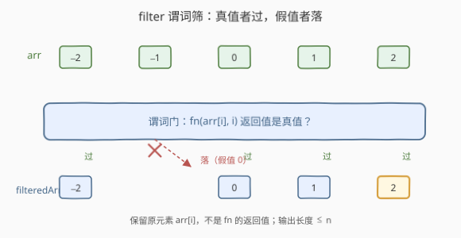
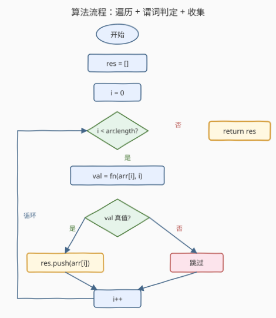

# LeetCode 过滤数组中的元素 题解

## 1. 题目概述

- **标题 / 题号**：过滤数组中的元素（#2634，easy）
- **链接**：https://leetcode.cn/problems/filter-elements-from-array/
- **难度**：简单
- **标签**：数组、高阶函数、谓词筛选、真值判定

**题意**：给定一个整数数组 `arr` 和一个过滤函数 `fn`，返回过滤后的数组 `filteredArr`。`fn` 接收一或两个参数：`arr[i]`（元素值）与 `i`（下标）。`filteredArr` 只保留使 `fn(arr[i], i)` 返回值为**真值（truthy）** 的元素——**真值** 指 `Boolean(value)` 返回 `true` 的值。**不得使用内置的 `Array.filter`。**

**示例 1**：

```text
输入：arr = [0,10,20,30], fn = function greaterThan10(n) { return n > 10; }
输出：[20,30]
解释：0 与 10 不大于 10 → 返回 false（假值）→ 丢弃；20、30 返回 true → 保留
```

**示例 2**：

```text
输入：arr = [1,2,3], fn = function firstIndex(n, i) { return i === 0; }
输出：[1]
解释：fn 也接收下标；仅 i===0 为 true，故只留首元素
```

**示例 3**：

```text
输入：arr = [-2,-1,0,1,2], fn = function plusOne(n) { return n + 1 }
输出：[-2,0,1,2]
解释：-1+1=0 是假值 → -1 被丢；其余返回非零数（真值）→ 保留
```

**约束**：

- `0 <= arr.length <= 1000`
- $-10^9 \le \text{arr[i]} \le 10^9$

> 💡 本题是 LeetCode「30 天 JavaScript」系列题目，与 [2635. 转换数组中的每个元素](https://leetcode.cn/problems/apply-transform-over-each-element-in-array/)（`map`，一一映射）、[2626. 数组归约运算](2626_数组归约运算.md)（`reduce`，多对一归约）并称**函数式三件套**。它考查的不是算法复杂度，而是 **filter 原语**：用谓词逐元素筛选。它唯一——也是最隐蔽——的考点是 **JS 真值/假值语义**：判定标准是 `Boolean(返回值)` 而非 `返回值 === true`，示例 3 正是为此而设。下文以 JS 为提交语言，并给出 Python / C++ 概念等价实现。

## 2. 解题思路

### 2.1 暴力思路：直接用 `Array.filter`

最省事是一行 `return arr.filter(fn)`。但题目**明确禁止**内置 `filter`，逼你直面一个根本问题：**filter 的内核到底是什么？**

### 2.2 核心观察：谓词筛选——一次遍历 + 真值判定 + 收集



filter 的内核极简：**遍历 → 用 `fn` 当谓词逐个判定 → 真值则收集、假值则丢弃**。三步串成一条流水线：

| 步 | 动作 | 说明 |
|----|------|------|
| 遍历 | `for i in 0..n-1` | 线性扫描，每个元素恰好问一次 |
| 判定 | `fn(arr[i], i)` | 谓词返回任意值，由**真值性**决定去留 |
| 收集 | 真值则 `push(arr[i])` | 输出长度 $\le n$（按谓词筛除） |

> 💡 **真值判定是本题的灵魂**。判定标准是 `Boolean(fn(arr[i], i))`，即"返回值是否真值"，而**不是** `fn(...) === true`。两者天差地别：`1`、`-1`、`"x"`、`[]` 都是真值但 `!== true`；`0`、`""`、`null`、`NaN` 是假值。示例 3 里 `plusOne(-1)` 返回 `0`——一个"看着没事"的数字，却因 `0` 是假值被丢弃，正是为刺破"返回值即结果"的错觉而设。

**JS 的 7 类假值**（其余皆为真值）：

| 假值 | 语境 | 本题是否触雷 |
|------|------|--------------|
| `false` | 布尔假 | 示例 1 / 2 命中 |
| `0` / `-0` | 数字零 | **示例 3 命中**（`-1+1=0`） |
| `0n` | BigInt 零 | fn 返回 Number，不触 |
| `""` | 空串 | 不触 |
| `null` | 空引用 | 不触 |
| `undefined` | 未定义 | 不触 |
| `NaN` | 非数 | 不触 |

> ⚠️ **头号 bug**：写成 `if (fn(arr[i], i) === true)`。这会把示例 3 的所有元素丢光——因为返回的 `1`、`2`、`3` 都不 `=== true`。正确写法是直接 `if (fn(arr[i], i))`，让 `if` 自动做真值强制；或显式 `if (Boolean(fn(arr[i], i)))`，二者等价。

> 💡 **`fn` 元数的灵活性**：题目说 `fn` 接收一或两个参数（`greaterThan10(n)` 只要 1 个、`firstIndex(n, i)` 要 2 个）。解法**永远传两个** `fn(arr[i], i)`：JS 会静默忽略多余实参，单参函数照常工作，无需探测 `fn.length`——这是 JS 的"宽容"特性，也是 Python / C++ 等价实现要额外处理的地方。

### 2.3 算法流程图



整体只有一个循环 + 一个结果数组：每轮调 `fn` 取返回值，真值则 `push`、假值则跳过，`i` 自增回顶。$n=0$ 时循环零次，直接返回空 `[]`——空数组无需特判，"循环不执行"天然兜底。

### 2.4 示例演算

![示例演算：arr=[−2,−1,0,1,2]，fn = n => n+1](../images/filter_example_walkthrough.svg)

以**示例 3**（`fn = n => n + 1`）为例逐元素过一遍，重点看 `i=1` 这一行——它返回 `0`，是唯一的假值，故被丢弃：

| i | arr[i] | fn(arr[i], i) | 真值? | 动作 | res |
|---|--------|---------------|-------|------|-----|
| 0 | −2 | −1 | 真值（非零数） | 保留 | [−2] |
| 1 | −1 |  0 | **假值（零）** | **丢弃** | [−2] |
| 2 |  0 |  1 | 真值 | 保留 | [−2, 0] |
| 3 |  1 |  2 | 真值 | 保留 | [−2, 0, 1] |
| 4 |  2 |  3 | 真值 | 保留 | [−2, 0, 1, 2] |

输出 `[-2, 0, 1, 2]`，与示例一致。可见 filter **保留的是原元素 `arr[i]`，而非 `fn` 的返回值**——返回值只参与"去留判定"，不进结果。这是与 `map`（结果取 `fn` 返回值）的根本分野。

## 3. 参考代码

### JavaScript / TypeScript（提交语言）

```javascript
/**
 * @param {number[]} arr
 * @param {Function} fn  (n, i) => 任意值
 * @return {number[]}
 */
var filter = function (arr, fn) {
    const res = [];
    for (let i = 0; i < arr.length; i++) {
        if (fn(arr[i], i)) {   // 真值判定：if 自动强转，等价 Boolean(fn(...))
            res.push(arr[i]);  // 保留原元素，不是 fn 的返回值
        }
    }
    return res;
};
```

TypeScript 版：

```typescript
function filter(arr: number[], fn: (n: number, i: number) => unknown): number[] {
    const res: number[] = [];
    for (let i = 0; i < arr.length; i++) {
        if (fn(arr[i], i)) {
            res.push(arr[i]);
        }
    }
    return res;
}
```

> 💡 **返回类型标 `unknown` 而非 `boolean`**：示例 3 的 `fn` 返回 `number` 而非 `boolean`。谓词的"返回类型"不限定布尔——只要能做真值判定即可。这正是 filter 与"返回布尔函数"的微妙区别：**谓词 = 任何能被强转为布尔的值**。

### Python（概念等价）

> 本题 LeetCode 仅开放 JS / TS，Python 版作概念对照。注意两点差异：(1) Python 的 `if x` 同样做真值判定，但假值集合不同——`0`、`0.0`、`""`、`[]`、`{}`、`None`、`False` 均假；(2) Python 对实参数量严格——单参函数传两参会抛 `TypeError`，故须用 `inspect` 探测元数，无法像 JS 那样"无脑传两个"。

```python
import inspect
from typing import List, Callable

def filter_array(arr: List[int], fn: Callable) -> List[int]:
    res: List[int] = []
    # 探测 fn 元数：1 参只传元素，2 参额外传下标（JS 无需此步）
    n_params = len(inspect.signature(fn).parameters)
    for i, x in enumerate(arr):
        val = fn(x, i) if n_params >= 2 else fn(x)
        if val:               # 真值判定，等价 bool(val)
            res.append(x)     # 保留原元素
    return res
```

> ⚠️ **Python 假值含空容器**：`[]`、`{}`、`()` 在 Python 是假值，而 JS 中 `[]`、`{}` 是**真值**（对象 / 数组恒真）。本题 `fn` 返回数字，两语言对 `0` 的处理一致（均假），结果相同；但若把 `fn` 换成返回数组的实现，两语言行为会分叉——这是跨语言移植时的隐蔽陷阱。

### C++（概念等价）

> C++ 标准库的 `std::copy_if` 即 filter（谓词只收元素、不收下标）。下面对应手写循环与标准库两种写法；C++ 的"真值判定"靠**上下文布尔转换**，对算术 / 指针类型非零即真，与 JS 对数字的语义一致。

```cpp
#include <vector>
#include <algorithm>
#include <functional>

// 手写版（对应题意，fn 收 (元素, 下标)）
std::vector<int> filterArray(const std::vector<int>& arr,
                             std::function<int(int, int)> fn) {
    std::vector<int> res;
    for (int i = 0; i < (int)arr.size(); i++) {
        if (fn(arr[i], i)) {          // int 上下文转 bool：非零即真
            res.push_back(arr[i]);
        }
    }
    return res;
}

// 等价标准库（谓词只收元素；下标靠捕获计数器补齐）：
// std::vector<int> res; int i = 0;
// std::copy_if(arr.begin(), arr.end(), std::back_inserter(res),
//              [&](int x) { return static_cast<bool>(fn(x, i++)); });
```

> ⚠️ **C++ 真值模型比 JS 窄**：`std::string`、`std::vector` 无隐式布尔转换（须 `.empty()` 或显式），故 C++ 里"空串 / 空数组"不会被自动当假值——这与 JS / Python 都不同。本题 `fn` 返回 `int`，三者对 `0` 的处理一致，结果一致。

## 4. 复杂度分析

| 维度 | 复杂度 | 说明 |
|------|--------|------|
| 时间复杂度 | $O(n)$ | 遍历一次，每元素执行一次 `fn`，$n = \text{arr.length}$ |
| 空间复杂度 | $O(n)$ | 最坏（全部保留）结果数组与输入等长；不计输出则为 $O(1)$ |

> ⚠️ `fn` 本身复杂度另算：约定 $O(1)$ 时整体 $O(n)$。输出空间是"必要输出"——filter 不像 reduce 那样压成 $O(1)$，因为它是"$n \to {\le}n$"的筛选，结果集本身就有线性规模。

## 5. 扩展：真值模型、惰性与原生 `filter` 的细节

**真值模型的语言对比。** 三语言对"什么算假值"各异，直接决定 filter 的行为：

| 值 | JS | Python | C++（上下文 bool） |
|----|----|--------|---------------------|
| `0` / `0.0` | 假 | 假 | 假（非零即真） |
| `""` 空串 | 假 | 假 | **无转换**（须显式） |
| `[]` 空数组 | **真** | 假 | **无转换** |
| `{}` 空对象 | **真** | 假 | **无转换** |
| `null` / `None` / `nullptr` | 假 | 假 | 假 |
| `NaN` | 假 | `nan` 真 | 不适用 |

JS 的"对象 / 数组恒真"是最反直觉的一点：`if ([])` 在 JS 为真、在 Python 为假。跨语言移植 filter 时务必校准假值集合。

**惰性 vs 急切。** JS 的 `Array.prototype.filter` 是**急切**的——立即返回新数组，全程求值。Python 的 `filter(pred, it)` 返回**迭代器**，是**惰性**的——只在消费时逐个求值，可处理无穷序列、可中途短路。函数式语言（Haskell `filter`、Scala `LazyList`）多走惰性路线。本题要手写急切版，但理解惰性有助于处理大数据流。

**原生 `Array.prototype.filter` 的完整签名。** 真实 `filter` 比本题多三处细节：(1) 谓词收 `(element, index, array)` 三参；(2) 第二参 `thisArg` 绑定谓词内 `this`；(3) **跳过稀疏数组的空槽（holes）**——`[1, , 3].filter(...)` 不会对中间空槽调谓词。本题数组密集、且只要求两参，故无需考虑这些；但知晓原生语义能避免"为什么我的 filter 没遍历到某些位置"的困惑。

> 💡 **reduce 即 map / filter 之父**：正如 [2626 扩展](2626_数组归约运算.md) 所述，`filter(arr, p) = reduce(arr, (acc, x) => p(x) ? acc.concat([x]) : acc, [])`。filter 是 reduce 输出"数组"且带谓词的特例。理解了 reduce 的左折叠，filter 就是"累加器换成数组、`fn` 换成条件 `push`"。

## 6. 面试要点

1. **为什么判定写 `if (fn(arr[i], i))` 而不是 `if (fn(arr[i], i) === true)`？**

   > 因为判定标准是**真值性**（`Boolean(返回值)`），不是严格等于 `true`。`1`、`-1`、`"x"` 都是真值但 `!== true`；写成 `=== true` 会让示例 3 的所有元素全部被丢（它们返回 `1 / 2 / 3` 都不等于 `true`）。`if (x)` 会自动做真值强制，与 `Boolean(x)` 等价，是 filter 谓词判定的正确姿势。

2. **JS 有哪些假值？为什么 `0` 是假值？**

   > 7 类：`false`、`0` / `-0`、`0n`、`""`、`null`、`undefined`、`NaN`。`0` 是假值源于 JS 沿用 C 的"零即假"传统——数字零在条件上下文表示"无"。示例 3 的 `plusOne(-1) = 0` 正是利用这点：返回 `0` 等价于"假"，元素被丢。这是本题最隐蔽的考点。

3. **`fn` 只声明一个参数时，传 `fn(arr[i], i)` 两个参会出错吗？**

   > 在 JS 不会。JS 函数对多余实参**静默忽略**（除非用 `...rest` 收集），单参函数照常只用第一个。所以我们永远传两个，无需探测 `fn.length`。但 Python 会抛 `TypeError`、C++ 模板会匹配失败，跨语言等价实现要靠 `inspect` 探元数或重载——这是 JS 的"宽容"独有之处。

4. **filter 与 map、reduce 的关系？为什么 filter 保留原元素而非 `fn` 的返回值？**

   > 三件套：`map` 是 $n \to n$ 一一映射（结果取 `fn` 返回值）、`filter` 是 $n \to {\le}n$ 筛选（结果取**原元素**，`fn` 只当谓词）、`reduce` 是 $n \to 1$ 归约。filter 保留原元素是因为 `fn` 的角色是"判定者"而非"变换者"——返回值只回答"留不留"，不进入结果。把 filter 的 `fn` 当 map 用（取返回值）是常见误解。

5. **原生 `Array.prototype.filter` 与本题的差异？**

   > 原生多三点：(1) 谓词收 `(element, index, array)` 三参；(2) 可传 `thisArg` 绑定 `this`；(3) 跳过稀疏数组的空槽（holes 不调谓词）。本题数组密集、谓词只收两参、禁用原生，故手写循环即可。但面试时能说出 holes 行为，体现对原生 API 边界的理解。

> 💡 **一句话总结**：2634 = 「遍历 + 谓词真值判定 + 收集原元素」。判定用 `if (fn(arr[i], i))` 而非 `=== true`——这是唯一考点；保留 `arr[i]` 而非 `fn` 返回值——这是与 map 的分野。$O(n)$ 时间、$O(n)$ 输出空间，一次遍历搞定。

## 同类练习题

| # | 题目 | 与本题的关联 |
|---|------|-------------|
| 2635 | [转换数组中的每个元素](https://leetcode.cn/problems/apply-transform-over-each-element-in-array/) | `map`——三件套的"一一映射"，结果取 `fn` 返回值，与本题"保留原元素"形成对照，一体两面 |
| 2626 | [数组归约运算](https://leetcode.cn/problems/array-reduce-transformation/)（[题解](2626_数组归约运算.md)） | `reduce`——三件套的"多对一归约"，且 reduce 可实现 filter，是三件套的最小内核 |
| 2705 | [精简对象](https://leetcode.cn/problems/compact-object/) | 把 filter 的"假值筛除"从数组搬上递归对象，与 [2633 序列化](2633_将对象转换为JSON字符串.md) 共用 JSON 树递归骨架，换个动作（删假值 vs 拼串） |
| 2625 | [扁平化嵌套数组](https://leetcode.cn/problems/flatten-deeply-nested-array/)（[题解](2625_扁平化嵌套数组.md)） | 沿嵌套数组递归按深度剪枝，同属"高阶数组操作 + 递归"家族，巩固对数组遍历与收集的运用 |
