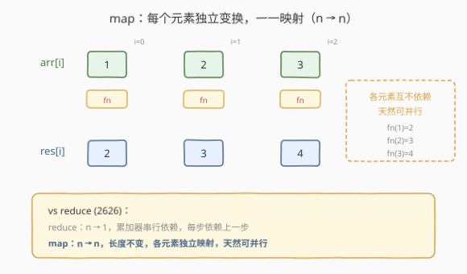
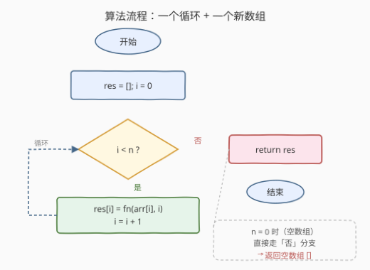

# LeetCode 转换数组中的每个元素 题解

## 1. 题目概述

- **标题 / 题号**：转换数组中的每个元素（#2635，easy）
- **链接**：https://leetcode.cn/problems/apply-transform-over-each-element-in-array/
- **难度**：简单
- **标签**：数组、函数式编程、高阶函数

**题意**：给定一个整数数组 `arr` 和一个映射函数 `fn`，返回一个**新数组**，其中每个元素是 `fn` 作用于 `arr` 对应元素的结果。**不得使用内置的 `Array.prototype.map` 方法。**

回调函数 `fn` 接收 1～2 个参数：

| 参数 | 含义 |
|------|------|
| `arr[i]` | 当前正在处理的元素 |
| `i` | 当前元素的下标（0-based，可选） |

**示例 1**：

```text
输入：arr = [1,2,3], fn = function plusone(n) { return n + 1; }
输出：[2,3,4]
解释：每个元素加 1：1→2, 2→3, 3→4。
```

**示例 2**：

```text
输入：arr = [1,2,3], fn = function plusI(n, i) { return n + i; }
输出：[1,3,5]
解释：每个元素加其下标：1+0=1, 2+1=3, 3+2=5。
```

**示例 3**：

```text
输入：arr = [10,20,15], fn = function constant() { return 42; }
输出：[42,42,42]
解释：fn 忽略输入，始终返回 42。
```

**约束**：

- `0 <= arr.length <= 1000`
- $-10^9 \le \text{arr}[i] \le 10^9$
- `fn` 的输出值范围 $[-10^9, 10^9]$

> 💡 本题属于 LeetCode「30 天 JavaScript」系列，**仅开放 JavaScript / TypeScript 提交入口**，考查的不是算法复杂度，而是 **map（映射）** 这一函数式编程原语：如何把一个"逐元素变换函数"作用到整个数组上，产出**等长**的新数组。它与 [2626. 数组归约运算](2626_数组归约运算.md) 是一对姊妹题——reduce 把 $n$ 个值"压"成 1 个，map 把 $n$ 个值"换"成另外 $n$ 个。

## 2. 解题思路

### 2.1 暴力思路：递归

和 reduce 一样，map 的定义也可以写成递归：处理首元素，再递归处理剩余部分，最后拼接。

```text
map(arr, fn):
    if arr 为空: return []
    return [fn(arr[0])] ++ map(arr[1:], fn)
```

翻译成代码很"优雅"，但有两个老问题：

- **切片开销**：每层递归 `arr.slice(1)` 在多数语言里是 $O(n)$ 拷贝，整体退化为 $O(n^2)$；
- **栈深度**：`arr.length` 可达 1000，递归深度 1000，逼近部分语言的栈上限。

递归把"过程"藏进调用栈，可读但不可控。

### 2.2 核心观察：逐元素映射 + 新数组收集



跳出递归的思维定式，关键观察只有一条——**每个元素的变换是独立的**：

| 观察 | 含义 |
|------|------|
| **各元素互不依赖** | `res[i]` 只依赖 `arr[i]` 和 `i`，不依赖 `res[i-1]` 或任何其他元素 |
| **长度不变** | 输出数组与输入数组**等长**（$n \to n$），每个位置一一对应 |
| **不修改原数组** | 结果写入**新数组** `res`，`arr` 保持不变（不可变原则） |

于是最自然的实现就是：**创建一个新数组，遍历 `arr`，把 `fn(arr[i], i)` 逐个填入 `res[i]`**。

> 💡 **map vs reduce 的根本区别**：reduce 有一个"累加器"在元素间**串行传递**（每步依赖上一步的 `acc`），所以严格串行、不可并行。map 没有累加器——每个 `res[i]` 只看 `arr[i]` 和 `i`，元素间**零依赖**，天然可并行。这也解释了为什么 GPU / MapReduce 中的 `map` 阶段可以大规模并行，而 `reduce` 需要分治合并。

> ⚠️ **不要用 `forEach` 代替循环**：`forEach` 也是数组高阶方法，虽然题目只禁了 `map`，但用 `forEach` 会有"绕道"之嫌。最直白的 `for` 循环既清晰又无歧义。

### 2.3 算法流程图



整体只有一个循环 + 一个新数组变量：循环条件 `i < n` 控制推进，循环体 `res[i] = fn(arr[i], i)` 完成"映射"。$n=0$ 时直接走"否"分支返回空数组，空数组与一般情况统一在同一个结构里。

### 2.4 示例演算

![示例演算：arr=[1,2,3] fn=(n,i)=>n+i](../images/map_example_walkthrough.svg)

以示例 2（`fn = (n, i) => n + i`）为例，每一步把 `fn(arr[i], i)` 的结果写入 `res[i]`：

| 步 | i | arr[i] | fn(arr[i], i) | res |
|----|---|--------|----------------|-----|
| init | – | – | – | `[]` |
| 1 | 0 | 1 | 1 + 0 = 1 | `[1]` |
| 2 | 1 | 2 | 2 + 1 = 3 | `[1, 3]` |
| 3 | 2 | 3 | 3 + 2 = 5 | `[1, 3, 5]` |

输出 `[1, 3, 5]`，与示例一致。注意每步的 `res[i]` **只依赖当前 `arr[i]` 和 `i`**，与 `res` 中其他位置的值无关——这正是 map 可并行的根源。

## 3. 参考代码

### JavaScript / TypeScript（提交语言）

```javascript
/**
 * @param {number[]} arr
 * @param {Function} fn  (element, index) => transformedValue
 * @return {number[]}
 */
var map = function (arr, fn) {
    const res = new Array(arr.length);
    for (let i = 0; i < arr.length; i++) {
        res[i] = fn(arr[i], i);
    }
    return res;
};
```

TypeScript 版：

```typescript
function map(arr: number[], fn: (n: number, i: number) => number): number[] {
    const res = new Array(arr.length);
    for (let i = 0; i < arr.length; i++) {
        res[i] = fn(arr[i], i);
    }
    return res;
}
```

> 💡 **预分配 vs `push`**：`new Array(arr.length)` 预分配后按下标写入，比 `res.push(fn(arr[i], i))` 更高效——`push` 可能触发多次动态扩容（均摊 $O(1)$ 但有常数开销），预分配一次到位。两种写法在本题规模下差异可忽略，但预分配更能体现"长度不变"的语义。

### Python（概念等价）

> LeetCode 本题仅开放 JS/TS，Python 版作概念对照。Python 内置 `map(fn, arr)` 返回迭代器，需 `list()` 才得到数组；此处手写以呼应题意。

```python
from typing import List, Callable

def map_array(arr: List[int], fn: Callable[[int, int], int]) -> List[int]:
    res = [0] * len(arr)          # 预分配
    for i, x in enumerate(arr):   # enumerate 同时给元素和下标
        res[i] = fn(x, i)
    return res

# 等价于内置：
# list(map(fn, arr))  # 但内置 map 不传下标 i
```

> ⚠️ **Python 内置 `map` 不传下标**：Python 的 `map(fn, arr)` 只把元素传给 `fn`，不传下标。若需下标，要用 `enumerate` + 列表推导：`[fn(x, i) for i, x in enumerate(arr)]`。JS 的 `Array.map` 天然传 `(element, index)`，这是两语言 API 设计的差异。

### C++（概念等价）

```cpp
#include <vector>
#include <functional>

std::vector<int> mapArray(const std::vector<int>& arr,
                          std::function<int(int, int)> fn) {
    std::vector<int> res(arr.size());
    for (size_t i = 0; i < arr.size(); i++) {
        res[i] = fn(arr[i], static_cast<int>(i));
    }
    return res;
}

// 等价于 C++20 ranges：std::views::iota(0, n) 配合 transform
// auto res = arr | std::views::transform(...) 需额外处理下标
```

## 4. 复杂度分析

| 维度 | 复杂度 | 说明 |
|------|--------|------|
| 时间复杂度 | $O(n)$ | 遍历一次数组，每元素执行一次 `fn`，$n = \text{arr.length}$ |
| 空间复杂度 | $O(n)$ | 输出数组本身长 $n$；额外变量仅 `i`，为 $O(1)$ |

> ⚠️ `fn` 本身的复杂度另算：若 `fn` 是 $O(1)$（如加法），整体 $O(n)$；若 `fn` 内部有 $O(k)$ 工作，整体 $O(nk)$。本题 `fn` 由调用方给定，约定为 $O(1)$。

> 💡 **与 reduce 的空间对比**：reduce 只需 $O(1)$ 额外空间（一个累加器），map 必须 $O(n)$（一个新数组）。这是因为 reduce 是"多对一"，map 是"一对一"——输出规模决定了空间下界。

## 5. 扩展：函数式三件套 map / filter / reduce

map、filter、reduce 是函数式数据处理的三大原语，三者的关系如下：

| 原语 | 输入 → 输出 | 依赖关系 | 可并行？ | 典型用途 |
|------|-----------|----------|----------|----------|
| **map** | $n \to n$ | 元素间独立 | ✅ 天然可并行 | 逐元素变换 |
| **filter** | $n \to {\le}n$ | 元素间独立（但输出长度不定） | ✅ 可并行（需合并） | 按谓词筛选 |
| **reduce** | $n \to 1$ | 串行依赖累加器 | ❌ 需分治 | 聚合归约 |

**三者的表达力层级**：reduce 是最通用的——map 和 filter 都能用 reduce 表达（见 [2626](2626_数组归约运算.md) 扩展节），但反过来不行。不过 map / filter 的语义更精确、更可读，工程中不会用 reduce 去替代它们。

**链式调用**：实践中常把三者串联：

```text
arr.map(fn).filter(pred).reduce(acc, init)
```

每一步产出一个新数组（map、filter）或一个值（reduce），形成数据处理管道。这是 Lodash、Ramda、Java Stream、Rust Iterator 等库的标准模式。

**并行 map**：由于 map 各元素独立，GPU 编程（CUDA / Ascend）和分布式计算（MapReduce）中的 `map` 阶段可以大规模并行——把数组分块，每块独立映射，最后拼接。reduce 因串行依赖，只能用分治归约（分块各自 reduce 再合并）来近似并行。

## 6. 面试要点

1. **map 和 forEach 的区别是什么？**

   > `map` 返回一个**新数组**（每个元素经 `fn` 变换），不修改原数组；`forEach` 返回 `undefined`，只做副作用（如打印、修改外部状态）。`map` 强调"纯变换"，`forEach` 强调"遍历执行"。本题禁用 `map`，也不该用 `forEach` 绕道。

2. **为什么 map 要返回新数组而不是原地修改？**

   > **不可变原则**：原地修改会改变输入，调用方可能在其他地方引用原数组，修改会引发难以追踪的 bug。返回新数组让数据流单向、可预测——这是函数式编程的核心主张，也是 React / Redux 中"状态不可变"的理论基础。

3. **map 可以并行化吗？为什么？**

   > 可以。`res[i]` 只依赖 `arr[i]` 和 `i`，元素间零依赖，所以可以把数组分块、每块独立映射、最后拼接。这正是 GPU 和 MapReduce 中 `map` 阶段的并行原理。reduce 因累加器串行依赖，不能直接并行，只能用分治归约近似。

4. **fn 不返回值会怎样？**

   > JS 中函数不显式 `return` 时返回 `undefined`，`res[i]` 会被赋值为 `undefined`。这不是报错而是静默写入 `undefined`，可能导致后续逻辑出错。原生 `Array.map` 也是如此——它不校验 `fn` 的返回值，原样填入。示例 3 的 `constant()` 函数不接收参数但显式 `return 42`，是刻意展示"fn 可以忽略参数但不能忽略返回值"。

5. **map 和 reduce 的空间复杂度为什么不同？**

   > reduce 输出单个值，只需 $O(1)$ 额外空间（一个累加器）。map 输出 $n$ 个值的数组，必须 $O(n)$ 空间存放结果。这是输出规模决定的下界——map 是"一对一"，reduce 是"多对一"。

> 💡 **一句话总结**：2635 = 「一个循环 + 一个新数组 + `fn(arr[i], i)`」。map 的本质是**逐元素独立变换**——每个 `res[i]` 只看 `arr[i]` 和 `i`，无跨元素依赖，$O(n)$ 时间、$O(n)$ 空间，天然可并行。与 reduce 的"串行累加"形成对照：一个 $n \to n$ 独立，一个 $n \to 1$ 依赖。

## 同类练习题

| # | 题目 | 与本题的关联 |
|---|------|-------------|
| 2626 | [数组归约运算](https://leetcode.cn/problems/array-reduce-transformation/)（[题解](2626_数组归约运算.md)） | `reduce`——函数式三件套的"多对一归约"，与本题 `map` 的"一对一映射"互为对照，一串行依赖一独立并行 |
| 2634 | [过滤数组中的元素](https://leetcode.cn/problems/filter-elements-from-array/) | `filter`——函数式三件套的"按谓词筛选"，与 map 同属"逐元素独立"但输出长度不定 |
| 2623 | [记忆函数](https://leetcode.cn/problems/memoize/)（[题解](2623_记忆函数.md)） | 高阶函数，把函数当值传递并缓存，与 map 同属"函数式原语"家族 |
| 2629 | [复合函数](https://leetcode.cn/problems/function-composition/)（[题解](2629_复合函数.md)） | 把一串单参函数从右向左串联成管道，与 map 的"逐元素变换"联手支撑函数式数据管道 |
| 2620 | [计数器](https://leetcode.cn/problems/counter/)（[题解](2620_计数器.md)） | 闭包持有可变状态，对照 map 的"无状态逐元素变换"，体现高阶函数的两种用法 |
