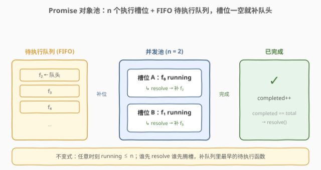
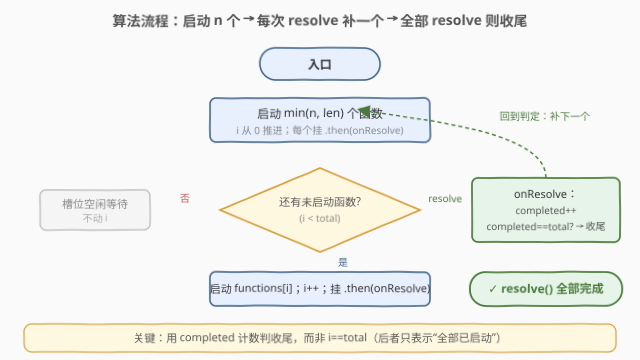
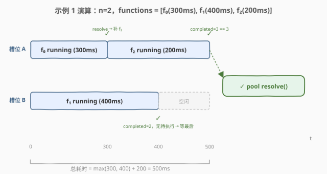

# LeetCode Promise 对象池 题解

## 1. 题目概述

- **标题 / 题号**：Promise 对象池（#2636，medium）
- **链接**：https://leetcode.cn/problems/promise-pool/
- **难度**：中等
- **标签**：Promise、异步、并发控制、高阶函数

> ⚠️ 本题为 LeetCode 付费题，题意描述根据官方示例用例与 hints 重建，可能与官方题面有出入。

**题意**：编写函数 `promisePool(functions, n)`，接收：

| 参数 | 含义 |
|------|------|
| `functions` | 一个函数数组，每个函数 `functions[i]()` 调用后返回一个 **Promise** |
| `n` | 并发上限（同时处于 pending 状态的 Promise 数量上限） |

要求**按数组顺序**调度执行这些函数，且任意时刻**并发执行**的 Promise 数不超过 `n`。当一个 Promise resolve 后，从队列里取出**下一个尚未启动**的函数继续执行，直到全部完成。最终返回一个 Promise，在所有函数都 resolve 后才 resolve。

> 💡 官方 hints 共两条，恰好点破调度规则：(1) Initially execute all the functions until the queue fills up.——先启动至多 `n` 个把"池子"填满；(2) Every time a function resolves, add a new promise to the queue if possible.——每当有 Promise resolve 就补一个新 Promise 进池。

**示例 1**：

```text
输入：functions = [() => new Promise(res => setTimeout(res, 300)),
                   () => new Promise(res => setTimeout(res, 400)),
                   () => new Promise(res => setTimeout(res, 200))],
      n = 2
执行轨迹：
  t=0    启动 f₀、f₁（占满 2 个槽位）
  t=300  f₀ resolve → 立即补 f₂（槽位 A 复用）
  t=400  f₁ resolve → 队列空，槽位 B 空闲
  t=500  f₂ resolve → 全部完成
输出：pool 的 Promise 在 t=500 resolve
```

**示例 2**：

```text
输入：functions = [同上 3 个], n = 5
执行轨迹：3 个函数同时启动（n 超出长度，按 len 取 min）
  t=0    启动 f₀、f₁、f₂
  t=200  f₂ resolve
  t=300  f₀ resolve
  t=400  f₁ resolve → 全部完成
输出：pool 的 Promise 在 t=400 resolve（= max 单个耗时）
```

**示例 3**：

```text
输入：functions = [同上 3 个], n = 1
执行轨迹：完全串行
  t=0    启动 f₀
  t=300  f₀ resolve → 补 f₁
  t=700  f₁ resolve → 补 f₂
  t=900  f₂ resolve → 全部完成
输出：pool 的 Promise 在 t=900 resolve（= Σ 单个耗时）
```

**约束**：

- `1 <= functions.length`（示例 3 处于长度为 3 的小规模场景）
- `1 <= n`
- 每个 `functions[i]` 返回一个 Promise，resolve 时无显式返回值

> 💡 本题是 [2637. 有时间限制的 Promise 对象](https://leetcode.cn/problems/promise-time-limit/) 的姊妹题——2637 给单个 Promise 加超时，2636 把多个 Promise 装进一个**有界并发池**统一调度。它不考算法复杂度，考的是 **Promise 的事件驱动调度**：如何用回调式补位维持"并发不超 n"的不变式。

## 2. 解题思路

### 2.1 暴力思路：`Promise.all` 全并行 或 串行 `for await`

两个极端写法都偏离题意：

```javascript
// 极端 A：全部并行
Promise.all(functions.map(f => f()));   // 并发数 = len，可能远超 n
// 极端 B：完全串行
for (const f of functions) await f();  // 并发数 = 1，浪费槽位
```

- **全并行**违反并发上限（示例 1 的 `n=2` 会被打成 3 并发）；
- **全串行**虽然不违约，但示例 2（`n=5`）应 400ms 完成，串行要 900ms——把"最多 `n` 个"退化成"恰好 1 个"。

正确解法必然介于两者之间：**先填满 `n` 个槽位，谁 resolve 谁腾位，腾位就补队头**。

### 2.2 核心观察：有界并发池——事件驱动补位



把调度抽象成一个**池 + 队列**的结构：

| 角色 | 职责 | 实现 |
|------|------|------|
| **n 个执行槽位** | 任意时刻至多 `n` 个 Promise 处于 pending | 维护一个共享下标 `i` |
| **FIFO 待执行队列** | 尚未启动的函数按数组顺序排队 | 共享下标 `i` 隐式表达——`functions[i]` 即队头 |
| **补位回调** | 某 Promise resolve 时，若队列非空则启动队头 | `onResolve` 里 `completed++` 后调 `next()` |
| **完成计数** | 记录已 resolve 的数量，达 `total` 收尾 | `completed === total` 时 resolve 外层 |

**关键不变式**：任意时刻 `running = i - completed`（已启动数 − 已完成数）`≤ n`。

- 初始连续调 `n` 次 `next()`，每次 `i++` 把 `running` 推到 `n`；
- 之后**只有在 `onResolve` 里**才调 `next()`——每 resolve 一次先 `completed++`（`running` 减 1），再 `next()` 启动队头（`i++`，`running` 回升 1），所以 `running` 永不突破 `n`。

> ⚠️ **头号 bug：用 `i === total` 判收尾**。`i` 只表示"已启动数"，不等同于"已完成数"。示例 1 里 `t=300` 时 `i` 已经是 3（全部启动），但 `f₁`、`f₂` 都还没 resolve——此时收尾会把还在跑的 Promise 扔掉。必须用**完成计数 `completed === total`** 判收尾，这是本题最容易踩的坑。

> 💡 **谁先 resolve 谁先补位**：`onResolve` 回调里直接调 `next()`，不关心是哪个槽位腾出来——只要队列还有函数就立刻补上。这就是"对象池"相对"车道划分"（见第 5 节）的核心优势：负载均衡，不会出现"一个槽位排队、另一个槽位闲置"。

### 2.3 算法流程图



外层 `new Promise` 包一个"手动 resolve"——`completed === total` 时调 `resolve()` 收尾。`next()` 是**递归补位函数**：若 `i < total` 就启动 `functions[i]`、`i++`、挂 `.then(onResolve)`；否则什么也不做（等待已启动的 Promise 完成）。初始连续 `min(n, total)` 次 `next()` 把池填满。

### 2.4 示例演算



以**示例 1**（`functions = [f₀(300), f₁(400), f₂(200)]`，`n=2`）为例，跟踪共享变量 `i` 与 `completed`：

| 时刻 | 事件 | i | completed | running | 动作 |
|------|------|---|-----------|---------|------|
| t=0 | 初始填充 | 0→2 | 0 | 0→2 | 启动 f₀、f₁（占满 2 槽） |
| t=300 | f₀ resolve | 2 | 0→1 | 2→1 | `next()`：i=2<3，启动 f₂，i→3，running→2 |
| t=400 | f₁ resolve | 3 | 1→2 | 2→1 | `next()`：i=3，无新函数，空转等待 |
| t=500 | f₂ resolve | 3 | 2→3 | 1→0 | `completed===3` → `resolve()` 收尾 |

输出 pool 的 Promise 在 `t=500` resolve。注意 `t=300` 时 `i` 已经到 3（全部已启动），但 `completed` 只有 1——**不能**用 `i` 判收尾，这正是头号 bug 的出处。`t=400` 时 `next()` 检测到 `i === total` 直接返回（不启动新函数），等待最后剩的 `f₂` 在 `t=500` 完成。

## 3. 参考代码

### JavaScript / TypeScript（提交语言）

```javascript
/**
 * @param {Function[]} functions
 * @param {number} n
 * @return {Promise<void>}
 */
var promisePool = async function (functions, n) {
    return new Promise((resolve) => {
        const total = functions.length;
        let i = 0;          // 下一个待启动函数的下标（隐式 FIFO 队头）
        let completed = 0;  // 已 resolve 的数量（收尾判据）

        function next() {
            if (i === total) return;     // 队列空：等其它槽位 resolve
            const fn = functions[i++];
            fn().then(() => {
                completed++;
                if (completed === total) {
                    resolve();         // 全部完成 → 收尾
                } else {
                    next();            // 槽位腾出 → 补队头
                }
            });
        }

        // 初始填满 n 个槽位（不足 n 个时按实际数量启动）
        for (let k = 0; k < n && k < total; k++) {
            next();
        }
        if (total === 0) resolve();     // 空数组兜底
    });
};
```

TypeScript 版：

```typescript
async function promisePool(
    functions: (() => Promise<void>)[],
    n: number
): Promise<void> {
    return new Promise<void>((resolve) => {
        const total = functions.length;
        let i = 0;
        let completed = 0;

        const next = (): void => {
            if (i === total) return;
            const fn = functions[i++];
            fn().then(() => {
                completed++;
                if (completed === total) {
                    resolve();
                } else {
                    next();
                }
            });
        };

        for (let k = 0; k < n && k < total; k++) {
            next();
        }
        if (total === 0) resolve();
    });
}
```

> 💡 **为什么 `next` 里同时管"启动"和"补位"**：把"初始填充"和"resolve 后补位"统一成同一个动作——"只要队列还有就启动队头"。初始循环调 `n` 次 `next` 就是填满池，`onResolve` 里调 1 次 `next` 就是补位。一份代码两条调用路径，避免维护两套逻辑。

### Python（概念等价，`concurrent.futures`）

> 本题 LeetCode 仅开放 JS/TS，Python 版作概念对照。Python 标准库里 `concurrent.futures.ThreadPoolExecutor(max_workers=n)` 是"有界并发池"的直接对应物：提交 `len` 个任务，线程池自动维持至多 `n` 个并发，谁完成谁取下一个。

```python
import asyncio
from concurrent.futures import ThreadPoolExecutor


async def promise_pool(functions, n):
    # 方式 A：用 asyncio 语义池（事件驱动，最贴近 JS）
    total = len(functions)
    i = 0
    completed = 0

    async def run_one(idx):
        nonlocal completed
        await functions[idx]()           # functions[i] 返回 awaitable
        completed += 1

    # asyncio 没有内置"补位池"，手动模拟：启动 n 个，谁完成谁补
    pending = set()
    for _ in range(min(n, total)):
        t = asyncio.create_task(run_one(i))
        i += 1
        pending.add(t)

    while pending:
        done, pending = await asyncio.wait(pending, return_when=asyncio.FIRST_COMPLETED)
        for _ in done:
            if i < total:
                t = asyncio.create_task(run_one(i))
                i += 1
                pending.add(t)
            # 若队列已空，pending 自然缩减至 0 退出

# 等价一行（ThreadPoolExecutor）：并发上限直接交给 max_workers
# with ThreadPoolExecutor(max_workers=n) as ex:
#     list(ex.map(lambda f: f(), functions))
```

> ⚠️ Python 的 `asyncio.wait(return_when=FIRST_COMPLETED)` 对应 JS 的 `.then(onResolve)`——"谁先完成就先补位"。但 `ThreadPoolExecutor` 用**线程**而非**事件循环**，对 CPU 密集任务才有真并行意义；对纯 I/O 异步，`asyncio` 池语义更贴切。

## 4. 复杂度分析

| 维度 | 复杂度 | 说明 |
|------|--------|------|
| 时间复杂度 | $O(m)$（墙钟 $T$） | $m = \text{functions.length}$，调度本身 $O(m)$（每函数启动、回调各 $O(1)$）；墙钟耗时 $T$ 取决于调度，下界 $\max_i t_i$（全并行，$n \ge m$），上界 $\sum_i t_i$（串行，$n = 1$） |
| 空间复杂度 | $O(1)$ | 仅维护 `i`、`completed` 两个计数器；Promise 链是事件驱动不占额外结构 |

> ⚠️ 上面 $O(m)$ 是**调度开销**——每个函数启动一次、`.then` 注册一次。**真正的执行耗时**由 `n` 与各函数实际耗时共同决定：`n` 越大越接近 $\max_i t_i$ 的下界，`n=1` 退化为 $\sum_i t_i$ 的串行上界。这是并发控制题目的典型"空间换时间"权衡：池越大，吞吐越高，但资源占用也越高。

> 💡 **不变式验证**：`running = i - completed`。初始循环 `n` 次 `next()` 后 `i=n`、`completed=0`、`running=n`；之后每 `onResolve` 先 `completed++`（`running→n-1`）再 `next()`（若队列非空 `i++`，`running→n`）。故 `running ∈ [0, n]` 恒成立——并发上限得到保证。

## 5. 扩展：车道划分 vs 真池，与 `p-limit` 等库

### 5.1 车道划分写法（优雅但有缺陷）

社区常贴的一种极简写法用 `Promise.all` + 切片把数组划成 `n` 条"车道"，每条车道串行 `await` 自己那份：

```javascript
async function promisePool(functions, n) {
    await Promise.all(
        functions.slice(0, n).map(async (_, lane) => {
            for (let j = lane; j < functions.length; j += n) {
                await functions[j]();
            }
        })
    );
}
```

- 车道 0 跑 `f₀, f_n, f_{2n}, …`；车道 1 跑 `f₁, f_{n+1}, …`；……；车道 `n-1` 跑 `f_{n-1}, f_{2n-1}, …`。
- 任意时刻每条车道至多 1 个 pending，共 `n` 条 → 并发上限 `n`，**满足不变式**。
- 本题 3 个示例（3 函数 + `n=2/5/1`）下，车道划分与真池**耗时完全相同**，故能 AC。

**但它不是真正的 FIFO 池**：当一个车道空了，即使队列里还有别的车道积压的函数，它也不会"跨车道"补位。构造反例 `[f₀(100ms), f₁(10ms), f₂(10ms), f₃(10ms)]`、`n=2`：

| 写法 | 车道 0 | 车道 1 | 总耗时 |
|------|--------|--------|--------|
| 真池 | f₀→f₂ | f₁→f₃ | f₁@10 完成→补 f₂@10 完成→补 f₃@10，f₀@100 完成 = **100ms** |
| 车道划分 | f₀(100)→f₂(10) | f₁(10)→f₃(10) | 车道 1 全程 20ms 就完事，但车道 0 要 110ms，整体 = **110ms** |

车道划分把"哪个槽位跑哪个函数"在启动时就钉死，丢失了"谁先腾位谁先补"的负载均衡能力。题目官方 hints 明确要"resolve 就补队头"——即真池语义。本题因测试集弱而两种写法都过，**工程实现应一律用真池**。

### 5.2 与 `p-limit` / `Promise.all` + 信号量的关系

生产里做并发限流的标配是 [`p-limit`](https://www.npmjs.com/package/p-limit) / [`async`/`p-queue`](https://www.npmjs.com/package/p-queue)：

```javascript
import pLimit from 'p-limit';
const limit = pLimit(n);           // 创建容量 n 的池
await Promise.all(
    functions.map(f => limit(() => f()))   // 每个任务包一层 limit()
);
```

`p-limit` 的内核与本题的真池几乎一致：维护 `activeCount` 和"待执行队列"，`activeCount < concurrency` 就从队列取一个启动，任务 resolve 时 `activeCount--` 再补。区别是 `p-limit` 接收任意多个**动态提交**的任务（生产者可随时 push），而本题是**静态一次性提交**一个数组——所以本题的 `i` 队列是隐式的（按下标递增），`p-limit` 则显式维护一个 `Queue`。

| 机制 | 本题真池 | `p-limit` | OS 信号量 |
|------|----------|-----------|----------|
| 容量上限 | `n` | `concurrency` | 计数初值 |
| 队列 | 隐式（数组下标 `i`） | 显式 `Queue` | 等待队列 |
| 补位时机 | `onResolve` → `next()` | 任务 resolve → `next()` | `signal()` 唤醒 |
| 提交方式 | 静态一次性 | 动态可增量 | 动态 |

> 💡 本题的"对象池"本质就是**计数信号量**的 Promise 版：`n` 是许可数，`next()` 是获取许可+启动任务，`onResolve` 里 `completed++` 隐含"释放许可+唤醒等待者"。理解了信号量，就理解了所有并发限流的原型。

## 6. 面试要点

1. **为什么用 `completed === total` 判收尾，而不是 `i === total`？**

   > `i` 是"已启动数"，`completed` 是"已完成数"。两者在 `n < total` 时必然错位：`i` 会先到达 `total`（全部已启动），但此时可能还有 Promise 在 pending。若用 `i === total` 收尾，会把仍在跑的 Promise 直接抛弃、提前 resolve——示例 1 在 `t=300` 时 `i` 已是 3，但 `f₁`、`f₂` 还没完成，提前收尾会漏掉它们。`completed === total` 才表示"真的全部 resolve 完"。

2. **如何保证任意时刻并发不超过 `n`？**

   > 靠"启动与补位都只发生在 `next()` 里、且 `next()` 的调用点受限"这一约束。初始连续调 `n` 次 `next` 把池填到 `running = n`；之后 `next` **只在 `onResolve` 里被调用**，每次调用前 `completed++` 已把 `running` 降到 `n-1`，补一个又回到 `n`。故 `running` 恒 $\in [0, n]$。若误在别处（比如循环里反复 `next`）调，会破坏不变式。

3. **`next()` 里 `if (i === total) return` 起什么作用？**

   > 这是"队列空"的早退。当某槽位 resolve 时队列可能已空（如示例 1 的 `t=400`），此时 `next` 不启动新函数、直接返回，让该槽位进入空闲等待。若去掉这行，会越界访问 `functions[total]`（`undefined`）并抛错。它也保证 `onResolve` 在"队列空但还有别的槽位在跑"时不误判收尾——收尾仍由 `completed === total` 兜底。

4. **车道划分（`slice(0,n)` + `Promise.all`）为什么不算严格的 Promise 池？**

   > 它把函数**预先钉死**到固定车道，丢失"谁先腾位谁补队头"的负载均衡。反例 `[f₀(100), f₁(10), f₂(10), f₃(10)]`、`n=2`：真池 100ms 完成（车道 1 完事后排空去补 f₂、f₃），车道划分要 110ms（车道 1 自己 20ms 完事后干等车道 0 的 100ms）。本题测试集不区分两者都能 AC，但语义上只有真池符合 hints 的"resolve 就补队头"。

5. **本题的"对象池"和操作系统信号量是什么关系？**

   > 它就是**计数信号量**的 Promise 版：`n` = 许可初值，`next()` 启动任务 ≈ 获取许可，`onResolve` 的 `completed++` ≈ 释放许可并唤醒等待者。所有并发限流（`p-limit`、`ThreadPoolExecutor(max_workers=n)`、Go 的 `chan struct{}` 信号量、数据库连接池）本质都是同一套"许可 + 等待队列"机制。

> 💡 **一句话总结**：2636 = 「`new Promise` + 共享 `i`/`completed` + `next()` 递归补位」。初始填满 `n` 槽，每次 resolve 先 `completed++` 再 `next()` 补队头，`completed === total` 时收尾。不变式 `running = i - completed ≤ n` 恒成立——这就是计数信号量的 Promise 化身。

## 同类练习题

| # | 题目 | 与本题的关联 |
|---|------|-------------|
| 2637 | [有时间限制的 Promise 对象](https://leetcode.cn/problems/promise-time-limit/) | 给单个 Promise 加超时取消，与本题给一批 Promise 加并发上限是 Promise 调度题的两面——一个控"超时"，一个控"并发" |
| 2721 | [并行执行异步函数](https://leetcode.cn/problems/execute-asynchronous-functions-in-parallel/) | 本题 `n` 等于数组长度时的退化情形，先理解无界并行（`Promise.all`）再看有界池，层次分明 |
| 2723 | [两个 Promise 对象相加](https://leetcode.cn/problems/add-two-promises/) | `Promise.all` 接收两个 Promise 后 `.then` 拿值，是"等待并发 Promise 全部完成"的最小用例，对照本题池收尾时 `completed === total` 的"全部完成"判定 |
| 2627 | [函数防抖](https://leetcode.cn/problems/debounce/) | 同属"事件驱动调度"家族——防抖靠 `clearTimeout/setTimeout` 在调用间重置时钟，对象池靠 `onResolve/next()` 在 resolve 间补位，都是"用回调管时序" |
| 2626 | [数组归约运算](https://leetcode.cn/problems/array-reduce-transformation/) | `reduce` 的串行累加器是 `n=1` 串行调度的同步版缩影，对比异步池把"串行依赖"放松成"至多 `n` 并发" |
