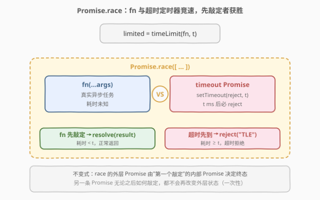
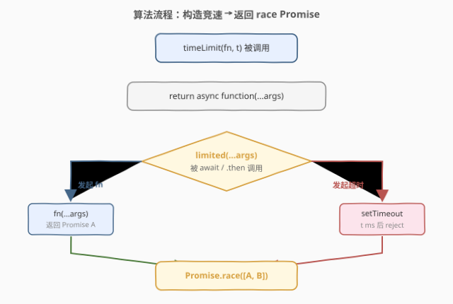
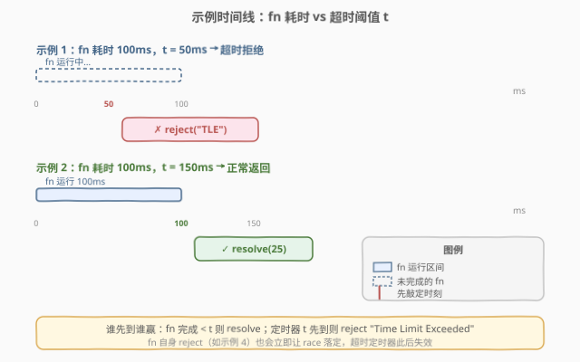

# LeetCode 有时间限制的Promise对象 题解

## 1. 题目概述

- **标题 / 题号**：有时间限制的Promise对象（#2637，medium）
- **链接**：https://leetcode.cn/problems/promise-time-limit/
- **难度**：中等
- **标签**：Promise、async/await、setTimeout、Promise.race

**题意**：编写函数 `timeLimit(fn, t)`，接收一个异步函数 `fn` 和以毫秒为单位的时间 `t`，返回一个**限时函数**。该函数接受与 `fn` 相同的参数，遵循：

- 若 `fn` 在 `t` 毫秒内完成，返回结果；
- 若 `fn` 执行超过 `t` 毫秒，拒绝并返回字符串 `"Time Limit Exceeded"`。

**示例 1**：

```text
输入：
fn = async (n) => { await new Promise(res => setTimeout(res, 100)); return n * n; }
inputs = [5]
t = 50
输出：{"rejected":"Time Limit Exceeded","time":50}
解释：fn 需要 100ms，但限时 50ms，t=50ms 时超时拒绝。
```

**示例 2**：

```text
输入：
fn = async (n) => { await new Promise(res => setTimeout(res, 100)); return n * n; }
inputs = [5]
t = 150
输出：{"resolved":25,"time":100}
解释：fn 在 100ms 完成 5*5=25，未达超时时间。
```

**示例 3**：

```text
输入：
fn = async (a, b) => { await new Promise(res => setTimeout(res, 120)); return a + b; }
inputs = [5,10]
t = 150
输出：{"resolved":15,"time":120}
解释：fn 在 120ms 完成 5+10=15，未达超时时间。
```

**示例 4**：

```text
输入：
fn = async () => { throw "Error"; }
inputs = []
t = 1000
输出：{"rejected":"Error","time":0}
解释：fn 立即抛出 Error，race 立即落定为 rejected。
```

**约束**：

- `0 <= inputs.length <= 10`
- `0 <= t <= 1000`
- `fn` 返回一个 Promise 对象

> 💡 关键信号：这是一道**语言特性题**，不考算法复杂度，考的是对 **Promise.race 语义**的理解——"谁先敲定谁获胜"，以及 Promise 状态**一次性、不可回退**的特性。核心是「**让真实任务与超时定时器竞速，先到先决**」。

## 2. 解题思路

### 2.1 暴力思路：轮询查询 fn 状态

最朴素的思路是**轮询**：每隔几毫秒用 `setInterval` 检查 `fn` 是否完成，若超过 `t` 就拒绝：

```javascript
function timeLimit(fn, t) {
  return async function (...args) {
    let done = false, result, error;
    fn(...args).then(r => { done = true; result = r; })
               .catch(e => { done = true; error = e; });
    const start = Date.now();
    while (!done && Date.now() - start < t) {} // 忙等
    if (!done) return Promise.reject("Time Limit Exceeded");
    if (error) throw error;
    return result;
  };
}
```

这能工作但**完全背离异步模型**：`while` 忙等霸占主线程，事件循环被卡死，`fn` 的 `.then` 回调**根本无法执行**（它要等主线程空出来才能进入微任务队列），于是 `done` 永远不会变 `true`，必然超时。

> ⚠️ **忙等 + 异步 = 必然死锁**。Promise 的 `.then`/`.catch` 是微任务，需要主线程让出后才会执行；而忙等恰恰不让出主线程，形成"我等你完成、你等我让出"的循环等待。这是 2621 睡眠函数中已强调的反模式。

### 2.2 核心观察：Promise.race 竞速



关键洞察：**不要去"查"fn 完没完成，而是让"完成"和"超时"两个事件自己竞争**。

`Promise.race(iterable)` 的语义恰好是——**第一个敲定（fulfilled 或 rejected）的 Promise 决定整个 race 的终态**，其余 Promise 之后如何敲定都不再影响外层。

我们构造两个竞速者：

| 竞速者 | 终态条件 | 含义 |
|--------|----------|------|
| **Promise A** = `fn(...args)` | fn 正常返回 → resolve；fn 抛错 → reject | 真实任务的真实结局 |
| **Promise B** = `new Promise((_, reject) => setTimeout(() => reject("Time Limit Exceeded"), t))` | `t` 毫秒后必定 reject | 超时闸门 |

把它们丢进 `Promise.race([A, B])`：

- 若 `fn` 在 `t` 毫秒内完成（无论 resolve 还是 reject），A **先敲定**，race 跟随 A 的终态；B 的定时器之后虽然也会触发 reject，但外层 Promise 已被 A 锁定，**reject 调用是空操作**。
- 若 `fn` 耗时超过 `t` 毫秒，B 的 `setTimeout` 先到，race 被 reject 为 `"Time Limit Exceeded"`；A 之后完成也不影响外层。

> 💡 **为什么不需要 clearTimeout？** 因为 Promise 状态是**一次性的**：race 的外层一旦被第一个敲定者锁定，第二个 reject 调用对外层毫无影响，不会覆盖、不会报错。定时器虽然最终会触发，但它只是对那个已被锁定的内部 Promise 调了一次无效的 reject。若在意定时器句柄泄漏（长时间未完成的 fn 背后挂着一个已无意义的 timer），可在 fn 先敲定时 `clearTimeout`，但对本题正确性无影响。

### 2.3 算法流程图



`timeLimit` 返回的 async 函数被调用时，**同步**地发起两条 Promise（fn 与超时），随即 `return Promise.race([...])`——返回即挂起，不阻塞主线程。终态由事件循环在 fn 完成或定时器到期的宏任务中决定。

### 2.4 示例演算



- **示例 1**（fn=100ms，t=50ms）：定时器在 50ms 先触发 `reject("Time Limit Exceeded")`，B 先敲定，race 落定为 rejected。fn 虽仍在运行但已无意义。
- **示例 2**（fn=100ms，t=150ms）：fn 在 100ms resolve(25)，A 先敲定，race 落定为 fulfilled(25)。150ms 后定时器触发 reject，但 B 的 reject 已是空操作。
- **示例 4**（fn 立即 throw）：fn 同步返回的 Promise 立即 reject("Error")，A 在 time≈0 就敲定，race 跟随 reject。这印证了 race 的"先到先决"——fn 自身的 reject 也能赢得竞速。

## 3. 参考代码

### JavaScript（推荐写法一：Promise.race）

```javascript
/**
 * @param {Function} fn
 * @param {number} t
 * @return {Function}
 */
var timeLimit = function (fn, t) {
    return async function (...args) {
        return Promise.race([
            fn(...args), // 真实任务：先敲定则跟随其终态
            new Promise((_, reject) =>
                setTimeout(() => reject("Time Limit Exceeded"), t)
            ), // 超时闸门：t ms 后必 reject
        ]);
    };
};
```

> 💡 三行核心：`fn(...args)` 发起真实任务、`new Promise` 挂 `t` 毫秒超时闸门、`Promise.race` 让两者竞速。外层 `async` 使返回值天然是 Promise，调用方可 `await` 也可 `.then`。`fn` 自身若 reject（如示例 4），A 会先于定时器敲定，race 跟随其 reject——错误透传，符合预期。

### JavaScript（写法二：async/await + setTimeout）

```javascript
var timeLimit = function (fn, t) {
    return async function (...args) {
        return new Promise((resolve, reject) => {
            fn(...args).then(resolve, reject); // fn 先完成则跟随其终态
            setTimeout(() => reject("Time Limit Exceeded"), t); // t ms 后超时
        });
    };
};
```

> 💡 与写法一**完全等价**，只是手动展开 `Promise.race` 的语义：在同一个 Promise 的 executor 里同时注册 fn 的 `.then(resolve, reject)`（把 fn 的终态"转发"给外层）和超时 `setTimeout`。先到者敲定外层，后到者的 `resolve`/`reject` 调用因状态已锁定而失效。写法一更简洁、更直白地表达了"竞速"意图，推荐使用。

### TypeScript

```typescript
type Fn = (...params: any[]) => Promise<any>;

function timeLimit(fn: Fn, t: number): Fn {
    return async function (...args: any[]) {
        return Promise.race([
            fn(...args),
            new Promise<never>((_, reject) =>
                setTimeout(() => reject("Time Limit Exceeded"), t)
            ),
        ]);
    };
}
```

### Python（asyncio 对应实现）

> 本题 LeetCode 仅开放 JS/TS，Python 版作概念对照。`asyncio.wait_for(coro, timeout)` 是 JS `Promise.race + setTimeout` 的对应物：它自动在超时时取消协程并抛出 `TimeoutError`。

```python
import asyncio


class Solution:
    def timeLimit(self, fn, t):
        async def limited(*args):
            return await asyncio.wait_for(fn(*args), timeout=t / 1000)

        return limited
```

> ⚠️ 注意 `asyncio.wait_for` 超时会**取消**底层协程并抛 `asyncio.TimeoutError`，与 JS 中 fn 继续在后台运行、仅 race 失效不同。本题要求超时返回字符串 `"Time Limit Exceeded"`，故实际需 catch `TimeoutError` 转为该字符串；此处仅展示概念对应。

## 4. 复杂度分析

| 维度 | 复杂度 | 说明 |
|------|--------|------|
| **时间复杂度** | $O(1)$ | 仅构造一个 race Promise、发起一个 fn 调用、注册一个定时器，与 `t` 大小无关（等待是"挂起"而非计算） |
| **空间复杂度** | $O(1)$ | 分配一个超时 Promise 与一个定时器句柄；race 外层 Promise 复用 V8 内部结构 |

> 💡 真实的"时间成本"是 $\min(\text{fn 耗时}, t)$ 毫秒的延迟，但属**调度开销**而非**计算复杂度**。fn 若未完成仍会在后台运行至结束（JS 无法取消已发起的 Promise），但其结果被丢弃——这是 JS 异步模型的固有限制。

## 5. 扩展：真正的"取消"与 AbortController

`Promise.race` 实现"超时返回"的本质是**让超时先赢得竞速**，但 fn 本身**并未被取消**——它仍在后台运行至结束，只是结果被丢弃。若 fn 涉及网络请求、文件 IO，这种"后台空转"会浪费资源。

现代 JS 提供 `AbortController` + `AbortSignal` 实现真正的**可中断异步**：

```javascript
var timeLimit = function (fn, t) {
    return async function (...args) {
        const ctrl = new AbortController();
        const timer = setTimeout(() => ctrl.abort(), t);
        try {
            return await fn(...args, { signal: ctrl.signal }); // fn 需尊重 signal
        } finally {
            clearTimeout(timer);
        }
    };
};
```

这要求 `fn` 内部检查 `signal.aborted` 并主动中止（如 `fetch(url, { signal })` 会在 abort 时抛 `AbortError`）。`Promise.race` 方案不需要 fn 配合，通用性更强，但无法真正停止后台任务——两者是**简单性 vs 资源效率**的取舍。

> 💡 本题的 fn 是黑盒（不知道是否支持 signal），故 `Promise.race` 是唯一通用解法。`AbortController` 适用于 fn 由你控制、且支持 signal 的工程场景。

## 6. 面试要点

1. **`Promise.race` 的确切语义是什么？**

   > `race` 返回一个新 Promise，其终态由 iterable 中**第一个敲定**（fulfilled 或 rejected）的 Promise 决定。第一个敲定后，其余 Promise 的后续 settle 调用对 race 结果**无影响**。若 iterable 为空，race 永远 pending。

2. **超时后 fn 仍在后台运行，会不会有问题？**

   > 会的。JS 无法取消已发起的 Promise，fn 会运行至结束，只是其 resolve/reject 结果被 race 丢弃。若 fn 有副作用（写文件、发请求、改全局状态），这些副作用**仍会发生**。需要真正取消时用 `AbortController` 让 fn 主动响应中止信号。

3. **为什么不需要 `clearTimeout`？**

   > Promise 状态是**一次性的**：race 外层被先敲定者锁定后，超时 Promise 的后续 `reject` 调用是空操作，不会覆盖、不会报错。定时器最终会触发但无害。不过若 fn 可能长时间挂起，`clearTimeout` 可避免一个无意义的定时器长期挂在事件循环中——是优化而非必需。

4. **fn 自身 reject（如示例 4）时会发生什么？**

   > fn 返回的 Promise A 立即 reject，A 先于定时器敲定，race 跟随 A 的终态 reject——**错误透传**给调用方。这符合直觉：fn 自己都失败了，无需等超时。race 不区分 resolve 与 reject，"先到先决"对两种终态一视同仁。

5. **`Promise.race` 与 `Promise.any` 有何区别？**

   > `race`：第一个敲定（无论 fulfilled 还是 rejected）即决出胜负。`any`：**第一个 fulfilled** 才赢，所有都 rejected 才抛 `AggregateError`。本题要的是 race——超时 reject 也要能赢，若用 any，超时 reject 会被忽略，fn 会一直等下去。

> 💡 **一句话总结**：2637 = 「`Promise.race([fn(...args), 超时 Promise])`」。让真实任务与 `t` 毫秒超时闸门竞速，先敲定者决定终态——fn 赢则透传结果，超时赢则 reject `"Time Limit Exceeded"`。本质是利用 Promise 状态的一次性实现"先到先决"。

## 同类练习题

| # | 题目 | 与本题的关联 |
|---|------|-------------|
| 2621 | [睡眠函数](https://leetcode.cn/problems/sleep/) | `new Promise(r => setTimeout(r, millis))`，一次性延迟回调；本题把 setTimeout 的 reject 用作超时闸门，承接"定时器驱动状态转移"思想（[题解](../2601-2700/2621_睡眠函数.md)） |
| 2622 | [有时间限制的缓存](https://leetcode.cn/problems/cache-with-time-limit/) | `setTimeout` + `clearTimeout` 管键过期，覆盖时必须清旧 timer 防误删；本题用定时器做超时拒绝，思想相通 |
| 2636 | [串行处理 promise](https://leetcode.cn/problems/promise-pool/) | Promise 的调度与并发控制，承接对 Promise 链与 async/await 时序的理解 |
| 2715 | [执行可取消的延迟函数](https://leetcode.cn/problems/timeout-cancellation/) | 在 2621 基础上加 cancel 取消延迟，与本题超时取消是"延迟 + 撤销"的两种应用 |
