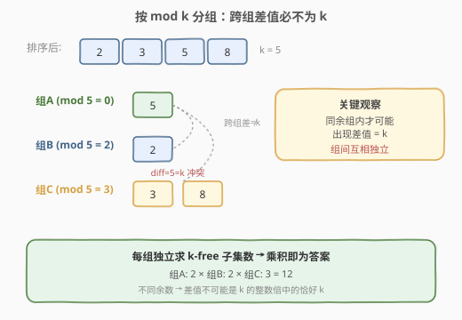
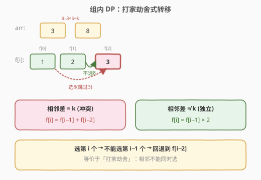

# LeetCode 统计K-Free子集的总数 题解

## 1. 题目概述

- **标题 / 题号**：统计K-Free子集的总数（#2638，medium）
- **链接**：https://leetcode.cn/problems/count-the-number-of-k-free-subsets/
- **难度**：中等
- **标签**：数组、数学、动态规划、组合数学、排序

> ⚠️ 本题为 LeetCode 付费题，题意描述根据官方示例用例与 hints 重建，可能与官方题面有出入。

**题意**：给定一个包含 **无重复** 元素的整数数组 `nums` 和一个整数 `k`。

如果一个子集中 **不** 存在两个差的绝对值等于 `k` 的元素，则称其为 **k-Free** 子集。注意，空集是一个 k-Free 子集。

返回 `nums` 中 k-Free 子集的数量。一个数组的 **子集** 是该数组中的元素的选择（可能为零个）。

**示例 1**：

```text
输入：nums = [5,4,6], k = 1
输出：5
解释：有 5 个合法子集：{}, {5}, {4}, {6} 和 {4, 6}。
```

**示例 2**：

```text
输入：nums = [2,3,5,8], k = 5
输出：12
解释：有 12 个合法子集：{}, {2}, {3}, {5}, {8}, {2, 3}, {2, 3, 5}, {2, 5}, {2, 5, 8},
{2, 8}, {3, 5} 和 {5, 8}。
```

**示例 3**：

```text
输入：nums = [10,5,9,11], k = 20
输出：16
解释：所有的子集都是有效的。由于子集的总数为 2^4 = 16，因此答案为 16。
```

**约束**：

- `1 <= nums.length <= 50`
- `1 <= nums[i] <= 1000`
- `1 <= k <= 1000`
- `nums` 中的元素互不相同

## 2. 解题思路

### 2.1 暴力思路

枚举 `nums` 的所有子集（共 $2^n$ 个），对每个子集检查是否存在两元素差的绝对值为 `k`。时间复杂度 $O(2^n \cdot n^2)$，`n = 50` 时直接爆掉，不可行。

### 2.2 核心观察：按 mod k 分组，组间互相独立



关键性质：两个数 $a, b$ 的差恰好为 $k$，等价于 $a \equiv b \pmod{k}$（且 $|a-b|=k$）。因此只有**同余**（对 $k$ 取模余数相同）的数才可能冲突；不同余数的数差值绝不可能是 $k$。

据此把 `nums` 排序后按 $x \bmod k$ 分组：

- 不同组的元素永远不会冲突 → **组与组之间互相独立**；
- 每组单独求「k-free 子集数」，最终答案是各组结果的**乘积**（乘法原理）。

### 2.3 组内 DP：打家劫舍式转移



同一组内元素已排序。对相邻两个元素 $arr[i-1], arr[i]$：

- 若 $arr[i] - arr[i-1] = k$：二者冲突，选了第 $i$ 个就不能选第 $i-1$ 个 → 转移退两格；
- 若 $arr[i] - arr[i-1] \neq k$：二者不冲突（同余但跨过了 $k$ 的倍数），互相独立。

设 $f[i]$ 为前 $i$ 个元素的 k-free 子集数，边界 $f[0] = 1$（空集），$f[1] = 2$（选或不选第 1 个）：

$$
f[i] = \begin{cases}
f[i-1] + f[i-2], & arr[i-1] - arr[i-2] = k \\
f[i-1] \times 2, & arr[i-1] - arr[i-2] \neq k
\end{cases}
$$

冲突情形即「打家劫舍」模型：相邻不能同时选，$f[i] = f[i-1] + f[i-2]$。

### 2.4 示例演算


以示例 2 `nums = [2,3,5,8], k = 5` 为例：

1. 排序：`[2,3,5,8]`；
2. 按 mod 5 分组：`mod=0 → {5}`、`mod=2 → {2}`、`mod=3 → {3,8}`；
3. 组内 DP：
   - `{5}`：$f = 2$；
   - `{2}`：$f = 2$；
   - `{3, 8}`：$8-3=5=k$，$f[0]=1, f[1]=2, f[2]=f[1]+f[0]=3$；
4. 乘积：$2 \times 2 \times 3 = 12$。

## 3. 参考代码

### C++

```cpp
class Solution {
  public:
    long long countTheNumOfKFreeSubsets(vector<int>& nums, int k) {
        sort(nums.begin(), nums.end());
        unordered_map<int, vector<int>> g;
        for (int x : nums) {
            g[x % k].push_back(x);
        }
        long long ans = 1;
        for (auto& [r, arr] : g) {
            int m = arr.size();
            vector<long long> f(m + 1);
            f[0] = 1;
            f[1] = 2;
            for (int i = 2; i <= m; i++) {
                if (arr[i - 1] - arr[i - 2] == k) {
                    f[i] = f[i - 1] + f[i - 2];
                } else {
                    f[i] = f[i - 1] * 2;
                }
            }
            ans *= f[m];
        }
        return ans;
    }
};
```

### Python

```python
class Solution:
    def countTheNumOfKFreeSubsets(self, nums: List[int], k: int) -> int:
        nums.sort()
        g = defaultdict(list)
        for x in nums:
            g[x % k].append(x)
        ans = 1
        for arr in g.values():
            m = len(arr)
            f = [0] * (m + 1)
            f[0] = 1
            f[1] = 2
            for i in range(2, m + 1):
                if arr[i - 1] - arr[i - 2] == k:
                    f[i] = f[i - 1] + f[i - 2]
                else:
                    f[i] = f[i - 1] * 2
            ans *= f[m]
        return ans
```

## 4. 复杂度分析

| 维度 | 复杂度 | 说明 |
|------|--------|------|
| 时间复杂度 | $O(n \log n)$ | 排序为主，组内 DP 合计遍历每个元素一次 $O(n)$ |
| 空间复杂度 | $O(n)$ | 分组哈希表与 DP 数组 |

## 5. 扩展：滚动数组优化空间

组内 DP 只依赖前两项，可将 $O(m)$ 数组压缩为两个滚动变量，使组内空间降为 $O(1)$，总空间为分组哈希表 $O(n)$。实现略。当 `n` 较大时该优化有意义；本题 `n <= 50`，数组版即可。

## 6. 面试要点

1. **为什么按 mod k 分组就能保证组间不冲突？**
   - 两个数差为 $k$ 必然同余（$a - b = k \Rightarrow a \equiv b \pmod{k}$）；逆否命题：不同余的数差值不可能是 $k$。

2. **同余组内，为什么相邻差不为 k 时转移是 $f[i-1] \times 2$？**
   - 同余但跨过 $k$ 的倍数意味着第 $i$ 个与第 $i-1$ 个不冲突，二者互相独立，第 $i$ 个选或不选都乘以 2。

3. **为什么答案取各组乘积而不是和？**
   - 组间互相独立（乘法原理）：每组各选一个 k-free 子集，组合起来仍是 k-free，方案数相乘。

4. **若 `nums` 含重复元素该如何处理？**
   - 题目保证无重复。若推广到有重复：相同值的元素互不冲突，可对每个值 $v$ 记频次 $c$，选它有 $2^c - 1$ 种（非空）方式，转移改为 $f[i] = f[i-1] + f[i-2] \cdot (2^{c_i} - 1)$。

5. **结果是否需要取模？**
   - 本题不取模，返回精确整数。`n <= 50` 时最坏全独立为 $2^{50}$，落在 64 位整数范围内（C++ 用 `long long`，Python 天然大整数）。

## 同类练习题

| # | 题目 | 与本题的关联 |
|---|------|-------------|
| 198 | [打家劫舍](https://leetcode.cn/problems/house-robber/) | 本组内 DP 的母题，$f[i]=f[i-1]+f[i-2]$ 的相邻不可同选模型 |
| 2597 | [美丽子集的数目](https://leetcode.cn/problems/the-number-of-beautiful-subsets/) | 几乎同构的免费题，子集中任意两元素差不为 $k$，含重复元素需额外处理频次 |
| 213 | [打家劫舍 II](https://leetcode.cn/problems/house-robber-ii/) | 打家劫舍的环形变体，拆环为线的分组思想与本题分组乘积异曲同工 |
