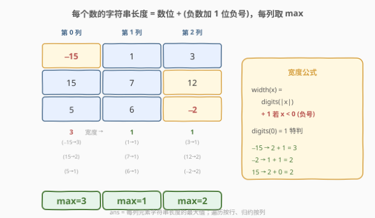
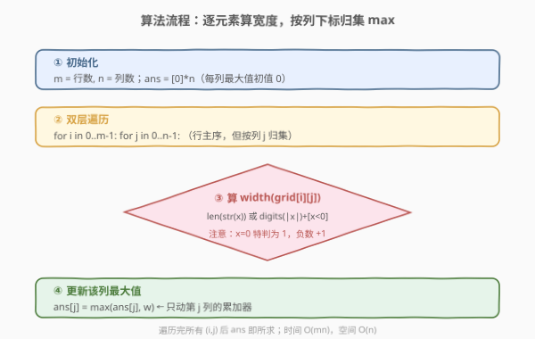
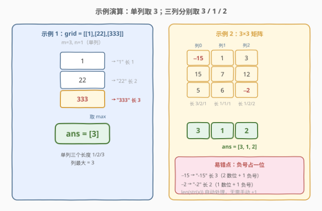

# 查询网格图中每一列的宽度

- **题目名称**：查询网格图中每一列的宽度
- **链接**：[2639. 查询网格图中每一列的宽度](https://leetcode.cn/problems/find-the-width-of-columns-of-a-grid/)
- **难度**：简单
- **标签**：数组、矩阵

## 1. 题目概述

给你一个下标从 $0$ 开始的 $m \times n$ 整数矩阵 `grid`。矩阵中**某一列的宽度**是这一列所有数字的**字符串长度**的最大值。请你返回一个大小为 $n$ 的整数数组 `ans`，其中 `ans[i]` 是第 $i$ 列的宽度。

> 一个整数 $x$ 若有 $\text{len}$ 个数位：非负时字符串长度为 $\text{len}$，负数时为 $\text{len} + 1$（多出负号 `-` 占一位）。

**示例 1**：

```text
输入：grid = [[1],[22],[333]]
输出：[3]
解释：第 0 列中，333 字符串长度为 3。
```

**示例 2**：

```text
输入：grid = [[-15,1,3],[15,7,12],[5,6,-2]]
输出：[3,1,2]
解释：
第 0 列中，只有 -15 字符串长度为 3。
第 1 列中，所有整数的字符串长度都是 1。
第 2 列中，12 和 -2 的字符串长度都为 2。
```

**约束条件**：

- $m == \text{grid.length}$，$n == \text{grid[i].length}$
- $1 \le m, n \le 100$
- $-10^{9} \le \text{grid[r][c]} \le 10^{9}$

> 💡 关键信号：规模 $m,n \le 100$，元素 $\le 10^9$（至多 $10$ 位数 $+ 1$ 负号 $= 11$ 字符）。没有效率压力，只要把「宽度 = 数位 $+$ 负号位」算对，并对每列取 $\max$ 即可。

---

## 2. 解题思路

### 2.1 直接思路：逐元素算长度、按列累加最大值

最直白的做法：开一个长度为 $n$ 的答案数组 `ans`（初始全 $0$），按行主序遍历矩阵的每个元素 $\text{grid[i][j]}$，计算它的字符串长度 $w$，再用 $w$ 去更新该列当前最大值 `ans[j] = max(ans[j], w)`。遍历结束，`ans` 即为所求。

这里唯一的「考点」是**怎么算一个整数的字符串长度**。两种等价方式：

1. **直接转字符串**：`to_string(x).size()` / `len(str(x))`。标准库会自动处理负号，写法最短、最不易错。
2. **数位计数**（数学法）：对 $|x|$ 反复除以 $10$ 计位数，再视 $x < 0$ 加 $1$ 位负号。不产生字符串对象，适合禁用字符串/注重常数开销的场景。

### 2.2 核心观察：宽度 = 数位 + 负号位；列向 reduce-max



把问题拆成两层：

**第一层：单个整数的宽度公式。**

设整数 $x$，其绝对值 $|x|$ 的十进制位数记作 $\text{digits}(x)$，则

$$
\text{width}(x) = \text{digits}(x) + \begin{cases} 1, & x < 0 \quad (\text{负号位}) \\ 0, & x \ge 0 \end{cases}
$$

其中 $\text{digits}(x)$ 可由「反复除以 $10$ 直到为 $0$」计数，但有一个**坑点**：$x = 0$ 时除法循环一次都不执行，会得到 $0$，而 `"0"` 的长度应为 $1$，故需特判 $\text{digits}(0) = 1$。

> ⚠️ **负号占位**是本题最易错处：`-15` 的字符串 `"-15"` 长度为 $3$（$2$ 数位 $+ 1$ 负号），而非 $2$。直接 `len(str(x))` 让库函数替你处理这个细节，是写代码时最稳妥的选择；数学法须手动 `+ (x < 0)`。

**第二层：列向 reduce-max。**

题目求的是**列**的宽度，与行无关。即对每个列下标 $j$：

$$
\text{ans}[j] = \max_{0 \le i < m} \text{width}\big(\text{grid[i][j]}\big)
$$

矩阵按行主序存储，遍历时外层走行、内层走列，但累加器按列下标 `ans[j]` 归集——**遍历方向是行主序，归约方向是列向**，二者解耦即可，不必真去转置矩阵。

> 💡 由约束 $-10^9 \le x \le 10^9$，最大宽度上界为 $-10^9 \to$ `"-1000000000"`，共 $11$ 字符，故 `ans` 每个元素 $\le 11$。

### 2.3 算法流程图



步骤：

1. 令 $m = \text{grid.length}$，$n = \text{grid[0].length}$，建答案数组 `ans` 长度 $n$，初值全 $0$；
2. 对每个行 $i \in [0, m)$、列 $j \in [0, n)$：
   - $w \gets \text{width}(\text{grid[i][j]})$（转字符串取长度，或数位计数 $+$ 负号位）；
   - $\text{ans}[j] \gets \max(\text{ans}[j],\; w)$；
3. 返回 `ans`。

### 2.4 示例演算



- **示例 1** `grid = [[1],[22],[333]]`（$m=3, n=1$，单列）：第 $0$ 列三个元素 `"1"`/`"22"`/`"333"` 长度分别为 $1,2,3$，取 $\max = 3$，故 `ans = [3]`。
- **示例 2** `grid = [[-15,1,3],[15,7,12],[5,6,-2]]`（$m=3, n=3$）：
  - 第 $0$ 列：`"-15"`(3)、`"15"`(2)、`"5"`(1) → $\max = 3$；
  - 第 $1$ 列：`"1"`(1)、`"7"`(1)、`"6"`(1) → $\max = 1$；
  - 第 $2$ 列：`"3"`(1)、`"12"`(2)、`"-2"`(2) → $\max = 2$；
  - 故 `ans = [3,1,2]`。注意 `"-2"` 长度为 $2$（$1$ 数位 $+ 1$ 负号），而非 $1$。

---

## 3. 参考代码

### C++

```cpp
class Solution {
public:
    vector<int> findColumnWidth(vector<vector<int>>& grid) {
        int m = grid.size(), n = grid[0].size();
        vector<int> ans(n, 0);
        for (int i = 0; i < m; ++i)
            for (int j = 0; j < n; ++j)
                ans[j] = max(ans[j], (int)to_string(grid[i][j]).size());
        return ans;
    }
};
```

> 💡 `to_string(x)` 对负数会自动带上 `-`，`.size()` 即得正确宽度，无需手动处理负号。这是最短、最不易错的写法。

**数位计数版（避免字符串分配）**：

```cpp
class Solution {
    int width(int x) {
        if (x == 0) return 1;        // 特判：0 的长度为 1
        int d = 0, t = abs(x);
        while (t) { ++d; t /= 10; }  // 数 |x| 的位数
        return d + (x < 0 ? 1 : 0);  // 负号多占 1 位
    }
public:
    vector<int> findColumnWidth(vector<vector<int>>& grid) {
        int m = grid.size(), n = grid[0].size();
        vector<int> ans(n, 0);
        for (int i = 0; i < m; ++i)
            for (int j = 0; j < n; ++j)
                ans[j] = max(ans[j], width(grid[i][j]));
        return ans;
    }
};
```

### Python

```python
class Solution:
    def findColumnWidth(self, grid: List[List[int]]) -> List[int]:
        m, n = len(grid), len(grid[0])
        ans = [0] * n
        for i in range(m):
            for j in range(n):
                ans[j] = max(ans[j], len(str(grid[i][j])))
        return ans
```

> 💡 `str(-15)` 直接得 `"-15"`，`len` 为 $3$，负号自动计入。

**Pythonic 转置版（`zip(*grid)` 按列迭代）**：

```python
class Solution:
    def findColumnWidth(self, grid: List[List[int]]) -> List[int]:
        return [max(len(str(x)) for x in col) for col in zip(*grid)]
```

> 💡 `zip(*grid)` 把「行列表」解包成「列迭代器」，外层直接遍历每一列、内层对列元素取 `max(len(str(x)))`，一行表达完「列向 reduce-max」。语义与双层循环完全等价，但更贴近问题的列向本质。

---

## 4. 复杂度分析

| 维度 | 复杂度 | 说明 |
|------|--------|------|
| **时间复杂度** | $O(m \cdot n \cdot L)$ | 共 $mn$ 个元素，每个算宽度需 $O(L)$，$L \le 11$（$10^9$ 位数 $+$ 负号）为常数，故可写作 $O(mn)$ |
| **空间复杂度** | $O(n)$ | 答案数组 `ans` 长 $n$（不计输出则 $O(1)$）；转字符串版额外 $O(L)=O(1)$ 临时串 |

> 💡 $L \le 11$ 是常数，所以无论转字符串还是数位计数，单元素开销都是 $O(1)$，总时间 $O(mn)$ 即遍历一遍矩阵的线性复杂度。$m,n \le 100 \Rightarrow mn \le 10^4$，远低于时限。

---

## 5. 扩展：宽度定义的变体与列向归约泛化

本题是「**矩阵列向归约**」的最朴素实例：把每列的元素用一个 $\max$ 聚合成一个标量。把聚合算子换一换、把「宽度」定义改一改，就是一整族题目：

- **聚合算子替换**：列向 $\max$ → 列向 $\text{sum}$、$\text{min}$、计数等。例如「每列元素之和」即对 `ans[j]` 做累加而非取 $\max$。
- **宽度定义替换**：字符串长度 → 数位和、二进制中 $1$ 的个数、绝对值等。把 `len(str(x))` 换成 `sum(int(c) for c in str(abs(x)))` 即得「每列最大数位和」。
- **方向替换**：列向 → 行向，即对每行做归约，遍历方向与归约方向一致（更 cache-friendly）。

实现上，列向归约有两种范式：**行主序遍历 $+$ 按列下标归集**（本题主流写法，无需转置，零额外空间）与**先转置再行向归约**（`zip(*grid)`，代码更直观但产生中间列迭代器）。当 $m,n$ 都小、追求可读性时转置写法优雅；当矩阵巨大、注重空间时行主序写法更省。

---

## 6. 面试要点

1. **一个负数的字符串长度为什么比它的位数多 1？**

   > 负号 `-` 本身占一个字符。`-15` 的字符串是 `"-15"`，共 $3$ 个字符（$2$ 数位 $+ 1$ 负号）。`len(str(x))` 让库函数处理；数学法须在位数基础上 `+ (x < 0 ? 1 : 0)`。

2. **数位计数法为什么要把 $0$ 单独特判？**

   > `while (t) { ++d; t /= 10; }` 对 $t = 0$ 一次都不执行，得到 $d = 0$，但 `"0"` 长度应为 $1$。故需 `if (x == 0) return 1;`。这是手写数位计数最常见的 off-by-one 坑。

3. **为什么按行遍历却能得到列的结果？**

   > 遍历方向（行主序）与归约方向（列向）是解耦的。每个元素 $\text{grid[i][j]}$ 只更新它所属列 `ans[j]` 的累加器，遍历完所有行后，每列的 $\max$ 自然汇集完成，无需真正转置矩阵。

4. **转字符串和数位计数两种实现各有何取舍？**

   > 转字符串写法最短、负号自动处理、不易错，是首选；但它会为每个元素分配一个临时字符串对象（$O(L)$ 临时空间，$L \le 11$ 为常数）。数位计数法不分配字符串、纯整数运算，常数更小、更底层，适合禁用字符串或追求极致常数的场景，但要手动处理 $0$ 与负号两个边界。

5. **`zip(*grid)` 这版 Python 写法的复杂度和正确性如何？**

   > `zip(*grid)` 把行列表解包成列迭代器，对每列做 `max(len(str(x)) for x in col)`，时间仍是 $O(mn)$、空间 $O(n)$（输出）。它把「列向」语义写得更直白，但 `*grid` 解包要求所有行等长（矩阵本就等长，成立）。等价于双层循环，仅风格不同。

> 💡 **一句话总结**：2639 = 「对每列取元素字符串长度的 $\max$」。宽度公式 $\text{width}(x) = \text{digits}(|x|) + [x<0]$，$0$ 特判为 $1$；行主序遍历、按列下标归集 $\max$，$O(mn)$ 一次过。

---

## 7. 同类练习题

- [867. 转置矩阵](https://leetcode.cn/problems/transpose-matrix/)：矩阵行列互换的母题，本题「列向归约」可看作「转置后逐行处理」的退化版，对照「真转置 vs 假转置（按列下标归集）」
- [566. 重塑矩阵](https://leetcode.cn/problems/reshape-the-matrix/)：矩阵形状变换与行列主序映射，巩固「行主序下标 $\leftrightarrow$ 二维坐标」换算
- [1252. 奇数值单元格的数目](https://leetcode.cn/problems/cells-with-odd-values-in-a-matrix/)：对整行/整列批量增量后再统计，同属矩阵行列级处理
- [1572. 矩阵对角线元素的和](https://leetcode.cn/problems/matrix-diagonal-sum/)：按「行列下标关系」选取元素求和，对照本题按固定列下标选取元素取 $\max$
- [766. 托普利茨矩阵](https://leetcode.cn/problems/toeplitz-matrix/)：按对角线方向遍历矩阵，对照本题按列方向遍历，巩固矩阵不同遍历方向的处理
