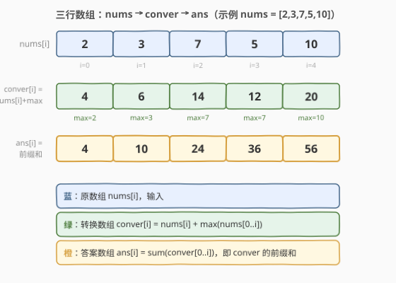
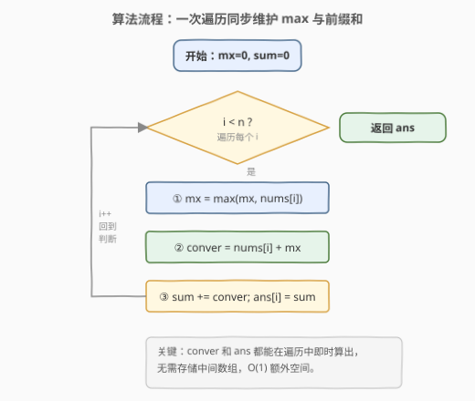

# LeetCode 一个数组所有前缀的分数 题解

## 1. 题目概述

- **标题 / 题号**：一个数组所有前缀的分数（#2640，medium）
- **链接**：https://leetcode.cn/problems/find-the-score-of-all-prefixes-of-an-array/
- **难度**：中等
- **标签**：数组、前缀和

**题意**：定义一个数组 `arr` 的 **转换数组** `conver` 为：

- `conver[i] = arr[i] + max(arr[0..i])`，其中 `max(arr[0..i])` 是满足 $0 \le j \le i$ 的所有 `arr[j]` 中的最大值。

定义一个数组 `arr` 的 **分数** 为 `arr` 转换数组中所有元素的和。

给你一个下标从 **0** 开始长度为 $n$ 的整数数组 `nums`，请你返回一个长度为 $n$ 的数组 `ans`，其中 `ans[i]` 是前缀 `nums[0..i]` 的分数。

**示例 1**：

```text
输入：nums = [2,3,7,5,10]
输出：[4,10,24,36,56]
解释：
对于前缀 [2]，转换数组为 [4]，所以分数为 4。
对于前缀 [2, 3]，转换数组为 [4, 6]，所以分数为 10。
对于前缀 [2, 3, 7]，转换数组为 [4, 6, 14]，所以分数为 24。
对于前缀 [2, 3, 7, 5]，转换数组为 [4, 6, 14, 12]，所以分数为 36。
对于前缀 [2, 3, 7, 5, 10]，转换数组为 [4, 6, 14, 12, 20]，所以分数为 56。
```

**示例 2**：

```text
输入：nums = [1,1,2,4,8,16]
输出：[2,4,8,16,32,64]
解释：
对于前缀 [1]，转换数组为 [2]，所以分数为 2。
对于前缀 [1, 1]，转换数组为 [2, 2]，所以分数为 4。
对于前缀 [1, 1, 2]，转换数组为 [2, 2, 4]，所以分数为 8。
对于前缀 [1, 1, 2, 4]，转换数组为 [2, 2, 4, 8]，所以分数为 16。
对于前缀 [1, 1, 2, 4, 8]，转换数组为 [2, 2, 4, 8, 16]，所以分数为 32。
对于前缀 [1, 1, 2, 4, 8, 16]，转换数组为 [2, 2, 4, 8, 16, 32]，所以分数为 64。
```

**约束**：

- $1 \le \text{nums.length} \le 10^5$
- $1 \le \text{nums[i]} \le 10^9$

> 💡 关键信号：每个 `conver[i]` 依赖「前缀最大值」，而 `ans[i]` 是 `conver` 的前缀和——两个依赖都可以在单次遍历中增量维护，无需回头扫描。

## 2. 解题思路

### 2.1 暴力思路

对每个前缀 `nums[0..i]`，独立计算转换数组的每个元素再求和。外层遍历 $i = 0 \dots n-1$，内层对每个 $i$ 重新扫描 $j = 0 \dots i$ 求 `max` 并累加 `conver[j]`。时间复杂度 $O(n^2)$，在 $n = 10^5$ 下必然超时。

### 2.2 核心观察：前缀最大值 + 前缀和，一次遍历



将问题拆成两个可增量维护的量：

1. **前缀最大值** `mx`：`mx = max(mx, nums[i])`，每步只需和上一个 `mx` 比一次，$O(1)$ 更新。
2. **转换数组的前缀和** `sum`：`conver[i] = nums[i] + mx`，`sum += conver[i]`，`ans[i] = sum`。

关键在于：`ans[i]` 就是 `conver` 数组的前缀和，即 $ans[i] = ans[i-1] + conver[i]$。而 `conver[i]` 只依赖 `nums[i]` 和当前的 `mx`——两者都能在遍历到 $i$ 时即时得出，**无需存储整个 `conver` 数组**。

### 2.3 算法流程图



三步循环体：
1. 更新前缀最大值：`mx = max(mx, nums[i])`
2. 计算转换值：`conver = nums[i] + mx`
3. 累加并写入答案：`sum += conver`；`ans[i] = sum`

### 2.4 示例演算

![示例演算：nums = [2,3,7,5,10]](../images/p2640_example_walkthrough.svg)

以示例 1 `nums = [2, 3, 7, 5, 10]` 为例：

| 步 $i$ | nums[i] | max(0..i) | conver[i] = nums[i] + max | ans[i] = 前缀和 |
|:------:|:-------:|:---------:|:------------------------:|:----------------:|
| 0 | 2 | 2 | 2 + 2 = 4 | 4 |
| 1 | 3 | 3 | 3 + 3 = 6 | 4 + 6 = 10 |
| 2 | 7 | 7 | 7 + 7 = 14 | 10 + 14 = 24 |
| 3 | 5 | 7 | 5 + 7 = 12 | 24 + 12 = 36 |
| 4 | 10 | 10 | 10 + 10 = 20 | 36 + 20 = 56 |

结果 `ans = [4, 10, 24, 36, 56]` ⭐。注意第 3 步 `nums[3]=5 < max=7`，`max` 不变但 `conver` 仍用当前 `max=7`。

## 3. 参考代码

### C++

```cpp
class Solution {
  public:
    vector<long long> findPrefixScore(vector<int>& nums) {
        int n = nums.size();
        vector<long long> ans(n);
        long long mx = 0, sum = 0;
        for (int i = 0; i < n; ++i) {
            mx = max(mx, (long long)nums[i]);
            sum += nums[i] + mx;
            ans[i] = sum;
        }
        return ans;
    }
};
```

### Python

```python
class Solution:
    def findPrefixScore(self, nums: List[int]) -> List[int]:
        n = len(nums)
        ans = [0] * n
        mx = 0
        s = 0
        for i in range(n):
            mx = max(mx, nums[i])
            s += nums[i] + mx
            ans[i] = s
        return ans
```

> ⚠️ **溢出注意**：$n \le 10^5$、$nums[i] \le 10^9$，每个 `conver[i]` 最大约 $2 \times 10^9$（超出 `int` 范围 $2.1 \times 10^9$），累加和 `sum` 最大约 $2 \times 10^{14}$（远超 `int`）。C++ 必须用 `long long`，Python 整数无溢出问题。`mx` 也需提升为 `long long` 以避免 `max` 比较时隐式截断。

## 4. 复杂度分析

| 维度 | 复杂度 | 说明 |
|------|--------|------|
| 时间复杂度 | $O(n)$ | 单次遍历，每步 $O(1)$：取 max、加法、赋值 |
| 空间复杂度 | $O(1)$ | 额外空间仅 `mx` 和 `sum` 两个变量；输出数组不计入 |

## 5. 扩展：若要求任意区间 $[l, r]$ 的分数差

`ans[r] - ans[l-1]` 给出前缀 `nums[0..r]` 与 `nums[0..l-1]` 的分数之差，但这**不等于**子数组 `nums[l..r]` 的分数——因为 `conver` 的定义依赖于「从 0 开始的前缀最大值」，子数组的最大值序列会重新计算。若要支持任意子数组的分数查询，需要用**稀疏表（ST 表）**预处理区间最大值，再对子数组逐位求 `conver` 并累加，复杂度为 $O(n \log n)$ 预处理 + $O(r-l+1)$ 单次查询，本质上是另一道题。

## 6. 面试要点

1. **`ans` 和 `conver` 是什么关系？**

   > `ans` 就是 `conver` 数组的前缀和：$ans[i] = \sum_{j=0}^{i} conver[j]$。因此 $ans[i] = ans[i-1] + conver[i]$，无需对每个前缀从头求和。

2. **为什么可以不存 `conver` 数组？**

   > `conver[i]` 只依赖 `nums[i]` 和前缀最大值 `mx`，二者在遍历到 $i$ 时已知。算出 `conver[i]` 后立刻累加进 `sum` 并写入 `ans[i]`，之后不再需要单独的 `conver[i]`，所以可以即算即弃。

3. **前缀最大值怎么维护？**

   > 增量更新：`mx = max(mx, nums[i])`。因为 `max(nums[0..i]) = max(max(nums[0..i-1]), nums[i])`，只需与上一步的 `mx` 比一次，$O(1)$。

4. **数据范围下为什么必须用 `long long`？**

   > `nums[i]` 最大 $10^9$，`mx` 最大也是 $10^9$，`conver[i]` 最大 $2 \times 10^9$ 已超 `int` 上限（$2{,}147{,}483{,}647$）。$n$ 个 `conver` 累加最大 $2 \times 10^{14}$，必须用 64 位整数。

5. **示例 2 中 `ans` 恰好是 $2$ 的幂序列，是巧合吗？**

   > 是输入特殊导致的。`nums = [1,1,2,4,8,16]` 是严格递增的，所以 `max(0..i) = nums[i]`，`conver[i] = 2 * nums[i]`，而 `nums` 本身是 $2$ 的幂，累加后 `ans` 也是 $2$ 的幂。换一组非递增输入（如示例 1）就不会有此规律。

> 💡 **一句话总结**：2640 = 「前缀最大值 + 转换数组前缀和」两个增量量的乘积——`mx` 管 max，`sum` 管 conver 的累加，一次遍历 $O(n)$/$O(1)$ 搞定。

## 同类练习题

| # | 题目 | 与本题的关联 |
|---|------|-------------|
| 303 | [区域和检索 - 数组不可变](https://leetcode.cn/problems/range-sum-query-immutable/) | 前缀和基础模板，`conver` 的前缀和思想直接源于此 |
| 1732 | [找到最高海拔](https://leetcode.cn/problems/find-the-highest-altitude/) | 前缀和 + 维护前缀最大值的简单应用，与本题「增量维护 max」同源 |
| 1413 | [逐步求和得到正数的最小值](https://leetcode.cn/problems/minimum-value-to-get-positive-step-by-step-sum/) | 前缀和的单次遍历维护，关注累加过程中的极值 |
| 724 | [寻找数组的中心下标](https://leetcode.cn/problems/find-pivot-index/) | 前缀和 + 总和求左右两侧和，前缀和的判定型应用 |
