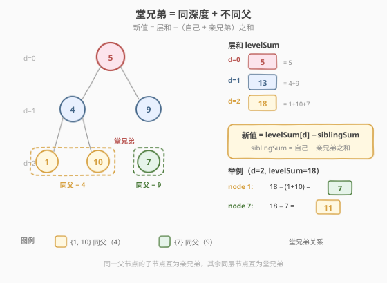
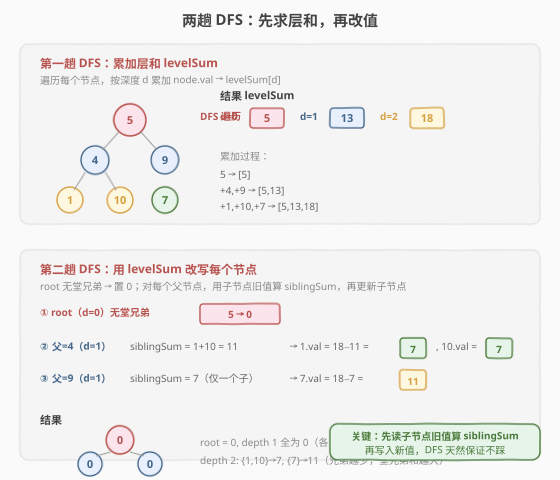
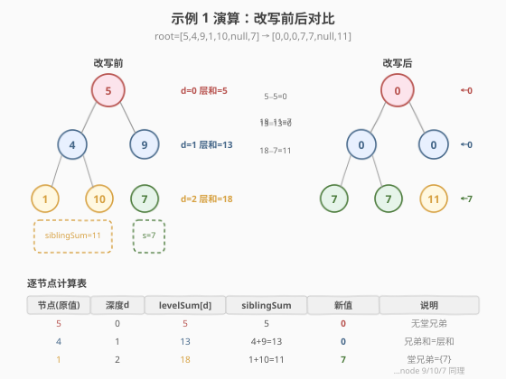

# 二叉树的堂兄弟节点 II

- **题目名称**：二叉树的堂兄弟节点 II
- **链接**：[2641. 二叉树的堂兄弟节点 II](https://leetcode.cn/problems/cousins-in-binary-tree-ii/)
- **难度**：中等
- **标签**：树、深度优先搜索、广度优先搜索、哈希表、二叉树

## 1. 题目概述

给你一棵二叉树的根 `root`，请你将**每个节点的值**替换成该节点的所有**堂兄弟节点值之和**。

如果两个节点在树中有**相同的深度**且它们的**父节点不同**，那么它们互为**堂兄弟**。

> 💡 **堂兄弟的定义**（与 [993. 二叉树的堂兄弟节点](../0901-1000/993_二叉树的堂兄弟节点.md) 一致）：同层 + 不同父。亲兄弟（同父）不是堂兄弟。

**示例 1**：

```text
输入：root = [5,4,9,1,10,null,7]
        5
      /   \
     4     9
    / \     \
   1   10    7
输出：[0,0,0,7,7,null,11]
解释：
- 5 无堂兄弟 → 0
- 4、9 无堂兄弟（各自兄弟和 = 整层和）→ 0
- 1 的堂兄弟只有 7 → 7
- 10 的堂兄弟只有 7 → 7
- 7 的堂兄弟是 1 和 10 → 11
```

**示例 2**：

```text
输入：root = [3,1,2]
     3
   /   \
  1     2
输出：[0,0,0]
解释：1 和 2 互为堂兄弟，但堂兄弟和 = 1+2 = 3，而各自 siblingSum = 3，所以 3−3 = 0。
```

**约束条件**：

- 树中节点数 $n$ 满足 $1 \le n \le 10^5$
- $1 \le \text{Node.val} \le 10^4$

> 💡 **关键语义**：① 堂兄弟和 = 同层所有节点值之和 −（自己 + 亲兄弟之和）。② 根节点（深度 0）无堂兄弟，值必为 0。③ 一个节点的亲兄弟越少，它的堂兄弟和越大（极端：独子节点的堂兄弟和 = 整层其余之和）。

---

## 2. 解题思路

### 2.1 暴力思路：逐节点枚举堂兄弟

对每个节点，BFS/DFS 找到同深度、不同父的所有节点，求和替换。朴素做法需要为每个节点扫描一遍同层节点。

```text
for each node u:
    sum = 0
    for each node v at same depth as u:
        if v.parent != u.parent:
            sum += v.val
    u.new_val = sum
```

问题：最坏情况（满二叉树最宽层约 $n/2$ 个节点），每个节点扫描同层 $\approx n/2$ 个，合计 $O(n^2)$，$n = 10^5$ 时约 $2.5 \times 10^9$，超时。需要把「逐节点枚举」优化为「按层批量计算」。

### 2.2 核心观察：层和减去兄弟和 = 堂兄弟和



**关键公式**：对于深度 $d$ 的节点 $u$，

$$\text{cousinSum}(u) = \text{levelSum}[d] - \text{siblingSum}(u)$$

其中 $\text{levelSum}[d]$ 是深度 $d$ 所有节点值之和，$\text{siblingSum}(u)$ 是 $u$ 及其亲兄弟（同父节点）的值之和。

> 💡 **为什么对？** 同层节点按父节点分成若干**兄弟组**，每个组内的节点互为亲兄弟。堂兄弟 = 同层但不在同一组。所以堂兄弟和 = 整层和 − 本组之和。这是「**补集思想**」——不求「谁是堂兄弟」，而用「整层 − 亲兄弟」一步到位。

由此得到**两趟 DFS**：

1. **第一趟**：DFS 遍历整棵树，按深度累加 $\text{levelSum}[d]$。
2. **第二趟**：对每个父节点，用它子节点的**旧值**算出 $\text{siblingSum}$，再把子节点的新值设为 $\text{levelSum}[d+1] - \text{siblingSum}$。

> ⚠️ **时序陷阱**：第二趟中，必须**先读子节点旧值算 siblingSum，再写入新值**，最后才递归子节点。由于每个节点的 siblingSum 只读自己的**子节点**（下一层），而新值是父节点写入的，DFS 天然保证「写新值」和「读旧值算下一层 siblingSum」不会互相踩踏——因为读取的是再下一层（孙辈），尚未被修改。

### 2.3 算法流程图



1. **第一趟 DFS**（`dfs1(node, depth)`）：
   - 若 `depth == levelSum.size()`，`levelSum.push_back(0)` 扩容。
   - `levelSum[depth] += node->val`。
   - 递归左右子树 `depth + 1`。

2. **第二趟 DFS**（`dfs2(node, depth)`）：
   - `root->val = 0`（根无堂兄弟）。
   - `childSum = (left ? left->val : 0) + (right ? right->val : 0)`（**旧值**）。
   - 若 `left`：`left->val = levelSum[depth+1] - childSum`。
   - 若 `right`：`right->val = levelSum[depth+1] - childSum`。
   - 递归左右子树 `depth + 1`（此时子节点已是新值，但递归读的是孙辈旧值，安全）。

### 2.4 示例演算



以示例 1 `root = [5,4,9,1,10,null,7]` 演算：

**第一趟**：`levelSum = [5, 13, 18]`

| 深度 | 节点 | levelSum[d] |
|------|------|-------------|
| 0 | 5 | 5 |
| 1 | 4, 9 | 13 |
| 2 | 1, 10, 7 | 18 |

**第二趟**：

| 节点(原值) | 深度 d | levelSum[d] | siblingSum | 新值 | 说明 |
|-----------|--------|-------------|------------|------|------|
| 5 | 0 | 5 | 5 | **0** | 无堂兄弟 |
| 4 | 1 | 13 | 4+9=13 | **0** | 兄弟和=层和 |
| 9 | 1 | 13 | 4+9=13 | **0** | 同上 |
| 1 | 2 | 18 | 1+10=11 | **7** | 堂兄弟={7} |
| 10 | 2 | 18 | 1+10=11 | **7** | 堂兄弟={7} |
| 7 | 2 | 18 | 7 | **11** | 堂兄弟={1,10} |

最终结果 `[0,0,0,7,7,null,11]` ✓

> 💡 **对称性观察**：同一兄弟组内的所有节点获得相同的新值（因为 siblingSum 相同）。所以 1 和 10 的结果都是 7，而 7（独子）的结果是 11——亲兄弟越少，堂兄弟和越大。

---

## 3. 参考代码

### C++

```cpp
class Solution {
  public:
    TreeNode* replaceValueInTree(TreeNode* root) {
        // 第一趟 DFS：累加每层之和
        vector<int> levelSum;
        function<void(TreeNode*, int)> dfs1 = [&](TreeNode* node, int depth) {
            if (!node) return;
            if (depth == (int)levelSum.size()) levelSum.push_back(0);
            levelSum[depth] += node->val;
            dfs1(node->left, depth + 1);
            dfs1(node->right, depth + 1);
        };
        dfs1(root, 0);

        // 第二趟 DFS：用层和改写每个节点
        root->val = 0;                                   // 根无堂兄弟
        function<void(TreeNode*, int)> dfs2 = [&](TreeNode* node, int depth) {
            if (!node) return;
            int childSum = 0;                            // 先读子节点旧值
            if (node->left)  childSum += node->left->val;
            if (node->right) childSum += node->right->val;
            if (node->left)                                 // 再写新值
                node->left->val = levelSum[depth + 1] - childSum;
            if (node->right)
                node->right->val = levelSum[depth + 1] - childSum;
            dfs2(node->left, depth + 1);                   // 递归（读孙辈旧值，安全）
            dfs2(node->right, depth + 1);
        };
        dfs2(root, 0);

        return root;
    }
};
```

> ⚠️ **易错点**：(1) 第二趟必须**先算 childSum 再写新值**——若先写 `left->val` 再读 `right->val` 凑 childSum 就会读到被自己改过的值（虽然本例左右互不影响，但顺序规范可防逻辑混乱）。(2) 根节点要单独置 0，不能放进 dfs2 递归（它没有「父节点」来算 siblingSum）。(3) `levelSum[depth+1]` 访问前确保 `depth+1 < levelSum.size()`——若 node 是叶子则无子节点，不会触发访问，安全。

### Python

```python
from typing import Optional


class Solution:
    def replaceValueInTree(self, root: Optional[TreeNode]) -> Optional[TreeNode]:
        # 第一趟 DFS：累加每层之和
        level_sum = []

        def dfs1(node, depth):
            if not node:
                return
            if depth == len(level_sum):
                level_sum.append(0)
            level_sum[depth] += node.val
            dfs1(node.left, depth + 1)
            dfs1(node.right, depth + 1)

        dfs1(root, 0)

        # 第二趟 DFS：用层和改写每个节点
        root.val = 0                                   # 根无堂兄弟

        def dfs2(node, depth):
            if not node:
                return
            child_sum = 0                              # 先读子节点旧值
            if node.left:
                child_sum += node.left.val
            if node.right:
                child_sum += node.right.val
            if node.left:                              # 再写新值
                node.left.val = level_sum[depth + 1] - child_sum
            if node.right:
                node.right.val = level_sum[depth + 1] - child_sum
            dfs2(node.left, depth + 1)                 # 递归（读孙辈旧值，安全）
            dfs2(node.right, depth + 1)

        dfs2(root, 0)

        return root
```

> 💡 Python 中闭包对 `level_sum`（`list`）的引用是天然可变的，无需 `nonlocal`；若要在闭包内重新赋值 `level_sum = ...` 才需 `nonlocal`。C++ 用 `function` + lambda 捕获 `[&]` 引用 `levelSum`。

---

## 4. 复杂度分析

| 维度 | 复杂度 | 说明 |
|------|--------|------|
| 时间复杂度 | $O(n)$ | 两趟 DFS 各遍历每个节点一次，合计 $2n$ 次访问，$O(n)$ |
| 空间复杂度 | $O(n)$ | `levelSum` 存 $L$ 个层和 $\le n$；DFS 递归栈深度 $O(h)$，$h$ 为树高（链状 $h=n$，平衡 $h=\log n$） |
| 对照：暴力枚举 | $O(n^2)$ | 每个节点扫描同层所有节点，最宽层 $\approx n/2$ |

> 💡 本题最大层和 $\le \lceil n/2 \rceil \times 10^4 \approx 5 \times 10^8$，未超 32 位 `int` 上界（$\approx 2.1 \times 10^9$），故 C++ 用 `int` 即可，无需 `long long`（对照 [2583](../2501-2600/2583_二叉树中的第K大层和.md) 因 val 上界 $10^6$ 而必须 `long long`）。

---

## 5. 扩展：单趟 BFS（省去第一趟）

两趟 DFS 直观且与官方 hint 一致，但可以**合并为单趟 BFS**：在处理第 $d$ 层时，遍历所有节点算出各自的 `childSum`（子节点旧值之和），这些 `childSum` 的总和**恰好等于** $\text{levelSum}[d+1]$（下一层所有节点值之和）。所以无需预存 `levelSum`，在同一轮内「先算全部 childSum + 累加 nextLevelSum → 再统一更新子节点」即可。

```cpp
class Solution {
  public:
    TreeNode* replaceValueInTree(TreeNode* root) {
        queue<TreeNode*> q;
        q.push(root);
        root->val = 0;
        while (!q.empty()) {
            int size = q.size();
            long nextLevelSum = 0;                  // 下一层层和 = 所有 childSum 之和
            vector<pair<TreeNode*, int>> rec;       // (node, childSum)
            for (int i = 0; i < size; ++i) {
                TreeNode* node = q.front(); q.pop();
                int childSum = 0;
                if (node->left)  childSum += node->left->val;
                if (node->right) childSum += node->right->val;
                rec.push_back({node, childSum});
                nextLevelSum += childSum;           // 累加得 levelSum[d+1]
                if (node->left)  q.push(node->left);
                if (node->right) q.push(node->right);
            }
            for (auto& [node, childSum] : rec) {    // 统一更新子节点
                if (node->left)
                    node->left->val = nextLevelSum - childSum;
                if (node->right)
                    node->right->val = nextLevelSum - childSum;
            }
        }
        return root;
    }
};
```

```python
from collections import deque
from typing import Optional


class Solution:
    def replaceValueInTree(self, root: Optional[TreeNode]) -> Optional[TreeNode]:
        q = deque([root])
        root.val = 0
        while q:
            size = len(q)
            next_level_sum = 0                       # 下一层层和
            rec = []                                 # (node, child_sum)
            for _ in range(size):
                node = q.popleft()
                child_sum = 0
                if node.left:
                    child_sum += node.left.val
                if node.right:
                    child_sum += node.right.val
                rec.append((node, child_sum))
                next_level_sum += child_sum         # 累加得 levelSum[d+1]
                if node.left:
                    q.append(node.left)
                if node.right:
                    q.append(node.right)
            for node, child_sum in rec:             # 统一更新子节点
                if node.left:
                    node.left.val = next_level_sum - child_sum
                if node.right:
                    node.right.val = next_level_sum - child_sum
        return root
```

| 维度 | 两趟 DFS | 单趟 BFS |
|------|----------|----------|
| 时间 | $O(n)$ | $O(n)$ |
| 空间 | $O(n)$（`levelSum` + 递归栈） | $O(n)$（队列 + `rec` 临时数组） |
| 遍历次数 | 2 次 | 1 次 |
| 代码量 | 稍长（两趟） | 稍长（两阶段循环） |

> 💡 **何时选 BFS？** 当不想预存 `levelSum` 数组、或树非常深（DFS 递归栈溢出风险）时选 BFS。核心洞察是 `Σ childSum = levelSum[d+1]`，这使得「层和」可以在同层处理中「边算边得」，无需提前收集。两趟 DFS 更贴合官方 hint 且逻辑更清晰，面试中先给两趟 DFS，再口述单趟 BFS 的优化即可。

---

## 6. 面试要点

1. **堂兄弟和的公式是怎么来的？为什么要用补集思想？**

   > 同层节点按父节点分成若干兄弟组。堂兄弟 = 同层但不在同一组。所以堂兄弟和 = 整层和 − 本组之和。用补集避免逐个枚举「谁是堂兄弟」，将 $O(n^2)$ 降为 $O(n)$。关键洞察：siblingSum（亲兄弟之和）只需要父节点就能算，无需全局信息。

2. **第二趟 DFS 为什么不会读到被改过的旧值？**

   > 处理节点 $u$（深度 $d$）时，读取的是 $u$ 的**子节点**（深度 $d+1$）的旧值来算 siblingSum，然后写入子节点新值，最后递归。递归进入子节点后，读取的是**孙辈**（深度 $d+2$）的值——这些节点尚未被任何操作触及。新值只被「父节点」写入，而 siblingSum 只读「子节点」，两者操作的是不同层，DFS 的「先写后递归」天然保证了不踩踏。

3. **根节点为什么要单独处理？**

   > 根节点（深度 0）没有父节点，也就没有「亲兄弟」，siblingSum 无从计算。但根的堂兄弟和 = levelSum[0] − root.val = root.val − root.val = 0，所以直接 `root->val = 0`。之后 dfs2 从根开始，处理根的子节点（深度 1），它们的 siblingSum 由根的左右子树旧值算出。

4. **同一兄弟组的节点新值一定相同吗？为什么？**

   > 是的。同一兄弟组的节点共享相同的 siblingSum 和 levelSum[d]，所以新值 = levelSum[d] − siblingSum 完全一致。这解释了示例 1 中 1 和 10 的新值都是 7。推论：亲兄弟越少（siblingSum 越小），堂兄弟和越大——独子节点的堂兄弟和 = 整层其余之和，是同层最大的。

5. **单趟 BFS 的核心洞察是什么？**

   > $\sum \text{childSum} = \text{levelSum}[d+1]$。因为每个深度 $d+1$ 的节点恰好是某个深度 $d$ 节点的子节点，所以所有深度 $d$ 节点的 childSum 之和 = 深度 $d+1$ 所有节点值之和。这使得「层和」可以在处理当前层时「边算边得」，无需提前跑一趟 DFS 收集。代价是需要一个临时数组 `rec` 存储每对 (node, childSum)，先算完再统一更新，避免「边算边改」导致后续节点读到已改的值。

> 💡 **一句话总结**：堂兄弟和 = 层和 − 兄弟和（补集思想），两趟 DFS 先求层和再改值，$O(n)$ 一趟搞定。关键是「先读旧值算 siblingSum，再写新值」，DFS 天然保证不踩踏。

---

## 7. 同类练习题

- [993. 二叉树的堂兄弟节点](https://leetcode.cn/problems/cousins-in-binary-tree/)（[题解](../0901-1000/993_二叉树的堂兄弟节点.md)）：堂兄弟定义的母题，判定两个给定节点是否为堂兄弟（同深度不同父），本题是其「批量改写」版
- [102. 二叉树的层序遍历](https://leetcode.cn/problems/binary-tree-level-order-traversal/)（[题解](../0101-0200/102_二叉树的层序遍历.md)）：BFS `while + for(size)` 逐层处理模板，单趟 BFS 解法的骨架来源
- [1161. 最大层内元素和](https://leetcode.cn/problems/maximum-level-sum-of-a-binary-tree/)（[题解](../1101-1200/1161_最大层内元素和.md)）：逐层求和并取最大，对照「层和」概念的另一应用
- [2583. 二叉树中的第 K 大层和](https://leetcode.cn/problems/kth-largest-sum-in-a-binary-tree/)（[题解](../2501-2600/2583_二叉树中的第K大层和.md)）：BFS 逐层求和 + 排序取第 k 大，同样是「层和」家族题，注意该题 val 上界 $10^6$ 需 `long long`
