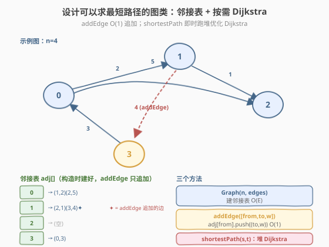
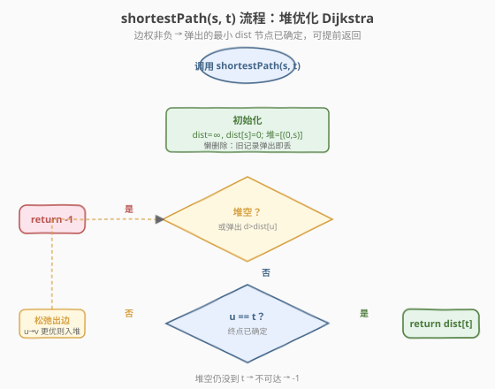
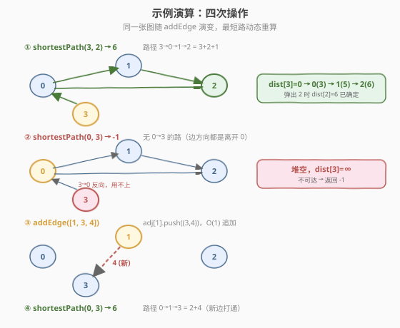

# 设计可以求最短路径的图类

- **题目名称**：设计可以求最短路径的图类
- **链接**：[2642. 设计可以求最短路径的图类](https://leetcode.cn/problems/design-graph-with-shortest-path-calculator/)
- **难度**：困难
- **标签**：图、设计、最短路径、堆/优先队列

## 1. 题目概述

给定一个有 `n` 个节点的**有向带权**图，节点编号 `0` 到 `n-1`。初始边由 `edges` 给出，`edges[i] = [from_i, to_i, edgeCost_i]`。要求实现一个 `Graph` 类：

- `Graph(int n, int[][] edges)`：初始化 `n` 个节点并装入初始边。
- `addEdge(int[] edge)`：向图中添加一条边 `edge = [from, to, edgeCost]`。数据保证添加前两节点间没有同向边。
- `int shortestPath(int node1, int node2)`：返回 `node1` 到 `node2` 的路径**最小**代价；若不可达返回 `-1`。路径代价为路径上所有边权之和。

**示例 1**：

```text
输入：
["Graph", "shortestPath", "shortestPath", "addEdge", "shortestPath"]
[[4, [[0, 2, 5], [0, 1, 2], [1, 2, 1], [3, 0, 3]]], [3, 2], [0, 3], [[1, 3, 4]], [0, 3]]
输出：
[null, 6, -1, null, 6]

解释：
Graph g = new Graph(4, [[0, 2, 5], [0, 1, 2], [1, 2, 1], [3, 0, 3]]);
g.shortestPath(3, 2); // 6。3 -> 0 -> 1 -> 2，代价 3 + 2 + 1 = 6。
g.shortestPath(0, 3); // -1。没有 0 到 3 的路径。
g.addEdge([1, 3, 4]); // 添加 1 -> 3 的边。
g.shortestPath(0, 3); // 6。0 -> 1 -> 3，代价 2 + 4 = 6。
```

**约束条件**：

- `1 <= n <= 100`
- `0 <= edges.length <= n * (n - 1)`
- `edges[i].length == edge.length == 3`
- `0 <= from_i, to_i, from, to, node1, node2 <= n - 1`
- `1 <= edgeCost_i, edgeCost <= 10^6`
- 图中任何时候都不会有重边和自环。
- 调用 `addEdge` 至多 `100` 次。
- 调用 `shortestPath` 至多 `100` 次。

> 💡 关键特征：边权全为正（`1 ~ 10^6`）、无重边自环、`n` 极小（`≤100`）、查询/加边次数都很少（`≤100`）。正权意味着 **Dijkstra** 适用；查询稀少意味着"按需重算"比"维护全源距离表"更自然。

---

## 2. 解题思路

### 2.1 暴力思路：每次查询重新建图 + BFS？

最朴素的联想是"图存下来，每次 `shortestPath` 跑一遍最短路"。但若边权都相等才适合 BFS（层数即距离，如 [腐烂的橘子](../0901-1000/994_腐烂的橘子.md)）；本题边权各异（`1` 与 `10^6` 并存），BFS 的"先入队 = 更近"失效——一条两段各 `1` 的路径可能比一条单段 `100` 的更短却排在更深层。

> ⚠️ 边权不等时 BFS 会得到错误最短路。让"当前已知距离最小的节点"优先出队，正是 **Dijkstra** 的核心。

### 2.2 核心观察：邻接表 + 堆优化 Dijkstra（按需查询）



这是 [743. 网络延迟时间](../0701-0800/743_网络延迟时间.md) 单源 Dijkstra 模板的设计类封装。数据结构选**邻接表**（稀疏图遍历出边只碰真实边，且 `addEdge` 可 `O(1)` 追加）：

- **`Graph(n, edges)`**：建 `adj` 数组，遍历 `edges` 填邻接表，`O(E)`。
- **`addEdge(edge)`**：`adj[from].push_back((to, w))`，`O(1)`。不维护任何距离表——新边到下次查询时自然生效。
- **`shortestPath(node1, node2)`**：以 `node1` 为源跑堆优化 Dijkstra，返回 `dist[node2]`（或 `-1`）。

> 💡 **为什么不在 `addEdge` 时预计算距离？** 查询/加边都不频繁（各 `≤100` 次），"按需重算"每次 `O(E log V)`，总开销远小于持续维护全源距离矩阵的代价，且实现极简——直接复用 743 的模板。这也是题目提示"Use Dijkstra's algorithm"的本意。

Dijkstra 三步走（边权非负保证贪心正确）：

1. `dist[s]=0`，其余 `∞`；堆 `[(0, s)]`。
2. 每次弹出 `(d, u)`：若 `d > dist[u]` 是过期记录，跳过（懒删除）；否则 `u` 的最短路已确定。
3. 松弛 `u` 的每条出边 `u→v(w)`：若 `d + w < dist[v]`，更新并入堆。
4. 弹出 `u == node2` 即可**提前返回** `dist[node2]`（终点已确定）；堆空仍未到则 `-1`。

### 2.3 算法流程图



### 2.4 示例演算



| 步骤 | 操作 | 结果 | 说明 |
|------|------|------|------|
| ① | `shortestPath(3, 2)` | `6` | 源 3：`dist[3]=0→0(3)→0(5)→1(5)→2(6)`。弹出 2 即确定，返回 6 |
| ② | `shortestPath(0, 3)` | `-1` | 源 0：只能到 1、2，堆空时 `dist[3]=∞`，返回 -1 |
| ③ | `addEdge([1, 3, 4])` | `null` | `adj[1]` 追加 `(3, 4)`，`O(1)` |
| ④ | `shortestPath(0, 3)` | `6` | 源 0：新边 1→3 打通，`0→1(2)→3(2+4=6)`，比无路时优，返回 6 |

> 💡 第 ① 步路径为 `3→0→1→2`（`3+2+1=6`），而非直边 `0→2(5)` 起的作用——注意源是 3 不是 0。第 ④ 步新边让原本不可达的 `0→3` 变得可达且最短，体现了"按需重算"能自动吸收 `addEdge` 的最新图状态。

---

## 3. 参考代码

### C++

```cpp
class Graph {
public:
    Graph(int n, vector<vector<int>>& edges) {
        adj.assign(n, {});
        for (auto& e : edges)
            adj[e[0]].push_back({e[1], e[2]});
    }

    void addEdge(vector<int> edge) {
        adj[edge[0]].push_back({edge[1], edge[2]});
    }

    int shortestPath(int node1, int node2) {
        const int INF = INT_MAX / 2;            // 防 d+w 溢出
        vector<int> dist(adj.size(), INF);
        dist[node1] = 0;

        priority_queue<pair<int,int>, vector<pair<int,int>>, greater<>> pq;
        pq.push({0, node1});

        while (!pq.empty()) {
            auto [d, u] = pq.top(); pq.pop();
            if (d > dist[u]) continue;          // 懒删除：过期记录
            if (u == node2) return d;           // 终点已确定，提前返回
            for (auto& [v, w] : adj[u]) {
                int nd = d + w;
                if (nd < dist[v]) {
                    dist[v] = nd;
                    pq.push({nd, v});
                }
            }
        }
        return -1;                              // 不可达
    }
private:
    vector<vector<pair<int,int>>> adj;          // adj[u] = {(v, w), ...}
};
```

### Python

```python
class Graph:
    def __init__(self, n: int, edges: List[List[int]]):
        self.adj = [[] for _ in range(n)]
        for f, t, c in edges:
            self.adj[f].append((t, c))

    def addEdge(self, edge: List[int]) -> None:
        self.adj[edge[0]].append((edge[1], edge[2]))

    def shortestPath(self, node1: int, node2: int) -> int:
        n = len(self.adj)
        INF = float('inf')
        dist = [INF] * n
        dist[node1] = 0

        pq = [(0, node1)]
        while pq:
            d, u = heapq.heappop(pq)
            if d > dist[u]:          # 懒删除：过期记录
                continue
            if u == node2:           # 终点已确定，提前返回
                return d
            for v, w in self.adj[u]:
                nd = d + w
                if nd < dist[v]:
                    dist[v] = nd
                    heapq.heappush(pq, (nd, v))
        return -1                    # 不可达
```

> 💡 **懒删除（lazy deletion）**：每次松弛成功就 `push` 一条新记录，旧的大距离记录留在堆里。弹出时若 `d > dist[u]` 说明过期，直接 `continue`，无需真正从堆中删除——比"修改堆中元素"简洁，是面试推荐写法。**提前返回**：弹出 `u == node2` 时其 `dist` 已最小（贪心已确定），立即返回，不必跑完整张图。

---

## 4. 复杂度分析

| 维度 | 复杂度 | 说明 |
|------|--------|------|
| `Graph` 构造 | `O(E)` | 遍历 `edges` 建邻接表 |
| `addEdge` | `O(1)` | 邻接表尾插一条边 |
| `shortestPath` | `O(E log V)` | 堆优化 Dijkstra；每条边至多松弛入堆一次，每次堆操作 `O(log V)` |
| 空间复杂度 | `O(V + E)` | 邻接表 `O(V+E)`、`dist` 与堆 `O(V)`/`O(E)` |

> ⚠️ 本题 `V ≤ 100`、`E ≤ V(V-1) ≈ 9900`、查询/加边各 `≤100` 次。单次查询约 `9900 × log100 ≈ 6.6e4` 次操作，100 次查询约 `6.6e6`，远在时限内。朴素 `O(V²)` Dijkstra 也能过（`V²=1e4`/次），但堆版本模板可迁移到 `V` 更大的题目，面试默认写堆版本以体现通用性。

---

## 5. 扩展：Floyd-Warshall 动态维护（全源增量更新）

`n ≤ 100` 时也可用 **Floyd-Warshall** 维护一个全源距离矩阵 `d[i][j]`，让 `shortestPath` 退化为 `O(1)` 查表：

- **构造**：`d` 初始化为 `∞`，主对角线 `0`，填入初始边后跑一遍标准 Floyd `O(n³)`。
- **`addEdge(u, v, w)`**：只新增一条边，无需重跑全量 Floyd。利用 **增量更新**——新边只可能缩短经过 `u→v` 的路径，对所有 `i, j`：

  $$d[i][j] = \min\bigl(d[i][j],\; d[i][u] + w + d[v][j]\bigr)$$

  这是 `O(n²)` 每条边，100 次加边共 `1e6`，远优于每次重跑 Floyd 的 `1e8`。
- **`shortestPath(s, t)`**：直接返回 `d[s][t]`（`∞` 则 `-1`），`O(1)`。

```cpp
// Floyd 增量版核心
void addEdge(vector<int> edge) {
    int u = edge[0], v = edge[1], w = edge[2];
    int n = d.size();
    for (int i = 0; i < n; ++i)
        for (int j = 0; j < n; ++j)
            d[i][j] = min(d[i][j], d[i][u] + w + d[v][j]);
}
int shortestPath(int s, int t) {
    return d[s][t] >= INF ? -1 : d[s][t];
}
```

| 方案 | 构造 | `addEdge` | `shortestPath` | 适用 |
|------|------|-----------|----------------|------|
| 邻接表 + Dijkstra | `O(E)` | `O(1)` | `O(E log V)` | 查询少、图大、边稀疏 |
| Floyd 增量维护 | `O(n³)` | `O(n²)` | `O(1)` | `n` 很小、查询密集 |

> 💡 本题查询 `≤100` 次，两种方案总开销相近，Dijkstra 版实现更直接且契合题目提示；Floyd 版的优势在"查询次数远多于加边次数"时才显现。

---

## 6. 面试要点

1. **为什么用 Dijkstra 而非 BFS？**

   - BFS 的"层数 = 距离"只在**等权图**成立。本题边权各异（`1` 与 `10^6` 并存），BFS 按入队顺序处理会得错误最短路。Dijkstra 用最小堆让"当前最近节点"优先出队，是正权图单源最短路的正确选择。

2. **`shortestPath` 为什么可以提前返回？**

   - 边权非负保证：被弹出的 `u` 的 `dist[u]` 已是全局最小（任何"绕远"路径只会更长）。所以一旦 `u == node2`，其距离已确定，立即返回 `d` 即可，不必遍历整张图。

3. **堆里同一节点为什么有多条记录？怎么处理？**

   - 每次松弛成功就 `push` 新记录，旧的大距离记录不会被主动删除。弹出时若 `d > dist[u]` 说明过期，`continue` 跳过（懒删除）。实现简单且仍 `O(E log V)`。

4. **为什么选邻接表而非邻接矩阵？**

   - `addEdge` 邻接表尾插 `O(1)`，邻接矩阵虽也能 `O(1)` 写入但 Dijkstra 遍历出边要扫整行 `O(V)`，稀疏图下浪费。邻接表只碰真实边，是图算法通用首选。本题 `E` 可达 `n(n-1)` 接近稠密，两者差距不大，但邻接表更可迁移。

5. **数据规模为什么允许"按需重算"？**

   - `V ≤ 100`、单次查询 `O(E log V) ≈ 6.6e4`，100 次查询约 `6.6e6`，远在时限内。查询稀少使得按需重算比持续维护全源距离表更划算，实现也更简单。

6. **如果 `addEdge` 极多、`shortestPath` 也极多怎么办？**

   - 当 `n` 仍小（`≤100`）时，改用 Floyd 增量维护（第 5 节）：`addEdge` `O(n²)`、查询 `O(1)`。当 `n` 大时则需更高级的动态图最短路结构（如动态 Dijkstra、可分解性数据结构），超出本题范围。

---

## 7. 同类练习题

- [743. 网络延迟时间](https://leetcode.cn/problems/network-delay-time/)：堆优化 Dijkstra 单源最短路（本题的模板母题）
- [1514. 概率最大的路径](https://leetcode.cn/problems/path-with-maximum-probability/)：把"最大概率"转"最长路"，Dijkstra 变体（取大 + 堆）
- [1976. 到达目的地的方案数](https://leetcode.cn/problems/number-of-ways-to-arrive-at-destination/)：Dijkstra 求最短路 + 统计最短路条数
- [1334. 阈值距离内邻居最少的城市](https://leetcode.cn/problems/find-the-city-with-the-smallest-number-of-neighbors-at-a-threshold-distance/)：Floyd 全源最短路 + 枚举城市（`n` 小时 Floyd 标准题）
- [146. LRU 缓存](https://leetcode.cn/problems/lru-cache/)：设计类题目结构范例（哈希 + 双向链表），对照本题"数据结构选型 + 方法职责划分"的设计思路
