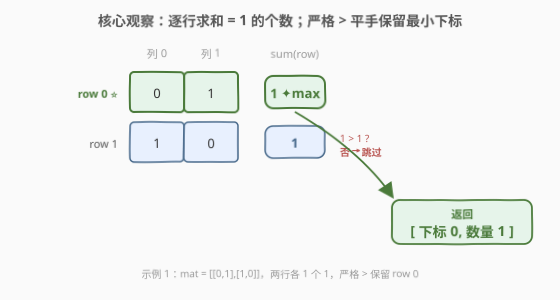
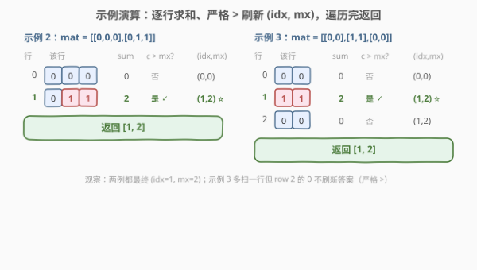

# 一最多的行

- **题目名称**：一最多的行
- **链接**：[2643. 一最多的行](https://leetcode.cn/problems/row-with-maximum-ones/)
- **难度**：简单
- **标签**：数组、矩阵

## 1. 题目概述

给你一个大小为 $m \times n$ 的二进制矩阵 `mat`，请你找出包含最多 **1** 的行的下标（从 **0** 开始）以及这一行中 **1** 的数目。

如果有多行包含最多的 $1$，只需要选择**行下标最小**的那一行。返回一个由行下标和该行中 $1$ 的数量组成的数组。

**示例 1**：

```text
输入：mat = [[0,1],[1,0]]
输出：[0,1]
解释：两行中 1 的数量相同。所以返回下标最小的行，下标为 0。该行 1 的数量为 1。答案为 [0,1]。
```

**示例 2**：

```text
输入：mat = [[0,0,0],[0,1,1]]
输出：[1,2]
解释：下标为 1 的行中 1 的数量最多。该行 1 的数量为 2。答案为 [1,2]。
```

**示例 3**：

```text
输入：mat = [[0,0],[1,1],[0,0]]
输出：[1,2]
解释：下标为 1 的行中 1 的数量最多。该行 1 的数量为 2。答案为 [1,2]。
```

**约束条件**：

- $m == \text{mat.length}$，$n == \text{mat[i].length}$
- $1 \le m, n \le 100$
- $\text{mat[i][j]}$ 为 $0$ 或 $1$

> 💡 关键信号：元素只有 $0/1$，故「一行中 $1$ 的个数」就是该行元素之和（$\text{popcount}$ 思想）；矩阵**未排序**且无任何单调性，必须读完每个元素才能确定每行之和 → 线性扫描就是最优。平手取最小下标用「严格 $>$」天然实现。

---

## 2. 解题思路

### 2.1 暴力思路：逐行求和、跟踪最大

最直白的做法：维护「已见最大 $1$ 数 `mx`」与「对应行下标 `idx`」，遍历每一行，对其求和得到该行 $1$ 的个数 `cnt`；若 `cnt` 严格大于 `mx` 则刷新 `mx` 与 `idx`。遍历结束 `[idx, mx]` 即为所求。

数据规模 $m,n \le 100 \Rightarrow mn \le 10^4$，$O(mn)$ 一次扫描轻松通过，无任何优化压力。

### 2.2 核心观察：求和即计数；严格 > 实现最小下标平手规则



把问题拆成两个要点：

**第一层：一行中 $1$ 的个数 = 行和。**

元素非 $0$ 即 $1$，故

$$
\text{cnt}_i = \sum_{j=0}^{n-1} \text{mat[i][j]}
$$

直接就是第 $i$ 行中 $1$ 的个数——无需逐个判等，`sum(row)` 一步到位。这是「二进制数组求和 = 置位计数」的最朴素体现，与位运算 $\text{popcount}$ 同源（只是这里一个元素占一个 `int` 而非一个 bit）。

**第二层：严格 $>$ 实现平手取最小下标。**

题目要求「多行并列最多时取下标最小」。关键在于比较时用**严格大于** `cnt > mx`：

- 遍历按行号 $i = 0, 1, \dots, m-1$ 递增进行；
- 仅当 `cnt` **严格**超过当前 `mx` 时才刷新 `idx = i`；
- 平手（`cnt == mx`）时不刷新，于是更早出现（下标更小）的那一行被保留。

> ⚠️ **易错点**：若误用 `>=`，平手时会把 `idx` 刷成更靠后的行号，违反「最小下标」规则。一字之差，结果相反。

> 💡 `mx` 初值取 $0$、`idx` 初值取 $0$ 即可：全零矩阵时首行（$cnt=0$）不刷新但天然是答案 `[0,0]`；任意有 $1$ 的行 $cnt \ge 1 > 0$ 会立刻刷新。无需哨兵 $-1$。

### 2.3 算法流程图

![算法流程：初始化 idx=mx=0；遍历每行求 cnt=sum(row)；若 cnt>mx 则刷新；遍历完返回 [idx,mx]](../images/p2643_algorithm_flow.svg)

步骤：

1. 令 `idx = 0`、`mx = 0`（下标与最大 $1$ 数，初始视为第 $0$ 行有 $0$ 个 $1$）；
2. 对每个行 $i \in [0, m)$：
   - $\text{cnt} \gets \sum_j \text{mat[i][j]}$（`sum(row)`）；
   - 若 $\text{cnt} > \text{mx}$（严格大于）：$\text{mx} \gets \text{cnt},\; \text{idx} \gets i$；否则保持不变；
3. 返回 `[idx, mx]`。

### 2.4 示例演算



- **示例 2** `mat = [[0,0,0],[0,1,1]]`（$m=2, n=3$）：
  - 行 $0$：和 $0$，$0 > 0$? 否 → `idx=0, mx=0`；
  - 行 $1$：和 $2$，$2 > 0$? 是 → `idx=1, mx=2`；
  - 返回 `[1,2]` ⭐。
- **示例 3** `mat = [[0,0],[1,1],[0,0]]`（$m=3, n=2$）：
  - 行 $0$：和 $0$，$0 > 0$? 否 → `idx=0, mx=0`；
  - 行 $1$：和 $2$，$2 > 0$? 是 → `idx=1, mx=2`；
  - 行 $2$：和 $0$，$0 > 2$? 否 → 保持 `idx=1, mx=2`；
  - 返回 `[1,2]` ⭐。注意多扫一行，但因严格 $>$ 不被 $0$ 刷掉，答案不变。

---

## 3. 参考代码

### C++

```cpp
class Solution {
public:
    vector<int> rowAndMaximumOnes(vector<vector<int>>& mat) {
        int idx = 0, mx = 0;                  // 最大 1 数与对应行下标
        for (int i = 0; i < (int)mat.size(); ++i) {
            int cnt = 0;
            for (int x : mat[i]) cnt += x;    // 0/1 求和即 1 的个数
            if (cnt > mx) { mx = cnt; idx = i; }  // 严格 >：平手保留下标更小者
        }
        return {idx, mx};
    }
};
```

**`accumulate` 简写版**：

```cpp
class Solution {
public:
    vector<int> rowAndMaximumOnes(vector<vector<int>>& mat) {
        int idx = 0, mx = 0;
        for (int i = 0; i < (int)mat.size(); ++i) {
            int cnt = accumulate(mat[i].begin(), mat[i].end(), 0);
            if (cnt > mx) { mx = cnt; idx = i; }
        }
        return {idx, mx};
    }
};
```

### Python

```python
class Solution:
    def rowAndMaximumOnes(self, mat: List[List[int]]) -> List[int]:
        idx = mx = 0
        for i, row in enumerate(mat):
            cnt = sum(row)            # 0/1 求和即 1 的个数
            if cnt > mx:              # 严格 >：平手保留更小下标
                mx, idx = cnt, i
        return [idx, mx]
```

**Pythonic 一行版（`index(max(...))` 天然返回首个最大值的下标）**：

```python
class Solution:
    def rowAndMaximumOnes(self, mat: List[List[int]]) -> List[int]:
        cnts = [sum(r) for r in mat]
        i = cnts.index(max(cnts))    # index 返回首个最大值下标 = 最小下标
        return [i, cnts[i]]
```

> 💡 `list.index(max(list))` 返回第一个最大值的下标，恰好满足「平手取最小下标」——这与「严格 $>$」是同一规则的两种表达：一个是遍历中只刷新严格更大者，一个是查表取首个最大者。空间代价是多存一个长度 $m$ 的 `cnts`（$O(m)$，本题 $m \le 100$ 可忽略）。

---

## 4. 复杂度分析

| 维度 | 复杂度 | 说明 |
|------|--------|------|
| **时间复杂度** | $O(m \cdot n)$ | 共 $m$ 行，每行求和 $O(n)$；每个元素恰读一次，线性扫描 |
| **空间复杂度** | $O(1)$ | 循环版只用 `idx`/`mx`/`cnt` 常数个变量（`accumulate` 版同）；Pythonic 版用 `cnts` 数组为 $O(m)$，不计输出 |

> 💡 $O(mn)$ 已是该问题**渐近下界**：矩阵未排序、元素无单调性，要确定每行 $1$ 的个数就必须读遍该行所有元素，$\Omega(mn)$ 不可破。$mn \le 10^4$，远低于时限。

---

## 5. 扩展：若每行有序，可加速到 $O(m \log n)$ 或 $O(m+n)$

本题矩阵**未排序**，故只能线性扫描。但若把条件加强为「**每一行非递减**（即所有 $0$ 在前、所有 $1$ 在后）」，则每行 $1$ 的个数可由「第一个 $1$ 的位置」推出，无需逐元素求和：

- **二分法**：对每行二分找首个 $1$（`bisect_left(row, 1)`），该行 $1$ 的个数 $= n - \text{pos}$。$m$ 行共 $O(m \log n)$。
- **阶梯法（$O(m+n)$）**：从右上角 `(0, n-1)` 出发——若当前格是 $1$，说明该行 $1$ 延伸到此，向左走继续数；若是 $0$，向下一行走。每步要么左移要么下移，至多 $m+n$ 步即可定位「含 $1$ 最多的行」的下界。这是「有序矩阵」系列的招牌技巧。

LeetCode 1337（每行有序、数「战士」$1$ 的个数后取最弱的 $k$ 行）与 1351（按行列均有序的矩阵统计负数）正是这一加速思路的考题。它们的共性是：**只要矩阵有序，就能把朴素的 $O(mn)$ 全表扫描压缩为 $O(m \log n)$ 甚至 $O(m+n)$**——前提是单调性可被利用。本题因无单调性而无法加速，恰好构成「有序 vs 无序」的对照。

---

## 6. 面试要点

1. **为什么比较用严格 `>` 而不是 `>=`？**

   > 题目要求平手时取**行下标最小**者。遍历按 $i$ 递增进行，只有「严格更大」才刷新 `idx`，平手（相等）时保持原 `idx`，于是更早出现的（下标更小）那行被保留。用 `>=` 会在平手时把 `idx` 刷成更靠后的行号，与题意相反。

2. **能否做到比 $O(mn)$ 更快？**

   > 不能。矩阵未排序、元素无单调性，要确定某行有多少个 $1$ 必须读遍该行全部 $n$ 个元素（最坏情况该行全 $0$，读到最后才能确认）。因此 $\Omega(mn)$ 是渐近下界。线性扫描即最优，没有更优算法可言。

3. **为什么 `sum(row)` 就等于该行 $1$ 的个数？**

   > 元素非 $0$ 即 $1$，行和 $\sum_j \text{mat[i][j]}$ 中每个 $1$ 贡献 $1$、每个 $0$ 贡献 $0$，求和结果恰是 $1$ 的计数。这是「二进制数组求和 = 置位计数」的体现，与位运算 $\text{popcount}$ 同源（区别仅在一个元素占一个 `int` 还是占一个 bit）。

4. **`mx` 初值为什么取 $0$ 而非 $-1$？**

   > 因元素只有 $0/1$，任意行之和 $\ge 0$，`mx=0`、`idx=0` 即可：全零矩阵时首行 $cnt=0$ 不刷新但天然是答案 `[0,0]`；有 $1$ 的行 $cnt \ge 1 > 0$ 立刻刷新。哨兵 $-1$ 也能工作但属多余——这里 $0$ 已是合法的最小可能值，既是初值也兼容答案。若元素允许负数才需更小哨兵。

5. **`cnts.index(max(cnts))` 的平手行为是否正确？**

   > 正确。`max` 取最大值，`list.index` 返回该值**首次出现**的下标，由于 `cnts` 按 $i = 0,1,\dots$ 顺序构成，「首个最大值」即「下标最小的最大行」，恰是题意。它和「遍历 + 严格 `>`」是同一平手规则的两种实现，代价是多存 $O(m)$ 的 `cnts`。

> 💡 **一句话总结**：2643 = 「逐行 `sum` 求 $1$ 的个数，严格 `>` 刷新最大值与下标」。$O(mn)$ 一次扫描、$O(1)$ 额外空间，平手取最小下标靠比较符「严格 $>$」天然实现。

---

## 7. 同类练习题

- [1337. 矩阵中战斗力最弱的 K 行](https://leetcode.cn/problems/the-k-weakest-rows-in-a-matrix/)：每行有序（$0$ 在前 $1$ 在后）、数「战士」$1$ 的个数后取最弱的 $k$ 行，本题的「行有序 + 计数」升级版，可上二分/阶梯加速
- [1582. 二进制矩阵中的特殊位置](https://leetcode.cn/problems/special-positions-in-a-binary-matrix/)：同为 $0/1$ 矩阵逐元素扫描判定，巩固「二进制矩阵逐格处理」范式
- [1351. 统计有序矩阵中的负数](https://leetcode.cn/problems/count-negative-numbers-in-a-sorted-matrix/)：行列均有序矩阵的阶梯法 $O(m+n)$ 计数，呼应扩展中「矩阵有序时的加速」
- [74. 搜索二维矩阵](https://leetcode.cn/problems/search-a-2d-matrix/)：有序矩阵二分查找，巩固「矩阵有序 → 利用单调性把线性降为对数/线性」的对照
