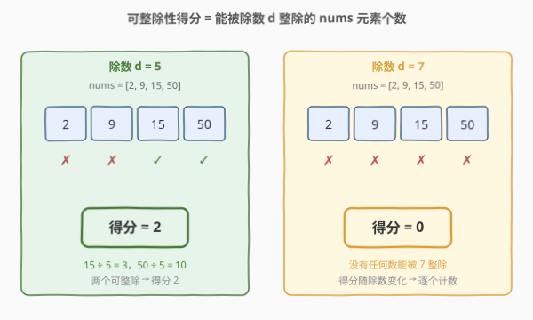
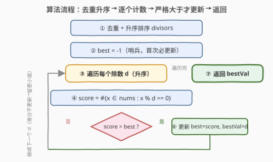
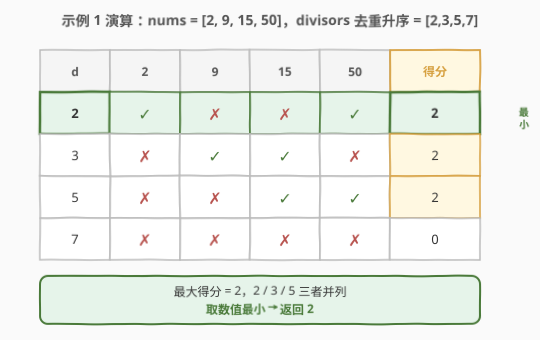

# LeetCode 找出可整除性得分最大的整数 题解

## 1. 题目概述

- **标题 / 题号**：找出可整除性得分最大的整数（#2644，easy）
- **链接**：https://leetcode.cn/problems/find-the-maximum-divisibility-score/
- **难度**：简单
- **标签**：数组、枚举、计数

**题意**：给定两个整数数组 `nums` 和 `divisors`。`divisors[i]` 的**可整除性得分**等于满足 `nums[j]` 能被 `divisors[i]` 整除的下标 `j` 的数量。

返回**可整除性得分最大**的整数 `divisors[i]`。若多个整数得分相同，则返回**数值最小**的那个。

**示例 1**：

```text
输入：nums = [2,9,15,50], divisors = [5,3,7,2]
输出：2
解释：5 得分 2（15、50）；3 得分 2（9、15）；7 得分 0；2 得分 2（2、50）。5/3/2 三者同分，返回最小的 2。
```

**示例 2**：

```text
输入：nums = [4,7,9,3,9], divisors = [5,2,3]
输出：3
解释：5 得分 0；2 得分 1（仅 4）；3 得分 3（9、3、9）。3 得分最大，返回 3。
```

**示例 3**：

```text
输入：nums = [20,14,21,10], divisors = [10,16,20]
输出：10
解释：10 得分 2（20、10）；16 得分 0；20 得分 1（20）。10 得分最大，返回 10。
```

**约束**：

- $1 \le \text{nums.length}, \text{divisors.length} \le 1000$
- $1 \le \text{nums[i]}, \text{divisors[i]} \le 10^9$

> 💡 关键信号：两数组规模都 $\le 1000$，值域却达 $10^9$。规模小 → 暴力 $O(nm)=10^6$ 次取模即可 AC；值域大 → 无法预筛倍数表，逐个取模是唯一可行路径。

## 2. 解题思路

### 2.1 暴力思路：对每个除数逐个计数

最直接的思路：遍历 `divisors` 中每个除数 $d$，扫描一遍 `nums`，统计能被 $d$ 整除的元素个数作为得分；维护得分最大者，平局时取数值最小的 $d$。

$|\text{nums}|, |\text{divisors}| \le 1000$，双重循环最多 $10^6$ 次取模运算，毫秒级即可完成，无需更复杂的数据结构。

### 2.2 核心观察：得分只依赖值，去重 + 升序自动处理平局



三个观察让暴力既正确又简洁：

**观察一：得分是纯值函数，与下标无关。** `divisors[i]` 的得分只取决于它的**数值**，与其在数组中的位置无关。因此相同值的除数得分必然相同——可先对 `divisors` **去重**，避免重复计算。最坏情况（全部相同）把 $O(nm)$ 降到 $O(n)$。

**观察二：平局取最小值 → 升序遍历 + 严格大于更新。** 题目要求同分时返回数值最小的除数。若把去重后的除数按**升序**排列，遍历时用「**仅当严格大于当前最大得分**」才更新答案，那么同分的更小值因先出现已被记录，后续更大值同分时不会覆盖——平局自动落到最小值，无需额外比较逻辑。

**观察三：值域 $10^9$ 排除筛法优化。** 若值域很小（如 $\le 10^5$），可预处理每个数的倍数在 `nums` 中的出现次数，用类似埃氏筛的 $O(V \log V)$ 桶计数加速。但本题值域 $10^9$，桶不可行，**逐个取模是唯一可行路径**，暴力即最优解法。

> ⚠️ **去重的正确性边界**：去重之所以安全，是因为「相同值 → 相同得分」，且平局判定基于值而非下标。若题目改成「按下标返回」（如返回 $i$ 而非 `divisors[i]`），则不能去重——但本题明确返回整数本身，去重合法。

### 2.3 算法流程图



四步：

1. 对 `divisors` 去重并升序排序；
2. 初始化 `best = -1`（哨兵，保证首个除数必然更新），`bestVal` 待定；
3. 遍历每个去重后的除数 $d$，计算 `score = ` `nums` 中能被 $d$ 整除的元素个数；
4. **仅当** `score > best` 时更新 `best = score`、`bestVal = d`（等分不更新 → 保留更小值）；
5. 遍历结束，返回 `bestVal`。

> 💡 **小优化（满分早停）**：若某 $d$ 的得分已达 $|\text{nums}|$（全部 `nums` 可整除），这是理论最大得分，无法被超越；又因升序遍历保证它是达到满分的**最小**值，可立即返回，无需继续。这是不影响复杂度的常数优化。

### 2.4 示例演算



以示例 1 `nums = [2,9,15,50]`，`divisors` 去重升序后为 $[2,3,5,7]$：

| $d$ | 2 | 9 | 15 | 50 | 得分 |
|-----|---|---|----|----|------|
| **2** | ✓ | ✗ | ✗ | ✓ | **2** ← 最小同分，最终答案 |
| 3 | ✗ | ✓ | ✓ | ✗ | 2 |
| 5 | ✗ | ✗ | ✓ | ✓ | 2 |
| 7 | ✗ | ✗ | ✗ | ✗ | 0 |

- $d=2$：得分 2，`best` 从 $-1$ 更新为 $2$，`bestVal=2`；
- $d=3$：得分 2，**不严格大于** 2，跳过（保留更小的 2）；
- $d=5$：得分 2，同理跳过；
- $d=7$：得分 0，跳过；
- 返回 `bestVal = 2`。

## 3. 参考代码

### C++

```cpp
class Solution {
public:
    int maxDivScore(vector<int>& nums, vector<int>& divisors) {
        vector<int> d(divisors.begin(), divisors.end());
        sort(d.begin(), d.end());
        d.erase(unique(d.begin(), d.end()), d.end());   // 去重 + 升序：平局自动取最小
        int bestVal = d[0], best = -1;                   // 哨兵 -1，首次必更新
        for (int div : d) {
            int score = 0;
            for (int x : nums) if (x % div == 0) ++score;
            if (score > best) {                          // 严格大于才更新 → 等分保留更小值
                best = score;
                bestVal = div;
            }
        }
        return bestVal;
    }
};
```

> 💡 `unique` 要求容器先有序，故 `sort` 在前；`unique` 把重复元素挪到末尾并返回新尾迭代器，`erase` 真正删除。也可用 `std::set` 一步去重 + 排序：`set<int> d(divisors.begin(), divisors.end());`，再遍历集合（`set` 默认升序）。

### Python

```python
class Solution:
    def maxDivScore(self, nums: List[int], divisors: List[int]) -> int:
        uniq = sorted(set(divisors))          # 去重 + 升序
        best_val, best = uniq[0], -1          # 哨兵 -1
        for d in uniq:
            score = sum(1 for x in nums if x % d == 0)
            if score > best:                  # 严格大于才更新
                best, best_val = score, d
        return best_val
```

> 💡 `sum(1 for x in nums if x % d == 0)` 是 Python 计数惯用法，等价于 `sum(x % d == 0 for x in nums)`（布尔自动转 1/0）。`sorted(set(...))` 一行完成去重 + 排序，比手动 `list` + `sort` + 去重更简洁。

## 4. 复杂度分析

| 维度 | 复杂度 | 说明 |
|------|--------|------|
| **时间复杂度** | $O\bigl(m \log m + n \cdot m'\bigr)$ | 去重排序 $O(m \log m)$；对 $m'$ 个不同除数各扫一遍 `nums`，共 $n \cdot m'$ 次取模，$m' \le m \le 1000$ |
| **空间复杂度** | $O(m)$ | 去重后的除数数组 |

> 💡 最坏 $m' = m$（全部互异）时退化为 $O(nm) = 10^6$ 次取模，毫秒级。去重仅在 `divisors` 含大量重复时带来收益（极端全相同：$m'=1$，降为 $O(n)$），但不影响最坏复杂度。

## 5. 扩展：值域缩小后的筛法加速

若把 `divisors` 与 `nums` 的值域从 $10^9$ 缩到 $V \le 10^5$，可改用**倍数筛计数**在 $O(V \log V)$ 内一次性求出所有除数的得分，远快于 $O(nm)$：

1. 用桶 `cnt[v]` 记录 `nums` 中等于 $v$ 的元素个数；
2. 对每个候选除数 $d$，枚举其倍数 $d, 2d, 3d, \dots$ 累加 `cnt`，得到 $d$ 的得分。

这相当于埃氏筛的「枚举倍数」骨架，与 [204. 计数质数](../0201-0300/204_计数质数.md) 的倍数划除同源。但本题 $V=10^9$，桶数组不可用，筛法退化为直接的逐个取模——「枚举倍数」与「逐个取模」是同一思想在两种值域规模下的两种实现。

> 💡 **规模决定解法**：值域小 → 预处理倍数表（筛）；值域大但数据量小 → 逐个计算（暴力）。这是「**值域 vs 数据量**」权衡的典型例子，204（值域筛）与 2644（逐个取模）恰好代表两端。

## 6. 面试要点

1. **为什么去重是安全的？**

   > 得分只依赖除数的**数值**：相同值必然整除相同的 `nums` 元素，得分相同。且平局判定基于「数值最小」而非「下标最小」，故相同值的去重不影响答案。若题目要求返回下标则不能去重。

2. **升序遍历 + 严格大于更新，如何保证平局取最小值？**

   > 升序使最小值最先出现并被记为 `best`。后续同分值因「不严格大于」而不覆盖，故最终 `bestVal` 是同分者中最早出现的最小值。这等价于比较键为 `(score, -value)` 取最大——但通过遍历顺序把「取最小」编码进更新条件，无需显式比较值。

3. **能否用筛法或倍数表优化到 $O(V)$？**

   > 不能。值域 $10^9$ 使桶数组（$V=10^9$）内存不可行；即便用哈希桶只存 `nums` 出现的位置，枚举每个除数的倍数在 `nums` 中的命中仍需逐个检查，最坏不优于 $O(nm)$。逐个取模是值域过大时的唯一可行解。

4. **`best` 初始化为 $-1$ 而非 $0$ 有何意义？**

   > 哨兵作用。除数得分最小为 $0$（没有任何 `nums` 可整除），若 `best` 初始化为 $0$，则首个得分为 $0$ 的除数不会被记录（因 $0 > 0$ 为假），导致 `bestVal` 永远停留在初值。用 $-1$ 保证首个除数必然触发更新，从而正确初始化 `bestVal`。

5. **若 `divisors` 含重复，不去重会出错吗？**

   > 不会出错，只是重复计算浪费。不去重时，对重复的同一值会算多遍得分（结果相同），平局取最小值的逻辑仍成立（因比较基于值）。去重是**性能优化**而非**正确性必需**。

> 💡 **一句话总结**：2644 = 「去重升序 + 逐个取模计数 + 严格大于才更新」。$n,m \le 1000$ 暴力即最优；值域 $10^9$ 排除筛法；去重与升序把「平局取最小」编入遍历顺序，代码简洁且正确。

## 同类练习题

| # | 题目 | 与本题的关联 |
|---|------|-------------|
| 1356 | [根据数字二进制下 1 的数目排序](https://leetcode.cn/problems/sort-integers-by-the-number-of-1-bits/)（[题解](../1301-1400/1356_根据数字二进制下1的数目排序.md)） | 为每个数计算一个属性（1 的个数）再按 `(属性, 值)` 排序，对照「逐个计数 + 平局按值」的同款套路 |
| 1337 | [矩阵中战斗力最弱的 K 行](https://leetcode.cn/problems/the-k-weakest-rows-in-a-matrix/)（[题解](../1301-1400/1337_矩阵中战斗力最弱的K行.md)） | 每行计数（1 的个数）后按 `(计数, 下标)` 排序取前 K，对照「计数 + 平局取最小下标」的计数选优模式 |
| 1394 | [找出数组中的幸运数](https://leetcode.cn/problems/find-lucky-integer-in-an-array/)（[题解](../1301-1400/1394_找出数组中的幸运数.md)） | 统计频率后选满足「值=频率」的最大数，同为「频率计数 + 按值选优」 |
| 1207 | [独一无二的出现次数](https://leetcode.cn/problems/unique-number-of-occurrences/)（[题解](../1201-1300/1207_独一无二的出现次数.md)） | 频率计数后再判重，承接「先计数后判定」的计数骨架 |
| 1742 | [盒子中小球的最大数量](https://leetcode.cn/problems/maximum-number-of-balls-in-a-box/)（[题解](../1701-1800/1742_盒子中小球的最大数量.md)） | 按数位和分桶计数后取最大，对照「桶计数 + 取最值」，可与本文第 5 节的筛计数互相对照 |
