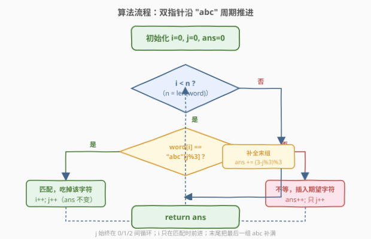
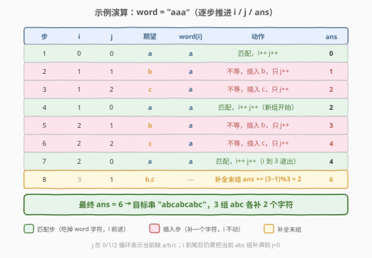

# 构造有效字符串的最少插入数

- **题目名称**：构造有效字符串的最少插入数
- **链接**：[2645. 构造有效字符串的最少插入数](https://leetcode.cn/problems/minimum-additions-to-make-valid-string/)
- **难度**：中等
- **标签**：贪心、字符串、栈、动态规划

## 1. 题目概述

给你一个字符串 `word`，可以向其中任意位置插入 `"a"`、`"b"`、`"c"` 任意次。返回使 `word` **有效**需要插入的最少字母数。

**有效**的定义：字符串可以由 `"abc"` 串联多次得到，即形如 `"abcabcabc..."`。

**示例 1**：

```text
输入：word = "b"
输出：2
解释：在 "b" 前插入 "a"、后插入 "c"，得到 "abc"。
```

**示例 2**：

```text
输入：word = "aaa"
输出：6
解释：每个 "a" 后依次插入 "b""c"，得到 "abcabcabc"。
```

**示例 3**：

```text
输入：word = "abc"
输出：0
解释：word 已是有效字符串。
```

**约束条件**：

- `1 <= word.length <= 50`
- `word` 仅由字母 `"a"`、`"b"`、`"c"` 组成。

---

## 2. 解题思路

### 2.1 暴力思路：枚举所有插入方案

最直白的做法是从左到右逐个位置尝试插入 `"a"`/`"b"`/`"c"` 或不插入，DFS 搜索所有方案，保留使结果有效的最小插入数。

> ⚠️ 问题：插入位置和字符的组合是指数级膨胀的，`word` 越长分支越多，完全无法承受。问题的本质不在于「试错」，而在于**每个 `word` 字符必须落到 `"abc"` 周期的某个确定位置**——只要找到这个对应关系，插入数就唯一确定。

换个角度：与其枚举插入，不如**确定 `word` 的每个字符应该对齐到 `"abc"` 周期的哪个位置**。

### 2.2 核心观察：贪心匹配 `"abc"` 周期


关键洞察：

1. **目标串是周期的**：有效串 = `"abc"` 重复 $G$ 次，长度 $= 3G$。
2. **`word` 是目标串的子序列**：`word` 的字符按原顺序出现在 `"abc"` 周期串中，其余位置由插入补齐。
3. **插入数 = 目标长度 − `n`**：$G$ 确定后，插入数 $= 3G - n$。因此**最小化插入数 ⇔ 最小化组数 $G$**。
4. **贪心最早匹配**：让 `word` 的每个字符对齐到周期中**最早的合法位置**（上一个字符对齐位置之后第一个匹配处），能把字符尽可能压进少数组里，使 $G$ 最小。

> 💡 这是经典的「子序列对齐周期模板」贪心：维护一个游标 `j` 在 `"abc"` 上循环（$0 \to 1 \to 2 \to 0 \to \cdots$），表示当前期望的字符。`word` 的字符若等于期望就消耗它、`j` 前进一步；若不等就说明该位置缺一个字符，插入并只推进 `j`。处理完 `word` 后，若当前组没填满（`j != 0`），把末组补全。

**为什么最早匹配最优（交换论证）**：把某字符的落点从「最早合法位置」推迟到更晚的位置，只会让后续所有字符的落点都不提前、最终到达的位置不减小，组数 $G$ 不降反可能增。因此最早匹配在每个字符上都是局部最优，且不损害后续——全局最优。

### 2.3 算法流程图



### 2.4 示例演算

以 `word = "aaa"` 为例，逐步展示游标 `i`（`word` 下标）、`j`（`"abc"` 周期位置，$0=a,1=b,2=c$）与 `ans` 的变化：



| 步 | i | j | 期望 | word[i] | 动作 | ans |
|----|---|---|------|---------|------|-----|
| 1 | 0 | 0 | a | a | 匹配，i++ j++ | 0 |
| 2 | 1 | 1 | b | a | 不等，插入 b，只 j++ | 1 |
| 3 | 1 | 2 | c | a | 不等，插入 c，只 j++ | 2 |
| 4 | 1 | 0 | a | a | 匹配，i++ j++（新组开始） | 2 |
| 5 | 2 | 1 | b | a | 不等，插入 b，只 j++ | 3 |
| 6 | 2 | 2 | c | a | 不等，插入 c，只 j++ | 4 |
| 7 | 2 | 0 | a | a | 匹配，i++ j++（i 到 3 退出） | 4 |
| 8 | 3 | 1 | b,c | — | 补全末组 ans += (3−1)%3 = 2 | 6 |

> 💡 **关键点**：步骤 2、3 是处理 `word[1]='a'` 时内层 `while` 的两次插入（期望先 `b` 再 `c` 都不匹配），步骤 4 才匹配并消耗该字符；步骤 5、6、7 同理处理 `word[2]`。`i` 到尾后（步骤 8）仍需把当前未满的 `abc` 组补到 `j=0`，公式为 `ans += (3 - j) % 3`：`j=1` 补 2 个、`j=2` 补 1 个、`j=0` 不补。

最终 `ans = 6`，目标串 `"abcabcabc"`，3 组 `abc` 各补 2 个字符。

---

## 3. 参考代码

### C++

```cpp
class Solution {
public:
    int addMinimum(string word) {
        string pat = "abc";
        int j = 0, ans = 0;
        for (char ch : word) {
            while (ch != pat[j]) {      // 期望不符，插入并只推进 j
                ans++;
                j = (j + 1) % 3;
            }
            j = (j + 1) % 3;            // 匹配，消耗该字符，推进 j
        }
        return ans + (3 - j) % 3;       // 补全最后一组 abc
    }
};
```

### Python

```python
class Solution:
    def addMinimum(self, word: str) -> int:
        pat = "abc"
        j = ans = 0
        for ch in word:
            while ch != pat[j]:        # 期望不符，插入并只推进 j
                ans += 1
                j = (j + 1) % 3
            j = (j + 1) % 3            # 匹配，消耗该字符，推进 j
        return ans + (3 - j) % 3       # 补全最后一组 abc
```

> ⚠️ **末尾补全别忘**：循环结束后若 `j != 0`，说明最后一组 `abc` 只填了一半（如 `j=1` 表示填了 `a`、还差 `bc`）。`ans += (3 - j) % 3` 正好补齐：`j=1→+2`、`j=2→+1`、`j=0→+0`。漏掉这一步会对 `"b"`（应输出 2，漏补只算出 1）等用例出错。

---

## 4. 复杂度分析

| 维度 | 复杂度 | 说明 |
|------|--------|------|
| 时间复杂度 | $O(n)$ | `j` 每步 +1 且在 $\{0,1,2\}$ 循环；内层 `while` 的总推进次数 = 总插入数，而插入数 $\le 3G \le 3n$，整体仍为线性摊还 |
| 空间复杂度 | $O(1)$ | 仅用 `j`、`ans` 两个整型变量，`pat` 为常量 |

> 💡 相比暴力枚举（指数级），贪心把「找最优插入」转化为「沿周期对齐」，一次扫描即得全局最优。

---

## 5. 扩展：分段计数法（更优雅的一行解）

观察有效串 `"abcabcabc..."` 的结构：**组内严格递增**（$a < b < c$），**组间出现下降**（$c \to a$）。因此 `word` 中每出现一次「非递增」`word[i] <= word[i-1]`，就必然要开启一个新组。

设组数 $S = 1 + \#\{i \ge 1 : word[i] \le word[i-1]\}$，则最少插入数 $= 3S - n$。

```python
class Solution:
    def addMinimum(self, word: str) -> int:
        segs = 1
        for i in range(1, len(word)):
            if word[i] <= word[i - 1]:
                segs += 1
        return segs * 3 - len(word)
```

| 方法 | 时间 | 空间 | 思路 |
|------|------|------|------|
| **周期匹配贪心** | $O(n)$ | $O(1)$ | 游标对齐 `"abc"` 周期，逐步插入 |
| **分段计数** | $O(n)$ | $O(1)$ | 统计非递增断点 = 组数，$3S-n$ 直接得解 |

> 💡 两者等价：非递增断点数 = 组数 $G$，因为「最早匹配」贪心恰好把每段严格递增的 `word` 片段压进同一组、断点处开新组。分段计数跳过了逐字符模拟，直接用结构性质算出 $G$，更简洁。

---

## 6. 面试要点

1. **为什么贪心匹配是最优的？**

   - 插入数 $= 3G - n$，最小化插入 ⇔ 最小化组数 $G$。把每个 `word` 字符对齐到周期中最早合法位置，使后续字符有最大余量塞进已有组里，$G$ 最小。交换论证：推迟任一字符的落点不会让最终位置提前，只会让 $G$ 不减，故最早匹配全局最优。

2. **循环结束后的 `(3 - j) % 3` 是什么？**

   - `j` 表示当前组的下一个期望位置。循环结束时若 `j != 0`，最后一组 `abc` 只填了前 `j` 个，需补 $3 - j$ 个（对 3 取模处理 `j=0` 的情形）。这是最容易遗漏的边界，漏掉会让 `"b"` 等单字符用例少算。

3. **分段计数为什么等价于周期匹配？**

   - 有效串组内严格递增、组间下降。`word` 中 `word[i] <= word[i-1]` 必跨组（下降或相等都不能同组，同组三字符互异且严格递增）。故断点数 $= G - 1$，$G = 1 +$ 断点数。它与「最早匹配」算出的最小 $G$ 一致，只是直接用结构性质跳过了模拟。

4. **这题为什么也带栈/DP标签？**

   - 栈视角：可视为状态机/栈式消费——`j` 是状态游标，匹配则「弹出」期望。DP 视角：令 `dp[i]` 为使 `word[:i]` 成为有效串前缀的最少插入，按 `word[i-1]` 在组内位置转移，$O(n)$ 但常数大。贪心 $O(n)/O(1)$ 是最优且最简，标签是同主题归类，不代表必须用栈/DP。

5. **如果允许插入任意字母（不限 abc）会怎样？**

   - 失去「周期模板」约束后，问题退化为「补成给定模式串的子序列」，性质不同。本题关键是目标串高度结构化（周期为 3），使贪心游标只需 3 状态即可完成对齐。

---

## 7. 同类练习题

- [921. 使括号有效的最少添加](https://leetcode.cn/problems/minimum-add-to-make-parentheses-valid/)：贪心添加字符使括号结构有效，同主题「最少添加使结构合法」
- [1541. 平衡括号字符串的最少插入次数](https://leetcode.cn/problems/minimum-insertions-to-balance-a-parentheses-string/)：按周期结构（`(` 需配 `))`）贪心插入补全，本题进阶版
- [2696. 删除子串后的字符串最小长度](https://leetcode.cn/problems/minimum-string-length-after-removing-substrings/)：栈模拟消除 `AB`/`CD` 子串，同属「abc 类子串结构处理」
- [1312. 让字符串成为回文串的最少插入次数](https://leetcode.cn/problems/minimum-insertion-steps-to-make-a-string-palindrome/)：最少插入使串满足结构约束的 DP 版（回文），对照贪心与 DP 的取舍
