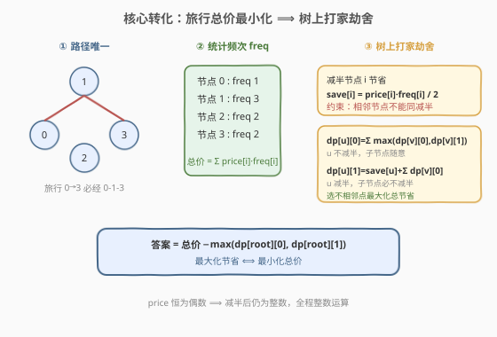
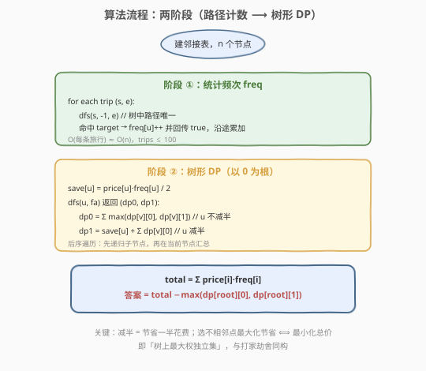
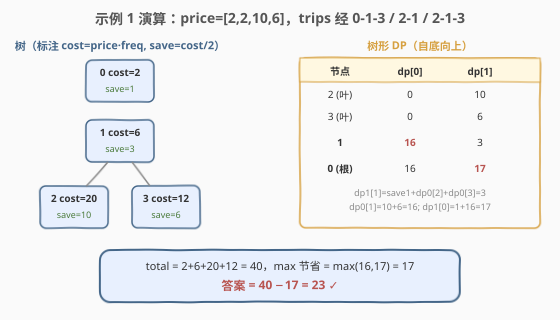

# LeetCode 最小化旅行的价格总和 题解

## 1. 题目概述

- **标题 / 题号**：最小化旅行的价格总和（#2646，hard）
- **链接**：https://leetcode.cn/problems/minimize-the-total-price-of-the-trips/
- **难度**：困难
- **标签**：树、深度优先搜索、图、动态规划

**题意**：现有一棵**无向、无根的树**，树中有 `n` 个节点，按 `0` 到 `n - 1` 编号。给定整数 `n`、长度为 `n - 1` 的二维整数数组 `edges`（`edges[i] = [a_i, b_i]` 表示节点 `a_i` 与 `b_i` 间有一条边）。

每个节点都关联一个价格：`price[i]` 是第 `i` 个节点的价格。**给定路径的价格总和**是该路径上所有节点的价格之和。

另给二维整数数组 `trips`，`trips[i] = [start_i, end_i]` 表示第 `i` 次旅行从 `start_i` 出发，经任意路径前往 `end_i`。

在执行**第一次旅行之前**，你可以选择一些**非相邻节点**并将其价格**减半**。返回执行所有旅行的**最小价格总和**。

**示例 1**：

```text
输入：n = 4, edges = [[0,1],[1,2],[1,3]], price = [2,2,10,6], trips = [[0,3],[2,1],[2,3]]
输出：23
解释：以节点 2 为根后的树结构如下图。选择节点 0、2、3 减半。
      第 1 次旅行 [0,1,3]，价格和 = 1 + 2 + 3 = 6
      第 2 次旅行 [2,1]，价格和 = 2 + 5 = 7
      第 3 次旅行 [2,1,3]，价格和 = 5 + 2 + 3 = 10
      总和 = 6 + 7 + 10 = 23。
```

**示例 2**：

```text
输入：n = 2, edges = [[0,1]], price = [2,2], trips = [[0,0]]
输出：1
解释：选择节点 0 减半。第 1 次旅行 [0]，价格和 = 1。总和 = 1。
```

**约束**：

- `1 <= n <= 50`
- `edges.length == n - 1`
- `0 <= a_i, b_i <= n - 1`，`edges` 表示一棵有效的树
- `price.length == n`，`price[i]` 是一个**偶数**
- `1 <= price[i] <= 1000`
- `1 <= trips.length <= 100`
- `0 <= start_i, end_i <= n - 1`

## 2. 解题思路

### 2.1 暴力思路

直接枚举「哪些节点减半」——$2^n$ 种组合，对每种组合还要验证「非相邻」并跑一遍所有旅行求和。`n <= 50` 时指数爆炸，完全不可行。难点在于：旅行的路径选择和减半节点的选择是两个看似耦合的决策。

### 2.2 核心观察：路径计数 + 树上打家劫舍



把问题拆成两个独立的事实，从而**解耦**「路径」与「减半」：

1. **路径在树中唯一**：树中任意两点的路径是唯一的（树无环）。所以无论怎么减半，每条旅行的「必经节点集合」是固定的。只需对每条旅行 `dfs` 找一次路径，统计每个节点被经过的频次 `freq[i]`。此时**总价 = $\sum_i \text{price}[i] \cdot \text{freq}[i]$**（减半的节点价格减半后照常乘以频次）。

2. **减半 = 节省一半，相邻不能同减半 = 树上打家劫舍**：若选择节点 `i` 减半，则节省 $\text{save}[i] = \text{price}[i] \cdot \text{freq}[i] / 2$。约束「非相邻」等价于「树上没有两个相邻节点同时被选中」——这正是**树上的打家劫舍**（最大权独立集）。我们要求**最大化总节省**，即 `total - max_savings` 即为最小总价。

> 💡 **为什么能解耦？** 因为「减半」改的是每个节点的单价，而「路径」决定的是节点被经过的次数。节点 `i` 对总价的贡献恒为 $\text{price}[i] \cdot \text{freq}[i]$，减半只是把它除以 2。路径怎么走不影响 freq（路径唯一），减半哪些节点也不影响路径。两者各算各的，最后乘起来。

> ⚠️ `price[i]` 恒为偶数，故 $\text{save}[i]$ 恒为整数，全程整数运算，无需处理小数。

**树形 DP 状态**（以任意节点为根，如 `0`）：

- `dp[u][0]`：子树 `u` 内的最大节省，且 `u` **不减半**。子节点随意 → `dp[u][0] = Σ_v max(dp[v][0], dp[v][1])`
- `dp[u][1]`：子树 `u` 内的最大节省，且 `u` **减半**。子节点必不减半 → `dp[u][1] = save[u] + Σ_v dp[v][0]`

答案 = `total - max(dp[root][0], dp[root][1])`。

### 2.3 算法流程图



两阶段串行：阶段①对每条旅行 `dfs` 找路径累加 `freq`；阶段②以后序遍历计算 `dp0/dp1`，最后用 `total - max` 得答案。

### 2.4 示例演算



以**示例 1**（`price=[2,2,10,6]`，trips 经 `0-1-3 / 2-1 / 2-1-3`）为例：

- **频次**：节点 0→1、1→3、2→2、3→2。`cost = price·freq = [2,6,20,12]`，`total = 40`；`save = cost/2 = [1,3,10,6]`。
- **DP（根 0，子树 0→1→{2,3}）**：
  - 叶 2：`dp0=0, dp1=10`；叶 3：`dp0=0, dp1=6`
  - 节点 1：`dp0 = max(0,10)+max(0,6) = 16`；`dp1 = 3 + 0 + 0 = 3`（减半 1 则子节点 2、3 不能减半）
  - 节点 0：`dp0 = max(16,3) = 16`；`dp1 = 1 + 16 = 1 + dp0[1] = 17`（减半 0，子节点 1 不减半取 dp0[1]=16）
- **答案**：`max(16,17) = 17` → `40 - 17 = 23` ✓

## 3. 参考代码

### C++

```cpp
class Solution {
public:
    int minimumTotalPrice(int n, vector<vector<int>>& edges, vector<int>& price, vector<vector<int>>& trips) {
        vector<vector<int>> g(n);
        for (auto& e : edges) {
            g[e[0]].push_back(e[1]);
            g[e[1]].push_back(e[0]);
        }
        // 统计每个节点被旅行路径经过的频次（树中路径唯一）
        vector<int> freq(n, 0);
        function<bool(int,int,int)> findPath = [&](int u, int fa, int target) -> bool {
            if (u == target) { freq[u]++; return true; }
            for (int v : g[u]) {
                if (v == fa) continue;
                if (findPath(v, u, target)) { freq[u]++; return true; }
            }
            return false;
        };
        for (auto& t : trips) findPath(t[0], -1, t[1]);

        // 树形 DP：返回 (u 不减半最大节省, u 减半最大节省)
        function<pair<int,int>(int,int)> dfs = [&](int u, int fa) -> pair<int,int> {
            int notHalve = 0, halve = price[u] * freq[u] / 2;
            for (int v : g[u]) {
                if (v == fa) continue;
                auto [c0, c1] = dfs(v, u);
                notHalve += max(c0, c1); // u 不减半，子节点随意
                halve += c0;             // u 减半，子节点必不减半
            }
            return {notHalve, halve};
        };
        int total = 0;
        for (int i = 0; i < n; i++) total += price[i] * freq[i];
        auto [s0, s1] = dfs(0, -1);
        return total - max(s0, s1);
    }
};
```

### Python

```python
class Solution:
    def minimumTotalPrice(self, n: int, edges: List[List[int]], price: List[int], trips: List[List[int]]) -> int:
        g = [[] for _ in range(n)]
        for a, b in edges:
            g[a].append(b)
            g[b].append(a)

        freq = [0] * n
        def find_path(u: int, fa: int, target: int) -> bool:
            if u == target:
                freq[u] += 1
                return True
            for v in g[u]:
                if v == fa:
                    continue
                if find_path(v, u, target):
                    freq[u] += 1
                    return True
            return False
        for s, e in trips:
            find_path(s, -1, e)

        # 返回 (u 不减半最大节省, u 减半最大节省)
        def dfs(u: int, fa: int):
            not_halve = 0
            halve = price[u] * freq[u] // 2
            for v in g[u]:
                if v == fa:
                    continue
                c0, c1 = dfs(v, u)
                not_halve += max(c0, c1)  # u 不减半，子节点随意
                halve += c0               # u 减半，子节点必不减半
            return not_halve, halve

        total = sum(price[i] * freq[i] for i in range(n))
        s0, s1 = dfs(0, -1)
        return total - max(s0, s1)
```

> 💡 `findPath` 用「命中 target 即回传 true 并沿途 `freq++`」的写法，一次 DFS 即可标出整条路径，无需显式存路径数组。`n <= 50` 时递归深度安全。

## 4. 复杂度分析

| 维度 | 复杂度 | 说明 |
|------|--------|------|
| 时间复杂度 | $O(n \cdot m)$ | 每条旅行一次 DFS 找路径 $O(n)$，共 $m$ 条旅行；树形 DP 遍历每个节点一次 $O(n)$。$m \le 100$，总计 $O(nm)$ |
| 空间复杂度 | $O(n)$ | 邻接表 `g`、`freq` 数组、递归调用栈深度 $O(n)$ |

> 💡 本题数据规模很小（$n \le 50, m \le 100$），即便路径查找用最朴素的 DFS 也轻松通过。若 $n$ 很大，可改用 LCA + 父指针上跳，或树上差分（路径端点 +1、LCA −1）把频次统计降到 $O((n+m)\log n)$。

## 5. 扩展：大规模下的频次统计——树上差分

当 $n$ 很大、旅行很多时，逐条 DFS 找路径会成为瓶颈。可用**树上差分**批量统计频次：

1. 以任意节点为根，BFS 求每个节点的父指针与深度。
2. 对每条旅行 `(s, e)`：求 `l = LCA(s, e)`，令 `l' = parent(l)`。做差分标记 `diff[s] += 1, diff[e] += 1, diff[l] -= 1`，若 `l'` 存在则 `diff[l'] -= 1`（路径 `s-e` 在 `l` 处汇聚，`l` 本身也要计入频次，但 `l` 的父亲不应被多算）。
3. 一次后序 DFS 对 `diff` 求子树和，即得每个节点的 `freq`。

复杂度降至 $O((n + m) \log n)$（带倍增 LCA）或 $O(n + m)$（欧拉序 + ST 表 LCA）。树形 DP 部分不变。本质是把「逐条路径累加」换成「端点打标记 + 一次汇总」，与 [525. 连续数组](https://leetcode.cn/problems/contiguous-array/) 的前缀和差分思想同源。

## 6. 面试要点

1. **为什么路径选择和减半选择可以解耦？**

   - 树中任意两点路径唯一，所以每条旅行「经过哪些节点」与减半方案无关，是固定的。节点 `i` 对总价贡献恒为 $\text{price}[i] \cdot \text{freq}[i]$，减半只是把它除以 2。于是先固定算 freq，再把「选哪些节点减半」当成独立的树上选点问题。

2. **为什么是「树上打家劫舍」而不是普通打家劫舍？**

   - 「非相邻」约束在树上 = 父子不能同时选中，这正是树形 DP 的经典状态：`dp[u][0/1]` 表示 `u` 不选/选时子树的最优。普通打家劫舍是线性序列上的 DP，而树有分支结构，需要按子树汇总，所以是「树上」版本（如 [337. 打家劫舍 III](https://leetcode.cn/problems/house-robber-iii/)）。

3. **减半的是「价格」还是「总价」？为什么贡献是 `price·freq`？**

   - 减半的是节点**单价**。但一个节点可能被多条旅行的多条路径经过（频次 `freq`），它的单价影响所有经过它的旅行。所以它对总价的实际贡献 = 单价 × 频次，减半节省 = 单价 × 频次 / 2。把「单价」换算成「贡献」后，问题就纯粹是按贡献权值选点了。

4. **`price` 恒为偶数这个条件有什么用？**

   - 保证 `price · freq / 2` 是整数，节省值和最终答案都是整数，全程整数运算不会丢精度。若 price 可为奇数，则需改用比较 `price·freq` 与 `price·freq/2`（向上/下取整）或扩倍后比较，逻辑会变复杂。

5. **如何不存路径数组就统计 freq？**

   - `findPath` 命中目标后返回 `true`，沿途每个节点在收到子树回传的 `true` 时 `freq++`。这样路径上的节点自动累加，无需额外存路径列表，空间 $O(1)$（不计递归栈）。本质是利用 DFS 回溯的「回传」语义标记路径。

## 同类练习题

| # | 题目 | 与本题的关联 |
|---|------|-------------|
| 337 | [打家劫舍 III](https://leetcode.cn/problems/house-robber-iii/)（[题解](../0301-0400/337_打家劫舍III.md)） | 树上打家劫舍的母题，`dp[u][0/1]` 状态定义与本题完全一致，本题是其「带权值（freq）+ 路径预处理」变体 |
| 213 | [打家劫舍 II](https://leetcode.cn/problems/house-robber-ii/)（[题解](../0201-0300/213_打家劫舍II.md)） | 环形打家劫舍，同样是「选不相邻点求最值」，对比树形与环形的拆解手法 |
| 834 | [树中距离之和](https://leetcode.cn/problems/sum-of-distances-in-tree/)（[题解](../0801-0900/834_树中距离之和.md)） | 树形 DFS + 换根，同样是「树上后序汇总 + 根切换」，训练树形 DP 的子树聚合思维 |
| 236 | [二叉树的最近公共祖先](https://leetcode.cn/problems/lowest-common-ancestor-of-a-binary-tree/)（[题解](../0201-0300/236_二叉树的最近公共祖先.md)） | 树上路径 / LCA 的基础，本题路径频次统计在大规模下正依赖 LCA 上跳 |
