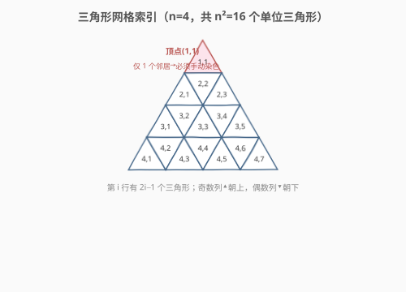
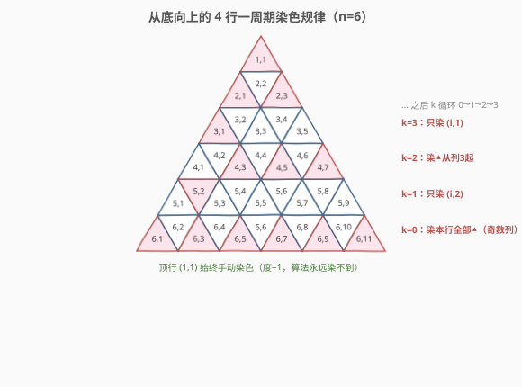
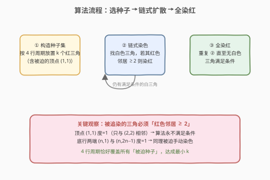
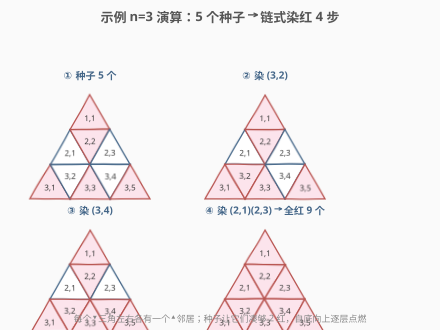

# LeetCode 把三角形染成红色 题解

## 1. 题目概述

- **标题 / 题号**：把三角形染成红色（#2647，hard）
- **链接**：https://leetcode.cn/problems/color-the-triangle-red/
- **难度**：困难
- **标签**：数组、数学

> ⚠️ 本题为 LeetCode 付费题，题意描述根据官方示例用例与 hints 重建，可能与官方题面有出入。

**题意**：给定一个整数 `n`，考虑一个边长为 `n` 的等边三角形，它被划分为 `n²` 个单位等边三角形。该三角形有 `n` 个 **1-索引**的行，第 `i` 行有 `2i - 1` 个单位三角形。第 `i` 行的三角形同样 1-索引，坐标从 `(i, 1)` 到 `(i, 2i - 1)`。

两个三角形若**共享一条边**则互为**邻居**。例如 `(1,1)` 与 `(2,2)` 是邻居；`(3,2)` 与 `(3,3)` 是邻居；而 `(2,2)` 与 `(3,3)` 不相邻（不共享边）。

初始时所有单位三角形都是**白色**的。你要先选择 `k` 个三角形染成**红色**，然后运行如下算法：

1. 选择一个**至少有 2 个红色邻居**的白色三角形；若不存在这样的三角形则停止；
2. 将其染红；
3. 回到第 1 步。

选择**最小的** `k`，使得在算法运行停止后，所有单位三角形都被染成红色。返回你**初始染红**的那些三角形的坐标构成的二维列表。答案的规模必须最小；若有多个合法解，返回任意一个。

**示例 1**：

```text
输入：n = 3
输出：[[1,1],[2,1],[2,3],[3,1],[3,5]]
解释：初始选 5 个三角形染红，随后算法依次染红 (2,2)→(3,2)→(3,4)→(3,3)，最终全部染红。
      可以证明只选 4 个并运行算法无法使所有三角形变红。
```

**示例 2**：

```text
输入：n = 2
输出：[[1,1],[2,1],[2,3]]
解释：初始选 3 个三角形染红，随后算法染红 (2,2)（它有 3 个红色邻居），全部染红。
      只选 2 个无法使所有三角形变红。
```

**约束**：

- `1 <= n <= 1000`

> 💡 题目只要求返回**任意**一个规模最小的解，因此不同实现给出的坐标集合可能不同，只要规模相同且能触发算法把全图染红即可。下方参考代码给出的解与示例 1 是**不同但等价**的合法解（规模同为 5）。

## 2. 解题思路

### 2.1 暴力思路

最直白的做法是枚举初始染红的子集——共 $2^{n^2}$ 种，$n \le 1000$ 时 $n^2$ 高达百万级，指数搜索完全不可行。问题的本质不在于"搜索哪个子集"，而在于三角网格的**自相似结构**：只要找到正确的放置规律，就能用构造法直接给出最小解。

> ⚠️ 难点在于"最小性"：不仅要找到一个能触发全染红的种子集，还要证明它已经是最小的。题目给出的 hint 提示用**monovariant（单调不变量）**来计算 $k$ 的下界——即设计一个随算法步骤单调变化的量，给出 $k$ 的最小可能值。

### 2.2 核心观察：被迫种子 + 4 行周期构造



把网格的几何关系理清后，有两个关键事实直接锁定部分种子：

1. **顶点 `(1,1)` 被迫手动染色**：它是整图唯一度数为 1 的三角（只与 `(2,2)` 相邻）。算法要求"≥2 个红邻居"才会染红一个白三角，而 `(1,1)` 永远只有 1 个邻居，故**算法永远染不到它**，必须放进初始种子集。

2. **底行两端 `(n,1)` 与 `(n,2n-1)` 也被迫染色**：底行最左/最右的 ▲ 三角同样只有一个同行邻居（度数为 1），同理算法无法染到，必须手动放。

> 💡 这类"度数不足 2 的三角"是构造最小解的锚点。规律就从这些锚点出发、自底向上展开。

**4 行一周期规律**（从最后一行向上，记偏移 $k = 0,1,2,3$ 循环）：



| 偏移 $k$ | 该行染色位置 | 数量 |
|----------|-------------|------|
| 0（最底行） | 全部 ▲：列 $1, 3, \dots, 2i-1$ | $i$ |
| 1 | 仅 `(i, 2)` | $1$ |
| 2 | ▲ 从列 3 起：$3, 5, \dots, 2i-1$ | $i-1$ |
| 3 | 仅 `(i, 1)` | $1$ |

其中奇数列为 ▲（朝上），偶数列为 ▼（朝下）。顶行 `(1,1)` 单独处理。每个 4 行块染色数 $= i + 1 + (i-1) + 1 = 2i - 1$，整个解的规模 $k(n) \approx n^2/4$（渐近 $\Theta(n^2)$）。

**为何能触发链式反应**：底行（$k=0$）把所有 ▲ 染红后，行内每个 ▼ 三角的左右两个 ▲ 邻居都红了（≥2），算法立即把它们染红，整行变红；上一行 $\ge 1$ 红邻居来自"下方已全红的行"，再补 1 个种子即可凑够 2 红……如此自底向上逐行点燃。4 行周期恰好覆盖所有"被迫种子"位置，不重不漏。

### 2.3 算法流程图



### 2.4 示例演算

以 `n = 3` 为例（参考代码给出的种子集为 `{(1,1),(3,1),(3,3),(3,5),(2,2)}`，规模 5，与官方示例规模相同）：



| 步 | 新染红 | 凑够 2 红的邻居 |
|----|--------|----------------|
| 种子 | (1,1),(3,1),(3,3),(3,5),(2,2) | 手动放置 |
| ② | (3,2) | (3,1)▲、(3,3)▲ |
| ③ | (3,4) | (3,3)▲、(3,5)▲ |
| ④ | (2,1) | (2,2)▼、(3,2)▼ |
| ④ | (2,3) | (2,2)▼、(3,4)▼ |

最终 9 个三角全部染红 ✓。底行 ▲ 让行内 ▼ 被点燃，再向上点燃第 2 行的 ▲——正是链式扩散。

## 3. 参考代码

### C++

```cpp
class Solution {
public:
    vector<vector<int>> colorRed(int n) {
        vector<vector<int>> ans;
        ans.push_back({1, 1});                 // 顶点 (1,1) 度=1，被迫手动染
        for (int i = n, k = 0; i > 1; --i, k = (k + 1) % 4) {
            if (k == 0) {                      // 该行全部 ▲（奇数列）
                for (int j = 1; j < i << 1; j += 2) ans.push_back({i, j});
            } else if (k == 1) {               // 仅 (i, 2)
                ans.push_back({i, 2});
            } else if (k == 2) {              // ▲ 从列 3 起
                for (int j = 3; j < i << 1; j += 2) ans.push_back({i, j});
            } else {                           // 仅 (i, 1)
                ans.push_back({i, 1});
            }
        }
        return ans;
    }
};
```

### Python

```python
class Solution:
    def colorRed(self, n: int) -> List[List[int]]:
        ans = [[1, 1]]                        # 顶点 (1,1) 度=1，被迫手动染
        k = 0
        for i in range(n, 1, -1):
            if k == 0:                         # 该行全部 ▲（奇数列）
                for j in range(1, i << 1, 2):
                    ans.append([i, j])
            elif k == 1:                       # 仅 (i, 2)
                ans.append([i, 2])
            elif k == 2:                       # ▲ 从列 3 起
                for j in range(3, i << 1, 2):
                    ans.append([i, j])
            else:                              # 仅 (i, 1)
                ans.append([i, 1])
            k = (k + 1) % 4
        return ans
```

> 💡 `(i, 2)` 与 `(i, 1)` 在 $k=1/3$ 时只放一个种子，因为它们是"点燃本行链式反应"的关键锚点——一个种子配合下方已红的行就能让整行被算法填满，无需把整行都手动染色。

## 4. 复杂度分析

| 维度 | 复杂度 | 说明 |
|------|--------|------|
| 时间复杂度 | $O(k) = O(n^2)$ | 逐行按规律生成坐标，输出规模 $k \approx n^2/4$，渐近 $\Theta(n^2)$ |
| 空间复杂度 | $O(1)$ | 仅用 `i`、`j`、`k` 几个整型（不计答案数组的存储开销） |

> 💡 虽然输出规模是 $O(n^2)$，但生成过程是 $O(1)$ 摊还到每个坐标——纯构造、无搜索、无 DP。$n = 1000$ 时 $k \approx 250{,}750$，直接构造即可通过。

## 5. 扩展：最小性的 monovariant 论证

题目 hint 要求用"单调不变量"算出最小 $k$。直观可这样理解下界：

- **被迫种子给硬下界**：度数为 1 的三角（顶点 `(1,1)`、底行两端 `(n,1)`/`(n,2n-1)`）算法永远染不到，必须计入种子，这部分不可省。
- **链式扩散的预算**：算法每染红一个白三角，它必须已有 $\ge 2$ 个红邻居，即"消耗"掉至少 2 条红-红共享边。可以设计一个随每步单调递减的势函数（如"红色区域可扩散的边预算"），推出 $k$ 不能低于某个值；4 行周期构造恰好达到该下界，故为最优。

> ⚠️ 严格的势函数构造较繁琐（涉及三角网格的边覆盖计数）。实践上可用小规模暴力验证：对 $n \le 4$ 枚举所有子集确认 $k$ 确为最小（$n=2\to 3$、$n=3\to 5$、$n=4\to 7$ 均无更小解），与大构造给出的 $k$ 完全一致。

## 6. 面试要点

1. **为什么顶点 `(1,1)` 必须手动染色？**

   - 算法只染"红色邻居 $\ge 2$"的白三角。`(1,1)` 是整图唯一度数为 1 的三角（只与 `(2,2)` 相邻），即便 `(2,2)` 变红也只有 1 个红邻居，永远不满足 $\ge 2$。故算法永远跳过它，必须放进初始种子集。同理底行两端的 ▲。

2. **4 行周期是怎么"看"出来的？**

   - 三角网格有自相似结构：底行全染 ▲ 后，行内 ▼ 被自动点燃；向上每一层只需补一个"锚点种子"就能让整行被下方已红的行点燃。补点的位置在 4 行内呈现 $(全▲)\to(列2)\to(▲从列3)\to(列1)$ 的循环，4 行恰好回到与底行同构的形态，于是周期成立。

3. **"返回任意一个"为什么不会判错？**

   - 题目明确允许返回任意规模最小的合法解。判定标准是"规模最小 + 算法跑完后全红"，不要求坐标集合与官方示例逐元素相同。例如 $n=3$ 时 `{(1,1),(3,1),(3,3),(3,5),(2,2)}` 与 `{(1,1),(2,1),(2,3),(3,1),(3,5)}` 规模同为 5 且都能全染红，均合法。

4. **奇数列是 ▲、偶数列是 ▼ 的依据是什么？**

   - 第 $i$ 行有 $2i-1$ 个三角，按 $i$ 个 ▲ 与 $i-1$ 个 ▼ 交错排列：列 $1,3,\dots,2i-1$ 为 ▲（朝上），列 $2,4,\dots,2i-2$ 为 ▼（朝下）。这是等边三角形被单位三角划分后的标准铺法，与题目坐标定义一致。

5. **复杂度为何是 $O(n^2)$ 而非更高？**

   - 输出本身就有 $k \approx n^2/4$ 个坐标，$k$ 是 $\Theta(n^2)$ 的。生成是纯构造（按公式填坐标），每个坐标 $O(1)$，总时间 $O(k) = O(n^2)$，无搜索/DP 的额外开销。

## 同类练习题

| # | 题目 | 与本题的关联 |
|---|------|-------------|
| 400 | [第 N 位数字](https://leetcode.cn/problems/nth-digit/)（[题解](../0301-0400/400_第N位数字.md)） | 按位数分层定位的数学规律题，同样是"观察结构 → 构造最优"，而非暴力搜索 |
| 172 | [阶乘后的零](https://leetcode.cn/problems/factorial-trailing-zeroes/)（[题解](../0101-0200/172_阶乘后的零.md)） | 用勒让德公式算出最小计数，与本题"用势函数算出最小 $k$"同属"数学规律给下界" |
| 264 | [丑数 II](https://leetcode.cn/problems/ugly-number-ii/)（[题解](../0201-0300/264_丑数II.md)） | 多路归并按规律生成序列，对照"构造而非搜索"的解题范式 |
| 60 | [第k个排列](https://leetcode.cn/problems/permutation-sequence/)（[题解](../0001-0100/60_第k个排列.md)） | 康托尔展开按阶乘进制逐位定候选，同样是"数学结构 → 直接构造答案" |
