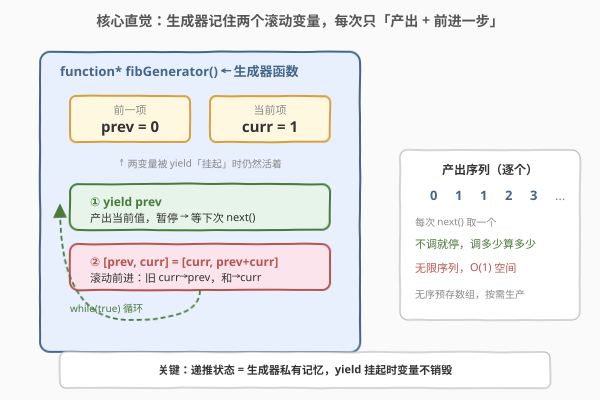
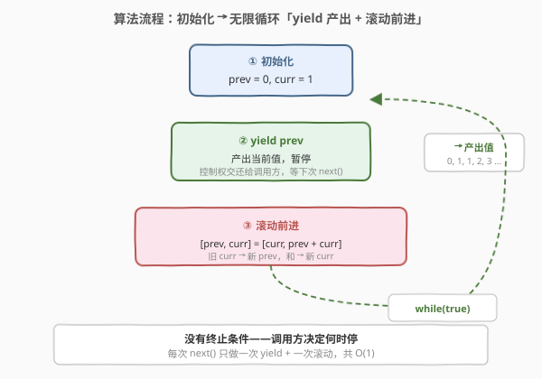
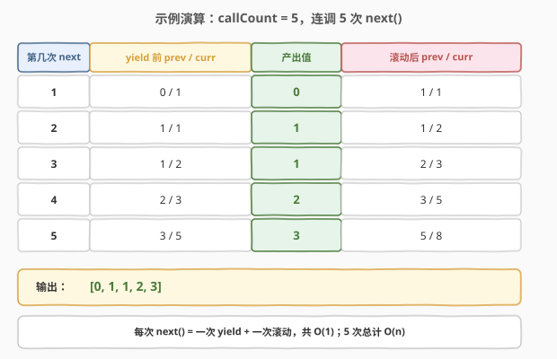

# LeetCode 生成斐波那契数列 题解

## 1. 题目概述

- **标题 / 题号**：生成斐波那契数列（#2648，easy）
- **链接**：https://leetcode.cn/problems/generate-fibonacci-sequence/
- **难度**：简单
- **标签**：生成器、迭代器、惰性求值、设计

**题意**：请你编写一个**生成器函数**，并返回一个可以生成**斐波那契数列**的生成器对象。

**斐波那契数列**的递推公式为 $X_n = X_{n-1} + X_{n-2}$。这个数列的前几个数字是 `0, 1, 1, 2, 3, 5, 8, 13`。

**示例 1**：

```text
输入：callCount = 5
输出：[0, 1, 1, 2, 3]
解释：
const gen = fibGenerator();
gen.next().value; // 0
gen.next().value; // 1
gen.next().value; // 1
gen.next().value; // 2
gen.next().value; // 3
```

**示例 2**：

```text
输入：callCount = 0
输出：[]
解释：gen.next() 永远不会被调用，所以什么也不会输出
```

**约束**：

- `0 <= callCount <= 50`

> 💡 本题考查的不是算法复杂度，而是**生成器（generator）**这一语言特性：如何让一个函数「产出一系列值」的同时记住自己的执行状态。题目官方以 JavaScript 为载体，但生成器思想跨语言通用，下文给出 JavaScript、Python、C++ 的等价实现。

## 2. 解题思路

### 2.1 暴力思路：每次从头递归算 fib(n)

最直白的「能跑」写法：把生成器退化成「每次调用从头算第 $n$ 个斐波那契数」——维护一个内部计数器 `k`，每次 `next()` 调用递归求 `fib(k)` 再 `k += 1`：

```text
fib(0) = 0, fib(1) = 1, fib(n) = fib(n-1) + fib(n-2)

gen.next():
  result = fib(k)   ← 从头递归
  k += 1
  return result
```

问题：递归 `fib(n)` 的时间复杂度是 $O(2^n)$——大量子问题被重复计算（如 `fib(3)` 在算 `fib(5)` 时被算了好几遍）。前 50 个斐波那契数如此算下来是灾难级的重复劳动。

> ⚠️ 这违背了生成器的初衷。生成器的精髓是**惰性 + 有状态**：每次产出只需在前一次的基础上「前进一小步」，而非从头重算。正确做法是把**递推过程本身**变成生成器内部状态，让每次 `next()` 都是 $O(1)$ 的推进。

### 2.2 核心观察：生成器 + 滚动两变量



斐波那契数列的递推只需**两个变量**：前一项 `prev` 与当前项 `curr`。每一步的产出值是 `prev`，产出后把 `[prev, curr]` 滚动更新为 `[curr, prev + curr]`——这就是「前进一小步」。

关键在于：**生成器函数在 `yield` 后会暂停、保留所有局部变量的值**，下次 `next()` 被调用时从暂停处恢复执行。于是这两个变量天然成为生成器的「私有记忆」，无需全局变量、无需数组缓存，每次调用只需 $O(1)$ 时间、$O(1)$ 空间。

- 初始：`prev = 0`，`curr = 1`；
- `yield prev` → 产出 `0`，暂停；
- 恢复：`[prev, curr] = [curr, prev + curr]` → `prev = 1, curr = 1`；
- `yield prev` → 产出 `1`，暂停；
- 恢复：`[prev, curr] = [curr, prev + curr]` → `prev = 1, curr = 2`；
- `yield prev` → 产出 `1`，暂停……

> 💡 **为什么是 `while(true)` 无限循环？** 生成器是**惰性求值（lazy evaluation）**的——`while(true)` 不会真的无限执行，它每循环一次就在 `yield` 处暂停，把控制权交还给调用方。调用方想要多少个就调多少次 `next()`，不想再要了就丢掉生成器对象。这正是「按需生产、用完即弃」的无限序列范式，对比暴力法「一次性算好存数组」省了 $O(n)$ 空间。

> ⚠️ **滚动顺序不可错**：必须先 `yield prev`（产出当前值），再滚动变量。若先滚动再 yield，会把 `curr` 当作第一个值产出，漏掉初始的 `0`。`yield` 是「产出并暂停」的语义，把它放在滚动之前，保证产出的是「这一步该有的值」。

### 2.3 算法流程图



整个生成器只有三步，循环往复：

1. **初始化**：`prev = 0`，`curr = 1`（数列前两项）；
2. **产出**：`yield prev`，暂停等待下一次 `next()`；
3. **滚动**：`[prev, curr] = [curr, prev + curr]`，回到第 2 步。

> 💡 流程图里没有「终止条件」——这正是生成器的特征。普通函数必须返回，生成器可以「永远不结束」，由调用方决定何时停止取值。

### 2.4 示例演算



以 `callCount = 5` 为例，`gen = fibGenerator()` 后连调 5 次 `next()`：

| 第几次 next() | yield 前 prev / curr | 产出值 | 滚动后 prev / curr |
|---------------|----------------------|--------|---------------------|
| 1 | 0 / 1 | **0** | 1 / 1 |
| 2 | 1 / 1 | **1** | 1 / 2 |
| 3 | 1 / 2 | **1** | 2 / 3 |
| 4 | 2 / 3 | **2** | 3 / 5 |
| 5 | 3 / 5 | **3** | 5 / 8 |

输出 `[0, 1, 1, 2, 3]`。注意每次 `next()` 只做一次产出 + 一次滚动，共 $O(1)$，5 次调用总计 $O(5) = O(n)$。若 `callCount = 0`，则 `next()` 从未被调用，生成器始终处于初始 `prev=0, curr=1` 的暂停态，什么都不产出。

## 3. 参考代码

### JavaScript（题目官方语言）

```javascript
/**
 * @return {Generator<number>}
 */
var fibGenerator = function* () {
    let prev = 0,
        curr = 1;
    while (true) {
        yield prev;
        [prev, curr] = [curr, prev + curr];
    }
};

/**
 * const gen = fibGenerator();
 * gen.next().value; // 0
 * gen.next().value; // 1
 */
```

> 💡 `function*` 是生成器函数的声明语法（星号标识），调用它不执行函数体，而是返回一个生成器对象。`yield` 暂停并产出值；解构赋值 `[prev, curr] = [curr, prev + curr]` 用临时元组同时更新两变量，避免引入第三个临时变量。实测 `gen.next().value` 依次返回 `0, 1, 1, 2, 3, 5, 8, 13...`。

### Python（生成器等价实现）

```python
from itertools import islice


def fib_generator():
    prev, curr = 0, 1
    while True:
        yield prev
        prev, curr = curr, prev + curr


# 取前 n 个斐波那契数
def take_fib(n: int) -> list[int]:
    return list(islice(fib_generator(), n))
```

> 💡 Python 的 `yield` 与 JS 语义完全一致：执行到 `yield` 暂停并返回值，`next()` 恢复执行。`itertools.islice(gen, n)` 是从无限序列取前 $n$ 个的标准用法，比手动循环 `next()` 更 Pythonic。Python 的元组解构 `prev, curr = curr, prev + curr` 同样是原子同时赋值，无需临时变量。

### C++（仿函数：可调用对象 + 成员状态）

```cpp
// C++ 没有语言级 generator（C++20 协程过于重量），用仿函数等价模拟
struct FibGenerator {
    int prev = 0;
    int curr = 1;

    int next() {
        int result = prev;          // 先取出当前值
        int nxt = prev + curr;      // 算下一项
        prev = curr;
        curr = nxt;
        return result;
    }
};
```

> 💡 C++ 在 C++20 之前没有语言级生成器，最贴近的等价物是**仿函数（functor）**：把 `prev`、`curr` 作为成员变量，每次调用 `next()` 取出当前值并滚动前进。语义上与 JS/Python 生成器的「记住状态、每次前进一步」完全对应，区别仅在于「成员变量」而非「局部变量被 yield 挂起」。这与 [2620. 计数器](../2601-2700/2620_计数器.md) 的仿函数写法一脉相承。

## 4. 复杂度分析

| 维度 | 复杂度 | 说明 |
|------|--------|------|
| **时间复杂度** | $O(1)$ 每次 / $O(n)$ 共 $n$ 次 | 每次 `next()` 只做一次产出 + 一次滚动加法，常数时间；调 $n$ 次总计 $O(n)$ |
| **空间复杂度** | $O(1)$ | 仅持有 `prev`、`curr` 两个整型变量，与调用次数无关——这是惰性生成器相对「预存数组」的核心优势 |

> 💡 本题考点不在性能而在**生成器语义**。对照暴力递归法 $O(2^n)$ 的时间，生成器把每次调用降到 $O(1)$，是因为它把递推过程本身变成了内部状态，避免了重复计算。

## 5. 扩展：生成器 vs 数组——惰性求值的力量

### 5.1 预存数组法

最朴素的替代方案：一次性算好前 `callCount` 个斐波那契数存进数组，每次 `next()` 从数组取下一个。时间 $O(n)$、空间 $O(n)$。缺点：**必须预先知道要取多少个**，且无论最终取不取都要分配 $O(n)$ 空间。

### 5.2 生成器的优势

生成器是**无限序列**的载体——它本身不存储结果，只存储「计算到哪一步」的少量状态，**按需生产、用完即弃**：

| 维度 | 预存数组 | 生成器 |
|------|----------|--------|
| 是否需提前知道个数 | 是 | 否（无限序列，取多少算多少） |
| 空间 | $O(n)$ | $O(1)$ |
| 不取全部时浪费 | 算了不用的也占空间 | 不调用就不算 |
| 可表达无限序列 | 否 | 是 |

> 💡 **惰性求值（lazy evaluation）**是生成器的哲学：值在「被需要时」才被计算。这与函数式编程中的 `Stream`、`lazy list` 一脉相承。Python 的 `itertools` 全家桶（`count`、`cycle`、`islice`）都建立在生成器之上，能表达无限序列而不爆内存。

> ⚠️ **生成器的「记忆」是单次使用的**：一个生成器对象从头到尾只走一遍，取过的值不会重来。要重新从头取值必须新建一个生成器对象（Python 中可把生成器函数再调一次，或用 `itertools.tee` 复制）。这是生成器相对数组的一个使用约束。

## 6. 面试要点

1. **什么是生成器？它和普通函数有何区别？**

   > 生成器是一种**可暂停、可恢复**的函数：执行到 `yield` 时产出值并暂停，保留所有局部变量的状态；下次被 `next()` 调用时从暂停处恢复继续执行。普通函数一旦返回局部变量即销毁，生成器的局部变量在 `yield` 暂停期间「活着」，这正是它能记住斐波那契递推状态的原理。

2. **`while(true)` 不会死循环卡死吗？**

   > 不会。生成器的 `while(true)` 每循环一次就在 `yield` 处**主动让出控制权**，把值交还给调用方并暂停。循环是否继续取决于调用方是否再调 `next()`——调用方不调，生成器就永远停在那里，不占 CPU。这是惰性求值的核心：无限序列的描述与它的实际展开是分离的。

3. **为什么先 `yield` 再滚动变量，顺序不能反？**

   > `yield prev` 产出的是「当前这一步的值」，之后才滚动到下一步。若先滚动再 yield，第一个产出值会变成 `curr`（即 1），漏掉初始的 `0`。`yield` 是「产出并暂停」的语义，把它放在滚动之前，保证产出的是「这一步该有的值」、滚动是为「下一步」做准备。

4. **生成器和迭代器是什么关系？**

   > 生成器是**创建迭代器的一种便捷语法**。手写迭代器需要实现 `hasNext`/`next` 接口并自己管理状态；生成器函数用 `yield` 自动帮你实现了迭代器协议——`yield` 的值就是 `next()` 的返回值，暂停/恢复的机制替你管好了状态。JS 中生成器对象本身就是合法的迭代器（有 `next()` 方法、可被 `for...of` 消费）；Python 中生成器也是迭代器（实现了 `__iter__` 和 `__next__`）。

5. **如何用生成器实现一个「取前 N 个斐波那契数」的辅助函数？**

   > JS：`[...Array(N)].map(() => gen.next().value)` 或手动循环 N 次 `next()`。Python：`list(itertools.islice(fib_generator(), N))`，`islice` 是从无限序列切片的标准工具，不会把无限序列展开爆内存。关键点：生成器只被消费一次，取完前 N 个后剩余部分永不被计算。

## 同类练习题

| # | 题目 | 与本题的关联 |
|---|------|-------------|
| 509 | [斐波那契数](https://leetcode.cn/problems/fibonacci-number/)（[题解](../0501-0600/509_斐波那契数.md)） | 斐波那契递推的基础题，返回第 $n$ 项；本题是其「生成器版」，把单次求值变成无限序列按需取值 |
| 2634 | [过滤数组中的元素](https://leetcode.cn/problems/filter-elements-from-array/) | 要求用生成器逐个产出满足条件的元素，承接本题对 `function*` + `yield` 语法的理解 |
| 2635 | [转换数组中的每个元素](https://leetcode.cn/problems/apply-transform-over-each-element-in-array/) | 用生成器逐个产出映射后的元素，与本题同为「生成器产出序列」的基础练习 |
| 2620 | [计数器](https://leetcode.cn/problems/counter/)（[题解](2620_计数器.md)） | 闭包记状态每次自增，本题生成器记两变量每次滚动，同属「函数携带私有状态」的设计题，可对照闭包与生成器两种状态封装机制 |
