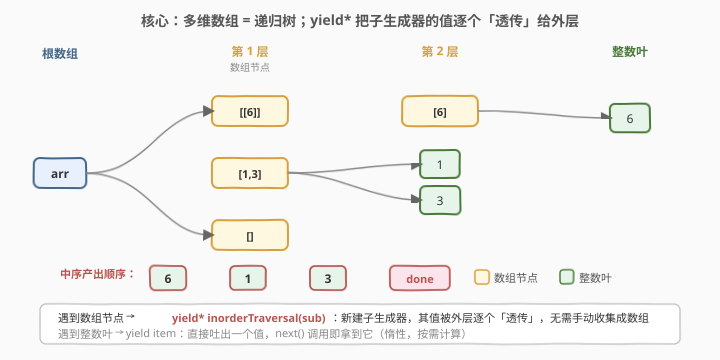
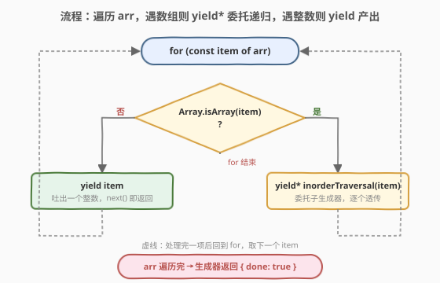

# LeetCode 嵌套数组生成器 题解

## 1. 题目概述

- **标题 / 题号**：嵌套数组生成器（#2649，medium）
- **链接**：https://leetcode.cn/problems/nested-array-generator/
- **难度**：中等
- **标签**：生成器、递归、深度优先搜索、数组

**题意**：给定一个整数的**多维数组**，返回一个**生成器对象**，按**中序遍历**的顺序逐个生成整数。

- **多维数组**：递归数据结构，元素是整数或其他多维数组。
- **中序遍历**：从左到右遍历每个数组，遇到整数就生成它，遇到数组就递归应用中序遍历。

**示例 1**：

```text
输入：arr = [[[6]],[1,3],[]]
输出：[6,1,3]
解释：
const generator = inorderTraversal(arr);
generator.next().value; // 6
generator.next().value; // 1
generator.next().value; // 3
generator.next().done;   // true
```

**示例 2**：

```text
输入：arr = []
输出：[]
解释：输入的多维数组没有任何元素，生成器不需要生成任何值。
```

**约束**：

- `0 <= arr.flat().length <= 10^5`
- `0 <= arr.flat()[i] <= 10^5`
- `maxNestingDepth <= 10^5`

> 💡 本题属 LeetCode「30 天 JavaScript」系列，**仅开放 JavaScript / TypeScript 提交入口**，考察 **generator 生成器**与 **`yield*` 委托**语法。生成器是跨语言通用概念，下文给出 Python 的 `yield from` 等价实现（两者语义几乎一一对应）。

## 2. 解题思路

### 2.1 暴力思路：先整体扁平化，再逐个返回

最直白的「能跑」写法：先把多维数组**整体扁平化成一个一维数组**，再把它做成一个逐个吐值的生成器：

```text
inorderTraversal(arr):
    flat = []                      // 先把所有整数收集进 flat
    stack = [arr]
    while stack 非空:
        cur = stack.pop()
        for item in cur:           // DFS 收集
            if isArray(item): stack.push(item)
            else: flat.push(item)
    for v in flat: yield v         // 再逐个 yield
```

逻辑没错，但有两个浪费：

1. **丧失惰性**：哪怕调用方只 `next()` 取第一个值，也得先把全部 $N$ 个整数物化进 `flat`，提前付清 $O(N)$ 时间与内存。生成器的核心价值是「按需计算」，暴力法把它退化成了「先算完再发」。
2. **多一次拷贝**：先收集成中间数组再 yield，多一趟遍历、多一份 $O(N)$ 副本，对 `flat().length <= 10^5` 的大数组是实打实的开销。

> ⚠️ 本题真正的考点不是"会不会遍历嵌套数组"，而是**能不能用 `yield*` 让递归与惰性合二为一**——把"递归遍历子数组"和"逐个产出值"融进同一条生成器管线，无需任何中间数组。

### 2.2 核心观察：`yield*` 委托 = 生成器版的「递归展开」



多维数组是递归定义的（整数 | 数组），所以遍历也是递归定义的。`yield*` 正是为这种递归量身定做的语法：

- **`yield value`**：吐出**一个**值，调用方 `next()` 即拿到它，生成器在此挂起。
- **`yield* someGenerator`**：**委托**给另一个可迭代对象/生成器，把它产出的值**逐个透传**给外层调用方，仿佛那些值是外层自己 yield 的一样。等子生成器耗尽，控制权交回外层继续。

于是三行就能写完：

```text
inorderTraversal(arr):
    for item in arr:
        if isArray(item):
            yield* inorderTraversal(item)   // 委托给子生成器，逐个透传
        else:
            yield item                      // 叶子：直接吐一个值
```

两个关键点让它比暴力法更优：

| 观察 | 含义 |
|------|------|
| **`yield*` 递归天然匹配树结构** | 多维数组的递归定义 ⟺ 生成器的递归委托：遇到子数组就开一个子生成器并透传其值，无需手动收集成数组 |
| **惰性贯穿全链** | 外层 `next()` 拉一个值，会层层 `yield*` 委托下去直到某个叶子 `yield` 出整数；不调 `next()` 就不推进，零预计算 |

> 💡 **`yield*` 等价于手写委托循环**：`yield* gen` ≈ `for (const v of gen) yield v`，但前者由引擎优化、且能**转发 `return`/`throw`**（子生成器可返回一个最终值给 `yield*` 表达式）。本题用不到返回值，但 `yield*` 的"逐个透传、无需中间数组"正是其精髓。

> ⚠️ **`maxNestingDepth <= 10^5` 会爆栈吗？** 官方 hint 明确说"无需担心递归深度"。`yield*` 委托链虽随嵌套深度增长，但生成器**挂起时其执行上下文落在堆上而非调用栈**，V8 对此有较宽松的处理，本题测试数据下递归 `yield*` 可直接通过。若追求极致稳健，2.5 节给出显式栈迭代版，把"递归深度"完全搬到堆上的数组里。

### 2.3 算法流程图



整体只有一条主线：**遍历当前数组的每个元素 → 是数组就 `yield*` 委托子生成器下钻 → 是整数就 `yield` 吐出 → 取完则生成器结束**。空数组不进循环、不产任何值，递归对空输入天然收敛。

### 2.4 示例演算

![示例演算：arr = [[[6]],[1,3],[]]，逐次 next() 取出 6、1、3](../images/p2649_example_walkthrough.svg)

以**示例 1** `arr = [[[6]],[1,3],[]]` 为例，三次 `next()` 的推进过程：

| 步 | 调用 | 返回 | 推进轨迹 |
|----|------|------|----------|
| 1 | `gen.next()` | `{value:6}` | 遇 `[[6]]`→`yield*`→遇 `[6]`→`yield*`→遇 `6`→`yield 6` |
| 2 | `gen.next()` | `{value:1}` | 子生成器耗尽回退到根，遇 `[1,3]`→`yield*`→遇 `1`→`yield 1` |
| 3 | `gen.next()` | `{value:3}` | 续 `[1,3]`，遇 `3`→`yield 3` |
| 4 | `gen.next()` | `{done:true}` | 遇 `[]`→空数组跳过；根遍历完，生成器结束 |

关键观察：`[]` 是空数组，`for...of` 不进循环，子生成器立即结束、不产任何值——递归对空输入天然收敛，无需特判。

## 3. 参考代码

### JavaScript / TypeScript（递归 `yield*`，提交语言，最优雅）

```javascript
/**
 * @param {Array} arr
 * @return {Generator}
 */
var inorderTraversal = function* (arr) {
    for (const item of arr) {
        if (Array.isArray(item)) {
            yield* inorderTraversal(item);   // 委托子生成器，逐个透传
        } else {
            yield item;                       // 叶子：吐出一个整数
        }
    }
};
```

TypeScript 版（带递归类型签名）：

```typescript
type MultidimensionalArray = (MultidimensionalArray | number)[];

function* inorderTraversal(arr: MultidimensionalArray): Generator<number, void, unknown> {
    for (const item of arr) {
        if (Array.isArray(item)) {
            yield* inorderTraversal(item);
        } else {
            yield item;
        }
    }
}
```

> 💡 `Generator<number, void, unknown>`：第一参 `TYield = number`（产出整数），第二参 `TReturn = void`（不 return 值），第三参 `TNext = unknown`（不接受 `next(v)` 注入的值）。本题只往外吐值，故 TReturn/TNext 用 `void`/`unknown` 即可。

### JavaScript（迭代栈，规避深嵌套递归）

> 若担心 `maxNestingDepth = 10^5` 的极端链式嵌套，可用「显式栈 + 迭代器」版本：把递归彻底搬到堆上的栈里，生成器帧不进调用栈，深度只受内存限制。仍是惰性的——只在 `next()` 时推进一格。

```javascript
var inorderTraversal = function* (arr) {
    // 栈存放「待消费的迭代器」，栈顶是当前正在遍历的那一层
    const stack = [arr[Symbol.iterator]()];
    while (stack.length) {
        const it = stack[stack.length - 1];
        const { value, done } = it.next();
        if (done) {
            stack.pop();                       // 该层遍历完，回退到上一层
        } else if (Array.isArray(value)) {
            stack.push(value[Symbol.iterator]()); // 下钻：压入子数组迭代器
        } else {
            yield value;                       // 整数：吐出，在此挂起
        }
    }
};
```

> ⚠️ 这版的游标由迭代器自身的内部状态维护（`it.next()` 自动推进），无需像 [2625 扁平化嵌套数组](../2601-2700/2625_扁平化嵌套数组.md)那样手动 `top[1] = i + 1`——因为迭代器把"遍历到哪了"封装好了，下钻时只要压一个新迭代器、回退时只要 `pop`。`yield value` 之后生成器挂起，下次 `next()` 从栈顶迭代器继续，状态天然保持。

### Python（`yield from`，与 `yield*` 一一对应）

> 本题 LeetCode 仅开放 JS/TS，Python 版作概念对照。Python 的 `yield from` 正是 `yield*` 的对应物，语义几乎逐字翻译——这是跨语言理解生成器委托的最佳样本。

```python
from typing import Generator

def inorder_traversal(arr: list) -> Generator[int, None, None]:
    for item in arr:
        if isinstance(item, list):
            yield from inorder_traversal(item)   # 委托子生成器，逐个透传
        else:
            yield item                            # 叶子：吐出一个整数
```

> 💡 **`yield from` vs `yield*` 的同与异**：两者都做"委托 + 透传"，但 PEP 380 引入 `yield from` 时还规定了**透明转发 `send()`/`throw()`/`close()`**——子生成器收到的注入值与异常都由外层代为转交。JS 的 `yield*` 同样转发 `next(v)` 注入与 `return(v)`，但不转发 `throw`。本题只往外吐值、用不到注入，故差异不显现。

## 4. 复杂度分析

| 维度 | 复杂度 | 说明 |
|------|--------|------|
| 时间复杂度 | $O(N)$ 摊还 | $N$ 为所有整数总数；每个整数 `yield` 一次、每个数组节点访问一次，全部摊还到各次 `next()` 上 |
| 空间复杂度 | $O(D)$ | $D$ 为最大嵌套深度；递归版为 `yield*` 委托链 / 调用栈，迭代版为显式栈；均**惰性**，不存 $O(N)$ 中间数组 |

> 💡 惰性是关键：暴力扁平化要 $O(N)$ 内存常驻；而 `yield*` 版每次 `next()` 只沿一条根→叶的路径推进，活跃内存仅 $O(D)$。当 $N = 10^5$ 但只需取前几个值时，生成器可中途停下、省去剩余计算——这是流式处理的核心。

## 5. 扩展：`yield` vs `yield*`，以及惰性 vs 急求值

围绕生成器委托有几个关键概念：

| 概念 | 语义 | 何时返回控制 |
|------|------|--------------|
| **`yield v`** | 产出**单个**值 `v`，挂起 | 立刻返回给调用方的 `next()` |
| **`yield* iter`** | 委托给可迭代对象 `iter`，逐个透传其值 | 等 `iter` **耗尽**才把控制交回外层 |
| **`return v`（生成器内）** | 结束本生成器，并把 `v` 作为 `yield*` 表达式的值 | 本生成器终止 |

- **`yield*` 的"透传"而非"收集"**：`yield* gen` **不会**先把 `gen` 的所有值收集成一个数组再发，而是一个一个地透传——因此它是惰性的，内存仍是 $O(D)$ 而非 $O(N)$。这是它和 `flat()` + 遍历的本质区别。
- **委托可嵌套**：`yield* yield* ... ` 形成一条委托链，调用方一次 `next()` 会层层穿透到最深的叶子。这正是本题递归 `yield*` 的工作方式——嵌套深度 = 委托链长度。
- **跨语言镜像**：JS 的 `yield*` ⟷ Python 的 `yield from` ⟷ C# 的 `foreach yield return` ⟷ 协程的子协程调用。掌握一个即理解一族。

> 💡 **工程落点**：生成器委托是构建**惰性管线**的积木——把"读取一行""解析一个 token""过滤一条记录"做成各自生成器，再用 `yield*` 串联，便是一条不物化中间结果的数据流水线（如大文件流式处理、解析器组合子）。它与 RxJS 的 `flatMap`、Node.js Stream 的 `pipe` 异曲同工，只是抽象层级不同。

## 6. 面试要点

1. **`yield` 和 `yield*` 的区别是什么？为什么本题用 `yield*`？**

   > `yield v` 产出一个值并挂起；`yield* iter` 把控制委托给另一个可迭代对象，逐个透传它的值，等它耗尽才交回控制。本题遇到子数组需要递归遍历其内部所有整数，用 `yield* inorderTraversal(sub)` 把子生成器的值逐个透传给外层，无需手动收集成中间数组，天然贴合递归结构。

2. **为什么说生成器是"惰性"的？怎么验证？**

   > 生成器函数被调用时只返回一个生成器对象，**函数体不执行**；只有在调用 `.next()` 时才推进到下一个 `yield` 并挂起。不调 `next()` 就不往下算。本题里，若只取前 2 个值，剩余整数不会被计算——这就是惰性。对照暴力扁平化先算完所有值，二者形成"惰性 vs 急求值"的鲜明对比。

3. **`maxNestingDepth <= 10^5`，递归 `yield*` 会爆栈吗？**

   > 官方 hint 说无需担心。生成器挂起时其执行上下文落在堆上而非调用栈，`yield*` 委托链虽随嵌套深度增长，但 V8 对此处理较宽松，本题测试数据下可直接通过。若追求极致稳健，用 3.2 的"显式栈 + 迭代器"版本，把递归彻底搬到堆上的数组，深度只受内存限制，与调用栈无关。

4. **迭代栈版为什么不用手动维护游标 `i`？**

   > 因为把每层包装成了 `Array[Symbol.iterator]()`，迭代器自身封装了"遍历到哪了"——`it.next()` 自动推进并返回 `{value, done}`。下钻时压一个新迭代器、回退时 `pop`，状态天然保持。对照 [2625](../2601-2700/2625_扁平化嵌套数组.md) 用数组+下标三元组 `[arr, i, d]` 需手动 `top[1] = i + 1`，这里更省心，因为不需要"深度"信息（本题无条件展开到底，不像 2625 要按深度预算判断）。

5. **空数组 `[]` 为什么不需要特判？**

   > `for (const item of [])` 循环体一次都不执行，子生成器立即结束、不产任何值，`yield*` 也随即耗尽交回控制。递归对空输入天然收敛——这是"用循环+递归处理递归结构"的天然好处，无需像扁平化数组那样为空输入单独写边界分支。

## 同类练习题

| # | 题目 | 与本题的关联 |
|---|------|-------------|
| 341 | [扁平化嵌套列表迭代器](https://leetcode.cn/problems/flatten-nested-list-iterator/) | 同套路"惰性展平嵌套结构"，但要求 `hasNext/next` 接口，用栈推迟展开，对照"生成器委托 vs 手写迭代器栈" |
| 2648 | [斐波那契数列生成器](https://leetcode.cn/problems/generate-fibonacci-sequence/) | 同属 30 天 JS 生成器系列，用 `yield` 逐个产出 Fibonacci，对照"无界序列的惰性生成" |
| 173 | [二叉搜索树迭代器](https://leetcode.cn/problems/binary-search-tree-iterator/) | 对递归结构做受控惰性遍历，用栈模拟中序，与本题"生成器中序遍历递归树"同构 |
| 2625 | [扁平化嵌套数组](https://leetcode.cn/problems/flatten-deeply-nested-array/) | 同仓已写题解，把多维数组展平成一维（急求值），与本题"惰性逐个 yield"互为镜像 |
