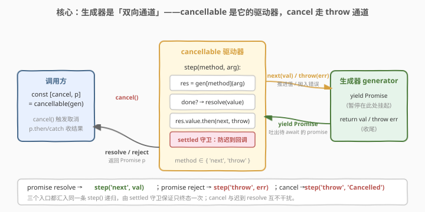
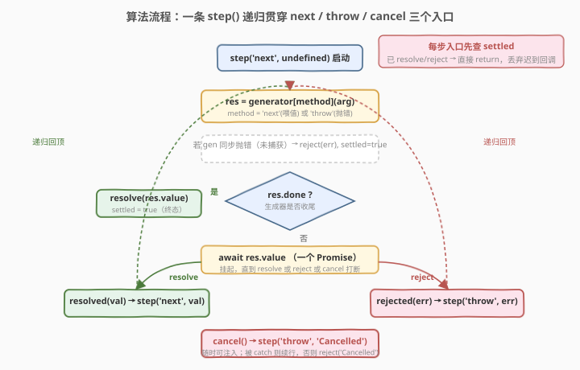
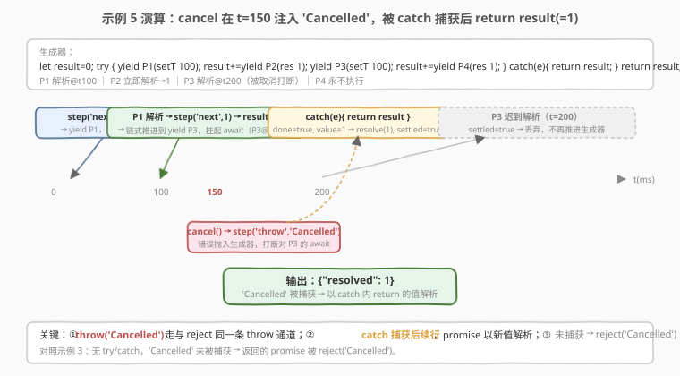

# 设计可取消函数

- **题目名称**：设计可取消函数
- **链接**：[2650. Design Cancellable Function](https://leetcode.cn/problems/design-cancellable-function/)
- **难度**：困难
- **标签**：生成器、Promise、异步、设计

## 1. 题目概述

写一个 `cancellable(generator)` 函数，接收一个**生成器对象**，返回 `[cancel, promise]`：

- 生成器**只会 `yield` Promise 对象**。你的职责是：把每个 promise 解析的值**经 `generator.next(value)` 喂回**生成器；若 promise **被拒绝**，则把错误**经 `generator.throw(error)` 抛入**生成器。
- 若在生成器完成前调用 `cancel()`：应向生成器抛入字符串 **`"Cancelled"`**（不是 `Error` 对象）。若该错误**被 `try/catch` 捕获**，返回的 promise 应解析为"下一个 yield 出或 return 的值"；若**未被捕获**，promise 应以 `"Cancelled"` 拒绝。除此之外不应执行任何其它代码。
- 生成器 `return` 时，promise 解析为返回值；生成器抛出未捕获错误时，promise 以该错误拒绝。

> 💡 本题属 LeetCode「30 天 JavaScript」系列**收官题**（题号 2650），**仅开放 JavaScript / TypeScript 提交入口**，考点是**生成器的双向通信**（`next` 喂值 / `throw` 抛错）与**可取消的异步驱动**。本质上，你要手写的正是 JS 引擎为 `async/await` 做的事——下文会展开。

**示例 1（立即完成，cancel 无效）**：

```text
generatorFunction = function*() { return 42; }
cancelledAt = 100
输出：{"resolved": 42}
// 生成器立即 return 42 并完成，promise 在 t=0 解析；之后 cancel 已无作用
```

**示例 2（生成器主动抛错→reject）**：

```text
generatorFunction = function*() { const msg = yield new Promise(res => res("Hello")); throw `Error: ${msg}`; }
cancelledAt = null
输出：{"rejected": "Error: Hello"}
// promise 解析 "Hello" 喂回 → 生成器抛 `Error: Hello` → 外层 promise 被同样错误拒绝
```

**示例 3（cancel 未被捕获→reject("Cancelled")）**：

```text
generatorFunction = function*() { yield new Promise(res => setTimeout(res, 200)); return "Success"; }
cancelledAt = 100
输出：{"rejected": "Cancelled"}
// await 200ms promise 期间，t=100 调 cancel → 抛 "Cancelled" → 无 catch → promise reject("Cancelled")
```

**示例 4（正常串行 4 个 promise→resolve(2)）**：

```text
generatorFunction = function*() {
  let result = 0;
  yield new Promise(res => setTimeout(res, 100));      // P1
  result += yield new Promise(res => res(1));          // P2
  yield new Promise(res => setTimeout(res, 100));      // P3
  result += yield new Promise(res => res(1));          // P4
  return result;
}
cancelledAt = null
输出：{"resolved": 2}   // 0 → +1 → +1 = 2，200ms 后完成
```

**示例 5（cancel 被 catch 捕获→return→resolve(1)）**：

```text
generatorFunction = function*() {
  let result = 0;
  try { yield P1(setT100); result += yield P2(res1); yield P3(setT100); result += yield P4(res1); }
  catch(e) { return result; }
  return result;
}
cancelledAt = 150
输出：{"resolved": 1}   // 前 2 步 result=1；t=150 cancel 抛 "Cancelled" 被捕获 → return 1 → resolve(1)
```

**示例 6（promise reject 被 catch 后续行→resolve(4)）**：

```text
generatorFunction = function*() {
  try { yield new Promise((_, reject) => reject("Promise Rejected")); }
  catch(e) { let a = yield new Promise(r => r(2)); let b = yield new Promise(r => r(2)); return a + b; }
}
cancelledAt = null
输出：{"resolved": 4}   // 第一个 promise 拒绝 → 抛入生成器被 catch → 续行 2+2=4
```

**约束条件**：

- `cancelledAt == null` 或 `0 <= cancelledAt <= 1000`
- `generatorFunction` 返回一个生成器对象

---

## 2. 解题思路

### 2.1 暴力思路：把生成器当「单向迭代器」，只 pull 不 push

最直觉的「能跑」写法是拿 `for...of` 或循环 `next()` 把生成器当普通迭代器消费，顺手 `await` 每个 promise：

```text
for (const p of generator) {       // 只调 next()，不把值喂回去
    const v = await p
    // ❌ 没把 v 经 next(v) 喂回生成器
}
```

这写法有 **三处致命缺失**：

1. **丢了「值回灌」通道**：`const x = yield P` 要求把 `P` 的解析值经 `next(value)` 灌回去，`x` 才拿得到。只 pull 不 push，生成器里的 `x` 永远是 `undefined`，后续计算全错。
2. **丢了「错误回灌」通道**：promise reject 时，正确做法是 `throw(error)` 把错误抛回生成器（让它的 `try/catch` 决定去留），而不是直接判失败。单向迭代没有这条通道。
3. **没有取消入口**：`cancel()` 需要在任意 await 点注入 `"Cancelled"`，这只能靠 `throw('Cancelled')`；单向循环根本接不上。

> ⚠️ 本题真正的考点不是"会不会写 promise 链"，而是**认清生成器是一条双向通道**——`next(v)` 把值推进去、`throw(e)` 把错误推进去、`yield P` 把 promise 吐出来。你要写的是这条通道的**驱动器**，把三个入口（值回灌、错误回灌、取消）汇入同一条推进逻辑。

### 2.2 核心观察：生成器是「双向通道」，cancellable 是它的「驱动器」



把生成器看作一台"可暂停的机器"：每次 `yield P` 它吐出一个 promise 并**挂起**，等你把 `P` 的结果**推进来**它才继续。驱动器要做的就三件事：

| 事件 | 驱动动作 | 等价语义 |
|------|----------|----------|
| promise **resolve**(val) | `generator.next(val)` | 把解析值灌回 `yield` 表达式 |
| promise **reject**(err) | `generator.throw(err)` | 把错误抛入生成器，交给它的 `try/catch` |
| 调用 **cancel()** | `generator.throw("Cancelled")` | 与 reject 同走 `throw` 通道，只是错误固定为 `"Cancelled"` |

三个入口都**汇入同一条 `step(method, arg)` 递归**——`method` 取 `'next'` 或 `'throw'`，`arg` 是要灌回的值/错误。于是整套行为被压缩成：

```text
step(method, arg):
    res = generator[method](arg)        // next(arg) 喂值 / throw(arg) 抛错
    if res.done: resolve(res.value)     // 生成器 return → 终态
    else: res.value.then(               // 等下一个 promise
        val  => step('next',  val),     // 解析 → 喂回
        err  => step('throw', err))     // 拒绝 → 抛入
```

两个关键设计让它稳健：

| 观察 | 含义 |
|------|------|
| **`cancel` 复用 `throw` 通道** | 取消不是"另起一条逻辑"，而是和 promise 拒绝一样往生成器里抛错。生成器用同一个 `try/catch` 统一处理"外部打断"——捕获则续行、不捕获则外层 reject。这让 cancel 与 reject 的语义天然统一 |
| **`settled` 终态守卫** | 一旦 `resolve`/`reject` 一次就置 `settled = true`，此后所有迟到的回调（被取消打断的那个 promise 之后才 resolve、或 cancel 被重复调用）一律 `return` 跳过——保证 promise 只终态一次、互不干扰 |

> 💡 **为什么 cancel 用字符串 `"Cancelled"` 而非 `Error`？** 题目明确要求"该错误应该是字符串 `\"Cancelled\"`（而不是一个 Error 对象）"。`generator.throw("Cancelled")` 在 JS 中合法——`throw` 可抛任意值，生成器的 `catch(e)` 拿到的 `e` 就是字符串 `"Cancelled"`。这是题目刻意设定的"取消信号"约定。

> ⚠️ **`settled` 守卫为何必须挡住迟到回调？** 考虑示例 5：t=150 cancel 抛 `"Cancelled"` 被捕获、生成器 `return 1` → `resolve(1)`。但被打断的 P3 在 t=200 才 resolve，其 `.then` 回调若不受挡会再次 `step('next', undefined)` 推进一个已完成的生成器。`settled` 让它一进门就返回，"不应执行任何其它代码"由此落地。

### 2.3 算法流程图



主线只有一条：**入口（值/错/cancel）→ `generator[method](arg)` → 完成则终态、否则 await 下一个 promise → resolve 走 `next` / reject 走 `throw` → 递归回顶**。`cancel` 是一条随时可注入的旁路，同样汇入 `step('throw', 'Cancelled')`。

### 2.4 示例演算



以**示例 5**为例，时间线推进过程：

| 时刻 | 事件 | 生成器状态 | promise 终态 |
|------|------|------------|--------------|
| t=0 | `step('next')` 启动 | `yield P1`(setT100) 挂起 | — |
| t=100 | P1 resolve → `step('next',undef)` | `result += yield P2`；P2 立即 resolve | — |
| t=100(微任务) | P2 resolve → `step('next',1)` | `result=1`；`yield P3`(setT200) 挂起 | — |
| t=150 | `cancel()` → `step('throw','Cancelled')` | 进入 `catch(e){ return result }` → `return 1` → done | **resolve(1)**, settled=true |
| t=200 | P3 迟到 resolve | （生成器已完成） | settled=true → 丢弃，不推进 |

关键观察：**cancel 走 `throw` 通道**，与 promise reject 同形；被 `catch` 捕获后生成器续行并 `return`，promise 以新值 `1` 解析。对照示例 3（无 `try/catch`），`"Cancelled"` 未被捕获 → 外层 promise 直接 `reject("Cancelled")`。

---

## 3. 参考代码

### JavaScript（`step` 递归 + `settled` 守卫，提交语言）

```javascript
/**
 * @param {Generator} generator
 * @return {[Function, Promise]}
 */
var cancellable = function (generator) {
    let cancelFn;
    const promise = new Promise((resolve, reject) => {
        let settled = false;                 // 终态守卫：已 resolve/reject 即不再推进

        function step(method, arg) {
            if (settled) return;            // 已终态：丢弃所有迟到回调
            let res;
            try {
                res = generator[method](arg);  // next(arg) 喂值 / throw(arg) 抛错
            } catch (err) {
                reject(err);               // 生成器同步抛出未捕获错误
                settled = true;
                return;
            }
            if (res.done) {                 // 生成器 return
                resolve(res.value);
                settled = true;
                return;
            }
            // res.value 是一个 Promise：解析→next 喂值，拒绝→throw 抛错
            res.value.then(
                (val) => { if (!settled) step('next', val); },
                (err) => { if (!settled) step('throw', err); }
            );
        }

        cancelFn = () => { if (!settled) step('throw', 'Cancelled'); };
        step('next', undefined);            // 启动生成器
    });
    return [cancelFn, promise];
};
```

> 💡 **为什么 `cancelFn` 也要查 `settled`？** 示例 1 中生成器立即 `return 42`，promise 在 t=0 就 resolve；`cancel` 在 t=100 才被调。若不挡，会对已完成的生成器 `throw("Cancelled")`——`generator.throw` 在生成器结束后会**同步抛出**该错误，变成未捕获异常。`settled` 守卫让"取消已完成的生成器"成为无害空操作，符合题意。

### TypeScript（带泛型类型签名）

```typescript
function cancellable<T>(
    generator: Generator<Promise<unknown>, T, unknown>
): [() => void, Promise<T>] {
    let cancelFn!: () => void;
    const promise = new Promise<T>((resolve, reject) => {
        let settled = false;

        function step(method: 'next' | 'throw', arg: unknown): void {
            if (settled) return;
            let res: IteratorResult<Promise<unknown>, T>;
            try {
                res = generator[method](arg as never);
            } catch (err) {
                reject(err);
                settled = true;
                return;
            }
            if (res.done) {
                resolve(res.value);
                settled = true;
                return;
            }
            res.value.then(
                (val: unknown) => { if (!settled) step('next', val); },
                (err: unknown) => { if (!settled) step('throw', err); }
            );
        }

        cancelFn = () => { if (!settled) step('throw', 'Cancelled'); };
        step('next', undefined);
    });
    return [cancelFn, promise];
};
```

> 💡 `Generator<TYield, TReturn, TNext>` 三参：`TYield = Promise<unknown>`（吐出 promise）、`TReturn = T`（return 值类型，即外层 promise 解析类型）、`TNext = unknown`（`next(v)` 注入的值类型，我们不约束）。`arg as never` 是为绕过 TS 对 `Generator` 方法参数的严格签名。

### Python（概念对照：`send` / `throw` + `asyncio`）

> 本题 LeetCode 仅开放 JS/TS，Python 版作**跨语言概念对照**，展示 `send()` ↔ `next()`、`throw()` ↔ `throw()` 的对应。注意：Python 生成器 `throw` 抛的是 **Exception 对象**（不能抛裸字符串），故 `"Cancelled"` 对应一个异常实例。

```python
import asyncio
from typing import Any, Awaitable, Callable, Generator, Tuple


def cancellable(gen: Generator[Awaitable[Any], Any, Any]) -> Tuple[Callable[[], None], "asyncio.Future"]:
    """gen yield 出 awaitable；驱动器把解析值经 send() 喂回、把错误经 throw() 抛入。
    cancel() 对应 task.cancel()：向当前 await 点注入 CancelledError（≈ throw('Cancelled')）。"""
    loop = asyncio.get_event_loop()
    fut: "asyncio.Future" = loop.create_future()

    async def drive():
        method, arg = "send", None        # 首次 send(None) ≡ next()
        while True:
            try:
                aw = gen.send(arg) if method == "send" else gen.throw(arg)
            except StopIteration as si:   # 生成器 return
                if not fut.done():
                    fut.set_result(si.value)
                return
            except BaseException as e:    # 未捕获抛出
                if not fut.done():
                    fut.set_exception(e)
                return
            try:
                arg = await aw            # resolve → 下轮 send(arg)
                method = "send"
            except asyncio.CancelledError:  # task.cancel() 注入 ≈ throw('Cancelled')
                arg = asyncio.CancelledError()  # 抛回生成器；被 except 捕获则续行
                method = "throw"
            except BaseException as e:    # reject → 下轮 throw(e)
                arg = e
                method = "throw"

    task = loop.create_task(drive())

    def cancel():
        if not fut.done():
            task.cancel()                 # ≈ step('throw', 'Cancelled')

    return cancel, fut
```

> ⚠️ **语义差异**：JS 的 `generator.throw("Cancelled")` 抛的是字符串，`catch(e)` 里 `e === "Cancelled"`；Python 的 `gen.throw(exc)` 必须传 Exception，生成器 `except e` 拿到的是异常对象。这是语言规约差异，不影响"双向通道"模型本身。另外 asyncio 的 `task.cancel()` 天然只打断当前单一 `await` 点，不存在 JS 中"迟到 `.then` 回调"的竞态——结构化并发的红利。

---

## 4. 复杂度分析

| 维度 | 复杂度 | 说明 |
|------|--------|------|
| 时间复杂度 | $O(K)$ | $K$ 为生成器 yield 的 promise 个数（含最终 `return`/`throw`）；每个 promise 触发一次 `step`，做 $O(1)$ 工作（一次 `generator.next/throw` + 一次 `.then` 注册） |
| 空间复杂度 | $O(1)$ | `step` 经 `.then` 微任务链推进，**不嵌套堆叠调用栈**（每个 `step` 注册完下一个 `.then` 即返回，下一次在独立微任务里跑）；仅常数状态：`settled`、`cancelFn`、返回的 `Promise` |

> 💡 **为什么不爆栈？** `step` 内部注册 `res.value.then(cb)` 后**立即返回**，`cb`（下一次 `step`）作为微任务在未来独立调度，不在当前调用栈上嵌套。因此即便生成器串行 await $K = 10^5$ 个 promise，调用栈深度始终 $O(1)$——这是 promise 链式调度与同步递归的本质区别。

---

## 5. 扩展：本题就是手写 `async/await` 运行时

### 5.1 `async/await` 的真身

`async function` 在引擎内部正是「一个 yield promise 的生成器 + 一个像 `cancellable` 这样的驱动器」的语法糖：

| `async/await` 写法 | 等价的生成器 + 驱动 |
|-------------------|---------------------|
| `const x = await p` | `const x = yield p`（驱动把 `p` 的值经 `next` 喂回） |
| `await` 的 promise reject 且未被 `try` 包住 | 驱动 `throw(err)`，生成器没 `catch` → 外层 reject |
| `return v` | 生成器 `return v` → 驱动 `resolve(v)` |
| `throw e` | 生成器抛 `e` → 驱动 `reject(e)` |

换言之，**你写的 `cancellable` ≈ JS 引擎的 `async/await` 状态机**。这也是 hint 里提到 redux-saga 的原因：saga 正是用生成器 + 这种驱动器把异步流程写成"看起来同步"的代码，把副作用（promise）作为 `yield` 的值交由中间件（驱动器）执行。

### 5.2 更稳健：用「代际计数」防过期回调

`settled` 守卫能过全部官方用例，但有一个**潜在竞态**：若 `cancel` 抛 `"Cancelled"` 被生成器 `catch` 后**继续 yield 新 promise**，而那个被打断的旧 promise **随后才 resolve**，`settled` 此时仍是 `false`——旧回调会调 `step('next', 旧值)`，用错误的值推进生成器（双推进）。

官方用例未触发它（所有 `catch` 后都直接 `return`），但若要**完全符合"不应执行任何其它代码"**，加一个单调递增的「代际 id」即可彻底免疫：

```javascript
var cancellable = function (generator) {
    let cancelFn;
    const promise = new Promise((resolve, reject) => {
        let settled = false;
        let runId = 0;                       // 代际：每次 step 自增

        function step(method, arg) {
            if (settled) return;
            const id = ++runId;              // 本轮 step 拥有该 id
            let res;
            try { res = generator[method](arg); }
            catch (err) { reject(err); settled = true; return; }
            if (res.done) { resolve(res.value); settled = true; return; }
            res.value.then(
                (val) => { if (!settled && runId === id) step('next', val); },   // 过期回调 id≠runId → 跳过
                (err) => { if (!settled && runId === id) step('throw', err); }
            );
        }
        cancelFn = () => step('throw', 'Cancelled');   // cancel 自增 runId，使旧 await 的回调立即过期
        step('next', undefined);
    });
    return [cancelFn, promise];
};
```

`cancel` 一旦 `step('throw')`，`runId` 自增，旧 promise 的 `.then` 回调捕获的 `id` 不再等于 `runId`，一进门就被跳过——被打断的 promise 之后无论如何 resolve/reject 都无法再推进生成器。

> 💡 对照 Python 版：`asyncio` 的 `task.cancel()` 天然只打断当前单一 `await` 点，无需手动代际计数——这是**结构化并发**比裸 promise 链更安全的地方。

---

## 6. 面试要点

1. **为什么不能直接用 `async/await` 来实现 `cancellable`？它和 `async/await` 是什么关系？**

   > 因为 `cancellable` 本身要*充当* `async/await` 的运行时——它要手动控制 `next`/`throw`、并暴露一个独立的 `cancel` 入口；若再用 `async/await` 实现它，等于"让运行时依赖运行时"，且 `cancel` 没法精确地把错误抛进挂起中的 `await` 点。二者的关系是：`async/await` 在引擎内部就是"生成器 + 一个类似 `cancellable` 的驱动器"的语法糖，本题就是把这个隐藏的状态机手写出来。

2. **`cancel()` 为什么走 `generator.throw("Cancelled")`？**

   > 因为"取消"在语义上就是"向生成器当前的挂起点抛一个错误"，与 promise reject 走的是**同一条 `throw` 通道**。这样生成器可以用同一个 `try/catch` 统一处理所有外部打断：捕获则续行、不捕获则外层 reject。选字符串 `"Cancelled"` 是题目约定的取消信号（而非 `Error` 对象）。

3. **`"Cancelled"` 被生成器捕获后，返回的 promise 怎么解析？未被捕获呢？**

   > 被捕获时，生成器续行到下一个 `yield`/`return`，promise 解析为那个值（示例 5：`catch` 里 `return result` → `resolve(1)`）。未被捕获时，`generator.throw("Cancelled")` 同步抛出，被驱动的 `try/catch` 接住 → `reject("Cancelled")`（示例 3）。

4. **`settled` 守卫解决了什么问题？不挡会怎样？**

   > 保证外层 promise 只终态一次，并丢弃所有迟到回调。两类迟到：(a) cancel 打断的旧 promise 之后才 resolve/reject；(b) cancel 在生成器已完成后才被调（示例 1）。不挡的话，(a) 会用错误值再次推进已切换的生成器（双推进），(b) 会对已结束的生成器 `throw` 从而同步抛出未捕获异常。`settled` 让这两类都变成无害空操作。

5. **生成的 promise 被 reject 时，为什么要 `throw` 回生成器而不是直接 `reject` 外层 promise？**

   > 因为生成器可能用 `try/catch` 包住这个 `yield`（示例 6：第一个 promise reject 被 `catch`，续行后 `return 4`）。直接 `reject` 外层就剥夺了生成器自行恢复的机会，违反"把错误抛回、由生成器决定去留"的语义。`throw` 把决定权交还生成器：它捕获就续行、不捕获才冒泡到外层 `reject`——这正是 `async/await` 中 `try { await p } catch` 的行为。

---

## 7. 同类练习题

- [2715. 执行可取消的延迟函数](https://leetcode.cn/problems/timeout-cancellation/)：本题的简化后续——延迟后执行函数并可超时取消，cancel 走 reject，对照"取消 = 超时 reject 的特例"
- [2637. 有时间限制的 Promise 对象](https://leetcode.cn/problems/promise-time-limit/)：同仓已写题解，给函数加超时限制、超时即 reject，对照"基于时间的取消"与本题"外部主动取消"
- [2636. Promise 对象池](https://leetcode.cn/problems/promise-pool/)：同仓已写题解，并发调度 promise，对照"多 promise 并发调度 vs 单生成器串行驱动"
- [2721. 并行执行异步函数](https://leetcode.cn/problems/execute-asynchronous-functions-in-parallel/)：`Promise.all` 并行执行一批异步函数，对照"并行 collect 全部结果 vs 串行 drive 逐个 yield"
