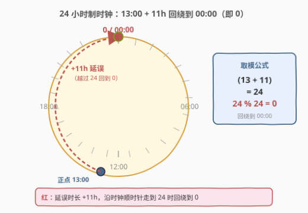
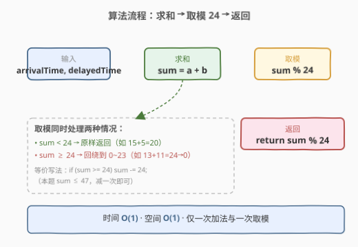
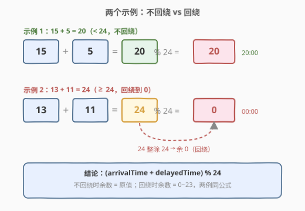

# LeetCode 计算列车到站时间 题解

## 1. 题目概述

- **标题 / 题号**：计算列车到站时间（#2651，easy）
- **链接**：https://leetcode.cn/problems/calculate-delayed-arrival-time/
- **难度**：简单
- **标签**：数学

**题意**：给你一个正整数 `arrivalTime` 表示列车正点到站的时间（单位：小时），另给你一个正整数 `delayedTime` 表示列车延误的小时数。返回列车实际到站的时间。

注意，该问题中的时间采用 **24 小时制**。

**示例 1**：

```text
输入：arrivalTime = 15, delayedTime = 5
输出：20
解释：列车正点到站时间是 15:00 ，延误 5 小时，所以列车实际到站的时间是 15 + 5 = 20（20:00）。
```

**示例 2**：

```text
输入：arrivalTime = 13, delayedTime = 11
输出：0
解释：列车正点到站时间是 13:00 ，延误 11 小时，所以列车实际到站的时间是 13 + 11 = 24（在 24 小时制中表示为 00:00 ，所以返回 0）。
```

**约束**：

- $1 \le \text{arrivalTime} < 24$
- $1 \le \text{delayedTime} \le 24$

> 💡 关键信号：「24 小时制」意味着时间在 $0 \sim 23$ 上循环——和超过 24 就要「回绕」。这是**取模运算**最朴素的应用场景：周期性回绕用 `%` 一步搞定。

## 2. 解题思路

### 2.1 暴力思路：先加再判断

最直白的做法是先把两个数加起来，再用 `if` 判断是否超过 24：

```text
sum = arrivalTime + delayedTime
if sum >= 24:
    sum -= 24
return sum
```

这在本题完全正确：`arrivalTime < 24`（最大 23）、`delayedTime ≤ 24`（最大 24），所以 $\text{sum} \le 23 + 24 = 47$，**最多减一次**就能落回 $[0, 23]$。但它把「不回绕」和「回绕」分两条分支写，且只对周期为 24 成立——若周期更大、或求和可能超过两个周期，减一次就不够了。

### 2.2 核心观察：取模统一两种情况



把 24 小时制看成一根**首尾相接的环**（时钟）：从 `arrivalTime` 出发，顺时针走 `delayedTime` 步，走到哪就是实际到站时刻。走满一圈（24 步）就回到起点 `0`。这种「在固定周期上累加并回绕」的结构，天然对应**取模运算**：

$$
\text{实际到站} = (\text{arrivalTime} + \text{delayedTime}) \bmod 24
$$

- 示例 1：$(15 + 5) \bmod 24 = 20 \bmod 24 = 20$（未越界，原样返回）；
- 示例 2：$(13 + 11) \bmod 24 = 24 \bmod 24 = 0$（整除，回绕到 0）。

> 💡 **取模的意义**：`%` 不是「多减一次 24」的语法糖，而是刻画「周期性」的数学工具。它把「不回绕」和「回绕」统一成同一个表达式——当 $\text{sum} < 24$ 时 $\text{sum} \bmod 24 = \text{sum}$（模不掉），当 $\text{sum} \ge 24$ 时自动回绕。更重要的是，**无论 sum 超过几个周期**（哪怕把约束放宽到 `delayedTime` 是任意大整数），取模都一步给出正确结果，无需多次相减。

### 2.3 算法流程图



三步即可：求和 `sum = arrivalTime + delayedTime`，取模 `sum % 24`，返回。取模这一个运算同时覆盖了 2.1 中的两条分支。

### 2.4 示例演算



两例对照可见，同一公式 `(a + b) % 24` 自动处理两种情形：余数在 $[0, 23]$ 内，未越界时余数 = 原值，整除时余数 = 0。

## 3. 参考代码

### C++

```cpp
class Solution {
public:
    int findDelayedArrivalTime(int arrivalTime, int delayedTime) {
        return (arrivalTime + delayedTime) % 24;
    }
};
```

### Python

```python
class Solution:
    def findDelayedArrivalTime(self, arrivalTime: int, delayedTime: int) -> int:
        return (arrivalTime + delayedTime) % 24
```

> ⚠️ 本题输入均为正整数且 $\text{sum} \le 47$，C++ `int` 不会溢出；Python 整数无限精度更无溢出问题。代码无需任何特判或边界处理。

## 4. 复杂度分析

| 维度 | 复杂度 | 说明 |
|------|--------|------|
| 时间复杂度 | $O(1)$ | 一次整数加法 + 一次取模，与输入规模无关 |
| 空间复杂度 | $O(1)$ | 仅用常数个变量 |

## 5. 扩展：取模 vs 条件相减

2.1 的「条件相减」与 2.2 的「取模」在本题数据范围下等价，但适用面不同：

| 写法 | 代码 | 适用范围 |
|------|------|----------|
| 条件相减 | `if (sum >= 24) sum -= 24;` | 仅当 $\text{sum} < 48$（最多越一个周期）时正确 |
| 取模 | `sum % 24` | 任意大的 `sum` 都正确，且天然推广到任意周期 |

> 💡 若把题目改成「`delayedTime` 可为任意大整数」，条件相减会漏掉「越过多个周期」的情况（如 $\text{sum} = 50$ 减一次 24 得 26，仍 $> 23$），而取模照样正确。工程中遇到「周期性回绕」一律用取模，避免枚举所有越界层数。

## 6. 面试要点

1. **为什么用 `% 24` 而不是直接返回 `arrivalTime + delayedTime`？**

   > 因为 24 小时制的时间只在 $[0, 23]$ 循环。和可能达到 24（如 $13+11=24$），在 24 小时制中 24 即 00:00，必须映射回 0。取模 `% 24` 正是把「超出周期部分」归零、保留「周期内余数」的运算。

2. **`% 24` 对 `sum < 24` 的情况会不会出错？**

   > 不会。当 $\text{sum} < 24$ 时，$\text{sum} \bmod 24 = \text{sum}$（被除数小于除数时余数就是被除数本身）。所以取模对「不回绕」与「回绕」两种情形给出一致的正确结果，无需分支。

3. **为什么约束里 `arrivalTime < 24` 而不是 `<= 24`？**

   > 24 小时制的合法时刻是 $0 \sim 23$，`24` 本身不存在（它表示下一天的 00:00，即 0）。所以 `arrivalTime` 严格小于 24。而 `delayedTime` 可以取到 24（整整延误一天，回到原时刻取模后仍是原值），这是题面刻意区分的边界。

4. **能否用条件相减替代取模？二者何时等价？**

   > 本题可以：$\text{sum} \le 47 < 48$，最多越一个周期，减一次 24 即可。但当求和可能跨越多个周期时（如 $\text{sum} = 50$），减一次不够，需循环减或直接取模。取模是条件相减在「任意周期数」上的推广，工程上更稳健。

5. **24 小时制里的 `24` 和 `0` 是什么关系？**

   > `24:00` 和 `00:00` 指同一时刻（一天的最后/开始的分界）。本题约定用 `0` 表示 00:00，所以 $24 \bmod 24 = 0$ 正是这一约定的数学体现——取模把「满周期」归零。

> 💡 **一句话总结**：2651 = `(arrivalTime + delayedTime) % 24`。把 24 小时制看作周期为 24 的环，加法后用取模统一「不回绕 / 回绕」两种情况，$O(1)$ 时间、$O(1)$ 空间。

## 同类练习题

| # | 题目 | 与本题的关联 |
|---|------|-------------|
| 258 | [各位相加](https://leetcode.cn/problems/add-digits/)（[站内题解](../0201-0300/258_各位相加.md)） | 数字根 `1 + (n-1) % 9`，与本题同为「取模处理周期性回绕」的最经典应用，对照 `(a+b) % 24` 理解模运算刻画周期的通用性 |
| 974 | [和可被 K 整除的子数组](https://leetcode.cn/problems/subarray-sums-divisible-by-k/)（[站内题解](../0901-1000/974_和可被K整除的子数组.md)） | 同余定理——前缀和之差能被 K 整除 ⇔ 前缀和对 K 同余，把取模从「单点回绕」升级为「计数同余类」 |
| 400 | [第 N 位数字](https://leetcode.cn/problems/nth-digit/)（[站内题解](../0301-0400/400_第N位数字.md)） | 用 `(n-1) % d` 在一个数字内定位具体位，取模的另一种用途——周期内定位而非回绕 |
| 29 | [两数相除](https://leetcode.cn/problems/divide-two-integers/)（[站内题解](../0001-0100/29_两数相除.md)） | 位运算模拟除法，每轮的「余数」即取模结果，对照本题理解「商×除数 + 余数 = 被除数」与模运算的关系 |
