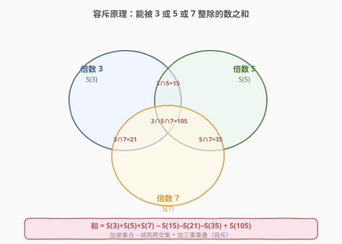
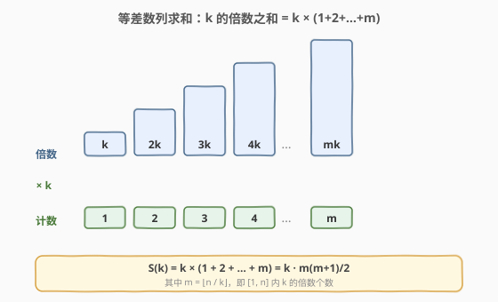
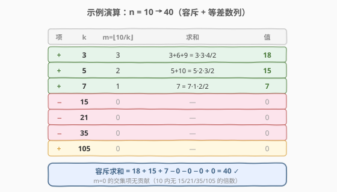

# LeetCode 倍数求和 题解

## 1. 题目概述

- **标题 / 题号**：倍数求和（#2652，easy）
- **链接**：https://leetcode.cn/problems/sum-multiples/
- **难度**：简单
- **标签**：数学、数论

**题意**：给你一个正整数 `n`，请你计算在 `[1, n]` 范围内**能被 `3`、`5`、`7` 整除**的所有整数之和。

返回一个整数，表示给定范围内所有满足约束条件的数字之和。

**示例 1**：

```text
输入：n = 7
输出：21
解释：在 [1, 7] 范围内能被 3、5、7 整除的所有整数分别是 3、5、6、7。数字之和为 21。
```

**示例 2**：

```text
输入：n = 10
输出：40
解释：在 [1, 10] 范围内能被 3、5、7 整除的所有整数分别是 3、5、6、7、9、10。数字之和为 40。
```

**示例 3**：

```text
输入：n = 9
输出：30
解释：在 [1, 9] 范围内能被 3、5、7 整除的所有整数分别是 3、5、6、7、9。数字之和为 30。
```

**约束**：

- $1 \le n \le 10^3$

> 💡 注意「3、5、7」是**或**关系：一个数只要能被其中任意一个整除就算入。被多个整除（如 `15` 同时被 3 和 5 整除）只算**一次**，不能重复加。这正暗示了「容斥」的必要性。

## 2. 解题思路

### 2.1 暴力思路：逐个遍历

最直白的做法（也是题目提示的官方思路）：从 `1` 遍历到 `n`，对每个数 `i` 判断 `i % 3 == 0 || i % 5 == 0 || i % 7 == 0`，满足就累加进答案。

```python
ans = 0
for i in range(1, n + 1):
    if i % 3 == 0 or i % 5 == 0 or i % 7 == 0:
        ans += i
```

由于 $n \le 10^3$，$O(n)$ 完全在时限内（1000 次循环几乎瞬时），这是**最稳妥、最不容易写错**的解法。缺点是「不够有趣」——当 $n$ 很大（如 $10^9$）时线性遍历就不可接受了。下文给出一个 $O(1)$ 的数论解法，把本题从「模拟」拔高到「容斥原理」的经典应用。

> 💡 面试中先报暴力法（讲清正确性），再主动升级到 $O(1)$ 解法，是加分项——展示你看到了「整除 + 求和」背后隐藏的集合结构。

### 2.2 核心观察：容斥原理 + 等差数列求和（O(1)）



把「能被 3、5 或 7 整除的数」看成三个集合的**并集**：

- $A$ = 「能被 3 整除的数」，其和记 $S(3)$
- $B$ = 「能被 5 整除的数」，其和记 $S(5)$
- $C$ = 「能被 7 整除的数」，其和记 $S(7)$

直接 $S(3) + S(5) + S(7)$ 会**重复计算交集**：比如 `15` 既在 $A$ 又在 $B$，被加了两次。要修正，就用**容斥原理（Inclusion-Exclusion Principle）**：

$$\text{ans} = S(3) + S(5) + S(7) - S(15) - S(21) - S(35) + S(105)$$

为什么交集写成 $S(15)$、$S(21)$、$S(35)$、$S(105)$？因为 $3,5,7$ 两两**互质**（都是质数），两两交集就是「同时被两者整除」，即被最小公倍数 $\mathrm{lcm}$ 整除：

- $\mathrm{lcm}(3,5) = 15$ → $A \cap B$ 即「被 15 整除」，其和记 $S(15)$
- $\mathrm{lcm}(3,7) = 21$ → $A \cap C$ 即「被 21 整除」，记 $S(21)$
- $\mathrm{lcm}(5,7) = 35$ → $B \cap C$ 即「被 35 整除」，记 $S(35)$
- $\mathrm{lcm}(3,5,7) = 105$ → $A \cap B \cap C$ 即「被 105 整除」，记 $S(105)$

> ⚠️ 这里依赖 $3,5,7$ 互质，故 $\mathrm{lcm}$ 即乘积。若改成不互质的除数（如 4、6），交集对应的 $k$ 必须用 $\mathrm{lcm}$ 而非乘积——例如 4 与 6 的交集是 $\mathrm{lcm}(4,6)=12$，不是 $24$。$S(k)$ 的定义始终是「被 $k$ 整除的数之和」。

### 2.3 等差数列求和：把 $S(k)$ 算成闭合公式

现在只需对 $k \in \{3,5,7,15,21,35,105\}$ 各算一次 $S(k)$。$S(k)$ 是 $[1,n]$ 内所有 $k$ 的倍数之和，这是一串**等差数列**：

$$k, \;2k, \;3k, \;\ldots, \;mk \quad \text{其中 } m = \left\lfloor \frac{n}{k} \right\rfloor$$



提取公因子 $k$ 后，倍数序列就是 $1,2,\ldots,m$ 的 $k$ 倍，求和也只放大 $k$ 倍：

$$S(k) = k \cdot (1 + 2 + \cdots + m) = k \cdot \frac{m(m+1)}{2}, \qquad m = \left\lfloor \frac{n}{k} \right\rfloor$$

一次整除 + 一次乘法，$S(k)$ 是 $O(1)$ 的。七个 $S(k)$ 加加减减，整体 $O(1)$。

> 💡 **等差数列和的「配对」直觉**：$1+2+\cdots+m = \frac{m(m+1)}{2}$ 可由首尾配对得出——把序列正写一遍倒写一遍，每对都等于 $m+1$，共 $m$ 对，再除以 2。本题的 $S(k)$ 是把这个结论乘了个 $k$。

### 2.4 示例演算



以 `n = 10` 为例，逐项算出每个 $S(k)$：

| 项 | $k$ | $m=\lfloor 10/k \rfloor$ | 倍数 / 公式 | 值 |
|----|-----|--------------------------|-------------|----|
| $+$ | 3 | 3 | $3+6+9 = 3 \cdot \tfrac{3 \cdot 4}{2}$ | 18 |
| $+$ | 5 | 2 | $5+10 = 5 \cdot \tfrac{2 \cdot 3}{2}$ | 15 |
| $+$ | 7 | 1 | $7 = 7 \cdot \tfrac{1 \cdot 2}{2}$ | 7 |
| $-$ | 15 | 0 | $10$ 内无 $15$ 的倍数 | 0 |
| $-$ | 21 | 0 | 同上 | 0 |
| $-$ | 35 | 0 | 同上 | 0 |
| $+$ | 105 | 0 | 同上 | 0 |

容斥求和：

$$\text{ans} = 18 + 15 + 7 - 0 - 0 - 0 + 0 = 40 \;\checkmark$$

与示例 2 一致。注意当 $n < 15$ 时，四个交集项的 $m$ 全为 $0$（即 $S=0$），容斥退化为三个集合之和的直接相加——这正是「小 $n$ 没有重复元素」的体现。验证示例 1（$n=7$）：$S(3)=3{+}6=9$、$S(5)=5$、$S(7)=7$，交集全 $0$，合计 $21\;\checkmark$。

## 3. 参考代码

### 方法一：暴力遍历（O(n)，稳妥首选）

### C++

```cpp
class Solution {
  public:
    int sumOfMultiples(int n) {
        int ans = 0;
        for (int i = 1; i <= n; ++i) {
            if (i % 3 == 0 || i % 5 == 0 || i % 7 == 0) {
                ans += i;
            }
        }
        return ans;
    }
};
```

### Python

```python
class Solution:
    def sumOfMultiples(self, n: int) -> int:
        return sum(
            i for i in range(1, n + 1)
            if i % 3 == 0 or i % 5 == 0 or i % 7 == 0
        )
```

### 方法二：容斥原理 + 等差数列求和（O(1)，进阶）

### C++

```cpp
class Solution {
  public:
    int sumOfMultiples(int n) {
        // S(k) = [1,n] 内 k 的倍数之和 = k * m*(m+1)/2，m = n/k
        auto S = [n](int k) {
            int m = n / k;
            return k * m * (m + 1) / 2;
        };
        // 容斥：3,5,7 两两互质，交集即被 lcm(=乘积) 整除
        return S(3) + S(5) + S(7) - S(15) - S(21) - S(35) + S(105);
    }
};
```

### Python

```python
class Solution:
    def sumOfMultiples(self, n: int) -> int:
        def s(k: int) -> int:        # S(k) = k 的倍数之和
            m = n // k
            return k * m * (m + 1) // 2
        # 容斥：3,5,7 两两互质，交集即被 lcm(=乘积) 整除
        return s(3) + s(5) + s(7) - s(15) - s(21) - s(35) + s(105)
```

> 💡 两个方法的代码量几乎相同，但方法二把复杂度从 $O(n)$ 降到 $O(1)$，且不随 $n$ 增长。当题目的 $n$ 放大到 $10^9$ 时，方法一直接 TLE，方法二依旧 7 次整数运算搞定——这就是数论闭合公式的威力。

> ⚠️ Python 求和务必用 `//`（地板除）。中间量 `k * m * (m + 1)` 最大出现在 $S(3)$：$n=1000$ 时 $3 \times 333 \times 334 \approx 3.3 \times 10^5$，远小于 $2^{31}-1$，C++ 用 `int` 完全无溢出风险（即便 $n$ 放到 $10^9$，$k \cdot m \cdot (m+1)$ 约 $3 \times 10^8$，仍安全）。

## 4. 复杂度分析

| 维度 | 方法 | 复杂度 | 说明 |
|------|------|--------|------|
| 时间复杂度 | 暴力遍历 | $O(n)$ | 逐个检查 $1 \sim n$，每次 $O(1)$ 判定 |
| 空间复杂度 | 暴力遍历 | $O(1)$ | 仅 `ans` 与循环变量 |
| 时间复杂度 | 容斥 + 等差数列 | $O(1)$ | 7 个 $S(k)$，每个一次整除 + 乘除，与 $n$ 无关 |
| 空间复杂度 | 容斥 + 等差数列 | $O(1)$ | 仅常数个整型变量 |

> 💡 本题 $n \le 10^3$，两种方法实测耗时差异可忽略。方法二的真正价值在于**可扩展性**——把约束 $n$ 提到 $10^9$ 乃至更大，方法二时间不变，而方法一不可行。面试中能点出这一点，说明你不只求「过」，还理解了算法的**渐进**差异。

## 5. 扩展：容斥符号为什么是 + − + 交替？

容斥原理的核心是「**逐步修正重复计数**」。以三个集合 $A,B,C$ 的并集之和为例：

1. **先加各集合**：$A+B+C$。但两两交集里的元素被加了**两次**（多了 1 次），需减回去。
2. **减两两交集**：$-AB-AC-BC$。但三重重叠 $A \cap B \cap C$ 的元素在第一步被加了 3 次，第二步又被减了 3 次，**净 0 次**——它本应被算 1 次，于是少了 1 次，要补回。
3. **加三重交集**：$+ABC$，把漏掉的 1 次补上。

最终：$|A \cup B \cup C| = A+B+C - AB - AC - BC + ABC$。符号规律是 **奇数重交集取 $+$，偶数重交集取 $-$**，可推广到任意 $n$ 个集合。

> 💡 一句话记法：「**多退少补**」——重叠次数算多了就减，算少了就加，符号交替直至每部分元素恰好被算 1 次。

### 5.1 退化情形

- **$n$ 较小**（$n < 15$）：所有交集项 $S(15),S(21),S(35),S(105)$ 的 $m=0$ 即值为 $0$，容斥退化为 $S(3)+S(5)+S(7)$——此时没有重复元素，直接相加即可。
- **除数不互质**：例如题目改成「能被 4 或 6 整除」，交集项不能用 $4 \times 6 = 24$，而要用 $\mathrm{lcm}(4,6) = 12$。本题 $3,5,7$ 都是质数，$\mathrm{lcm}$ 恰为乘积，故可直接写 $15,21,35,105$。

## 6. 面试要点

1. **暴力法和容斥法该用哪个？**

   > 题目 $n \le 10^3$，暴力 $O(n)$ 完全够用且不易写错，**稳妥交暴力**。容斥 $O(1)$ 是进阶展示：当 $n$ 放大到 $10^9$ 时暴力不可行，容斥仍 7 次运算。面试先报暴力讲清正确性，再主动升级到 $O(1)$。

2. **容斥为什么是「加三个、减三个、再加一个」？**

   > 直接相加会让两两交集的元素被重复计算（如 15 同时属于 3 和 5 的倍数），故减去两两交集；但三重重叠（如 105）在第一步被加 3 次、第二步被减 3 次，净 0 次，少算了 1 次，故再加回。符号规律：奇数重交集取 $+$，偶数重取 $-$。

3. **$S(k)$ 的闭合公式怎么推？**

   > $[1,n]$ 内 $k$ 的倍数为 $k, 2k, \ldots, mk$，$m=\lfloor n/k \rfloor$。提取 $k$ 后是 $k \times (1+2+\ldots+m) = k \cdot m(m+1)/2$，即「等差数列和 × 公差因子」。$m$ 用一次整除得到，故 $S(k)$ 是 $O(1)$。

4. **为什么交集写成 $S(15)$ 而不是 $S(3 \times 5)$？**

   > 二者在本题相等，因为 $3,5$ 互质 $\mathrm{lcm}(3,5)=3 \times 5 = 15$。但**只有互质时乘积才等于最小公倍数**。若除数不互质（如 4 与 6），交集必须用 $\mathrm{lcm}(4,6)=12$ 而非 $24$，否则会把「被 12 整除」的元素漏算成「被 24 整除」。代码里写常数 $15$ 等是利用了互质的特例。

5. **如果除数改成 $a, b, c$ 三个任意正整数，怎么改代码？**

   > 把 $15,21,35,105$ 换成 $\mathrm{lcm}(a,b),\mathrm{lcm}(a,c),\mathrm{lcm}(b,c),\mathrm{lcm}(a,b,c)$，用 `lcm(x,y) = x / gcd(x,y) * y` 计算。这正是 [1201. 丑数 III](https://leetcode.cn/problems/ugly-number-iii/) 的设定——给定 $a,b,c$ 求第 $n$ 个能被它们整除的数，需把容斥嵌入**二分答案**中。

## 同类练习题

| # | 题目 | 与本题的关联 |
|---|------|-------------|
| 1201 | [丑数 III](https://leetcode.cn/problems/ugly-number-iii/) | 给定 $a,b,c$ 求第 $n$ 个能被它们整除的数。把本题的容斥计数器 $f(x) = $ 「$\le x$ 内满足条件的个数」嵌入二分答案，是本题容斥思路的直接进阶（计数→第 $n$ 个） |
| 878 | [第 N 个神奇数字](https://leetcode.cn/problems/nth-magical-number/) | 给定 $a,b$ 求第 $n$ 个能被 $a$ 或 $b$ 整除的数。两集合版的容斥 $f(x)=\lfloor x/a \rfloor + \lfloor x/b \rfloor - \lfloor x/\mathrm{lcm}(a,b) \rfloor$ + 二分，是 1201 的双集合退化版 |
| 1015 | [可被 K 整除的最小整数](https://leetcode.cn/problems/smallest-integer-divisible-by-k/) | 找只含数字 1 且能被 $k$ 整除的最小整数。同属整除/同余主题，但用「模拟余数递推」而非容斥，可对比两种整除问题的切入角度 |
| 204 | [计数质数](https://leetcode.cn/problems/count-primes/)（[题解](../0201-0300/204_计数质数.md)） | 数论计数题，用埃氏筛统计 $\le n$ 的质数个数。与本题主打「闭合公式计数」对比的是「筛法枚举计数」，两题合看能理解数论计数的两条路径 |
