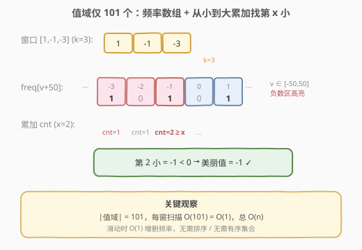
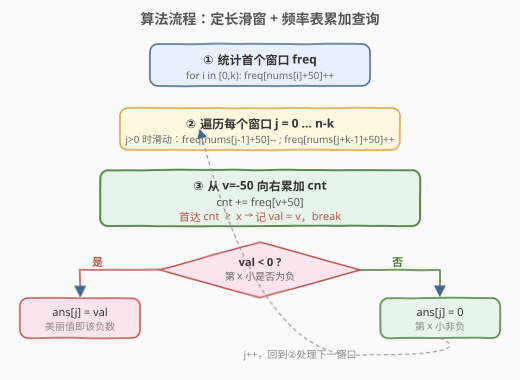

# 滑动子数组的美丽值

- **题目名称**：滑动子数组的美丽值
- **链接**：[2653. 滑动子数组的美丽值](https://leetcode.cn/problems/sliding-subarray-beauty/)
- **难度**：中等
- **标签**：数组、哈希表、滑动窗口

## 1. 题目概述

给定长度为 $n$ 的整数数组 `nums`，对每个长度为 $k$ 的子数组求「美丽值」：若该子数组中**第 $x$ 小的整数是负数**，则美丽值为该第 $x$ 小的数；否则美丽值为 $0$。返回长度为 $n-k+1$ 的结果数组，依次对应从下标 $0$ 开始的每个长度为 $k$ 的子数组。

**示例 1**：

```text
输入：nums = [1,-1,-3,-2,3], k = 3, x = 2
输出：[-1,-2,-2]
解释：
[1,-1,-3] 第 2 小是 -1（负数）→ 美丽值 -1
[-1,-3,-2] 第 2 小是 -2 → 美丽值 -2
[-3,-2,3] 第 2 小是 -2 → 美丽值 -2
```

**示例 2**：

```text
输入：nums = [-1,-2,-3,-4,-5], k = 2, x = 2
输出：[-1,-2,-3,-4]
```

**示例 3**：

```text
输入：nums = [-3,1,2,-3,0,-3], k = 2, x = 1
输出：[-3,0,-3,-3,-3]
解释：[1,2] 第 1 小是 1（非负）→ 美丽值 0；其余窗口最小值均为负。
```

**约束条件**：

- `n == nums.length`
- $1 \le n \le 10^5$
- $1 \le k \le n$
- $1 \le x \le k$
- $-50 \le \text{nums}[i] \le 50$

> 💡 题眼在约束最后一行：**元素值域只有 101 个**。这让「求定长窗口内第 $x$ 小」从需要有序集合的 $O(\log k)$ 维护，退化成「频率表 + $O(101)$ 扫描」的 $O(1)$ 查询，总体 $O(n)$。若值域很大（如 $10^9$），就必须上平衡树/对顶堆/树状数组，见第 5 节。

---

## 2. 解题思路

### 2.1 暴力思路：每窗排序取第 x 小

对每个长度为 $k$ 的窗口，复制出来排序后取第 $x$ 小。共 $n-k+1$ 个窗口，每窗排序 $O(k \log k)$，总 $O(n \cdot k \log k)$。$n,k \le 10^5$ 时可达 $10^5 \times 10^5 \log \approx 10^{10}$，必然超时。问题在于**没有复用相邻窗口的信息**——滑动一格只有首尾两个元素变化，却对整窗重排，浪费严重。

### 2.2 核心观察：小值域 → 频率表累加



突破口是 $-50 \le \text{nums}[i] \le 50$，值域大小 $V = 101$。用一个长度 $101$ 的频率数组 `freq`，`freq[v+50]` 表示值 $v$ 在当前窗口出现的次数：

1. **维护窗口**：滑动一格时，出去的元素 `freq` 减 1、进来的元素 `freq` 加 1，各 $O(1)$，无需排序。
2. **查询第 $x$ 小**：从最小值 $v=-50$ 起向右累加 `freq[v+50]`，累计计数 `cnt` 首次达到 $\ge x$ 时，当前 $v$ 即第 $x$ 小（同值按出现次数计秩，天然处理重复）。扫描至多 $V=101$ 步，$O(1)$。
3. **判定美丽值**：若该第 $x$ 小 $v < 0$ 则答案为 $v$，否则为 $0$。

> ⚠️ 关键点：「第 $x$ 小」在带重复元素的序列里指**升序排好后的第 $x$ 个位置**（非去重后的第 $x$ 个不同值）。频率累加法天然实现这一点：同值的多次出现各占一个秩位，`cnt += freq[v]` 一次累加该值全部出现次数。这与计数排序「按值聚合 + 累加定位秩」完全同构。

### 2.3 算法流程图



三阶段：

1. **初始化**：对首个窗口 `nums[0..k-1]` 统计 `freq`。
2. **遍历窗口** $j = 0 \dots n-k$：若 $j>0$，先滑动——`freq[nums[j-1]+50]--`、`freq[nums[j+k-1]+50]++`。
3. **查询**：从 $v=-50$ 累加 `cnt`，首达 `cnt >= x` 记 `val = v` 并 `break`；`ans[j] = val < 0 ? val : 0`。

### 2.4 示例演算

![示例演算：nums=[1,-1,-3,-2,3], k=3, x=2，三窗分别得 -1,-2,-2](../images/p2653_example_walkthrough.svg)

取示例 1：`nums=[1,-1,-3,-2,3]`, `k=3`, `x=2`，共 $5-3+1=3$ 个窗口：

| $j$ | 窗口 | freq 关键项 | 累加到 $\text{cnt}\ge 2$ | 第 2 小 | 美丽值 |
|-----|------|-------------|---------------------------|---------|--------|
| 0 | `[1,-1,-3]` | $-3{:}1,\,-1{:}1,\,1{:}1$ | $-3{\to}1,\,-1{\to}2$ ✓ | $-1$ | $-1$ |
| 1 | `[-1,-3,-2]` | $-3{:}1,\,-2{:}1,\,-1{:}1$ | $-3{\to}1,\,-2{\to}2$ ✓ | $-2$ | $-2$ |
| 2 | `[-3,-2,3]` | $-3{:}1,\,-2{:}1,\,3{:}1$ | $-3{\to}1,\,-2{\to}2$ ✓ | $-2$ | $-2$ |

> 💡 三窗的第 2 小都落在负数区，故美丽值等于该负数本身。若某窗负数不足 $x$ 个（如示例 3 中 `[1,2]` 当 $x=1$，最小值 $1\ge 0$），累加到第 $x$ 小时已进入非负区，`val >= 0` → 美丽值 $0$。

---

## 3. 参考代码

### C++（频率表 + 累加查询）

```cpp
class Solution {
public:
    vector<int> getSubarrayBeauty(vector<int>& nums, int k, int x) {
        int n = nums.size();
        int freq[101] = {0};              // 值 v 对应 freq[v + 50]
        for (int i = 0; i < k; ++i) freq[nums[i] + 50]++;
        vector<int> ans;
        for (int j = 0; j <= n - k; ++j) {
            if (j > 0) {                  // 滑动：左出右进
                freq[nums[j - 1] + 50]--;
                freq[nums[j + k - 1] + 50]++;
            }
            int cnt = 0, val = 0;
            for (int v = -50; v <= 50; ++v) {
                cnt += freq[v + 50];
                if (cnt >= x) { val = v; break; }
            }
            ans.push_back(val < 0 ? val : 0);
        }
        return ans;
    }
};
```

### Python（频率表 + 累加查询）

```python
class Solution:
    def getSubarrayBeauty(self, nums: List[int], k: int, x: int) -> List[int]:
        freq = [0] * 101                  # 值 v 对应 freq[v + 50]
        for i in range(k):
            freq[nums[i] + 50] += 1
        ans = []
        for j in range(len(nums) - k + 1):
            if j > 0:                     # 滑动：左出右进
                freq[nums[j - 1] + 50] -= 1
                freq[nums[j + k - 1] + 50] += 1
            cnt = 0
            val = 0
            for v in range(-50, 51):
                cnt += freq[v + 50]
                if cnt >= x:
                    val = v
                    break
            ans.append(val if val < 0 else 0)
        return ans
```

> 💡 **几处细节**：(1) 偏移 `+50` 把 $[-50,50]$ 映射到 $[0,100]$，避免负数下标。(2) 首窗单独建表，后续每窗先滑动再查询，逻辑清晰且无「查询后再滑动」的边界错位。(3) `val` 初始为 $0$：若 $x$ 落在非负区，循环结束时 `val` 仍可能是某非负值，`val < 0` 判定自然给出 $0$；即便整窗无负数且累加提前在非负处命中，`val >= 0` 也正确归零。(4) 仅关心负数时可把内层循环改为 `v in range(-50, 0)` 并先数负数个数——不足 $x$ 个直接给 $0$，常数减半（见第 5 节）。

---

## 4. 复杂度分析

| 维度 | 复杂度 | 说明 |
|------|--------|------|
| 时间复杂度 | $O(V \cdot n)$，$V=101$ | $n-k+1$ 个窗口，每窗累加扫描至多 $101$ 步；$V \cdot n \approx 10^7$，稳过 |
| 时间复杂度 | 实际 $O(n)$ | $V$ 是常数，故渐近为 $O(n)$；滑动增删各 $O(1)$ |
| 空间复杂度 | $O(V) = O(1)$ | 频率数组定长 $101$，输出不计额外空间 |

> ⚠️ $n \le 10^5$：暴力 $O(nk\log k)$ 最坏 $10^{10}$ 必超；频率表法 $V\cdot n \approx 1.01\times 10^7$，常数极小，稳过。**本题的难度不在算法本身，而在识破「小值域」这一题眼**——一旦意识到值域只有 $101$，频率累加几乎是唯一自然的解法。

---

## 5. 扩展：只数负数、大值域如何处理

### 5.1 常数优化：只维护负数区

由于美丽值非 $0$ 当且仅当「窗口内负数至少 $x$ 个」，可只维护 $v\in[-50,-1]$ 这 $50$ 个槽位：累加负数计数 `neg`，若 `neg >= x` 则在负数区定位第 $x$ 小（仍为负数）；否则直接给 $0$，连非负区都不扫。常数减半，渐近不变：

```cpp
// 仅负数区，val 默认 0
int neg = 0, val = 0;
for (int v = -50; v < 0; ++v) {
    neg += freq[v + 50];
    if (neg >= x) { val = v; break; }   // 命中即负数，否则 val 保持 0
}
ans.push_back(val);
```

### 5.2 大值域：有序集合 / 对顶堆 / 树状数组

若去掉「值域 $\le 50$」约束（如 $\text{nums}[i] \in [-10^9,10^9]$），频率表不可用，需用能维护动态第 $k$ 小的结构：

| 解法 | 数据结构 | 单窗查询 | 适用 |
|------|----------|----------|------|
| 有序多重集 + 二分 | `multiset` / `SortedList` | $O(\log k)$ 维护 + $O(\log k)$ 定位 | 通用，代码最简 |
| 对顶堆 | 大根堆(前 $x$) + 小根堆(余量) | 摊还 $O(\log k)$ | $x$ 固定，滑动需懒删除 |
| 值域树状数组 | 离散化后 BIT | $O(\log V)$ 增删 + 二分定位 | 值域中等、需在线 |

本题因 $V=101 \ll \log k$，频率表在常数与实现难度上全面碾压上述方案。这正是「看到小值域要条件反射式想到计数」的意义：**用值域换对数**，当 $V$ 与 $\log n$ 同阶甚至更小时，计数法天然更优。

---

## 6. 面试要点

1. **为什么用频率表而不是对窗口排序或用单调队列？**

   > 单调队列擅长维护窗口最值（max/min），但维护「第 $x$ 小」时一旦弹出队首就可能丢失第 $x$ 小的秩信息，难以 $O(1)$ 滑动维护。排序无复用。本题题眼是 $|\text{值域}|=101$，频率表把「第 $x$ 小」变成「按值聚合后累加定位秩」，滑动增删 $O(1)$、查询 $O(V)=O(1)$，是值域小时的最优解。

2. **频率累加如何正确处理重复元素的第 $x$ 小？**

   > 第 $x$ 小指升序序列的第 $x$ 个位置（含重复各占一位）。累加时 `cnt += freq[v]` 一次吞掉值 $v$ 的全部出现次数，相当于把同值的多个位置一起计入秩。当 `cnt` 首次 $\ge x$，说明第 $x$ 个位置落在值 $v$ 上，正确命中，与计数排序定位一致。

3. **如果第 $x$ 小是非负数，为什么直接返回 0 而不是该值？**

   > 题目定义：第 $x$ 小为负数时美丽值才取该负数，否则一律 $0$。所以累加命中的 `val >= 0` 时直接置 $0$。优化版可只数负数：若窗口负数总数 $< x$，第 $x$ 小必非负，连非负区都不必扫，直接给 $0$。

4. **滑动窗口的边界怎么写才不出错？**

   > 首窗 `[0,k-1]` 单独建表；之后 $j$ 从 $0$ 到 $n-k$ 遍历，`j>0` 时先弹出 `nums[j-1]`、压入 `nums[j+k-1]` 再查询。这样每个 $j$ 对应的窗口正好是 `[j, j+k-1]`，避免「先查询再滑动」导致的窗口错位。也可写成「先查询当前窗，再滑动到下一窗」的等价形式，关键是查询与滑动不要交叉。

5. **值域变大后本题怎么扩展？**

   > 去掉小值域约束后改用 `SortedList` 维护窗口多重集：滑动时 `add`/`discard` 各 $O(\log k)$，定位第 $x$ 小用 `sl[x-1]` 也是 $O(\log k)$，总 $O(n\log k)$。或用对顶堆维护前 $x$ 小（$x$ 固定时高效，滑动需懒删除）。值域中等可离散化后上树状数组二分定位第 $x$ 小。详见第 5 节对照表。

> 💡 **一句话总结**：2653 = 「定长滑窗」+「小值域频率表」+「累加定位第 $x$ 小」。题眼是 $|\text{值域}|=101$，把需要有序集合的动态第 $k$ 小问题退化成 $O(n)$ 的计数累加，是「用值域换对数」的招牌题。

---

## 7. 同类练习题

- [239. 滑动窗口最大值](https://leetcode.cn/problems/sliding-window-maximum/)（[站内题解](../0201-0300/239_滑动窗口最大值.md)）：同样是定长滑窗聚合，但求最值用单调队列；对照本题因值域小改用频率表，体会「最值用单调队列、第 $x$ 小用计数/有序集」的分流
- [480. 滑动窗口中位数](https://leetcode.cn/problems/sliding-window-median/)（[站内题解](../0401-0500/480_滑动窗口中位数.md)）：定长滑窗求第 $k$ 小（中位数），值域大需 `SortedList`/对顶堆 $O(n\log k)$，对照本题值域小退化到 $O(n)$ 计数
- [1438. 绝对差不超过限制的最长连续子数组](https://leetcode.cn/problems/longest-continuous-subarray-with-absolute-diff-less-than-or-equal-to-limit/)（[站内题解](../1401-1500/1438_绝对差不超过限制的最长连续子数组.md)）：变长滑窗 + 窗口最值差，用有序集合/单调队列维护极差，对照本题定长窗口的频率维护
- [220. 存在重复元素 III](https://leetcode.cn/problems/contains-duplicate-iii/)（[站内题解](../0201-0300/220_存在重复元素III.md)）：滑窗内近似查重，值域小时用桶分桶 $O(1)$ 查邻桶，同为「小值域→计数/分桶」思想的应用
