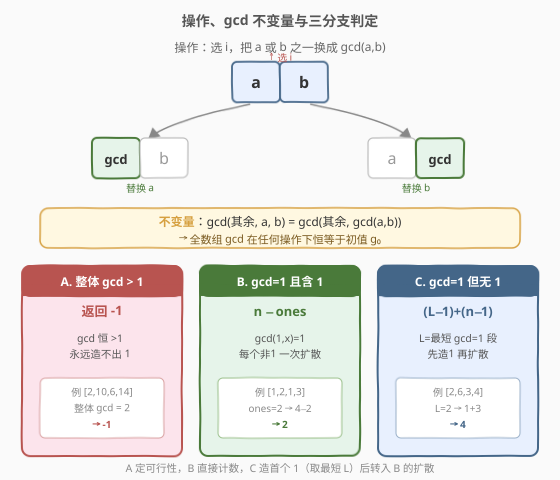
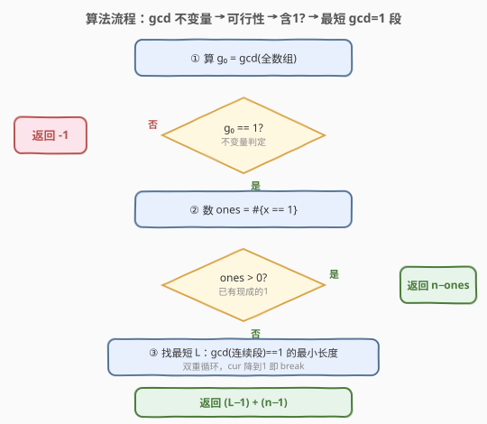

# 使数组所有元素变成1的最少操作次数

- **题目名称**：使数组所有元素变成 1 的最少操作次数
- **链接**：[2654. 使数组所有元素变成 1 的最少操作次数](https://leetcode.cn/problems/minimum-number-of-operations-to-make-all-array-elements-equal-to-1/)
- **难度**：中等
- **标签**：数组、数学、数论、最大公约数、欧几里得算法

## 1. 题目概述

给定下标从 `0` 开始的**正整数**数组 `nums`（长度 $n$），可执行**任意次**下述操作：

- 选择下标 $i$（$0 \le i < n-1$），将 `nums[i]` 或 `nums[i+1]` **之一**替换为 $\gcd(\text{nums}[i],\, \text{nums}[i+1])$。

返回使**所有**元素都等于 `1` 的**最少**操作次数；若无法做到则返回 `-1`。

**示例 1**：

```text
输入：nums = [2,6,3,4]
输出：4
解释：选 i=2，把 nums[2] 替换为 gcd(3,4)=1 → [2,6,1,4]；
      选 i=1，把 nums[1] 替换为 gcd(6,1)=1 → [2,1,1,4]；
      选 i=0，把 nums[0] 替换为 gcd(2,1)=1 → [1,1,1,4]；
      选 i=2，把 nums[3] 替换为 gcd(1,4)=1 → [1,1,1,1]。
```

**示例 2**：

```text
输入：nums = [2,10,6,14]
输出：-1
解释：整体 gcd = 2，操作不改变整体 gcd，永远造不出 1。
```

**约束条件**：

- $2 \le \text{nums.length} \le 50$
- $1 \le \text{nums}[i] \le 10^6$

> 💡 关键信号：操作本质是「用相邻两数的 gcd 覆盖其中一个」；而 $\gcd(\text{其余},\, a,\, b) = \gcd(\text{其余},\, \gcd(a,b))$，故**全数组的 gcd 在任何操作下不变**。这一不变量直接决定可行性，而「能否凑出 1」则取决于是否存在 gcd=1 的连续子数组。

---

## 2. 解题思路

### 2.1 暴力思路：对状态空间 BFS

最直白的做法是把「当前数组」当状态，每次选一个 $i$ 与替换方向作为操作，BFS 找到全 1 状态的最短步数。但状态空间是天文数字：每个元素取值可达 $10^6$，$n$ 最多 $50$，分支因子约 $2(n-1)$，深搜/BFS 完全不可行。

必须抓住操作的结构性质——**gcd 单调不增**（每次替换只会让某元素变小或不变），且**整体 gcd 不变**，从而把问题拆成「可行性判定」+「造第一个 1」+「扩散 1」三段。

### 2.2 核心观察：gcd 不变量 + 三分支



**不变量**：操作把 $a,b$ 中的一个换成 $g=\gcd(a,b)$，而

$$\gcd(\text{rest},\, a,\, b) \;=\; \gcd(\text{rest},\, \gcd(a,b))$$

故**全数组 gcd 在任何操作序列下恒等于初值 $g_0$**。由此得到三分支：

| 分支 | 条件 | 最少操作 | 说明 |
|------|------|----------|------|
| A | $g_0 > 1$ | $-1$ | 整体 gcd 恒 $>1$，永远造不出 1 |
| B | $g_0 = 1$ 且已有 1 | $n - \text{ones}$ | 每个非 1 元素借相邻 1 一次搞定：$\gcd(1,x)=1$ |
| C | $g_0 = 1$ 但无 1 | $(L-1)+(n-1)$ | $L$ = gcd=1 的最短连续子数组长度 |

**分支 B**：只要数组里有 1，就能像「传染」一样扩散——$\gcd(1,x)=1$，把与 1 相邻的 $x$ 一次替换成 1，再以新生成的 1 继续扩散。每个非 1 元素恰好一次操作，总数 $n - \text{ones}$。注意若有多个 1，它们各自向两侧扩散，比「单源扩散」更省，所以**不能**用 $n-1$ 笼统代替。

**分支 C**：没有现成的 1 时，必须先「造」出第一个 1。只有 gcd=1 的连续段才能通过反复取相邻 gcd 缩成一个 1，长度为 $L$ 的段缩成一个 1 需 $L-1$ 次（每合并相邻两位，段长减 1）。选**最短**的 $L$ 使造第一个 1 的代价最小；造出后即落入分支 B 的局面（已有 1 个 1），还需把其余 $n-1$ 个元素扩散成 1，共 $n-1$ 次。合计 $(L-1)+(n-1)$。

> ⚠️ **为何取「最短」子数组？** 造第一个 1 的代价 $L-1$ 随子数组长度线性增长，而扩散阶段固定 $n-1$ 与 $L$ 无关，故总代价关于 $L$ 单调，取最小 $L$ 即最优。

### 2.3 算法流程图



### 2.4 示例演算

![示例 1 演算：[2,6,3,4] 先造 1 再扩散](../images/p2654_example_walkthrough.svg)

以示例 1 `nums = [2,6,3,4]`（$n=4$）为例：

1. **可行性**：$g_0 = \gcd(2,6,3,4) = 1$，可做。
2. **数 1**：无 1，落入分支 C。
3. **找最短 gcd=1 子数组**：枚举所有连续段——
   - $[2,6]\to 2$；$[6,3]\to 3$；$[3,4]\to \gcd(3,4)=1$ ✓（长度 2）
   - $[2,6,3]\to 1$（长度 3）；$[6,3,4]\to 1$（长度 3）……
   - 最短 $L = 2$（即 $[3,4]$）。
4. **造第一个 1**：$L-1 = 1$ 次操作——把 `nums[2]` 换成 $\gcd(3,4)=1$ → `[2,6,1,4]`。
5. **扩散**：$n-1 = 3$ 次操作——
   - $\gcd(6,1)=1$ → 替换 `nums[1]` → `[2,1,1,4]`
   - $\gcd(2,1)=1$ → 替换 `nums[0]` → `[1,1,1,4]`
   - $\gcd(1,4)=1$ → 替换 `nums[3]` → `[1,1,1,1]`
6. **合计**：$(L-1)+(n-1) = 1+3 = 4$ ⭐

---

## 3. 参考代码

### C++

```cpp
class Solution {
  public:
    int minOperations(vector<int>& nums) {
        int n = nums.size();
        // 整体 gcd 是不变量：>1 则永远造不出 1
        int g = 0;
        for (int x : nums) g = gcd(g, x);
        if (g != 1) return -1;

        // 已有 1：每个非 1 元素借相邻 1 一次搞定
        int ones = 0;
        for (int x : nums) if (x == 1) ++ones;
        if (ones > 0) return n - ones;

        // 无 1：找 gcd=1 的最短连续子数组
        int minLen = n + 1;
        for (int i = 0; i < n; ++i) {
            int cur = 0;
            for (int j = i; j < n; ++j) {
                cur = gcd(cur, nums[j]);   // gcd 单调不增
                if (cur == 1) {
                    minLen = min(minLen, j - i + 1);
                    break;                 // 再往后只会更长
                }
            }
        }
        // 造第一个 1 (L-1) + 扩散 (n-1)
        return (minLen - 1) + (n - 1);
    }
};
```

### Python

```python
from math import gcd
from functools import reduce

class Solution:
    def minOperations(self, nums: List[int]) -> int:
        n = len(nums)
        # 整体 gcd 不变量：>1 则无解
        if reduce(gcd, nums) != 1:
            return -1

        # 已有 1：n - ones
        ones = sum(1 for x in nums if x == 1)
        if ones > 0:
            return n - ones

        # 无 1：最短 gcd=1 连续子数组
        min_len = n + 1
        for i in range(n):
            cur = 0
            for j in range(i, n):
                cur = gcd(cur, nums[j])
                if cur == 1:
                    min_len = min(min_len, j - i + 1)
                    break
        return (min_len - 1) + (n - 1)
```

> 💡 **两个细节**：① 内层 `cur` 从 `0` 起累 gcd，因 $\gcd(0, x) = x$，等价于「空段 gcd = 元素自身」，边界自然；② `cur` 随 $j$ 推进单调不增，一旦降到 `1` 立即 `break`——同一起点 $i$ 下更长的段只会让 $L$ 变大，不会更优。

---

## 4. 复杂度分析

| 维度 | 复杂度 | 说明 |
|------|--------|------|
| 时间复杂度 | $O(n^2 \log M)$ | 双重循环枚举 $\Theta(n^2)$ 段，每段累一次 gcd 为 $O(\log M)$；$n \le 50$、$M = 10^6$，总量约 $2500 \times 20 \approx 5 \times 10^4$ |
| 空间复杂度 | $O(1)$ | 只用常数个变量 |

> ⚠️ 整体 gcd 与数 1 各一遍 $O(n)$，找最短段才是瓶颈；但 $n$ 极小，暴力 $O(n^2)$ 远比下文「gcd 稀疏表」的优化省心。

---

## 5. 扩展：$n$ 更大时的 $O(n \log M)$ gcd 稀疏技巧

本题 $n \le 50$，$O(n^2)$ 足矣。但当 $n$ 升到 $10^5$ 级（如「子数组 gcd 种类数」类题），可利用一个经典结论：

> **以每个位置为起点的连续子数组，其 gcd 取值至多 $O(\log M)$ 种**（gcd 每变化一次至少除以 2）。

据此维护「上一位置的所有 $(\text{gcd},\, \text{结束下标})$ 二元组集合」，对新元素 $x$ 把每个 gcd 再与 $x$ 取 gcd、合并同值保留最远结束点，集合大小始终 $O(\log M)$。总时间 $O(n \log M)$、空间 $O(\log M)$。本题 $n$ 小无需此优化，但思路可迁移到 2447（gcd 等于 K 的子数组计数）等题。

---

## 6. 面试要点

1. **为什么整体 gcd 是不变量？**

   > 操作把 $a,b$ 之一换成 $g=\gcd(a,b)$。替换前全体 gcd $=\gcd(\text{rest},\, a,\, b)$；替换后 $=\gcd(\text{rest},\, g,\, b)$（或 $a$）。由 gcd 的结合律 $\gcd(\text{rest},\, a,\, b) = \gcd(\text{rest},\, \gcd(a,b)) = \gcd(\text{rest},\, g)$，而未被替换的那个本就包含在 $\text{rest}$ 之外、可与 $g$ 合并——最终全体 gcd 不变。故初值 $g_0 > 1$ 时永远无法出现 1。

2. **已有 1 时为什么是 $n-\text{ones}$ 而不是 $n-1$？**

   > 多个 1 各自向两侧扩散，互不干扰：每个非 1 元素只需与某个相邻的 1（含扩散中新生的 1）做一次操作即变 1。有 $k$ 个 1 时非 1 元素恰 $n-k$ 个、各一次操作，共 $n-k$。若用单源扩散的 $n-1$，当 $k \ge 2$ 时会高估。

3. **造第一个 1 为什么是 $L-1$ 次？**

   > 长 $L$、gcd=1 的段，可从一端起反复「把相邻两数的 gcd 写入靠右那位」，每步把段的「有效 gcd 前缀」缩 1。最终把整段缩成单个 1，恰好 $L-1$ 步。最短 $L$ 使该代价最小，且扩散阶段 $n-1$ 与 $L$ 无关，故取最短。

4. **如何枚举所有连续子数组找最短 gcd=1？复杂度？**

   > 双重循环：外层起点 $i$，内层 $j$ 从 $i$ 起累 $\gcd(\text{cur},\, \text{nums}[j])$，cur 降到 1 即记长度并 break。$\Theta(n^2)$ 段、每段一次 $O(\log M)$ gcd，共 $O(n^2 \log M)$。$n \le 50$ 毫无压力。

5. **若数组本就全 1，返回什么？**

   > $g_0 = 1$、$\text{ones} = n$，落入分支 B，返回 $n - n = 0$。代码中 `ones > 0` 直接返回 $n - \text{ones} = 0$，正确。

> 💡 **一句话总结**：2654 = 「gcd 不变量定可行性 + 含 1 则 $n-\text{ones}$ + 无 1 则最短 gcd=1 段造首个 1 再扩散」。$O(n^2 \log M)$ 时间、$O(1)$ 空间。

---

## 7. 同类练习题

- [914. 卡牌分组](https://leetcode.cn/problems/x-of-a-kind-in-a-deck-of-cards/)：统计各值频数后看全体 gcd $\ge 2$，gcd 不变量思想的最直接应用
- [2447. 最大公因数等于 K 的子数组数目](https://leetcode.cn/problems/number-of-subarrays-with-gcd-equal-to-k/)：gcd 稀疏技巧 $O(n \log M)$ 枚举所有子数组 gcd，承接本文第 5 节扩展
- [1071. 字符串的最大公因子](https://leetcode.cn/problems/greatest-common-divisor-of-strings/)：把 gcd 从数论迁到字符串（周期结构），欧几里得算法同源
- [2601. 质数减法运算](https://leetcode.cn/problems/prime-subtraction-operation/)（[站内题解](../2601-2700/2601_质数减法运算.md)）：同区间同属数论主题，埃氏筛预表 + 贪心，与本文「gcd 化简」同属数论工具箱
- [149. 直线上最多的点数](https://leetcode.cn/problems/max-points-on-a-line/)（[站内题解](../0101-0200/149_直线上最多的点数.md)）：用 gcd 化简分数表示斜率做哈希键，与本文「gcd 化简」一脉相承
