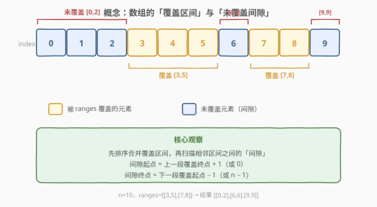
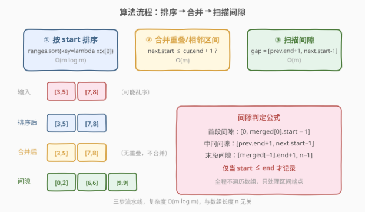

# 寻找最大长度的未覆盖区间

- **题目名称**：寻找最大长度的未覆盖区间
- **链接**：[2655. 寻找最大长度的未覆盖区间](https://leetcode.cn/problems/find-maximal-uncovered-ranges/)
- **难度**：中等
- **标签**：数组、排序

## 1. 题目概述

> ⚠️ 本题为 LeetCode 付费题，题意描述根据官方示例用例与 hints 重建，可能与官方题面有出入。

给定一个长度为 `n` 的数组 `nums`（下标 `0` 到 `n-1`），以及一个二维数组 `ranges`，其中 `ranges[i] = [left_i, right_i]`（**闭区间**）表示数组中从下标 `left_i` 到 `right_i` 的元素被**覆盖**。

请返回所有**极大未覆盖区间**，按起点升序排列。一个极大未覆盖区间 `[l, r]` 满足：

- 区间内每个下标都**未被**任何 `ranges` 元素覆盖；
- 区间无法向左或向右扩展（即 `l-1` 或 `r+1` 处要么越界、要么被覆盖）。

若不存在未覆盖的下标，返回空数组 `[]`。

**示例 1**：

```text
输入：n = 10, ranges = [[3,5],[7,8]]
输出：[[0,2],[6,6],[9,9]]
解释：
  覆盖：{3,4,5} 和 {7,8}
  未覆盖的极大连续段：[0,2]、[6,6]、[9,9]
```

**示例 2**：

```text
输入：n = 3, ranges = [[0,2]]
输出：[]
解释：所有下标 0、1、2 均被覆盖，无未覆盖区间。
```

**示例 3**：

```text
输入：n = 7, ranges = [[2,4],[0,3]]
输出：[[5,6]]
解释：
  排序后 [0,3] 和 [2,4] 重叠，合并为 [0,4]
  未覆盖的极大连续段：[5,6]
```

**约束条件（重建）**：

- $1 \le n \le 10^9$（数组长度可能极大）
- $0 \le \text{ranges.length} \le 10^5$
- $0 \le \text{left}_i \le \text{right}_i < n$

> 💡 官方 hints 明确指出：「解法复杂度与数组长度 $n$ **无关**」。因此不能逐下标遍历数组，只能在**区间端点**上做文章——这是本题从「暴力」迈向「最优」的关键分水岭。

---

## 2. 解题思路

### 2.1 暴力思路：逐下标标记

最直白的做法：开一个长度为 $n$ 的布尔数组 `covered`，遍历每个 `range`，把 `[left, right]` 内的元素标记为 `true`，再扫描 `covered` 收集连续 `false` 段。

```text
covered = [False] * n
for l, r in ranges:
    for i in range(l, r+1):
        covered[i] = True
result = scan_consecutive_false(covered)
```

逻辑没错，但有两个致命问题：

1. **空间爆炸**：$n$ 可达 $10^9$，开 `covered` 数组直接 OOM。
2. **时间爆炸**：若某个 `range` 覆盖 $10^8$ 个元素，单次遍历就是 $O(10^8)$，而 hints 明确要求复杂度与 $n$ 无关。

> ⚠️ 暴力法的根源在于「逐元素」思维。实际上我们只关心**区间的边界**：哪里开始覆盖、哪里结束覆盖——间隙只存在于相邻覆盖段之间。把思维从「逐元素标记」切换到「区间端点扫描」，就跳出了 $O(n)$ 的陷阱。

### 2.2 核心观察：排序 + 合并 + 扫描间隙



三个观察构成完整解法：

| 观察 | 含义 |
|------|------|
| **排序消除乱序** | `ranges` 未必按起点有序，排序后才能用「上一段终点」和「下一段起点」来判定间隙 |
| **合并消除重叠** | 重叠或相邻（`next.start ≤ cur.end + 1`）的区间合并后，合并段内部无间隙，只需在合并段**之间**找间隙 |
| **间隙由端点决定** | 间隙起点 = 上一段终点 $+1$（或 $0$），间隙终点 = 下一段起点 $-1$（或 $n-1$）。全程只触碰区间端点，与 $n$ 的大小无关 |

> 💡 **合并条件含「相邻」**：`next.start ≤ cur.end + 1`（而非 `next.start ≤ cur.end`），因为两个闭区间 `[3,5]` 和 `[6,8]` 虽不重叠但**相邻**，中间无间隙，应合并为 `[3,8]`，否则会误报一个 `[6,5]` 的空间隙。

### 2.3 算法流程图



三步流水线，每步复杂度清晰可控：

1. **排序**：按 `start` 升序排 `ranges`，$O(m \log m)$
2. **合并**：遍历排序后的区间，重叠或相邻则合并，$O(m)$
3. **扫描间隙**：在合并段之间（含首段前、末段后）找间隙，$O(m)$

### 2.4 示例演算

![示例演算：n=10, ranges=[[3,5],[7,8]] → 三个间隙 [0,2],[6,6],[9,9]](../images/p2655_example_walkthrough.svg)

以**示例 1** `n=10, ranges=[[3,5],[7,8]]` 为例：

| 步骤 | 操作 | 数据状态 |
|------|------|----------|
| ① 排序 | 按 start 排序 | `[[3,5],[7,8]]`（本例已有序） |
| ② 合并 | `[7,8]` 的 start=7 > 5+1=6 → 不合并 | `merged = [[3,5],[7,8]]` |
| ③ 间隙·首段 | prev_end=-1 → `[0, 3-1]` = `[0,2]` | 结果加入 `[0,2]` |
| ③ 间隙·中段 | prev_end=5 → `[6, 7-1]` = `[6,6]` | 结果加入 `[6,6]` |
| ③ 间隙·末段 | prev_end=8 → `[9, 10-1]` = `[9,9]` | 结果加入 `[9,9]` |

> 💡 **首段间隙的 prev_end 初值 = -1**：这样 `prev_end + 1 = 0`，自然得到间隙起点为 $0$，无需为首段单独写分支。末段间隙同理——循环结束后 prev_end 是最后一段的终点，`prev_end + 1` 到 `n-1` 即为末段间隙。**哨兵技巧**让三种间隙（首段/中段/末段）共用同一段逻辑。

---

## 3. 参考代码

### Python

```python
from typing import List

class Solution:
    def findMaximalUncoveredRanges(self, n: int, ranges: List[List[int]]) -> List[List[int]]:
        ranges.sort(key=lambda x: x[0])

        merged = []
        for l, r in ranges:
            if merged and l <= merged[-1][1] + 1:
                merged[-1][1] = max(merged[-1][1], r)
            else:
                merged.append([l, r])

        result = []
        prev_end = -1
        for l, r in merged:
            if prev_end + 1 < l:
                result.append([prev_end + 1, l - 1])
            prev_end = r
        if prev_end + 1 < n:
            result.append([prev_end + 1, n - 1])

        return result
```

### C++

```cpp
#include <vector>
#include <algorithm>
using namespace std;

class Solution {
public:
    vector<vector<int>> findMaximalUncoveredRanges(int n, vector<vector<int>>& ranges) {
        sort(ranges.begin(), ranges.end());

        vector<vector<int>> merged;
        for (auto& r : ranges) {
            if (!merged.empty() && r[0] <= merged.back()[1] + 1) {
                merged.back()[1] = max(merged.back()[1], r[1]);
            } else {
                merged.push_back(r);
            }
        }

        vector<vector<int>> result;
        int prevEnd = -1;
        for (auto& m : merged) {
            if (prevEnd + 1 < m[0]) {
                result.push_back({prevEnd + 1, m[0] - 1});
            }
            prevEnd = m[1];
        }
        if (prevEnd + 1 < n) {
            result.push_back({prevEnd + 1, n - 1});
        }

        return result;
    }
};
```

> 💡 **`ranges` 为空时**：`merged` 为空，循环不执行，`prev_end = -1`，末段检查 `0 < n` 成立，直接返回 `[[0, n-1]]`——整个数组都是未覆盖区间。无需为空输入单独写分支，哨兵 `prev_end = -1` 自然处理。

---

## 4. 复杂度分析

| 维度 | 复杂度 | 说明 |
|------|--------|------|
| 时间复杂度 | $O(m \log m)$ | 排序主导；合并与间隙扫描各 $O(m)$，$m = \text{len(ranges)}$ |
| 空间复杂度 | $O(m)$ | `merged` 数组与 `result` 数组各至多 $m$ 个元素 |

> 💡 **与 $n$ 无关**是本题的核心约束。暴力法 $O(n)$ 在 $n = 10^9$ 时不可行，而本解法 $O(m \log m)$ 只取决于区间数量 $m$（至多 $10^5$），即使 $n$ 高达 $10^{18}$ 也不受影响。这正是 hints 所说的「解法复杂度与数组长度无关」。

---

## 5. 扩展：边界与变体

### 5.1 间隙判定条件 `prev_end + 1 < l` 的等价含义

间隙存在 ⟺ `prev_end + 1 < l`，即 `prev_end + 1 ≤ l - 1`，即间隙起点不超过终点。反例：若上一段终点为 $5$、下一段起点为 $6$，则 `prev_end + 1 = 6`，`6 < 6` 为假——两段相邻、无间隙，正确跳过。

### 5.2 变体：只返回最大长度的间隙

若题意要求只返回**长度最大**的未覆盖区间（可能有多个并列），在收集完所有间隙后加一步过滤：

```python
if not result:
    return []
max_len = max(r[1] - r[0] for r in result)
return [r for r in result if r[1] - r[0] == max_len]
```

> ⚠️ 官方中文标题「寻找**最大长度**的未覆盖区间」可能暗示此变体。但英文标题用 "Maximal"（极大的，即不可扩展），且 hints 仅描述如何找间隙、未提及过滤。本解以英文标题与 hints 为准，返回**所有**极大未覆盖区间。若实际题意需过滤，按上式追加一步即可，核心算法不变。

### 5.3 区间覆盖越界处理

若输入区间存在 `left < 0` 或 `right ≥ n` 的越界情况，可在合并前先做一轮 clamp：`l = max(l, 0)`, `r = min(r, n-1)`，再丢弃 `l > r` 的空区间。本解假设输入合法，不额外处理。

---

## 6. 面试要点

1. **为什么不能逐元素标记数组？**

   > 因为 $n$ 可达 $10^9$，开布尔数组直接 OOM，遍历也是 $O(n)$。hints 明确要求复杂度与 $n$ 无关。正确做法是只操作区间端点：排序后合并，间隙完全由相邻覆盖段的端点决定，全程 $O(m \log m)$。

2. **合并条件为什么是 `l ≤ merged[-1][1] + 1` 而不是 `l ≤ merged[-1][1]`？**

   > 因为闭区间 `[3,5]` 和 `[6,8]` 虽不重叠但**相邻**——下标 5 和 6 之间没有间隙（5 被覆盖、6 也被覆盖），应合并为 `[3,8]`。若用严格重叠 `l ≤ cur.end` 判定，会把 `[3,5]` 和 `[6,8]` 视为两段，误报一个 `[6,5]` 的空间隙。加 `+1` 恰好把「相邻」纳入合并。

3. **哨兵 `prev_end = -1` 有什么作用？**

   > 让首段间隙与中段间隙共用同一段逻辑：首段的「上一段终点」虚拟为 $-1$，则 `prev_end + 1 = 0` 自然得到间隙起点 $0$，无需为首段单独写 `if` 分支。同理，循环结束后 `prev_end` 是最后一段的真实终点，末段间隙 `[prev_end+1, n-1]` 也无需特判。

4. **`ranges` 为空时返回什么？**

   > 返回 `[[0, n-1]]`——整个数组都是未覆盖区间。代码中 `merged` 为空，循环不执行，`prev_end = -1`，末段检查 `0 < n` 成立，直接产出 `[[0, n-1]]`。无需为空输入写额外分支。

5. **本题与 [56. 合并区间](https://leetcode.cn/problems/merge-intervals/) 的区别是什么？**

   > 56 题求合并后的覆盖区间本身，本题求合并后**覆盖区间之间的间隙**。两者共享前两步（排序 + 合并），第三步分道：56 题输出 `merged`，本题扫描 `merged` 相邻元素之间的空隙。可以理解为 56 题的「补集」问题。

---

## 7. 同类练习题

- [56. 合并区间](https://leetcode.cn/problems/merge-intervals/)：本题前半部分的核心子问题，排序 + 合并重叠区间，掌握后本题只多了「扫描间隙」一步
- [57. 插入区间](https://leetcode.cn/problems/insert-interval/)：向已排序的无重叠区间列表中插入新区间并合并，同样依赖「端点比较 + 合并」范式
- [228. 汇总区间](https://leetcode.cn/problems/summary-ranges/)：把连续整数序列压缩为区间表示，可视为本题的逆问题——从间隙还原覆盖区间
- [1893. 检查是否区域内所有整数都被覆盖](https://leetcode.cn/problems/check-if-all-the-integers-in-a-range-are-covered/)：判断给定区间是否被完全覆盖，与本题的「找未覆盖」互为对偶，同样用差分数组或区间合并
