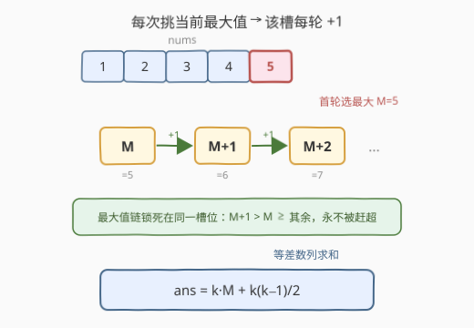
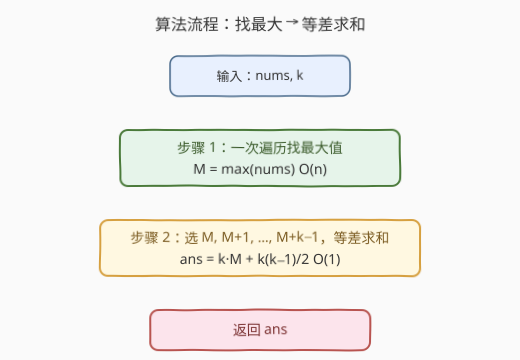

# K 个元素的最大和

- **题目名称**：K 个元素的最大和
- **链接**：[2656. K 个元素的最大和](https://leetcode.cn/problems/maximum-sum-with-exactly-k-elements/)
- **难度**：简单
- **标签**：贪心、数组

## 1. 题目概述

给定下标从 $0$ 开始的整数数组 `nums` 和整数 $k$。你需要**恰好执行** $k$ 次操作以最大化得分，每次操作四步：

1. 从 `nums` 中选一个元素 $m$；
2. 把选中的 $m$ 从数组中删除；
3. 把新元素 $m+1$ 加入数组；
4. 得分增加 $m$。

返回执行恰好 $k$ 次后的最大得分。

**示例 1**：

```text
输入：nums = [1,2,3,4,5], k = 3
输出：18
解释：第 1 次选 5，和=5，nums=[1,2,3,4,6]；
      第 2 次选 6，和=6，nums=[1,2,3,4,7]；
      第 3 次选 7，和=5+6+7=18，nums=[1,2,3,4,8]。返回 18。
```

**示例 2**：

```text
输入：nums = [5,5,5], k = 2
输出：11
解释：第 1 次选 5，和=5，nums=[5,5,6]；
      第 2 次选 6，和=6，nums=[5,5,7]。返回 5+6=11。
```

**约束条件**：

- $1 \le \text{nums.length} \le 100$
- $1 \le \text{nums[i]} \le 100$
- $1 \le k \le 100$

> 💡 **关键约束**：每次操作「删 $m$ 加 $m+1$」使该槽位自增 $1$。由于 $m+1 > m$ 且 $m+1 \ge$ 数组中其余任何元素（只要 $m$ 是当前最大），所以**一直挑当前最大值**就能让它逐次 $+1$ 连成等差数列，无需重新选槽位——这正是 $O(n)$ 找最大、$O(1)$ 求和的依据。

---

## 2. 解题思路

### 2.1 暴力思路

按题意模拟 $k$ 轮：每轮线性扫一遍 `nums` 找最大值 $m$，累加进得分，再把该位置改成 $m+1$。单轮 $O(n)$，$k$ 轮 $O(nk)$，本题 $n,k\le 100$ 完全可过。但「每次操作后最大值只增不减」这一结构让模拟大材小用——最大值链一旦确定就不会改变，可用等差数列 $O(1)$ 直接求和。

### 2.2 核心观察：挑最大值即得等差数列



**贪心策略：每次都选当前数组的最大值。**

设首轮最大值 $M = \max(\text{nums})$。首轮选 $M$ 后，数组里那个被删的 $M$ 换成了 $M+1$。此时：

- $M+1 > M$，且 $M+1 \ge$ 其余所有元素（因为 $M$ 本是全局最大，其余 $\le M < M+1$）；
- 所以下一轮的最大值就是 $M+1$，且仍在同一个槽位。

如此往复，第 $i$ 轮（$i=0,1,\ldots,k-1$）选的就是 $M+i$，所选序列构成等差数列

$$
M,\ M+1,\ M+2,\ \ldots,\ M+(k-1).
$$

其和为

$$
\text{ans} = \sum_{i=0}^{k-1}(M+i) = k\,M + \frac{k(k-1)}{2}.
$$

> 💡 **为什么贪心是对的？** 交换论证：若某最优解在某轮没挑当前最大值 $M'$，而挑了更小的 $m < M'$，则把这次操作换成挑 $M'$：当前得分 $m \to M'$（增），且替换出的 $m+1 \to M'+1$（$\ge m+1$，后续状态不劣）。故「任意一轮挑当前最大」的解不劣于任意最优解，即最优。又因挑最大后最大值链单调自增、永不被赶超，整条链锁死在首轮最大值 $M$ 上，公式成立。

### 2.3 算法流程图



两步：

1. **找最大值**：$M = \max(\text{nums})$，一次遍历 $O(n)$；
2. **等差数列求和**：$\text{ans} = k\,M + \dfrac{k(k-1)}{2}$，返回。

### 2.4 示例演算

![示例演算：nums=[1,2,3,4,5], k=3 的三轮操作链](../images/p2656_example_walkthrough.svg)

以 `nums = [1,2,3,4,5], k = 3` 为例，$M = 5$：

| 轮次 | 选 $m$ | 累计得分 | 操作后 `nums` |
|------|--------|----------|----------------|
| 1 | $5$ | $5$ | $[1,2,3,4,6]$ |
| 2 | $6$ | $5+6=11$ | $[1,2,3,4,7]$ |
| 3 | $7$ | $5+6+7=\mathbf{18}$ | $[1,2,3,4,8]$ |

公式验算：$\text{ans} = 3\times 5 + \tfrac{3\times 2}{2} = 15+3 = 18$，一致。

> ⚠️ 注意每轮被改写的都是「当前最大」所在槽位，其余元素原封不动。这正是「只看 $M$ 不看其余元素」的由来——其它元素只用来确定首轮 $M$，之后全程陪跑。

---

## 3. 参考代码

### C++

```cpp
class Solution {
public:
    int maximizeSum(vector<int>& nums, int k) {
        int M = *max_element(nums.begin(), nums.end());
        return k * M + k * (k - 1) / 2;
    }
};
```

### Python

```python
class Solution:
    def maximizeSum(self, nums: List[int], k: int) -> int:
        M = max(nums)
        return k * M + k * (k - 1) // 2
```

> 💡 也可一行写成 `return (M := max(nums)) * k + k * (k - 1) // 2`。注意 Python 用 `//` 整除；$\frac{k(k-1)}{2}$ 必为整数（相邻两数之积必偶），无需担心除不尽。

---

## 4. 复杂度分析

| 维度 | 复杂度 | 说明 |
|------|--------|------|
| 时间复杂度 | $O(n)$ | 一次遍历找 $\max$；求和为 $O(1)$ 算术，与 $k$ 无关 |
| 空间复杂度 | $O(1)$ | 仅一个整型 $M$ |
| 对照：逐轮模拟 | $O(nk)$ | 每轮扫一遍找最大并改写，本题数据下也能 AC，但未利用「最大值链自增」结构 |

> 💡 数据范围 $n,k\le 100$ 是为了让「逐轮线性扫」的朴素写法也能过；贪心把任意规模压成 $O(n)$（瓶颈仅在找最大值），即便 $n,k$ 到 $10^9$（求和防溢出即可）依然瞬间出解。

---

## 5. 扩展：若每次操作换成 $m+c$（$c\ne 1$）？

把题面的「加 $m+1$」推广为「加 $m+c$」（$c$ 为固定增量）。首轮最大 $M$，第 $i$ 轮选 $M + i\cdot c$，和为

$$
\text{ans} = k\,M + c\cdot\frac{k(k-1)}{2}.
$$

本题为 $c=1$ 的特例。更进一步，若各槽位增量不同（$c$ 依位置而变），则需权衡「高初值」与「高增量」——但题面规定操作作用于被选元素本身、增量恒为 $1$，所以「锁定最大值链」这一捷径天然成立。这一对比说明：**「删 $m$ 加 $m+1$」的本质是把单次选择改写成一条公差 $1$ 的等差链，贪心锁链即最优**。

---

## 6. 面试要点

1. **为什么每轮都挑当前最大值？**

   > 当前最大值 $M'$ 满足：选它当前得分最大（$M'\ge$ 其余），且换出的 $M'+1$ 也是后续最大（$M'+1 > M' \ge$ 其余），使后续状态最优。交换论证：把任一「未挑最大」的轮次改成挑最大，得分只增不减、后续状态不劣，故「每轮挑最大」最优。

2. **为什么最大值链会「锁死」在首轮的 $M$ 上？**

   > 首轮挑 $M$ 后该槽变 $M+1$；因 $M$ 是全局最大，$M+1 > M \ge$ 其余，所以 $M+1$ 是新一轮最大且仍在同一槽。归纳地，第 $i$ 轮最大恒为 $M+i$，始终在该槽，永不被赶超——链一旦起步就锁定。

3. **公式 $k\,M + \frac{k(k-1)}{2}$ 怎么来的？**

   > $k$ 次选择构成首项 $M$、公差 $1$、项数 $k$ 的等差数列 $M, M+1, \ldots, M+k-1$。等差求和 $=$ 首项 $\times$ 项数 $+$ 公差 $\times\frac{k(k-1)}{2}$，即 $k\,M + \frac{k(k-1)}{2}$。

4. **为什么不挑其它元素、或交替挑不同元素？**

   > 挑非最大值 $m < M'$：当前得分少 $M'-m$，换出的 $m+1 < M'+1$，后续最大也变小，双重不劣。交替挑不同元素只会把「最大链」拆散、累计得分更小。只有当「换出的新值能赶超原最大链」时交替才有意义，但 $m+1\le M < M+1$，永远赶不超。

5. **$k=1$ 或数组只有一个元素的边界？**

   > $k=1$：$\text{ans}=M$，公式 $1\cdot M + 0 = M$，正确。数组长度 $1$：$M=\text{nums}[0]$，仍选它，链为 $\text{nums}[0], \text{nums}[0]+1, \ldots$，公式一致，无需特判。

> 💡 **一句话总结**：每轮挑当前最大值，首轮 $M$ 锁链，所选即等差数列 $M, M+1, \ldots, M+k-1$，和 $=k\,M + \frac{k(k-1)}{2}$，$O(n)$ 找最大后 $O(1)$ 出解。

---

## 7. 同类练习题

- [2600. K 件物品的最大和](https://leetcode.cn/problems/k-items-with-the-maximum-sum/)（[题解](../2501-2600/2600_K件物品的最大和.md)）：同为「恰取 $k$ 个/次使和最大」的贪心框架，按价值降序贪心取尽；本题把「价值序列」显式成等差链，对照「定额内挑最大」的贪心直觉
- [2558. 从数量最多的堆取走礼物](https://leetcode.cn/problems/take-gifts-from-the-richest-pile/)（[题解](../2501-2600/2558_从数量最多的堆取走礼物.md)）：$k$ 次操作每次挑当前最大堆并改写（向下取整平方根），用大根堆模拟「每轮取最大」，对照「选最大 + 改写」的操作型贪心
- [1962. 移除石子使总数最小](https://leetcode.cn/problems/remove-stones-to-minimize-the-total/)：$k$ 次操作每次挑当前最大堆并减半，大根堆驱动「每轮取最大」的贪心，与本题「锁定最大值链」互为正反对照（一增一减）
- [1005. K 次取反后最大化的数组和](https://leetcode.cn/problems/maximize-sum-of-array-after-k-negations/)（[题解](../1001-1100/1005_K次取反后最大化的数组和.md)）：$k$ 次操作贪心改写数组元素以最大化总和，同属「$k$ 次操作 + 贪心改写」家族，对照「先消化最优动作」的建模思路
