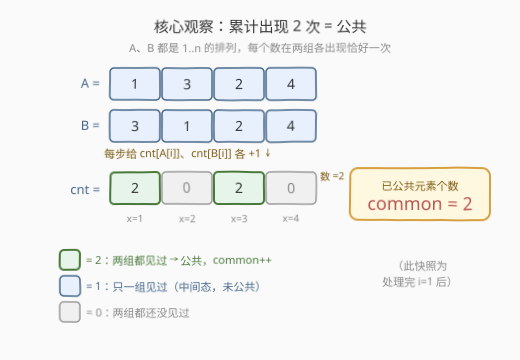
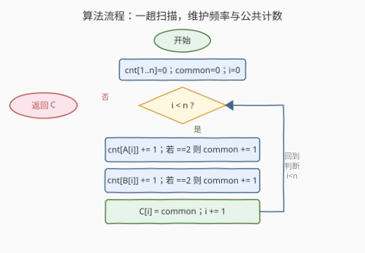

# LeetCode 找到两个数组的前缀公共数组 题解

## 1. 题目概述

- **标题 / 题号**：找到两个数组的前缀公共数组（#2657，medium）
- **链接**：https://leetcode.cn/problems/find-the-prefix-common-array-of-two-arrays/
- **难度**：中等
- **标签**：数组、哈希表、位运算

**题意**：给定两个下标从 **0** 开始、长度为 $n$ 的整数**排列** $A$ 和 $B$。定义 $A$ 和 $B$ 的**前缀公共数组** $C$，其中 $C[i]$ 是数组 $A$ 和 $B$ 到下标 $i$ 之前公共元素的**数目**。返回该前缀公共数组 $C$。

> 💡 **排列**：长度为 $n$ 的数组若恰好包含 $1$ 到 $n$ 的每个元素各一次，则称为一个排列。本题保证 $A$、$B$ 都是 $n$ 个元素的排列——这一约束是整个解法的关键支点。

**示例 1**：

```text
输入：A = [1,3,2,4], B = [3,1,2,4]
输出：[0,2,3,4]
解释：
i = 0：没有公共元素，所以 C[0] = 0。
i = 1：1 和 3 是两个数组的前缀公共元素，所以 C[1] = 2。
i = 2：1、2 和 3 是两个数组的前缀公共元素，所以 C[2] = 3。
i = 3：1、2、3 和 4 是两个数组的前缀公共元素，所以 C[3] = 4。
```

**示例 2**：

```text
输入：A = [2,3,1], B = [3,1,2]
输出：[0,1,3]
解释：
i = 0：没有公共元素，所以 C[0] = 0。
i = 1：只有 3 是公共元素，所以 C[1] = 1。
i = 2：1、2 和 3 是两个数组的前缀公共元素，所以 C[2] = 3。
```

**约束**：

- $1 \le A.\text{length} = B.\text{length} = n \le 50$
- $1 \le A[i], B[i] \le n$
- 题目保证 $A$ 和 $B$ 两个数组都是 $n$ 个元素的**排列**。

> 💡 数据规模 $n \le 50$ 很小，但本题考察的是「在排列约束下如何用一趟扫描增量维护答案」，而非硬抠 $O(n^2)$。

## 2. 解题思路

### 2.1 暴力思路：逐位取前缀集合求交集

最直白的写法：对每个下标 $i$，把 $A[0..i]$ 与 $B[0..i]$ 各自建成集合，求交集大小作为 $C[i]$。

```text
for i in 0..n-1:
    setA = { A[0..i] }
    setB = { B[0..i] }
    C[i] = |setA ∩ setB|
```

逻辑没错，但每个 $i$ 都**从零重建两个集合**并求交，时间 $O(n^2)$（或 $O(n^3)$ 视实现），且没有利用两条性质：

1. **前缀的累积性**：$A[0..i]$ 与 $A[0..i-1]$ 只差一个元素 $A[i]$，无需每次重建，增量维护即可；
2. **排列约束**：每个数 $x \in [1,n]$ 在 $A$ 中恰出现一次、在 $B$ 中也恰出现一次，所以一个数成为公共元素的充要条件是「在两侧前缀中都已出现」——这能把「求交集大小」简化为「数有多少个数已出现两次」。

> ⚠️ 本题真正的考点是：发现排列约束下「公共 ⟺ 累计出现次数达到 2」，从而把逐位求交退化成一趟扫描 + 一个计数器。

### 2.2 核心观察：频率计数，达到 2 即公共



**关键直觉**：维护一个频率数组 $\text{cnt}[1..n]$，记录每个数在 $A[0..i]$ 与 $B[0..i]$ 合计中出现的次数。处理下标 $i$ 时：

- $\text{cnt}[A[i]] \mathrel{+}= 1$：$A[i]$ 在前缀里多出现一次（必然来自 $A$）；
- $\text{cnt}[B[i]] \mathrel{+}= 1$：$B[i]$ 在前缀里多出现一次（必然来自 $B$）。

因为 $A$、$B$ 都是排列，**每个数 $x$ 在整个 $\text{cnt}$ 上的累计上限恰好是 2**（$A$ 一次 + $B$ 一次）。于是：

$$
\text{cnt}[x] = 2 \iff x \text{ 在 } A[0..i] \text{ 和 } B[0..i] \text{ 中都出现过} \iff x \text{ 是当前前缀的公共元素}
$$

每当某个 $\text{cnt}[x]$ **从 1 跃升到 2**，就多出一个公共元素，维护一个全局计数器 `common` 并 `+1`；此时 $C[i] = \text{common}$。

| 观察 | 含义 |
|------|------|
| **排列 ⟹ 每个数 cnt 上限为 2** | 不可能出现 3 次或更多，故「达到 2」即封顶，无须担心重复触发 |
| **跃升发生在 1→2 的瞬间** | 只在 `cnt[x]` 刚变为 2 时 `common++`，避免重复计数；前缀中尚未在另一侧出现的数 cnt 停在 1 |
| **A[i] == B[i] 的退化** | 同一数在两侧同一下标出现：第一次 `+1` 到 1（不触发），第二次 `+1` 到 2（触发），自然只计一次 |

> 💡 **为什么 `A[i] == B[i]` 不会重复计数？** 设 $A[i] = B[i] = x$。因为 $x$ 是排列元素、首次出现，处理前 $\text{cnt}[x] = 0$。先 $\text{cnt}[A[i]]\mathrel{+}=1 \Rightarrow 1$（不等于 2，不触发）；再 $\text{cnt}[B[i]]\mathrel{+}=1 \Rightarrow 2$（触发 `common++` 一次）。两次自增只产生一次跃升，完美对应「$x$ 在 $A$、$B$ 同位出现 → 恰好贡献一个公共元素」。

### 2.3 算法流程图



整体是一条线性的单循环，每轮做两次自增 + 两次「是否到 2」判断：

1. 初始化 $\text{cnt}[1..n] = 0$，$\text{common} = 0$，$i = 0$；
2. 当 $i < n$：
   - $\text{cnt}[A[i]] \mathrel{+}= 1$；若 $\text{cnt}[A[i]] == 2$，则 $\text{common} \mathrel{+}= 1$；
   - $\text{cnt}[B[i]] \mathrel{+}= 1$；若 $\text{cnt}[B[i]] == 2$，则 $\text{common} \mathrel{+}= 1$；
   - $C[i] = \text{common}$；
   - $i \mathrel{+}= 1$；
3. 返回 $C$。

> 💡 两次自增顺序无关紧要：无论先 $A[i]$ 还是先 $B[i]$，跃升判定都基于「自增后是否恰好等于 2」，而排列约束保证每个数最多到 2，因此无论哪种顺序，$A[i]=B[i]$ 时只会在第二次自增触发一次。

### 2.4 示例演算

![示例演算：A=[1,3,2,4], B=[3,1,2,4]，逐行追踪 cnt 与 common](../images/p2657_example_walkthrough.svg)

以**示例 1** $A=[1,3,2,4]$、$B=[3,1,2,4]$ 逐步追踪：

| $i$ | $A[i]$ | $B[i]$ | cnt 增量 | common | $C[i]$ |
|-----|--------|--------|----------|--------|--------|
| 0 | 1 | 3 | cnt[1]→1；cnt[3]→1 | 0 | 0 |
| 1 | 3 | 1 | cnt[3]→2 ✓；cnt[1]→2 ✓ | 2 | 2 |
| 2 | 2 | 2 | cnt[2]→1；cnt[2]→2 ✓ | 3 | 3 |
| 3 | 4 | 4 | cnt[4]→1；cnt[4]→2 ✓ | 4 | 4 |

关键看点：

- $i=1$ 时，$A[1]=3$ 让 cnt[3] 跃升到 2（公共）、$B[1]=1$ 让 cnt[1] 跃升到 2（公共），`common` 一轮连跳两级 $0 \to 2$，$C[1]=2$；
- $i=2$ 时 $A[2]=B[2]=2$，先 cnt[2]→1（不触发），再 cnt[2]→2（触发一次），`common` $2 \to 3$，恰好只计一次——印证 2.2 的退化分析；
- $i=3$ 同理 $A[3]=B[3]=4$，`common` $3 \to 4$。

最终 $C = [0,2,3,4]$，与示例一致。

> 💡 **示例 2** $A=[2,3,1]$、$B=[3,1,2]$ 验证：$i=0$：cnt[2]→1、cnt[3]→1，common=0，$C[0]=0$；$i=1$：cnt[3]→2✓、cnt[1]→1，common=1，$C[1]=1$；$i=2$：cnt[1]→2✓、cnt[2]→2✓，common=3，$C[2]=3$。得 $[0,1,3]$ ✓。

## 3. 参考代码

### C++（频率数组，$O(n)$ / $O(n)$）

```cpp
class Solution {
public:
    vector<int> findThePrefixCommonArray(vector<int>& A, vector<int>& B) {
        int n = A.size();
        vector<int> cnt(n + 1, 0), C(n);
        int common = 0;
        for (int i = 0; i < n; ++i) {
            if (++cnt[A[i]] == 2) ++common;
            if (++cnt[B[i]] == 2) ++common;
            C[i] = common;
        }
        return C;
    }
};
```

> 💡 `++cnt[x] == 2` 把「自增」与「跃升判定」合在一句：自增后恰好为 2 才触发，排列约束保证不会重复命中。`cnt` 下标 1..n，开 $n+1$ 避免越界。

### Python（频率数组，$O(n)$ / $O(n)$）

```python
class Solution:
    def findThePrefixCommonArray(self, A: List[int], B: List[int]) -> List[int]:
        n = len(A)
        cnt = [0] * (n + 1)
        C = [0] * n
        common = 0
        for i in range(n):
            cnt[A[i]] += 1
            if cnt[A[i]] == 2:
                common += 1
            cnt[B[i]] += 1
            if cnt[B[i]] == 2:
                common += 1
            C[i] = common
        return C
```

> ⚠️ 注意：当 $A[i] = B[i]$ 时，第一次自增使 cnt 到 1（不触发），第二次到 2（触发一次）——两次 `if` 不会都命中，因为第一次后 cnt 是 1 而非 2。这正是排列约束带来的天然正确性，无需特判。

## 4. 复杂度分析

| 维度 | 复杂度 | 说明 |
|------|--------|------|
| **时间复杂度** | $O(n)$ | 一趟扫描，每个下标常数次自增与判断 |
| **空间复杂度** | $O(n)$ | 频率数组 $\text{cnt}[1..n]$；输出数组 $C$ 不计额外空间 |
| 对照：暴力集合求交 | $O(n^2)$ 时间 / $O(n)$ 空间 | 每个下标重建前缀集合并求交，未利用累积性与排列约束 |

> 💡 $O(n)$ 已是最优：$C$ 有 $n$ 项必须逐个产出，至少 $\Omega(n)$。频率数组把「逐位求交」压缩为「增量计数 + 跃升触发」，是排列约束下的最优利用。

## 5. 扩展：位掩码 + popcount

$n \le 50$ 时，$1..n$ 的出现情况可以压进一个 64 位整数。维护两个掩码：

```python
class Solution:
    def findThePrefixCommonArray(self, A: List[int], B: List[int]) -> List[int]:
        maskA = maskB = 0
        C = []
        for a, b in zip(A, B):
            maskA |= 1 << a
            maskB |= 1 << b
            C.append((maskA & maskB).bit_count())
        return C
```

- `maskA` 的第 $x$ 位为 1 表示 $x$ 已在 $A$ 的当前前缀出现；`maskB` 同理；
- `maskA & maskB` 的置位即「两侧都已出现」的数，`bit_count()` 直接给出公共元素个数 $C[i]$。

| 对比 | 频率数组 | 位掩码 |
|------|----------|--------|
| 时间 | $O(n)$ | $O(n)$（`bit_count` 为单指令级） |
| 空间 | $O(n)$（cnt 数组） | $O(1)$（两个 64 位整数） |
| 通用性 | 任意值域 | 受限于掩码位数（$n \le 63$ 用一个长整型） |
| 跃升判定 | 显式 `common++` | 隐式：每步重算交集 popcount |

> 💡 位掩码版把「计数到 2」换成「两侧掩码按位与」，省去 cnt 数组与跃升分支，更短更优雅；但**仅当值域 $\le 63$** 时可用一个机器字承载。频率数组版对任意值域（如题目改为 $A[i]$ 可超 $n$）依然成立，是更通用的范式。两者在 $n \le 50$ 下等价高效，面试可先给频率版（直观、易讲清「为什么到 2 即公共」），再点出位掩码版体现对数据规模的敏感度。

## 6. 面试要点

1. **为什么 cnt 达到 2 就一定是公共元素？**

   > 因为 $A$、$B$ 都是 $1..n$ 的排列，每个数在 $A$ 中恰出现一次、在 $B$ 中恰出现一次。所以一个数在「$A$ 的前缀 + $B$ 的前缀」合计中最多出现 2 次。cnt 达到 2 意味着它既在 $A[0..i]$ 出现过、又在 $B[0..i]$ 出现过，恰是公共的定义。

2. **$A[i] = B[i]$ 时会不会重复计数？**

   > 不会。设 $A[i]=B[i]=x$，处理前 cnt[x] 必为 0（$x$ 首次出现）。先 `cnt[A[i]]+=1` 到 1（不等于 2，不触发），再 `cnt[B[i]]+=1` 到 2（触发一次）。两次自增只产生一次跃升，自然只计一个公共元素，与「$x$ 在两侧同位出现贡献一个公共元素」吻合。

3. **暴力集合求交哪里浪费了？**

   > 它每个 $i$ 都从零重建 $A[0..i]$、$B[0..i]$ 的集合并求交，时间 $O(n^2)$，既未利用前缀的累积性（相邻前缀只差一个元素），也未利用排列约束（公共 ⟺ 出现两次）。频率数组版把两个浪费都消除：增量维护 + 跃升触发，降到 $O(n)$。

4. **位掩码版何时优于频率数组？**

   > 当值域 $n \le 63$（一个 64 位机器字可承载）且追求极致简洁时。位掩码用按位与 + popcount 直接得到交集大小，省去 cnt 数组与分支，空间 $O(1)$。但若值域更大或元素可为任意整数，位掩码失效，频率数组更通用。

5. **如果不保证是排列（元素可重复、值域不固定）怎么做？**

   > 仍可增量维护，但 cnt 的语义改为「$x$ 在两侧前缀各自是否出现」，需用两个独立哈希集合 `seenA`/`seenB`（或 cnt 记录「在 A 出现」「在 B 出现」两维状态），每步把 $A[i]$ 加入 seenA、$B[i]$ 加入 seenB，$C[i]$ = 同时存在于两者的大小。跃升判定从「cnt==2」改为「刚加入的一侧使其首次同时在另一侧出现」。排列约束让本题退化成单维 cnt，是简化关键。

> 💡 **一句话总结**：排列约束下，维护频率 cnt，每步给 $A[i]$、$B[i]$ 各 +1，**从 1 跃升到 2 即公共、common++**，$C[i]=\text{common}$；$O(n)$ 时间、$O(n)$ 空间，是「增量计数 + 阈值触发」的招牌题。

## 同类练习题

| # | 题目 | 与本题的关联 |
|---|------|-------------|
| 448 | [找到所有数组中消失的数字](https://leetcode.cn/problems/find-all-numbers-disappeared-in-an-array/)（[题解](../0401-0500/448_找到所有数组中消失的数字.md)） | 同样利用「$1..n$ 排列」约束，用下标当哈希键做 $O(1)$ 空间标记，对照「排列性质如何简化计数」 |
| 2640 | [一个数组所有前缀的分数](https://leetcode.cn/problems/find-the-score-of-all-prefixes-of-an-array/)（[题解](../2601-2700/2640_一个数组所有前缀的分数.md)） | 同样逐前缀增量计算并填入结果数组，对照「前缀累积维护」的通用骨架 |
| 659 | [分割数组为连续子序列](https://leetcode.cn/problems/split-array-into-consecutive-subsequences/)（[题解](../0601-0700/659_分割数组为连续子序列.md)） | 频率表 + 阈值触发的另一招牌题，用 freq/tails 双表增量维护，对照「计数驱动决策」范式 |
| 187 | [重复的 DNA 序列](https://leetcode.cn/problems/repeated-dna-sequences/)（[题解](../0101-0200/187_重复的DNA序列.md)） | 位掩码编码 + 哈希计数的经典题，对照第 5 节「位掩码替代频率数组」的扩展思路 |
| 2574 | [左侧右侧求和差值](https://leetcode.cn/problems/left-and-right-sum-differences/)（[题解](../2501-2600/2574_左侧右侧求和差值.md)） | 逐位用前缀增量构造结果数组，对照「一趟扫描填答案」的最简形态 |
