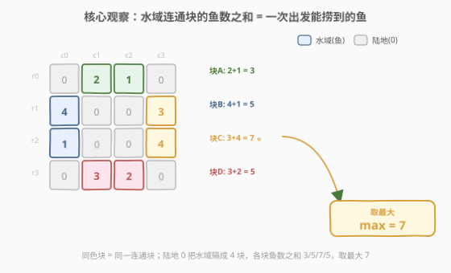
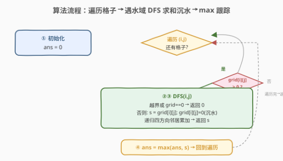
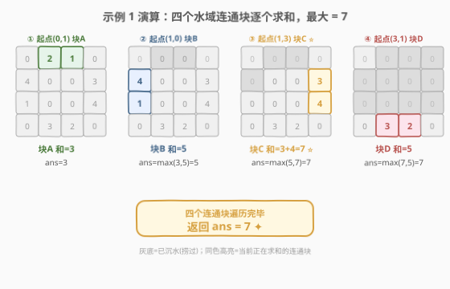

# LeetCode 网格图中鱼的最大数目 题解

## 1. 题目概述

- **标题 / 题号**：网格图中鱼的最大数目（#2658，medium）
- **链接**：https://leetcode.cn/problems/maximum-number-of-fish-in-a-grid/
- **难度**：中等
- **标签**：图、DFS、BFS、并查集、数组、矩阵、连通分量

**题意**：给你一个下标从 $0$ 开始、大小为 $m \times n$ 的二维整数数组 `grid`，其中 `grid[r][c]` 的含义：

- `grid[r][c] == 0`：是一块**陆地**；
- `grid[r][c] > 0`：是一块**水域**，且包含 `grid[r][c]` 条鱼。

一位渔夫可以从任意**水域**格子 $(r, c)$ 出发，然后执行以下操作任意次：

1. 捕捞格子 $(r, c)$ 处所有的鱼，**或者**
2. 移动到相邻的**水域**格子（上下左右四方向）。

请你返回渔夫在最优策略下**最多**可以捕捞多少条鱼。如果没有水域格子，返回 $0$。

**示例 1**：

```text
输入：grid = [[0,2,1,0],[4,0,0,3],[1,0,0,4],[0,3,2,0]]
输出：7
解释：渔夫可以从格子 (1,3) 出发，捕捞 3 条鱼，然后移动到格子 (2,3)，捕捞 4 条鱼。
```

**示例 2**：

```text
输入：grid = [[1,0,0,0],[0,0,0,0],[0,0,0,0],[0,0,0,1]]
输出：1
解释：渔夫可以从格子 (0,0) 或者 (3,3) ，捕捞 1 条鱼。
```

**约束**：

- $m == \text{grid.length}$
- $n == \text{grid[i].length}$
- $1 \le m, n \le 10$
- $0 \le \text{grid[i][j]} \le 10$

> 💡 **关键信号**：渔夫一旦从某个水域出发，只能沿四方向在**水域连通块**内游走并累计捕捞量——这意味着「一次出发能捞到的鱼 = 该格所在水域连通块的鱼数之和」。题目所求即「**所有水域连通块中鱼数之和的最大值**」。这是「矩阵连通分量 + 分量求和」的招牌题型，与 [695. 岛屿的最大面积](https://leetcode.cn/problems/max-area-of-island/) 同构（那里数格子数，这里数鱼数）。

## 2. 解题思路

### 2.1 暴力思路

枚举每个出发格子 + 枚举所有游走路径 → 路径数指数级，$m,n$ 虽小到 $10$ 仍不可行，且同一连通块内任意起点捞到的鱼都一样多，大量重复计算。

### 2.2 核心观察：DFS 沉水法求连通块鱼数之和



把问题拆成两层：

**第一层：捕捞量 = 所在水域连通块的鱼数之和。**

渔夫从某格出发后，可在连通块内任意游走、沿途全捞光（每格的鱼不会重复出现，捞了就没了），所以「一次出发的捕捞量」就是「该格所在水域连通块所有格子的 `grid` 值之和」。与起点在块内哪个位置无关——连通块任意起点答案相同。

**第二层：答案 = 所有连通块和的最大值。**

于是问题转化为「找出每个水域连通块、求其元素和、取最大」。遍历每个格子，遇到未访问的水域 `grid[i][j] > 0` 就 DFS 把整个连通块求和并标记（原地置 $0$，即「沉水」兼做 visited），用 `max` 跟踪全局最大。

> ⚠️ **易错点**：陆地 `0` 既不是鱼也不可游走，DFS 遇 `0` 立即返回 $0$；起点本身也得是水域。若误把 `0` 也当可走格子，会把不连通的水域经陆地"桥接"错误合并。

> 💡 **与 695 的对照**：695「岛屿的最大面积」数的是连通块中 `'1'` 的**个数**（每格贡献 $1$），本题数的是连通块中 `grid` 值的**之和**（每格贡献 `grid[i][j]`）。模板完全一致，只是 DFS 返回值由"计数 $1$"换成"累加 `grid[i][j]`"。

### 2.3 算法流程图



步骤：

1. 初始化答案 `ans = 0`；
2. 遍历每个格子 $(i, j) \in [0,m) \times [0,n)$：
   - 若 `grid[i][j] > 0`（未访问的水域）：调用 `dfs(i, j)` 求该连通块鱼数之和 `s`，并原地置 $0$ 标记；
   - `ans = max(ans, s)`；
3. DFS `(i, j)`：越界或 `grid[i][j] == 0` 返回 $0$；否则累加 `grid[i][j]`，置 $0$，递归四方向邻居求和返回；
4. 遍历结束返回 `ans`。

### 2.4 示例演算



以示例 1 `grid = [[0,2,1,0],[4,0,0,3],[1,0,0,4],[0,3,2,0]]` 为例，按遍历顺序发现连通块：

| 步骤 | 起点 $(i,j)$ | DFS 走过的水域连通块 | 鱼数之和 | 当前 `ans` |
|------|--------------|---------------------|----------|-----------|
| ① | $(0,1)=2$ | $(0,1),(0,2)$ | $2+1=3$ | $3$ |
| ② | $(1,0)=4$ | $(1,0),(2,0)$ | $4+1=5$ | $5$ |
| ③ | $(1,3)=3$ | $(1,3),(2,3)$ | $3+4=7$ ⭐ | $7$ |
| ④ | $(3,1)=3$ | $(3,1),(3,2)$ | $3+2=5$ | $7$ |

最终输出 `7`。注意步骤 ③ 的连通块鱼数之和最大，对应官方解释「从 $(1,3)$ 出发捞 $3$，移动到 $(2,3)$ 捞 $4$」。四方向连通：$(0,1)\leftrightarrow(0,2)$、$(1,0)\leftrightarrow(2,0)$、$(1,3)\leftrightarrow(2,3)$、$(3,1)\leftrightarrow(3,2)$，其余相邻均被陆地 `0` 隔开。

## 3. 参考代码

### C++

```cpp
class Solution {
    int m, n;
    int dx[4] = {0, 0, 1, -1};
    int dy[4] = {1, -1, 0, 0};

    int dfs(vector<vector<int>>& g, int i, int j) {
        if (i < 0 || i >= m || j < 0 || j >= n || g[i][j] == 0)
            return 0;
        int sum = g[i][j];
        g[i][j] = 0;            // 沉水：捞光即置 0，兼做 visited
        for (int d = 0; d < 4; d++)
            sum += dfs(g, i + dx[d], j + dy[d]);
        return sum;
    }

  public:
    int findMaxFish(vector<vector<int>>& grid) {
        m = grid.size();
        n = grid[0].size();
        int ans = 0;
        for (int i = 0; i < m; i++)
            for (int j = 0; j < n; j++)
                if (grid[i][j] > 0)
                    ans = max(ans, dfs(grid, i, j));
        return ans;
    }
};
```

### Python

```python
class Solution:
    def findMaxFish(self, grid: List[List[int]]) -> int:
        m, n = len(grid), len(grid[0])
        dirs = [(0, 1), (0, -1), (1, 0), (-1, 0)]

        def dfs(i: int, j: int) -> int:
            if i < 0 or i >= m or j < 0 or j >= n or grid[i][j] == 0:
                return 0
            s = grid[i][j]
            grid[i][j] = 0          # 沉水：捞光即置 0，兼做 visited
            for di, dj in dirs:
                s += dfs(i + di, j + dj)
            return s

        ans = 0
        for i in range(m):
            for j in range(n):
                if grid[i][j] > 0:
                    ans = max(ans, dfs(i, j))
        return ans
```

**BFS 版**（避免大网格递归栈溢出；本题 $m,n \le 10$ 用 DFS 足矣）：

```python
from collections import deque

class Solution:
    def findMaxFish(self, grid: List[List[int]]) -> int:
        m, n = len(grid), len(grid[0])
        dirs = [(0, 1), (0, -1), (1, 0), (-1, 0)]
        ans = 0
        for i in range(m):
            for j in range(n):
                if grid[i][j] > 0:
                    s = 0
                    q = deque([(i, j)])
                    while q:
                        x, y = q.popleft()
                        if grid[x][y] == 0:
                            continue
                        s += grid[x][y]
                        grid[x][y] = 0
                        for di, dj in dirs:
                            nx, ny = x + di, y + dj
                            if 0 <= nx < m and 0 <= ny < n and grid[nx][ny] > 0:
                                q.append((nx, ny))
                    ans = max(ans, s)
        return ans
```

## 4. 复杂度分析

| 维度 | 复杂度 | 说明 |
|------|--------|------|
| **时间复杂度** | $O(m \cdot n)$ | 每个格子最多被 DFS 访问一次（沉水置 $0$ 后不再进入），整体线性扫描 |
| **空间复杂度** | $O(m \cdot n)$ | DFS 递归栈最坏（全水域）深度 $m \cdot n$；BFS 版队列最坏 $O(\min(m,n))$ |

> 💡 本题 $m, n \le 10$，$mn \le 100$，DFS 递归栈绝不会超限，时间空间均无压力。但模板可推广到 $300 \times 300$ 量级（如 695/200），届时 Python 宜用 BFS 防栈溢出。

## 5. 扩展：并查集解法

DFS/BFS 一次遍历即可求所有连通块和，是本题最优解。并查集也能做，适合需要**动态查询连通性**的变体：

1. 把每个水域格子的值作为该连通块的初始"鱼数"；
2. 遍历每个水域格子，与左邻居、上邻居（已遍历的）`union`，合并时把两个连通块的鱼数之和累加到新根；
3. 遍历所有水域格子，取其所在连通块根上记录的鱼数之和的最大值。

代价是常数大于 DFS（路径压缩 + 按秩合并），但支持后续动态连通性查询。本题无此需求，DFS 更直接。

## 6. 面试要点

1. **为什么"沉水"（`grid[i][j] = 0`）可以省 visited 数组？**

   > 沉水把已访问的水域变成陆地 `0`，后续遍历遇 `0` 自然跳过——原地标记，省 $O(mn)$ 的 visited 矩阵。前提是允许修改输入 `grid`；若不能改输入，需额外 visited 矩阵或遍历后还原。

2. **为什么同一连通块任意起点答案相同？**

   > 渔夫在连通块内可任意游走，沿途把每格鱼全捞光。由于"捞了就没了"、每格只贡献一次，一次出发的捕捞量 = 连通块所有格子值之和，与起点位置无关。因此只需对每个连通块求一次和，不必对块内每格都跑一遍 DFS。

3. **DFS 和 BFS 有何区别？该如何选？**

   > 时间复杂度均为 $O(mn)$。空间上 DFS 递归栈最坏 $O(mn)$（全水域蛇形长链），BFS 队列最坏 $O(\min(m,n))$。本题 $mn \le 100$ 两者皆可；推广到大网格时 Python DFS 可能栈溢出，宜用 BFS。写法上 DFS 更简洁。

4. **本题和 [695. 岛屿的最大面积](https://leetcode.cn/problems/max-area-of-island/) 的关系？**

   > 同一模板的两种实例化：695 的 DFS 返回"连通块中格子**个数**"（每格贡献 $1$），本题返回"连通块中 `grid` 值**之和**"（每格贡献 `grid[i][j]`）。把 `sum += 1` 换成 `sum += grid[i][j]` 即可互转。两者都是"矩阵连通分量 + 分量聚合"范式。

5. **陆地 `0` 在 DFS 中起什么作用？误把 `0` 当可走格子会怎样？**

   > `0` 是 DFS 的天然终止条件：越界或遇 `0` 立即返回 $0$，不贡献鱼也不扩展。若误把 `0` 也当可走格子，会把原本被陆地隔开的两个水域连通块经陆地"桥接"错误合并成一个，和值偏大，答案错误。连通性只在水域（$>0$）格子间成立。

> 💡 **一句话总结**：2658 = 「水域连通块的 `grid` 值之和取最大」。$O(mn)$ 一次 DFS 沉水求和、`max` 跟踪，模板同 695，只是把"数格子"换成"数鱼数"。

## 同类练习题

| # | 题目 | 与本题的关联 |
|---|------|-------------|
| 695 | [岛屿的最大面积](https://leetcode.cn/problems/max-area-of-island/) | 本题的"计数版"姊妹题，DFS 求连通块格子数取最大，模板完全一致 |
| 200 | [岛屿数量](https://leetcode.cn/problems/number-of-islands/) | DFS/BFS 数连通块个数，本题的"计数 vs 求和"对照基础题 |
| 1254 | [统计封闭岛屿的数目](https://leetcode.cn/problems/number-of-closed-islands/) | 水域/陆地角色互换的连通分量 DFS，巩固"四方向连通 + 边界判定"范式 |
| 1020 | [飞地的数量](https://leetcode.cn/problems/number-of-enclaves/) | 从边界反向 DFS/BFS 标记可逃出格子，剩余即飞地，连通分量与边界判定的综合 |
| 463 | [岛屿的周长](https://leetcode.cn/problems/island-perimeter/) | 单连通块周长 = 陆地格暴露的水/边界数，DFS/直接遍历两种思路，巩固矩阵连通分量题型 |
