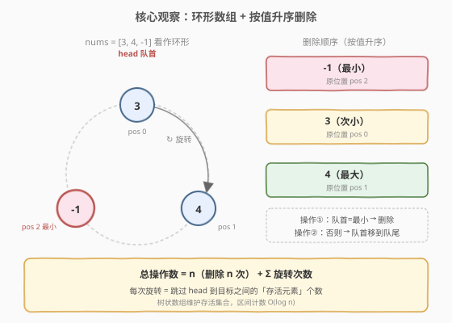
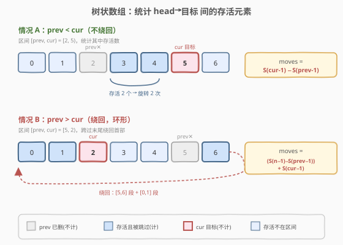
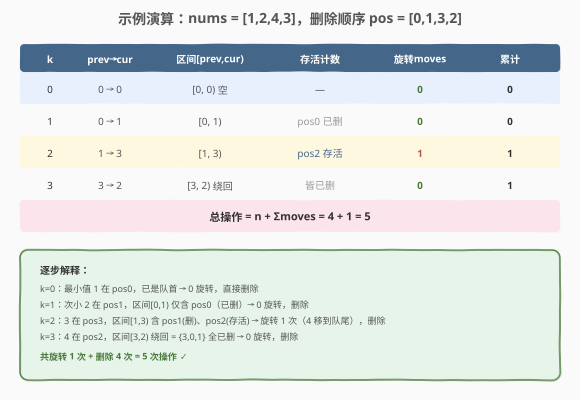

# LeetCode 将数组清空 题解

## 1. 题目概述

- **标题 / 题号**：将数组清空（#2659，hard）
- **链接**：https://leetcode.cn/problems/make-array-empty/
- **难度**：困难
- **标签**：贪心、树状数组、排序、数组

**题意**：给定一个包含若干**互不相同**整数的数组 `nums`，重复执行以下操作**直到数组为空**：

- 若数组中**第一个元素**是当前数组中的**最小值**，则删除它；
- 否则，将第一个元素**移动到数组末尾**。

返回使 `nums` 为空所需的操作数。

**示例 1**：

```text
输入：nums = [3,4,-1]
输出：5
解释：
操作1 → [4, -1, 3]   （3 不是最小，移到末尾）
操作2 → [-1, 3, 4]    （4 不是最小，移到末尾）
操作3 → [3, 4]        （-1 是最小，删除）
操作4 → [4]           （3 是最小，删除）
操作5 → []            （4 是最小，删除）
```

**示例 2**：

```text
输入：nums = [1,2,4,3]
输出：5
```

**示例 3**：

```text
输入：nums = [1,2,3]
输出：3
```

**约束**：

- $1 \le$ `nums.length` $\le 10^5$
- $-10^9 \le$ `nums[i]` $\le 10^9$
- `nums` 中的元素**互不相同**。

> 💡 关键在于「互不相同」——所有元素有严格全序，删除顺序被**唯一确定**：必然先删最小、再删次小……直到最大。剩下的难点只是「模拟这个固定顺序下要旋转多少次」，用**树状数组**动态维护存活集合即可。

## 2. 解题思路

### 2.1 暴力思路：直接模拟

最直观的做法：开一个双端队列模拟。每次看队首是否为当前最小值：是则弹出（操作 +1），否则把队首搬到队尾（操作 +1），直到队列为空。

```text
dq = deque(nums)
while dq:
    if dq[0] == min(dq):      # 每次重新求最小
        dq.popleft()
    else:
        dq.append(dq.popleft())
    ans += 1
```

时间 $O(n^2)$（每轮 `min(dq)` 扫描整个队列），$n = 10^5$ 时约 $10^{10}$ 次运算，**超时**。

> ⚠️ 暴力的浪费在于：**每次都重新求当前最小值**，而实际上「下一个要删的元素」从游戏开始就被值的全序关系钉死了。突破口是观察——把数组看作**环形**，「移到末尾」就是一次旋转，删除顺序固定为按值升序，只需统计每两次删除之间的旋转步数。

### 2.2 核心观察：环形数组 + 按值升序删除

由于元素**互不相同**，设 $p_0, p_1, \dots, p_{n-1}$ 为将元素**按值升序**排列后对应的**原始下标**（$p_0$ 是最小值的下标，$p_{n-1}$ 是最大值的下标）。删除顺序必然是 $p_0 \to p_1 \to \cdots \to p_{n-1}$，与任何旋转都无关——这是值的全序决定的。

「把队首移到队尾」等价于**环形数组顺时针旋转一步**，队首指针前进一步。因此：

$$\text{总操作数} = \underbrace{n}_{\text{删除 } n \text{ 次}} + \underbrace{\sum_{k=0}^{n-1} \text{moves}_k}_{\text{旋转次数}}$$

其中 $\text{moves}_k$ 表示：在删除第 $k$ 小元素前，需要把队首从当前位置旋转到 $p_k$ 所跳过的**存活元素数**。



**关键转移**：设上一次删除的是 $p_{k-1}$（第 $k-1$ 小，已被删除），那么删除后队首会自然落到「$p_{k-1}$ 之后的下一个存活元素」。要把队首转到 $p_k$，需跳过 $p_{k-1}$ 到 $p_k$ 之间（正向环形、半开区间 $[p_{k-1}, p_k)$）的所有存活元素。由于 $p_{k-1}$ 本身已删（存活值为 0），把它当作左端点不影响计数：

$$\text{moves}_k = \text{alive 在 } [p_{k-1},\, p_k) \text{ 正向环形区间的个数} \quad (k \ge 1)$$

而对 $k=0$，游戏开始时队首就在下标 $0$，故 $\text{moves}_0 = \text{alive 在 } [0,\, p_0)$ 的个数 $= p_0$。**只需把 $p_{-1}$ 初始化为 $0$，上述公式对 $k=0$ 同样成立**（此时 $0$ 尚存活，被正确计入）。

> 💡 **直觉理解**：环形半开区间 $[p_{k-1}, p_k)$ 之所以能统一覆盖 $k=0$，是因为游戏开始队首就是 $0$，$p_{-1}=0$ 恰好是「当前的队首位置」；而 $k\ge 1$ 时 $p_{k-1}$ 已死，把它作左端点与「下一个存活元素」作左端点计数结果完全一致。这就是把 $k=0$ 与 $k\ge 1$ 合二为一的诀窍。

### 2.3 树状数组统计存活区间

维护一个长度为 $n$ 的**树状数组（BIT）**，初始全部为 $1$（表示所有元素存活）。每删掉 $p_k$，把对应位置**减 1**（标记死亡）。设前缀和 $S(i) = \sum_{j=0}^{i} \text{alive}[j]$（$S(-1)=0$），则对区间 $[L, R)$（半开，正向，不绕回时 $L < R$）：

$$\text{alive}[L, R) = S(R-1) - S(L-1)$$

当 $L > R$（绕回末尾）时，拆成尾段 + 首段：

$$\text{alive}[L, R) = \big(S(n-1) - S(L-1)\big) + S(R-1)$$



**完整算法流程**：

1. 对下标 $0..n-1$ 按 `nums[i]` 升序排序，得到删除顺序数组 `order`（`order[k] = p_k`）。
2. 初始化树状数组，所有位置置 $1$。
3. 令 `prev = 0`（即 $p_{-1}$），`moves = 0`。
4. 对 $k = 0..n-1$：令 `cur = order[k]`，按 $L=\text{prev}$、$R=\text{cur}$ 计算 $[L,R)$ 的存活个数累加进 `moves`；把 `cur` 位置减 $1$；`prev = cur`。
5. 返回 $n + \text{moves}$。

### 2.4 示例演算

以 `nums = [1,2,4,3]` 为例：按下标收集后按值排序，得到删除顺序 $p = [0, 1, 3, 2]$（依次删值 1、2、3、4）。



| $k$ | prev→cur | 区间 $[\text{prev},\text{cur})$ | 存活计数 | moves | 累计 |
|-----|----------|----------------------------------|----------|-------|------|
| 0 | 0 → 0 | $[0,0)$ 空 | — | 0 | 0 |
| 1 | 0 → 1 | $[0,1)$ | pos0 已删 | 0 | 0 |
| 2 | 1 → 3 | $[1,3)$ | pos2 存活 | 1 | 1 |
| 3 | 3 → 2 | $[3,2)$ 绕回 | 皆已删 | 0 | 1 |

总操作 $= n + \text{moves} = 4 + 1 = 5$，与示例一致。

> 💡 留意 $k=2$：要把队首从删除 pos1 后的位置转到 pos3，需跳过 pos2（值 4，存活），旋转 1 次（4 被移到队尾，3 来到队首），随后删除 3。这正是「区间存活计数」对应实际旋转步数的体现。

## 3. 参考代码

### C++

```cpp
// 将数组清空.cpp —— 环形数组 + 树状数组区间计数
// 编译: g++ -O2 -std=c++17 将数组清空.cpp -o makeempty
#include <vector>
#include <numeric>
#include <algorithm>
using namespace std;

class Solution {
  public:
    long long countOperationsToEmptyArray(vector<int>& nums) {
        int n = nums.size();
        vector<int> order(n);
        iota(order.begin(), order.end(), 0);
        sort(order.begin(), order.end(), [&](int i, int j) {
            return nums[i] < nums[j];            // 按值升序定删除顺序
        });

        vector<int> bit(n + 1, 0);
        auto update = [&](int i, int delta) {    // 0-indexed
            for (i += 1; i <= n; i += i & -i) bit[i] += delta;
        };
        auto query = [&](int i) -> int {         // 前缀 [0..i]，i=-1 返回 0
            if (i < 0) return 0;
            int s = 0;
            for (i += 1; i > 0; i -= i & -i) s += bit[i];
            return s;
        };
        for (int i = 0; i < n; i++) update(i, 1); // 全部存活

        long long moves = 0;
        int prev = 0;                              // p_{-1} = 0（队首起点）
        for (int k = 0; k < n; k++) {
            int cur = order[k];
            int cnt;
            if (prev == cur) {
                cnt = 0;
            } else if (prev < cur) {                // 不绕回 [prev, cur)
                cnt = query(cur - 1) - query(prev - 1);
            } else {                                // 绕回 [prev, n) + [0, cur)
                cnt = (query(n - 1) - query(prev - 1)) + query(cur - 1);
            }
            moves += cnt;
            update(cur, -1);                       // 删除 cur
            prev = cur;
        }
        return n + moves;
    }
};
```

### Python

```python
class Solution:
    def countOperationsToEmptyArray(self, nums: list[int]) -> int:
        n = len(nums)
        order = sorted(range(n), key=lambda i: nums[i])   # 按值升序定删除顺序

        bit = [0] * (n + 1)

        def update(i: int, delta: int) -> None:           # 0-indexed
            i += 1
            while i <= n:
                bit[i] += delta
                i += i & -i

        def query(i: int) -> int:                          # 前缀 [0..i]，i=-1 返回 0
            if i < 0:
                return 0
            i += 1
            s = 0
            while i > 0:
                s += bit[i]
                i -= i & -i
            return s

        for i in range(n):
            update(i, 1)                                  # 全部存活

        moves = 0
        prev = 0                                           # p_{-1} = 0（队首起点）
        for k in range(n):
            cur = order[k]
            if prev == cur:
                cnt = 0
            elif prev < cur:                               # 不绕回 [prev, cur)
                cnt = query(cur - 1) - query(prev - 1)
            else:                                          # 绕回 [prev, n) + [0, cur)
                cnt = (query(n - 1) - query(prev - 1)) + query(cur - 1)
            moves += cnt
            update(cur, -1)                                # 删除 cur
            prev = cur
        return n + moves
```

> 💡 **实现细节**：① `order` 用「按下标排序」而非排值本身，是为了保留**原始位置**信息——旋转步数取决于位置而非值。② `query(-1)` 需特判返回 0，避免循环非法下标。③ 删除用 `update(cur, -1)`（减 1），而非「置 0」——树状数组只支持增量修改，先全置 1 再逐个减 1 即可表达「存活→死亡」。④ `moves` 与答案可达 $n + \frac{n(n-1)}{2}$ 量级，但 $n \le 10^5$ 时仍远小于 `long long` 上界；C++ 用 `long long` 求稳，Python 自动扩容。

## 4. 复杂度分析

| 维度 | 复杂度 | 说明 |
|------|--------|------|
| **时间复杂度** | $O(n \log n)$ | 排序 $O(n \log n)$；$n$ 次树状数组「查询 + 更新」各 $O(\log n)$，共 $O(n \log n)$ |
| **空间复杂度** | $O(n)$ | 树状数组 $O(n)$；`order` 数组 $O(n)$ |

> ⚠️ 朴素模拟 $O(n^2)$ 的瓶颈是「每轮重算最小值 + 逐个旋转」。本题把两个浪费都消掉：① 删除顺序由值排序**一次性**确定；② 旋转步数用树状数组前缀和**对数时间**统计存活区间，无需逐个模拟旋转。这是「降阶」的典型——把 $O(n)$ 的扫描压成 $O(\log n)$ 的查询。

## 5. 扩展：线段树 / 有序集合解法

### 5.1 线段树

树状数组能做区间求和，线段树同样胜任（单点修改 + 区间求和）。复杂度同为 $O(n \log n)$，但常数与代码量更大。本题无区间修改需求，树状数组是更轻量的选择。

### 5.2 有序集合（`std::set` / `SortedList`）

也可用一个有序下标集合维护存活元素。对区间 $[p_{k-1}, p_k)$ 的存活计数，等价于「集合中键值落在 $(p_{k-1}, p_k)$ 内的元素个数」，可用 `set` 的 `order_of_key` 或 `SortedList.bisect` 在 $O(\log n)$ 内得到（绕回时拆成两段查询相加）。C++ 标准库 `std::set` 不支持顺序统计，需借助 `__gnu_pbds::tree` 或手写平衡树；Python 可直接用 `sortedcontainers`。本质与树状数组相同，均把「数存活」压到 $O(\log n)$。

### 5.3 与「约瑟夫问题」的关系

「环形数组、按固定步长/顺序逐个删除」是经典**约瑟夫问题**的抽象。不同的是：约瑟夫问题按固定步长 $k$ 数数删除，本题按**值的全序**决定删除顺序。但二者都需要「环形区间内第几个存活元素」这类查询，因此树状数组 + 二分定位（`find_kth`）是约瑟夫类问题的通用武器。本题因删除顺序显式给出，省去了 `find_kth`，仅需区间求和。

## 6. 面试要点

1. **为什么删除顺序是固定的？**

   - 因为元素**互不相同**，所有值构成严格全序。每次「删除当前最小值」时，被删的永远是「尚未删除中最小的那一个」——这从游戏一开始就被值的大小关系唯一确定，与中间如何旋转无关。这是把 $O(n^2)$ 模拟转为 $O(n \log n)$ 计算的关键前提；若元素可重复，则需要更复杂的处理。

2. **为什么用半开区间 $[p_{k-1}, p_k)$，而不是闭区间 $(p_{k-1}, p_k)$？**

   - 半开区间把 $p_{k-1}$（已删，存活值为 0）纳入左端点不影响计数，却能让 $k=0$ 与 $k\ge 1$ 用**同一公式**：初始化 $p_{-1}=0$，因为游戏开始队首就是下标 $0$，区间 $[0, p_0)$ 正确给出 $\text{moves}_0 = p_0$。若用开区间 $(p_{k-1}, p_k)$，$k=0$ 的左端点 $0$ 是存活的，会被错误排除，必须特判。

3. **绕回时区间计数怎么拆？**

   - 当 $p_{k-1} > p_k$（删除顺序要求「向回走」），正向环形半开区间 $[p_{k-1}, p_k)$ 跨过数组末尾，拆成尾段 $[p_{k-1}, n-1]$ 与首段 $[0, p_k-1]$，分别前缀和相减再相加：$(S(n-1) - S(p_{k-1}-1)) + S(p_k-1)$。这是环形问题把「跨边界区间」化为「两段线性区间」的标准手法。

4. **树状数组为什么用「减 1」而非「置 0」标记删除？**

   - 树状数组（BIT）只支持**增量修改 + 前缀求和**，不支持任意赋值。初始化时所有位置 `update(i, +1)`（全存活），删除时 `update(cur, -1)`（存活值 1→0）。前缀和 $S(i)$ 自然给出 $[0, i]$ 的存活总数。若用线段树则可显式赋值，但常数更大。

5. **$k=0$ 时 $\text{moves}_0 = p_0$ 的直观含义？**

   - 最小值在原始下标 $p_0$。游戏开始队首在下标 $0$，要把 $p_0$ 旋到队首需跳过下标 $0, 1, \dots, p_0-1$ 共 $p_0$ 个元素（此时全存活），即旋转 $p_0$ 次。若最小值恰在队首（$p_0=0$），则 $0$ 次旋转直接删除。公式 $S(p_0-1) - S(-1) = p_0$ 与之完全吻合。

> 💡 **一句话总结**：2659 是「环形约瑟夫 + 值序删除」的树状数组题——元素互不相同使删除顺序被值全序钉死，「移到末尾」即环形旋转，故总操作 $= n + \Sigma\text{旋转}$；每次旋转步数 = 半开区间 $[p_{k-1}, p_k)$ 内的存活数，用树状数组前缀和 $O(\log n)$ 统计，绕回时拆尾段+首段。初始化 $p_{-1}=0$ 统一 $k=0$ 与 $k\ge 1$，整体 $O(n \log n)$。

## 同类练习题

| # | 题目 | 与本题的关联 |
|---|------|-------------|
| 307 | [区域和检索 - 数组可修改](https://leetcode.cn/problems/range-sum-query-mutable/) | 树状数组单点修改 + 区间求和的母题，本题区间计数的底层工具 |
| 315 | [计算右侧小于当前元素的个数](https://leetcode.cn/problems/count-of-smaller-numbers-after-self/) | 树状数组 + 离散化统计「右侧更小者个数」，与本题「统计区间内存活数」同构 |
| 327 | [区间和的个数](https://leetcode.cn/problems/count-of-range-sum/) | 前缀和 + 树状数组统计落在某区间的个数，离散化 + 区间计数范式 |
| 1649 | [通过指令创建有序数组](https://leetcode.cn/problems/create-sorted-array-through-instructions/) | 树状数组动态维护已插入元素，查询「小于/大于当前值」的个数，与本题「动态存活集 + 区间计数」套路一致 |
| 189 | [旋转数组](https://leetcode.cn/problems/rotate-array/) | 「移到末尾」即环形旋转的概念基础，理解旋转方向与队首指针的入门题 |
