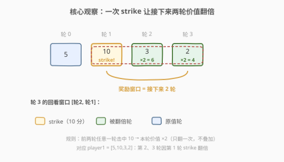
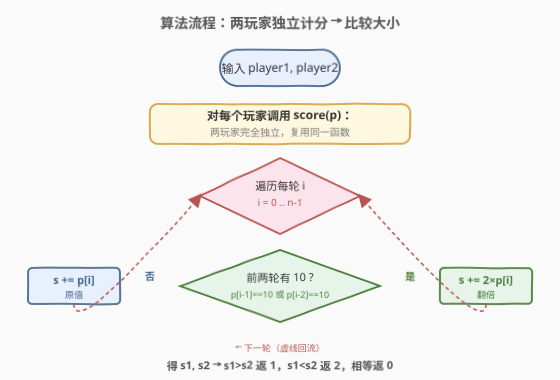
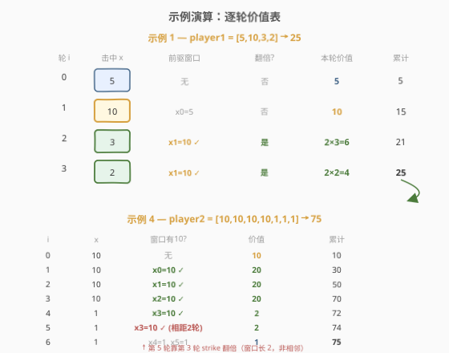

# 保龄球游戏的获胜者

- **题目名称**：保龄球游戏的获胜者
- **链接**：[2660. 保龄球游戏的获胜者](https://leetcode.cn/problems/determine-the-winner-of-a-bowling-game/)
- **难度**：简单
- **标签**：数组、模拟

## 1. 题目概述

给你两个下标从 `0` 开始的整数数组 `player1` 和 `player2`，分别表示玩家 1 和玩家 2 每一轮击中的瓶数。保龄球比赛由 `n` 轮组成，每轮恰好 `10` 个瓶子。

玩家第 $i$ 轮的**价值**（实际计入分数的值）按以下规则计算：

- 如果玩家在**前两轮中的任意一轮**（即第 $i-1$ 轮或第 $i-2$ 轮）击中了 `10` 个瓶子，则本轮价值为 $2x_i$；
- 否则，本轮价值为 $x_i$。

玩家的**得分**是其 $n$ 轮价值的总和。返回：

- `1`：玩家 1 得分更高；
- `2`：玩家 2 得分更高；
- `0`：平局。

**示例 1**：

```text
输入：player1 = [5,10,3,2], player2 = [6,5,7,3]
输出：1
解释：玩家 1 得分 = 5 + 10 + 2*3 + 2*2 = 25；玩家 2 得分 = 6 + 5 + 7 + 3 = 21。
```

**示例 2**：

```text
输入：player1 = [3,5,7,6], player2 = [8,10,10,2]
输出：2
解释：玩家 1 得分 = 3 + 5 + 7 + 6 = 21；玩家 2 得分 = 8 + 10 + 2*10 + 2*2 = 42。
```

**示例 3**：

```text
输入：player1 = [2,3], player2 = [4,1]
输出：0
解释：玩家 1 得分 = 2 + 3 = 5；玩家 2 得分 = 4 + 1 = 5，平局。
```

**示例 4**：

```text
输入：player1 = [1,1,1,10,10,10,10], player2 = [10,10,10,10,1,1,1]
输出：2
解释：玩家 1 得分 = 1+1+1+10+2*10+2*10+2*10 = 73；玩家 2 得分 = 10+2*10+2*10+2*10+2*1+2*1+1 = 75。
```

**约束条件**：

- $n = \text{player1.length} = \text{player2.length}$
- $1 \le n \le 1000$
- $0 \le \text{player1}[i], \text{player2}[i] \le 10$

> 💡 注意「前两轮的任意一轮击中 10」是一个**长度为 2 的回看窗口**：一记全中（strike，击中 10）会让**接下来两轮**的价值翻倍。这和真实保龄球的「strike 奖励接下来两轮」规则一脉相承，只是本题把奖励简化为「翻倍」而非「加上接下来两轮的原始分」。

---

## 2. 解题思路

### 2.1 暴力思路：逐轮模拟

最直接的做法就是题目字面意思——对每个玩家、每一轮 $i$，检查 $i-1$ 和 $i-2$ 这两个前驱轮次里有没有击中 `10` 的，有则本轮 $\times 2$，否则原值。把所有轮的价值累加成总分，最后两个玩家的总分比较大小即可。

由于 $n \le 1000$，$O(n)$ 的模拟完全在时限内，且实现几乎不可能写错——这就是本题**最稳妥**的解法，也是官方预期解法。

> 💡 本题是典型的「**模拟题**」：没有复杂算法，考的是把规则**忠实、不重不漏**地翻译成代码。模拟题最大的坑不是不会做，而是**边界条件漏判**——详见 2.2 对「前两轮」窗口边界的处理。

### 2.2 核心观察：长度为 2 的回看窗口



把规则换个角度看：**第 $i$ 轮是否翻倍，取决于 $[i-2, i-1]$ 这个长度为 2 的窗口里是否出现过 10**。于是每轮只需做一次「窗口内有 10 吗」的判定：

$$\text{val}(i) = \begin{cases} 2x_i, & (i \ge 1 \wedge x_{i-1}=10) \;\vee\; (i \ge 2 \wedge x_{i-2}=10) \\ x_i, & \text{otherwise} \end{cases}$$

要点：

- **边界要加下标守卫**：第 0 轮没有前驱，第 1 轮只有一个前驱。直接写 `player[i-1]` 在 $i=0$ 时会越界（C++ 未定义、Python 取到最后一个元素导致**静默错误**），必须用 `i >= 1` / `i >= 2` 守卫。
- **翻倍不叠加**：即便前两轮**都**是 10，本轮也只翻倍**一次**（$2x_i$，不是 $4x_i$）。判定是布尔「或」而非计数——这避免了重复翻倍的常见 bug。
- **strike 的「有效期」**：一次全中（round $j$ 击中 10）会影响 $j+1$ 和 $j+2$ 两轮，正好对应「回看窗口长度 2」。若连续全中，窗口被反复刷新，但翻倍仍只作用一次——参见示例 4 玩家 2 连续 4 个 10 后的链式翻倍。

### 2.3 算法流程图



整体是「**独立计分 → 比较**」两阶段，两个玩家的计分完全独立、互不影响，因此可以抽取一个 `score(player)` 函数复用。

### 2.4 示例演算



以**示例 1** `player1 = [5,10,3,2]` 逐轮展开（绿色为翻倍轮，灰色为原值轮）：

| 轮次 $i$ | 击中 $x_i$ | 前驱窗口 | 翻倍? | 本轮价值 | 累计 |
|----------|-----------|-------------------|-------|---------|------|
| 0 | 5 | 无 | 否 | 5 | 5 |
| 1 | 10 | $x_0=5$ | 否 | 10 | 15 |
| 2 | 3 | $x_1=10$ ✓ | 是 | $2\times3=6$ | 21 |
| 3 | 2 | $x_2=3,\;x_1=10$ ✓ | 是 | $2\times2=4$ | 25 |

第 2、3 轮都因为第 1 轮的 10 而翻倍——这正是「一次 strike 奖励接下来两轮」的体现。玩家 2 `[6,5,7,3]` 全程无 10，全部原值，得分 21。$25 > 21$，返回 `1`。

再看**示例 4** 玩家 2 `[10,10,10,10,1,1,1]`，连续 strike 形成翻倍链：

| 轮次 $i$ | $x_i$ | 前驱窗口 | 翻倍? | 本轮价值 | 累计 |
|----------|-------|-------------------|-------|---------|------|
| 0 | 10 | 无 | 否 | 10 | 10 |
| 1 | 10 | $x_0=10$ ✓ | 是 | 20 | 30 |
| 2 | 10 | $x_1=10$ ✓ | 是 | 20 | 50 |
| 3 | 10 | $x_2=10$ ✓ | 是 | 20 | 70 |
| 4 | 1 | $x_3=10$ ✓ | 是 | 2 | 72 |
| 5 | 1 | $x_4=1,\;x_3=10$ ✓ | 是 | 2 | 74 |
| 6 | 1 | $x_5=1,\;x_4=1$ | 否 | 1 | 75 |

注意第 5 轮：虽然上一轮（第 4 轮）只击中 1，但**第 3 轮的 10** 仍在两轮窗口内，因此第 5 轮依然翻倍——窗口是「前两轮**任意**一轮」，不是「上一轮」。第 6 轮窗口 $[x_5=1, x_4=1]$ 内无 10，恢复原值。玩家 1 得 73，$73 < 75$，返回 `2`。

> 💡 示例 4 是本题最易错的点：连续全中后，strike 的「余热」会沿窗口向后**渗透两轮**。第 5 轮靠的是**第 3 轮**（相距两轮）的 strike，而非相邻轮——这正是「窗口长度 2」要捕捉的。

---

## 3. 参考代码

### 方法一：回看窗口模拟（最直观，推荐首选）

### C++

```cpp
class Solution {
  public:
    int isWinner(vector<int>& player1, vector<int>& player2) {
        auto score = [](const vector<int>& p) {
            int s = 0, n = p.size();
            for (int i = 0; i < n; ++i) {
                bool doubled = (i >= 1 && p[i - 1] == 10) ||
                               (i >= 2 && p[i - 2] == 10);
                s += doubled ? 2 * p[i] : p[i];
            }
            return s;
        };
        int s1 = score(player1), s2 = score(player2);
        return s1 == s2 ? 0 : (s1 > s2 ? 1 : 2);
    }
};
```

### Python

```python
class Solution:
    def isWinner(self, player1: List[int], player2: List[int]) -> int:
        def score(p: List[int]) -> int:
            s = 0
            for i, x in enumerate(p):
                doubled = (i >= 1 and p[i - 1] == 10) or \
                          (i >= 2 and p[i - 2] == 10)
                s += 2 * x if doubled else x
            return s

        s1, s2 = score(player1), score(player2)
        return 0 if s1 == s2 else (1 if s1 > s2 else 2)
```

> ⚠️ Python 中 `p[i-1]` 在 $i=0$ 时会取到**最后一个元素**（负索引），不会报越界，而是**静默给出错误结果**——所以 `i >= 1` 的守卫在 Python 里尤其关键，不能省。C++ 则会越界访问，行为未定义。

### 方法二：前瞻式「奖励倒计时」（避免下标守卫，进阶）

### C++

```cpp
class Solution {
  public:
    int isWinner(vector<int>& player1, vector<int>& player2) {
        auto score = [](const vector<int>& p) {
            int s = 0, bonus = 0; // bonus = 剩余待翻倍的轮数
            for (int x : p) {
                s += bonus > 0 ? 2 * x : x;
                bonus = (x == 10) ? 2 : max(bonus - 1, 0);
            }
            return s;
        };
        int s1 = score(player1), s2 = score(player2);
        return s1 == s2 ? 0 : (s1 > s2 ? 1 : 2);
    }
};
```

### Python

```python
class Solution:
    def isWinner(self, player1: List[int], player2: List[int]) -> int:
        def score(p: List[int]) -> int:
            s = bonus = 0  # bonus = 剩余待翻倍的轮数
            for x in p:
                s += 2 * x if bonus > 0 else x
                bonus = 2 if x == 10 else max(bonus - 1, 0)
            return s

        s1, s2 = score(player1), score(player2)
        return 0 if s1 == s2 else (1 if s1 > s2 else 2)
```

> 💡 方法二把视角从「**回看**前两轮有没有 10」翻转成「**前瞻**——一次 10 把接下来两轮的翻倍额度提前存进 `bonus`」。每轮先消费额度（`bonus>0` 则翻倍），再按本轮是否 10 重置额度为 2 或递减。`max(bonus-1, 0)` 保证额度不跌成负数；连续全中时 `bonus` 被反复刷新为 2（覆盖而非累加），恰好对应「翻倍只作用一次」。两种视角复杂度同为 $O(n)$/$O(1)$，但前瞻式**无需下标守卫**、对边界天然免疫。

---

## 4. 复杂度分析

| 维度 | 方法 | 复杂度 | 说明 |
|------|------|--------|------|
| 时间复杂度 | 回看窗口 | $O(n)$ | 每轮 $O(1)$ 判定 + 累加，共 $n$ 轮 |
| 空间复杂度 | 回看窗口 | $O(1)$ | 仅累计变量与循环下标 |
| 时间复杂度 | 奖励倒计时 | $O(n)$ | 单趟遍历，每轮 $O(1)$ |
| 空间复杂度 | 奖励倒计时 | $O(1)$ | 仅累计变量与 `bonus` |

> 💡 两方法均为 $O(n)$/$O(1)$，渐近完全相同。区别在**实现稳健性**：回看式需手写 `i>=1`/`i>=2` 守卫（漏写即越界/负索引 bug），前瞻式用 `bonus` 计数器把边界处理内化进递推，更不易错。本题 $n\le10^3$，任意一种都瞬时通过，选哪个看团队对「可读性 vs 健壮性」的偏好。

---

## 5. 扩展：连续全中时翻倍链为何不会叠加？

最易困惑的是示例 4 玩家 2 连续 4 个 10：既然第 1、2、3 轮都是 strike，第 3 轮是否该被**多次**翻倍？答案是否定的，原因有二：

1. **规则是布尔判定，不是计数**：题目说「前两轮**任意一轮**击中 10 则翻倍」，是「是否存在」而非「有几个」。即便窗口里两个都是 10，也只翻倍**一次**（$2x_i$）。
2. **`bonus` 用覆盖而非累加**：方法二中 `bonus = 2 if x==10 else ...`，遇到新的 strike 直接把额度**重置为 2**（而非 `bonus += 2`）。这精确反映了「翻倍状态是二值的（翻/不翻），新 strike 只负责续命两轮，不叠加倍率」。

若把规则改成「窗口内每有一个 10 就多翻一倍」（$2^k x_i$），则 `bonus` 需改成计数器并累加——但本题不是这样。理解「覆盖 vs 累加」是避免把 strike 奖励写错的关键。

> ⚠️ 真实保龄球的 strike 奖励更复杂：strike 后接下来两轮的**原始分**会被加到 strike 那轮的 10 分上（即 $10 + x_{j+1} + x_{j+2}$），而非把后续轮翻倍。本题是对规则的**简化改写**，不要把真实保龄球规则硬套进来。

---

## 6. 面试要点

1. **两个玩家为什么可以共用一个 `score` 函数？**

   > 计分规则只依赖玩家自己的轮次数组，两玩家之间**完全独立、无耦合**。抽取 `score(p)` 既消除重复代码，又保证两人用同一套逻辑（避免各写一份导致不一致 bug）。最后只需比较 `s1`、`s2`。

2. **回看式里 `i >= 1` 守卫在 Python 里能不能省？**

   > **不能**。Python 的负索引会让 `p[i-1]` 在 $i=0$ 时取到 `p[-1]`（最后一个元素）而不报错，给出**静默错误**。C++ 则直接越界访问（未定义行为）。守卫在两种语言里都不可省，是本题最常见的 bug 来源。

3. **连续多个 strike，中间轮会不会被翻倍多次？**

   > 不会。规则是「窗口内**是否存在** 10」的布尔判定，不是「有几个 10 就翻几倍」。即便前两轮都是 10，本轮也只翻倍**一次**。前瞻式用 `bonus` 覆盖（而非累加）恰好对应这一点。

4. **前瞻式 `bonus` 的递推为什么用 `max(bonus-1, 0)` 而不是 `bonus-1`？**

   > 额度不能为负。当没有 strike 且 `bonus` 已为 0 时，`bonus-1` 会变 $-1$，下一轮 `bonus>0` 误判为 false 仍正确，但语义不清且若改判定方式易错。`max(..., 0)` 把状态限制在 $\ge0$，保持「剩余待翻倍轮数」的语义自洽。

5. **如果规则改成「前 k 轮任意一轮为 10 才翻倍」，怎么改？**

   > 回看式把窗口从 2 扩到 $k$：判定 `any(p[j]==10 for j in range(max(0,i-k), i))`，仍 $O(nk)$。前瞻式更优雅：把 strike 的奖励额度设为 $k$（`bonus = k if x==10 else max(bonus-1,0)`），仍是 $O(n)$，且无需修改判定结构——这正是前瞻式的可扩展优势。

---

## 7. 同类练习题

- [682. 棒球比赛](https://leetcode.cn/problems/baseball-game/)：记录棒球队每一打次，根据上一打的「全垒打/二垒打」等特殊操作回看前几轮得分。与本题同属「体育计分 + 前驱操作影响当前分」的模拟家族，且需用栈/计数处理历史记录，难度递进
- [1652. 拆炸弹](https://leetcode.cn/problems/defuse-the-bomb/)：循环数组中每个位置取**前 k 个**或后 k 个元素之和。与本题同属「回看固定长度窗口」模式，可对比「窗口求和」与「窗口翻倍判定」两种窗口用法
- [2012. 数组美丽值求和](https://leetcode.cn/problems/sum-of-beauty-in-the-array/)：每个元素的「美丽值」取决于其**左侧最大值与右侧最小值**的关系。同属「当前元素依赖邻居」的回看/前瞻判定，可对比「点对点邻居」与「窗口内极值」的判定差异
- [2073. 买票需要的时间](https://leetcode.cn/problems/time-needed-to-buy-tickets/)：模拟排队买票，每人按轮次消耗额度。同属「逐轮模拟 + 跨越多轮的状态」的模拟题，可对比「按人推进」与「按轮推进」两种模拟视角
