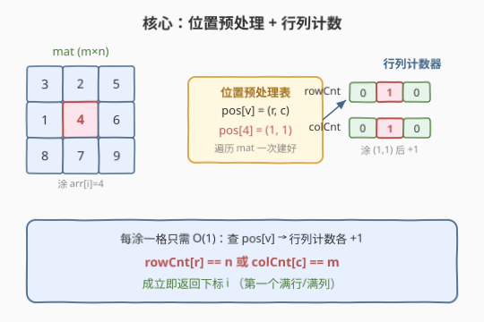
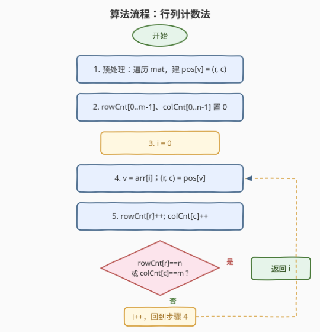
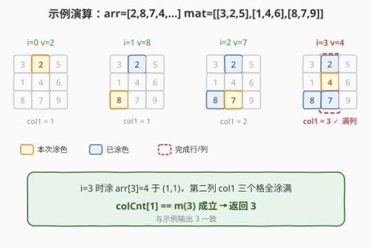

# 找出叠涂元素

- **题目名称**：找出叠涂元素
- **链接**：[2661. 找出叠涂元素](https://leetcode.cn/problems/first-completely-painted-row-or-column/)
- **难度**：中等
- **标签**：数组、哈希表、矩阵

## 1. 题目概述

给定一个下标从 0 开始的整数数组 `arr` 和一个 $m \times n$ 的整数矩阵 `mat`。`arr` 和 `mat` 都包含范围 $[1, m \times n]$ 内的**所有**整数（各出现一次，互不相同）。

从下标 0 开始遍历 `arr`，每一步把 `mat` 中值为 `arr[i]` 的那个格子涂色。找出 `arr` 中**第一个**使 `mat` 的某一行或某一列**全部被涂色**的元素，返回其下标 $i$。

**示例 1**：

```text
输入：arr = [1,3,4,2], mat = [[1,4],[2,3]]
输出：2
解释：mat 为 2×2。i=0 涂 1 于 (0,0)；i=1 涂 3 于 (1,1)；
      i=2 涂 4 于 (0,1)，此时第一行 {1,4} 与第二列 {3,4} 均涂满，返回 2。
```

**示例 2**：

```text
输入：arr = [2,8,7,4,1,3,5,6,9], mat = [[3,2,5],[1,4,6],[8,7,9]]
输出：3
解释：mat 为 3×3。i=0 涂 2 于 (0,1)；i=1 涂 8 于 (2,0)；
      i=2 涂 7 于 (2,1)；i=3 涂 4 于 (1,1)，第二列 {2,7,4} 全涂满，返回 3。
```

**约束条件**：

- $m =$ `mat.length`，$n =$ `mat[i].length`，`arr.length` $= m \times n$
- $1 \le m, n \le 10^5$，$1 \le m \times n \le 10^5$
- $1 \le$ `arr[i]`, `mat[r][c]` $\le m \times n$
- `arr` 中的整数**互不相同**；`mat` 中的整数**互不相同**

> 💡 关键前提：`arr` 与 `mat` 各自包含 $[1, m \times n]$ 的**全部**整数且互不重复——这意味着每个值在 `mat` 中有**唯一坐标**，且 `arr` 中每个值都会被涂一次。于是涂色顺序由 `arr` 唯一给定，问题等价于「按 `arr` 顺序逐格涂色，何时首次出现满行或满列」。

---

## 2. 解题思路

### 2.1 暴力思路

最直观：维护 `painted[r][c]` 布尔矩阵，每涂一格后扫描「刚涂的行 $r$」和「刚涂的列 $c$」是否全涂满。检查一行需 $O(n)$、一列需 $O(m)$，单步 $O(m+n)$，整体 $O(mn \cdot (m+n))$。

$m \times n$ 上限 $10^5$，但 $m$、$n$ 各自可达 $10^5$（例如 $m=10^5, n=1$ 时 $m+n \approx 10^5$），整体最坏约 $10^{10}$，**超时**。更糟的暴力是每步全量扫描整个矩阵判满，$O((mn)^2)$。

> ⚠️ 浪费在于：每涂一格都「重新从头扫描」该行该列，而其实只需知道「这行/这列已经涂了**几个**格」——一个计数即可。突破口：把「判满」从 $O(m+n)$ 的扫描压成 $O(1)$ 的计数自增。

### 2.2 核心观察：位置预处理 + 行列计数

分两步降阶：

1. **位置预处理**：遍历 `mat` 一次，建立 `pos[v] = (r, c)`——值 $v$ 在矩阵中的坐标。$O(mn)$ 一次建好。
2. **行列计数**：维护 `rowCnt[r]`（第 $r$ 行已涂格数）与 `colCnt[c]`（第 $c$ 列已涂格数）。涂 `arr[i]=v` 时查 $(r,c) = pos[v]$，执行 `rowCnt[r]++`、`colCnt[c]++`。若 `rowCnt[r]==n`（行宽）或 `colCnt[c]==m`（列高）即返回 $i$。**每步 $O(1)$**。



> 💡 为什么「判满」能 $O(1)$？因为每行格数固定为 $n$、每列格数固定为 $m$。涂一格使该行计数 $+1$、该列计数 $+1$；计数触顶即满。无需维护「哪些格涂了」，只需「涂了几个」——这是把集合判等问题压成标量计数的关键。

### 2.3 算法流程



完整步骤：

1. 遍历 `mat`，对每个 `mat[r][c]` 记 `pos[mat[r][c]] = (r, c)`。
2. 初始化 `rowCnt[0..m-1] = 0`、`colCnt[0..n-1] = 0`。
3. 令 $i$ 从 0 起：$v = arr[i]$；$(r,c) = pos[v]$；`rowCnt[r]++`；`colCnt[c]++`。
4. 若 `rowCnt[r] == n` 或 `colCnt[c] == m`，返回 $i$；否则 $i{+}{+}$，回到步骤 3。

### 2.4 示例演算

以示例 2 为例：`arr = [2,8,7,4,…]`，`mat = [[3,2,5],[1,4,6],[8,7,9]]`（$m=n=3$）。预处理得 `pos`：$2 \to (0,1)$、$8 \to (2,0)$、$7 \to (2,1)$、$4 \to (1,1)$……



| $i$ | `arr[i]` | $(r,c)$ | `rowCnt` | `colCnt` | 完成? |
|-----|----------|---------|-----------|-----------|--------|
| 0 | 2 | (0,1) | [1,0,0] | [0,1,0] | 否 |
| 1 | 8 | (2,0) | [1,0,1] | [1,1,0] | 否 |
| 2 | 7 | (2,1) | [1,0,2] | [1,2,0] | 否 |
| 3 | 4 | (1,1) | [1,1,2] | [1,3,0] | `colCnt[1]==3==m` ✓ → 返回 3 |

$i=3$ 时涂 $(1,1)$，第二列计数达 $m=3$，返回 3，与示例一致。

> 💡 留意第二列 `colCnt[1]` 的增长：$1 \to 1 \to 2 \to 3$。涂 2（行0）、涂 7（行2）、涂 4（行1）三次恰好覆盖该列全部三行。行列计数法把「列是否满」简化为「列计数是否等于行数 $m$」，无需记录具体哪些行涂过。

---

## 3. 参考代码

### C++

```cpp
// 找出叠涂元素.cpp —— 位置预处理 + 行列计数
// 编译: g++ -O2 -std=c++17 找出叠涂元素.cpp -o painted
#include <vector>
#include <utility>
using namespace std;

class Solution {
  public:
    int firstCompleteIndex(vector<int>& arr, vector<vector<int>>& mat) {
        int m = mat.size(), n = mat[0].size();
        int total = m * n;                       // 值域 [1, total]
        vector<pair<int,int>> pos(total + 1);    // pos[v] = (r, c)
        for (int r = 0; r < m; ++r)
            for (int c = 0; c < n; ++c)
                pos[mat[r][c]] = {r, c};

        vector<int> rowCnt(m, 0), colCnt(n, 0);
        for (int i = 0; i < total; ++i) {
            auto [r, c] = pos[arr[i]];           // 查值对应的坐标
            if (++rowCnt[r] == n || ++colCnt[c] == m)
                return i;                        // 行满(==n) 或 列满(==m)
        }
        return -1;                               // 理论不可达：涂完最后一格必满
    }
};
```

### Python

```python
class Solution:
    def firstCompleteIndex(self, arr: list[int], mat: list[list[int]]) -> int:
        m, n = len(mat), len(mat[0])
        total = m * n                              # 值域 [1, total]
        pos = [None] * (total + 1)                 # pos[v] = (r, c)
        for r in range(m):
            for c in range(n):
                pos[mat[r][c]] = (r, c)

        rowCnt = [0] * m
        colCnt = [0] * n
        for i, v in enumerate(arr):
            r, c = pos[v]                           # 查值对应的坐标
            rowCnt[r] += 1
            colCnt[c] += 1
            if rowCnt[r] == n or colCnt[c] == m:    # 行满(==n) 或 列满(==m)
                return i
        return -1                                   # 理论不可达
```

> 💡 **实现细节**：① 值域恰好是 $[1, m \times n]$ 且互不重复，故 `pos` 用长度 $total+1$ 的数组以值直接做下标，$O(1)$ 寻址，无需哈希表。② 行宽为 $n$、列高为 $m$，故判满条件是 `rowCnt[r]==n` 与 `colCnt[c]==m`，二者方向相反别写反。③ `++rowCnt[r] == n` 利用自增表达式同时完成「计数」与「比较」，短路 `||` 保证任一满足即返回。④ 返回 $-1$ 仅是占位：涂完最后一格时全矩阵满，至少有一行一列满，循环内必然命中。

---

## 4. 复杂度分析

| 维度 | 复杂度 | 说明 |
|------|--------|------|
| **时间复杂度** | $O(mn)$ | 预处理遍历 `mat` 一次 $O(mn)$；主循环最多 $mn$ 步，每步 $O(1)$，共 $O(mn)$ |
| **空间复杂度** | $O(mn)$ | `pos` 数组 $O(mn)$；`rowCnt` $O(m)$、`colCnt` $O(n)$ 均不超过 $O(mn)$ |

> ⚠️ 暴力 $O(mn \cdot (m+n))$ 的瓶颈是「每步重扫整行整列」。本题把两处浪费都消掉：① 涂色坐标用 `pos` 表**一次预处理** $O(1)$ 取得，免去每步在矩阵里搜值；② 判满用行列计数 $O(1)$ 自增比对，免去 $O(m+n)$ 扫描。这是「空间换时间 + 集合压标量」的典型降阶。

---

## 5. 扩展：反向索引法（取行列完成时刻的最小值）

还有一种等价视角，同样 $O(mn)$ 但思路更「整体」：

1. 建立**反向索引** `idx[v]` = 值 $v$ 在 `arr` 中的下标（即 $v$ 被涂色的时刻）。
2. 对每一行 $r$，其**完成时刻** $= \max_c idx[mat[r][c]]$（该行最后一个被涂的格子的下标）。
3. 对每一列 $c$，其**完成时刻** $= \max_r idx[mat[r][c]]$。
4. 答案 $=$ 所有行、列完成时刻的**最小值**。

理由：一行被涂满的**确切时刻**，就是它最后一格被涂的时刻，即该行各格 `idx` 的最大值；首个涂满的行/列，就是这些「完成时刻」里最小的那个。

```cpp
// 反向索引法 —— 取所有行列完成时刻的最小值
#include <climits>
class Solution {
  public:
    int firstCompleteIndex(vector<int>& arr, vector<vector<int>>& mat) {
        int m = mat.size(), n = mat[0].size(), total = m * n;
        vector<int> idx(total + 1);
        for (int i = 0; i < total; ++i) idx[arr[i]] = i;   // 值→涂色时刻

        int ans = INT_MAX;
        for (int r = 0; r < m; ++r) {                       // 每行完成时刻
            int last = 0;
            for (int c = 0; c < n; ++c) last = max(last, idx[mat[r][c]]);
            ans = min(ans, last);
        }
        for (int c = 0; c < n; ++c) {                       // 每列完成时刻
            int last = 0;
            for (int r = 0; r < m; ++r) last = max(last, idx[mat[r][c]]);
            ans = min(ans, last);
        }
        return ans;
    }
};
```

> 💡 **两种解法对比**：行列计数法「**边走边判**」，命中即返回，**可提前终止**，平均更省；反向索引法「**先算所有完成时刻再取最小**」，必须扫完全部行列，但思路更整体、一次成形。两者渐进复杂度相同 $O(mn)$，面试中行列计数法更直观、写起来更短，推荐作为主解。

---

## 6. 面试要点

1. **为什么用 `pos` 数组而非 `unordered_map`？**

   - 题目保证值域恰为 $[1, m \times n]$ 且互不重复，是**稠密连续正整数**。用长度 $total+1$ 的数组以值直接做下标，$O(1)$ 寻址且常数远小于哈希表（无散列、无冲突、缓存友好）。若值域稀疏或不可枚举，才退回哈希表。

2. **行列计数为何能把判满降到 $O(1)$？**

   - 每行格数恒为 $n$、每列格数恒为 $m$。涂一格使该行计数 $+1$、该列计数 $+1$；计数**触顶**即满。我们只需跟踪「涂了几个」而非「涂了哪些」，把集合判等压成标量比较。这是「固定容量 + 增量计数」的标准套路。

3. **判满条件为何是 `==n` 与 `==m` 而非都 `==n`？**

   - 行的容量是**列数 $n$**（一行有 $n$ 格），列的容量是**行数 $m$**（一列有 $m$ 格）。行满判定 `rowCnt[r] == n`、列满判定 `colCnt[c] == m`，方向相反，写反是最常见的笔误。口诀：「行满看列数、列满看行数」。

4. **`pos` 数组大小为何是 $total+1$？**

   - 值从 1 开始到 $total = m \times n$，用值做下标需要索引 $1..total$，故数组长度 $total+1$（下标 0 留空）。`arr.length == m*n` 保证值域恰好覆盖，无越界风险。

5. **反向索引法为何取「最大值的最小值」？**

   - 一行涂满的时刻 $=$ 该行最后一格被涂的时刻 $=$ 行内各格 `idx` 的**最大值**（所有格子都涂过才算满，取最晚那个）。首个涂满的行/列 $=$ 所有这些完成时刻的**最小值**。`max` 描「行内瓶颈」、`min` 选「最早完成」，是经典的「瓶颈最小化」结构。

> 💡 **一句话总结**：2661 是「矩阵位置预处理 + 行列计数」的哈希题——值域稠密故 `pos[v]` 直接做数组下标 $O(1)$ 取坐标，涂一格让 `rowCnt[r]` 与 `colCnt[c]` 各 $+1$，触顶 `==n`/`==m` 即满返回。整体 $O(mn)$ 时间、$O(mn)$ 空间，把暴力的 $O(mn(m+n))$ 判满压成 $O(1)$ 计数。

---

## 7. 同类练习题

- [2133. 检查是否每一行每一列都包含全部整数](https://leetcode.cn/problems/check-if-every-row-and-column-contains-all-numbers/)：同样判「行/列是否凑齐」，用集合/计数检验每行每列元素完整性，本题的判满思想泛化到全矩阵
- [2482. 行和列中一和零的差值](https://leetcode.cn/problems/difference-between-ones-and-zeros-in-row-and-column/)：对每行每列维护 1 的计数再合成结果，与本题「行列计数」同构
- [2352. 相等行列对](https://leetcode.cn/problems/equal-row-and-column-pairs/)：把行/列序列哈希后做配对计数，矩阵行列表征 + 哈希思想的另一应用
- [1582. 二进制矩阵中的特殊位置](https://leetcode.cn/problems/special-positions-in-a-binary-matrix/)：预处理行和、列和后逐点判定，与本题「位置预处理 + 行列计数」思路一致
