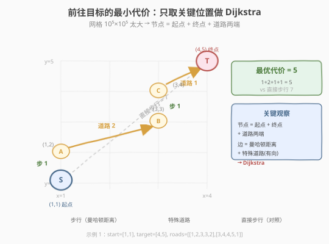
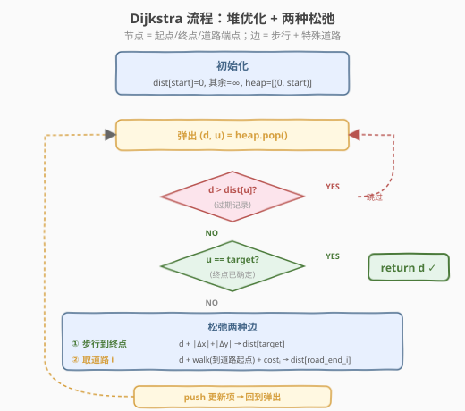
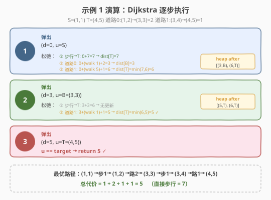

# LeetCode 前往目标的最小代价 题解

## 1. 题目概述

- **标题 / 题号**：前往目标的最小代价（#2662，medium）
- **链接**：https://leetcode.cn/problems/minimum-cost-of-a-path-with-special-roads/
- **难度**：中等
- **标签**：图、数组、最短路径、堆/优先队列

**题意**：给定起点 `(startX, startY)` 和终点 `(targetX, targetY)`。从 `(x1, y1)` 到 `(x2, y2)` 的**步行代价**为曼哈顿距离 $|x_2 - x_1| + |y_2 - y_1|$。另有若干**特殊路径** `specialRoads[i] = [x1_i, y1_i, x2_i, y2_i, cost_i]`，可以从 `(x1_i, y1_i)` 到达 `(x2_i, y2_i)`，代价为 `cost_i`（可能比步行更便宜）。每条特殊路径可使用任意次数。返回从起点到终点的最小总代价。

**示例 1**：

```text
输入：start = [1,1], target = [4,5], specialRoads = [[1,2,3,3,2],[3,4,4,5,1]]
输出：5
解释：
  (1,1)→(1,2) 步行 1 → (1,2)→(3,3) 道路0 代价 2 → (3,3)→(3,4) 步行 1 → (3,4)→(4,5) 道路1 代价 1
  总计 1+2+1+1 = 5（直接步行 = 7）
```

**示例 2**：

```text
输入：start = [3,2], target = [5,7], specialRoads = [[5,7,3,2,1],[3,2,3,4,4],[3,3,5,5,5],[3,4,5,6,6]]
输出：7
解释：不使用任何特殊路径，直接步行 |5-3|+|7-2| = 7 最优。
```

**示例 3**：

```text
输入：start = [1,1], target = [10,4], specialRoads = [[4,2,1,1,3],[1,2,7,4,4],[10,3,6,1,2],[6,1,1,2,3]]
输出：8
解释：(1,1)→(1,2) 步行 1 → (1,2)→(7,4) 道路1 代价 4 → (7,4)→(10,4) 步行 3，总计 8。
```

**约束**：

- `start.length == target.length == 2`
- $1 \le \text{startX} \le \text{targetX} \le 10^5$
- $1 \le \text{startY} \le \text{targetY} \le 10^5$
- $1 \le \text{specialRoads.length} \le 200$
- `specialRoads[i].length == 5`
- $\text{startX} \le x_{1i}, x_{2i} \le \text{targetX}$，$\text{startY} \le y_{1i}, y_{2i} \le \text{targetY}$
- $1 \le \text{cost}_i \le 10^5$

> 💡 关键特征：坐标范围高达 $10^5 \times 10^5$，但特殊道路数 $\le 200$。网格太大不能逐格搜索，只能以"关键位置"为节点建模。

## 2. 解题思路

### 2.1 暴力思路：网格 BFS？

最朴素的想法是把每个网格点当作节点，BFS/Dijkstra 遍历整张网格。但坐标范围 $10^5 \times 10^5 = 10^{10}$ 个点——无论时间还是空间都不可行。

> ⚠️ 问题核心：网格巨大但"有意义的"位置极少。需要找到正确的节点集合，使图足够小。

### 2.2 核心观察：关键位置 + Dijkstra



**关键洞察**（可证明）：最优路径只会经过以下几类位置——**起点、终点、每条特殊道路的两个端点**。任何中间停靠点如果不是道路端点，都可以用曼哈顿距离直接跳过（三角不等式保证不更差）。

由此将问题转化为**有向图最短路**：

- **节点**：起点 $S$、终点 $T$、每条道路的终点 $(x_{2i}, y_{2i})$（共 $\le 2n+2 \le 402$ 个）
- **边**（两种）：
  - **步行边**：任意节点 $u$ → 终点 $T$，权值 $= |x_T - x_u| + |y_T - y_u|$
  - **特殊道路边**：从任意节点 $u$，步行到道路起点 $(x_{1i}, y_{1i})$，再走道路到 $(x_{2i}, y_{2i})$，权值 $= |x_{1i} - x_u| + |y_{1i} - y_u| + \text{cost}_i$

> 💡 **为什么不需要道路起点作为节点？** 从任意节点 $u$，松弛道路 $i$ 时已经隐式计算了"步行到 $(x_{1i}, y_{1i})$"的曼哈顿距离。道路起点不需要单独入堆——它只在"步行 + 取道路"这一复合转移中被途经，不需要独立的最短距离。

这是 [743. 网络延迟时间](../0701-0800/743_网络延迟时间.md) 堆优化 Dijkstra 模板的变体：边权非负（曼哈顿距离 $\ge 0$、$\text{cost}_i \ge 1$），贪心正确。弹出 $u = T$ 时即可**提前返回**。

### 2.3 算法流程图



Dijkstra 三步走（边权非负保证贪心正确）：

1. `dist[start] = 0`，其余 $\infty$；堆 `[(0, start)]`。
2. 弹出 `(d, u)`：若 `d > dist[u]` 是过期记录，跳过（懒删除）；若 `u == target`，返回 `d`。
3. 松弛两种边：步行到 `target`（曼哈顿距离）；每条道路 $i$（步行到道路起点 + $\text{cost}_i$）。更新并入堆。

### 2.4 示例演算



以示例 1 为例（$S=(1,1)$, $T=(4,5)$, 道路0: $(1,2)\to(3,3)$ 代价 2, 道路1: $(3,4)\to(4,5)$ 代价 1），节点集 $\{S, B=(3,3), T\}$：

| 步骤 | 弹出 (d, u) | 关键松弛 | dist 更新 | 堆 |
|------|------------|----------|-----------|-----|
| ① | (0, S) | 道路0: $0{+}1{+}2{=}3{\to}B$；道路1: $0{+}5{+}1{=}6{\to}T$；步行: $0{+}7{=}7{\to}T$ | $B{=}3$, $T{=}6$ | [(3,B),(6,T)] |
| ② | (3, B) | 道路1: $3{+}1{+}1{=}5{\to}T$ | $T{=}5$（原 6） | [(5,T),(6,T)] |
| ③ | (5, T) | $u{=}T$ → return 5 ✓ | — | — |

> 💡 第 ② 步是关键：从 $B=(3,3)$ 出发，步行到道路1起点 $(3,4)$ 仅需 1，加上道路代价 1，总计 $3+1+1=5 < 6$，把 `dist[T]` 从 6 改善到 5。道路1的起点 $(3,4)$ 从未作为节点入堆——它只在松弛中被"途经"。

## 3. 参考代码

### C++

```cpp
class Solution {
public:
    int minimumCost(vector<int>& start, vector<int>& target, vector<vector<int>>& specialRoads) {
        using ll = long long;
        using Point = pair<int, int>;
        Point sp = {start[0], start[1]};
        Point tp = {target[0], target[1]};

        // dist map：节点 → 最短距离
        map<Point, ll> dist;
        dist[sp] = 0;
        if (sp != tp) dist[tp] = LLONG_MAX;
        for (auto& r : specialRoads) {
            Point re = {r[2], r[3]};
            if (!dist.count(re)) dist[re] = LLONG_MAX;
        }

        // 堆优化 Dijkstra
        priority_queue<pair<ll, Point>, vector<pair<ll, Point>>, greater<>> pq;
        pq.push({0, sp});

        while (!pq.empty()) {
            auto [d, u] = pq.top(); pq.pop();
            if (d > dist[u]) continue;             // 懒删除：过期记录
            if (u == tp) return (int) d;           // 终点已确定，提前返回

            // ① 步行到终点
            ll walkT = abs(tp.first - u.first) + abs(tp.second - u.second);
            if (d + walkT < dist[tp]) {
                dist[tp] = d + walkT;
                pq.push({dist[tp], tp});
            }

            // ② 每条道路：步行到道路起点 + 道路代价
            for (auto& r : specialRoads) {
                Point rs = {r[0], r[1]};
                Point re = {r[2], r[3]};
                ll walk = abs(rs.first - u.first) + abs(rs.second - u.second);
                ll nd = d + walk + r[4];
                if (nd < dist[re]) {
                    dist[re] = nd;
                    pq.push({nd, re});
                }
            }
        }
        return (int) dist[tp];
    }
};
```

### Python

```python
class Solution:
    def minimumCost(self, start: List[int], target: List[int], specialRoads: List[List[int]]) -> int:
        import heapq

        sp = (start[0], start[1])
        tp = (target[0], target[1])

        # dist map：节点 → 最短距离
        dist = {sp: 0}
        if sp != tp:
            dist[tp] = float('inf')
        for r in specialRoads:
            re = (r[2], r[3])
            if re not in dist:
                dist[re] = float('inf')

        # 堆优化 Dijkstra
        pq = [(0, sp)]
        while pq:
            d, u = heapq.heappop(pq)
            if d > dist[u]:               # 懒删除：过期记录
                continue
            if u == tp:                   # 终点已确定，提前返回
                return d

            # ① 步行到终点
            walk_t = abs(tp[0] - u[0]) + abs(tp[1] - u[1])
            if d + walk_t < dist[tp]:
                dist[tp] = d + walk_t
                heapq.heappush(pq, (dist[tp], tp))

            # ② 每条道路：步行到道路起点 + 道路代价
            for r in specialRoads:
                rs = (r[0], r[1])
                re = (r[2], r[3])
                walk = abs(rs[0] - u[0]) + abs(rs[1] - u[1])
                nd = d + walk + r[4]
                if nd < dist[re]:
                    dist[re] = nd
                    heapq.heappush(pq, (nd, re))

        return dist[tp]
```

> 💡 **两种松弛的含义**：① 是"纯步行到终点"——保证不使用任何道路时也能得到答案（曼哈顿距离）。② 是"步行到道路起点 + 取道路"——复合转移，道路起点不需要作为独立节点。**提前返回**：弹出 $u = T$ 时其 `dist` 已最小（边权非负，贪心已确定），立即返回。

## 4. 复杂度分析

| 维度 | 复杂度 | 说明 |
|------|--------|------|
| 时间 | $O(n^2 \log n)$ | $n$ 个节点（$\le 2 \times 200 + 2 = 402$），每次弹出松弛 $O(n)$ 条边（$n$ 条道路 + 1 条步行），每条边入堆 $O(\log n)$ |
| 空间 | $O(n)$ | `dist` 字典/映射存 $n$ 个节点，堆至多 $O(n^2)$ 条记录 |

> ⚠️ 本题 $n \le 402$，$n^2 \approx 1.6 \times 10^5$，$n^2 \log n \approx 1.4 \times 10^6$，远在时限内。朴素 $O(n^2)$ Dijkstra（不用堆，每次线性扫描找最小）也足够快，但堆版本模板可迁移到更大规模，面试默认写堆版。

## 5. 扩展：过滤无效道路

若某条道路的 $\text{cost}_i \ge$ 其起点到终点的曼哈顿距离，则步行直接到达更便宜，该道路**永远不会被使用**。可在建图前过滤：

```python
# 过滤：道路代价 >= 步行代价时无意义
specialRoads = [r for r in specialRoads
               if r[4] < abs(r[2] - r[0]) + abs(r[3] - r[1])]
```

此优化不改变正确性（被过滤的道路不会改善任何距离），但可减少松弛次数。在最坏情况（所有道路都有用）下不影响复杂度，实现简单、无副作用。

## 6. 面试要点

1. **为什么只需考虑道路端点作为节点，不必遍历网格？**

   - 可证明：最优路径经过的中间点一定是某条特殊道路的端点。若经过了一个"非端点"位置，由曼哈顿距离的三角不等式，可以直接跳到下一个端点而不更差。网格 $10^5 \times 10^5$ 太大，但"有意义"的位置只有 $O(n)$ 个。

2. **为什么道路起点不需要作为独立节点？**

   - 松弛道路 $i$ 时，转移是"步行到 $(x_{1i}, y_{1i})$ + 取道路"，步行距离已隐式包含在转移中。道路起点只是一个"途经"位置，不需要独立的最短距离——它不会被"停在"那里再做其他决策。

3. **为什么步行边只需要连到终点，不需要连到其他道路端点？**

   - 到达其他道路端点的唯一意义是从那里出发取更多道路，但"从当前节点步行到道路 $j$ 起点再取道路"已经覆盖了这一场景。步行到道路端点（非道路起点）没有额外价值，由三角不等式可直接跳到下一个道路起点。

4. **如果特殊道路数量很大（如 $10^5$）怎么办？**

   - 当前 $O(n^2)$ 松弛会变成 $O(n^2 \log n) \approx 10^{10}$，不可行。需引入更高效的数据结构：如将道路起点建入 1D/2D 最近邻索引（KD-Tree），或按坐标分桶批量松弛。但这超出本题范围——题目约束 $n \le 200$ 就是为此设计的。

5. **为什么 Dijkstra 适用？边权一定非负吗？**

   - 曼哈顿距离 $|x_2 - x_1| + |y_2 - y_1| \ge 0$，$\text{cost}_i \ge 1$，所有边权严格非负。非负保证 Dijkstra 贪心正确：被弹出的节点 $u$ 的 `dist[u]` 已是全局最小，不会被后续更新改善。

## 同类练习题

| # | 题目 | 与本题的关联 |
|---|------|-------------|
| 743 | [网络延迟时间](https://leetcode.cn/problems/network-delay-time/) | 堆优化 Dijkstra 单源最短路模板母题（本题的基础） |
| 2642 | [设计可以求最短路径的图类](../2601-2700/2642_设计可以求最短路径的图类.md) | Dijkstra 的设计类封装，对照"邻接表 + 按需查询"的设计思路 |
| 1631 | [最小体力消耗路径](https://leetcode.cn/problems/path-with-minimum-effort/) | Dijkstra 变体（最小化路径最大边权而非总权值），2D 网格建模 |
| 1976 | [到达目的地的方案数](https://leetcode.cn/problems/number-of-ways-to-arrive-at-destination/) | Dijkstra 求最短路 + 统计最短路条数 |
| 1786 | [从第一个节点出发到森林的最小受限路径](https://leetcode.cn/problems/number-of-restricted-paths-from-first-to-last-node/) | Dijkstra 预处理距离 + 树形 DP 计数 |
