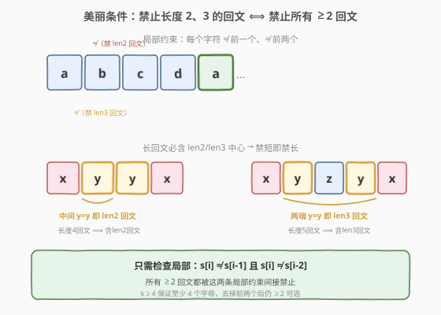
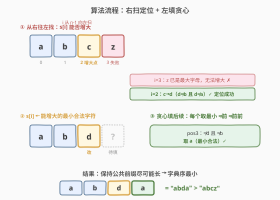
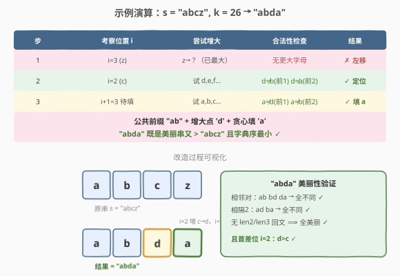

# LeetCode 字典序最小的美丽字符串 题解

## 1. 题目概述

- **标题 / 题号**：字典序最小的美丽字符串（#2663，hard）
- **链接**：https://leetcode.cn/problems/lexicographically-smallest-beautiful-string/
- **难度**：困难
- **标签**：贪心、字符串

**题意**：如果一个字符串满足以下条件，则称其为**美丽字符串**：

- 它由英语小写字母表的前 `k` 个字母组成；
- 它**不包含任何长度为 2 或更长的回文子字符串**。

给你一个长度为 `n` 的美丽字符串 `s` 和一个正整数 `k`。请找出并返回一个长度为 `n` 的美丽字符串，该字符串还满足：在字典序大于 `s` 的所有美丽字符串中字典序最小。如果不存在这样的字符串，则返回空字符串。

> 字典序定义：对长度相同的字符串 `a`、`b`，若 `a` 与 `b` 在第一个不同的位置上 `a` 的字符更大，则 `a` 的字典序大于 `b`。例如 `"abcd"` 大于 `"abcc"`（第四位 `d > c`）。

**示例 1**：

```text
输入：s = "abcz", k = 26
输出："abda"
解释："abda" 既是美丽字符串，又字典序大于 "abcz"。可证明不存在同时满足字典序大于 "abcz"、美丽、字典序小于 "abda" 的字符串。
```

**示例 2**：

```text
输入：s = "dc", k = 4
输出：""
解释：可证明，不存在既是美丽字符串，又字典序大于 "dc" 的字符串。
```

**约束**：

- $1 \le$ `n == s.length` $\le 10^5$
- $4 \le$ `k` $\le 26$
- `s` 是一个美丽字符串。

> 💡 关键约束在两点：① 「无长度 ≥2 回文」可被**两条局部约束**等价替代——只需禁止长度 2、3 的回文；② `k ≥ 4` 保证每填一个位置去掉前两个禁忌字符后**至少还有 2 个可选**，贪心填充永不会卡死。突破口是观察「字典序最小的大串」要尽量保留原串前缀——从右往左找第一个能增大的位置。

## 2. 解题思路

### 2.1 暴力思路：枚举 / 下一个排列

最直观的做法：在所有由前 `k` 个字母构成长度 `n` 的字符串中，枚举大于 `s` 的候选，逐个检查是否美丽，取字典序最小者。检查美丽性可用「是否存在回文子串」。

- 枚举量 $O(k^n)$，$n = 10^5$ 时天文数字，**不可行**；
- 即使「按字典序递增地生成下一个候选」也平均每次 $O(n)$，且候选可能极多，仍**超时**。

> ⚠️ 暴力的浪费在于：① 没利用「美丽性是**局部约束**」这一结构；② 没利用「字典序最小意味着**公共前缀最长**」这一性质。突破口是把全局回文判定化简为两条局部规则，再据此贪心构造。

### 2.2 核心观察：局部约束 + 公共前缀最长

**观察一：禁止长度 2、3 回文 ⟺ 禁止所有长度 ≥2 回文。**

一个长度 $L \ge 4$ 的回文 $s[i..i{+}L{-}1]$ 满足 $s[i{+}j] = s[i{+}L{-}1{-}j]$。它的**中心**：

- $L$ 为偶数：最中间两位 $s[i{+}L/2{-}1] = s[i{+}L/2]$，构成**长度 2 回文**；
- $L$ 为奇数：最中间三位的两端 $s[i{+}(L{-}1)/2{-}1] = s[i{+}(L{+}1)/2]$，构成**长度 3 回文**。

因此**任何长度 ≥4 的回文必含一个长度 2 或 3 的回文中心**。反之长度 2、3 回文本身就是长度 ≥2 的回文。两者等价。于是美丽条件简化为两条**局部规则**：

$$\boxed{\;s[i] \ne s[i-1] \quad(\text{禁 len2}), \qquad s[i] \ne s[i-2] \quad(\text{禁 len3})\;}$$

即每个字符只需与「前一个」和「前两个」字符不同。这正是「贪心可填」的基石——每个位置只受前两位约束。



**观察二：字典序最小 ⟺ 公共前缀最长。**

设 $t > s$，$t$ 与 $s$ 在首个不同位置 $i$ 上 $t[i] > s[i]$，而 $t[0..i{-}1] = s[0..i{-}1]$。比较两个候选 $t_1$（前缀长 $i_1$）、$t_2$（前缀长 $i_2$，$i_2 > i_1$）：在位置 $i_1$ 处 $t_1[i_1] > s[i_1] = t_2[i_1]$，故 $t_1 > t_2$。**前缀越长，串越小**。所以要找**最靠右**的、能让 $s[i]$ 增大的位置 $i$。

### 2.3 算法流程

结合两条观察，算法分三步：

1. **从右往左**扫 $i = n{-}1 \to 0$：尝试把 $s[i]$ 增大到某个 $c \in (s[i],\, \text{'a'+}k)$，且 $c \ne s[i{-}1]$、$c \ne s[i{-}2]$（若有）。找到最小的合法 $c$ 即定位成功。
2. **置 $s[i] = c$**（最小合法增大字符）。此时 $s[0..i]$ 仍美丽（前缀本就美丽，$c$ 不与前两位冲突），且 $s[0..i] >$ 原 $s[0..i]$。
3. **从左往右贪心填** $i{+}1 \dots n{-}1$：每个位置取「最小合法字符」（$\ne$ 前一、$\ne$ 前二）。因 $k \ge 4$，禁忌至多 2 个、可选 $\ge 2$ 个，**必能填满**。

若扫描完无任何位置可增大，返回 `""`。



> 💡 **为什么 $k \ge 4$ 是关键**：填位置 $j$ 时禁忌字符为 $s[j{-}1]$、$s[j{-}2]$。在美丽串中 $s[j{-}1] \ne s[j{-}2]$（相邻必不同），故禁忌恰好 2 个互异字符，可选 $k-2 \ge 2$ 个，永远有解。若 $k < 4$（如 $k=3$），最坏只剩 1 个可选，可能填不下去——这正是题目下界设为 4 的原因。

### 2.4 示例演算

以 `s = "abcz", k = 26` 为例：



| 步 | 考察位置 $i$ | 尝试增大 | 合法性检查 | 结果 |
|----|--------------|----------|------------|------|
| 1 | $i=3$（`z`） | `z`→？（已最大） | 无更大字母 | ✗ 左移 |
| 2 | $i=2$（`c`） | 试 `d,e,f…` | `d≠b`(前1) `d≠a`(前2) | ✓ 定位 |
| 3 | $i{+}1=3$ 待填 | 试 `a,b,c…` | `a≠d`(前1) `a≠b`(前2) | ✓ 填 `a` |

公共前缀 `"ab"` + 增大点 `d` + 贪心填 `a` = `"abda"`，既是美丽串又 $>$ `"abcz"` 且字典序最小。

> 💡 留意步骤 2：在 $i=2$ 处 `c` 能增大到 `d`，但**不**直接增大到 `z`——要取「最小合法增大字符」保证 $s[0..i]$ 这一段字典序尽可能小。后续贪心填 `a` 同理：每步都取最小合法，整体才最小。

## 3. 参考代码

### C++

```cpp
// 字典序最小的美丽字符串.cpp —— 贪心：右扫定位 + 左填贪心
// 编译: g++ -O2 -std=c++17 字典序最小的美丽字符串.cpp -o sbs
#include <string>
using namespace std;

class Solution {
  public:
    string smallestBeautifulString(string s, int k) {
        int n = s.size();
        char top = 'a' + k;                       // 合法字符上界（开区间）
        for (int i = n - 1; i >= 0; --i) {        // 从右往左找可增大位置
            for (char c = s[i] + 1; c < top; ++c) {
                if (i >= 1 && c == s[i - 1]) continue;   // 禁 len2 回文
                if (i >= 2 && c == s[i - 2]) continue;   // 禁 len3 回文
                s[i] = c;                                 // 最小合法增大
                for (int j = i + 1; j < n; ++j) {         // 贪心填后续
                    for (char d = 'a'; d < top; ++d) {
                        if (j >= 1 && d == s[j - 1]) continue;
                        if (j >= 2 && d == s[j - 2]) continue;
                        s[j] = d;
                        break;
                    }
                }
                return s;
            }
        }
        return "";
    }
};
```

### Python

```python
class Solution:
    def smallestBeautifulString(self, s: str, k: int) -> str:
        n = len(s)
        base = ord('a')
        top = base + k                      # 合法字符上界（开区间）
        s = list(s)
        for i in range(n - 1, -1, -1):       # 从右往左找可增大位置
            for c in range(ord(s[i]) + 1, top):
                ch = chr(c)
                if i >= 1 and ch == s[i - 1]:   # 禁 len2 回文
                    continue
                if i >= 2 and ch == s[i - 2]:   # 禁 len3 回文
                    continue
                s[i] = ch                         # 最小合法增大
                for j in range(i + 1, n):        # 贪心填后续
                    for d in range(base, top):
                        dh = chr(d)
                        if j >= 1 and dh == s[j - 1]:
                            continue
                        if j >= 2 and dh == s[j - 2]:
                            continue
                        s[j] = dh
                        break
                return ''.join(s)
        return ""
```

> 💡 **实现细节**：① 内层 `c` 从 `s[i]+1` 起递增，**第一次命中即最小合法增大**，无需排序候选；同理填后续 `d` 从 `'a'` 起递增。② 检查仅看 `s[i-1]`、`s[i-2]`，因为增大 $s[i]$ 只可能新增长度 2/3 回文，前缀 $s[0..i{-}1]$ 已美丽不变。③ 增大 $s[i]$ 后，$s[i{+}1..]$ 全部被覆盖重填，故 $s[i]$ 与右侧的潜在冲突无需检查——后续填值会主动避开 $s[i]$。④ 找不到可增大位置（如 `dc`、`k=4`：`d` 无法再大、`c` 增到 `d` 却撞上首位 `d`）返回 `""`。

## 4. 复杂度分析

| 维度 | 复杂度 | 说明 |
|------|--------|------|
| **时间复杂度** | $O(n \cdot k)$ | 右扫定位最坏遍历 $n$ 位、每位试 $\le k$ 字符；贪心填 $\le n$ 位、每位试 $\le k$ 字符。$k \le 26$，实际 $O(26n)$ |
| **空间复杂度** | $O(n)$ | C++ 原地修改入参 `string`（拷贝由调用方承担）；Python `list(s)` 显式 $O(n)$ |

> ⚠️ 朴素枚举 $O(k^n)$ 的瓶颈是「全局回文判定 + 逐个生成」。本题把回文判定**局部化**为两条相邻/相隔规则，把「找最小大串」转为「右扫定位 + 贪心填」，每步 $O(k)$ 即定，整体压到线性级。

## 5. 扩展：构造性与「下一个排列」的类比

### 5.1 与「下一个排列」(31. 下一个排列) 的同构

求字典序下一个更大串是经典**「下一个排列」问题**的推广：① 从右往左找第一个可升高的位置；② 该位置取最小升高值；③ 右侧重排为最小序。31 题右侧「升序排列」是最小序；本题右侧因有美丽约束，改为「贪心取最小合法字符」。两者骨架完全一致，差异仅在右侧「最小化」的手段。

### 5.2 为什么不能直接调「下一个排列」再过滤美丽？

「下一个排列」给出字典序下一个串，但它很可能**不美丽**（撞回文）。反复「取下一排列 + 检查美丽」最坏要跳过 $O(k^n)$ 个不美丽串，退化成暴力。本题的妙处在于：把美丽性「内嵌」进贪心填充——一旦在 $i$ 处升高，右侧直接贪心构造出**既美丽又最小**的串，一步到位，无需反复试错。

### 5.3 无解判定的本质

返回 `""` 当且仅当每一位都无法在不撞前两位的前提下增大。这通常发生在串已接近「该字母表下最大美丽串」时。例 `dc`、`k=4`：`d` 是字母表最大字符无法升高；`c→d` 撞首位 `d`（长度 2 回文）。本质上 $s$ 已是该长度、该 $k$ 下的字典序最大美丽串，无更大者。

## 6. 面试要点

1. **为什么禁止长度 2、3 回文就够了？**

   - 任何长度 $L \ge 4$ 的回文，其中心要么是最中间两位相等（偶数 $L$ → 含 len2 回文），要么是最中间三位首尾相等（奇数 $L$ → 含 len3 回文）。故「存在 ≥4 回文」⟹「存在 len2 或 len3 回文」。逆方向显然。两条等价，所以只需检查相邻不同 + 相隔一位不同两条局部规则。

2. **为什么从右往左找可增大位置，而非从左往右？**

   - 字典序最小的大串要求与原串的**公共前缀尽可能长**。设两个候选分别在位置 $i_1 < i_2$ 与原串分叉且都更大，则在 $i_1$ 处前者 $>$ 原串 $=$ 后者，故前者 $>$ 后者，即前缀更长（分叉更靠右）的候选更小。所以取**最靠右**的可增大位置。

3. **增大 $s[i]$ 时为什么只检查 $s[i-1]$、$s[i-2]$，不看右侧？**

   - 前缀 $s[0..i{-}1]$ 原本就美丽且未改动，增大 $s[i]$ 只可能新增长度 2（$s[i]=s[i{-}1]$）或长度 3（$s[i]=s[i{-}2]$）回文，故只查这两位。右侧 $s[i{+}1..]$ 随后会被**整体重填**，填值时主动避开 $s[i]$，故 $s[i]$ 与右侧的冲突不必预先检查。

4. **贪心填后续时为什么一定填得下去？**

   - 填位置 $j$ 的禁忌是 $s[j{-}1]$、$s[j{-}2]$。美丽串中相邻必不同（$s[j{-}1] \ne s[j{-}2]$），故禁忌恰为 2 个互异字符，可选 $k-2$ 个。$k \ge 4$ 时 $k-2 \ge 2 > 0$，恒有解。这正是题目把 $k$ 下界设为 4 的原因；若 $k=3$ 最坏仅剩 1 可选，仍可填但「最小」可能受限，$k<3$ 则可能死锁。

5. **为什么不增大到最大的合法字符，而是最小合法字符？**

   - 要让整个串字典序最小，不仅公共前缀要长，分叉位 $i$ 的字符也要**尽量小**（只要 $> s[i]$ 即可保证大串性质）。取最小合法增大字符使 $s[0..i]$ 这一段最小；同理后续贪心取最小合法字符使 $s[i{+}1..]$ 最小。两段都最小，整体才最小。

> 💡 **一句话总结**：2663 是「下一个排列 + 局部回文约束」的贪心构造题——把「无 ≥2 回文」等价为「相邻不同 + 相隔一位不同」两条局部规则，再按「公共前缀最长」从右往左定位首个可增大位置、取最小合法增大字符，右侧贪心填最小合法字符；$k \ge 4$ 保证贪心永不卡死，整体 $O(nk)$。

## 同类练习题

| # | 题目 | 与本题的关联 |
|---|------|-------------|
| 31 | [下一个排列](https://leetcode.cn/problems/next-permutation/) | 本题的母题——右扫找首个可升高位 + 右侧重排为最小序，骨架完全一致，差异仅在右侧「最小化」手段 |
| 670 | [最大交换](https://leetcode.cn/problems/maximum-swap/) | 贪心定位交换位 + 右侧取最值，与本题「右扫定位 + 贪心构造」的思路同源 |
| 321 | [拼接最大数](https://leetcode.cn/problems/create-maximum-number/) | 贪心构造字典序极值串，单栈维护 + 跨数组选最大前缀，构造型贪心进阶 |
| 402 | [移掉 K 位数字](https://leetcode.cn/problems/remove-k-digits/) | 单调栈贪心构造字典序最小串，与本题「贪心取最小合法字符」的局部决策思想相通 |
| 316 | [去除重复字母](https://leetcode.cn/problems/remove-duplicate-letters/) | 贪心 + 单调栈保字典序最小，含去重约束的构造型贪心，对照本题的局部约束构造 |
